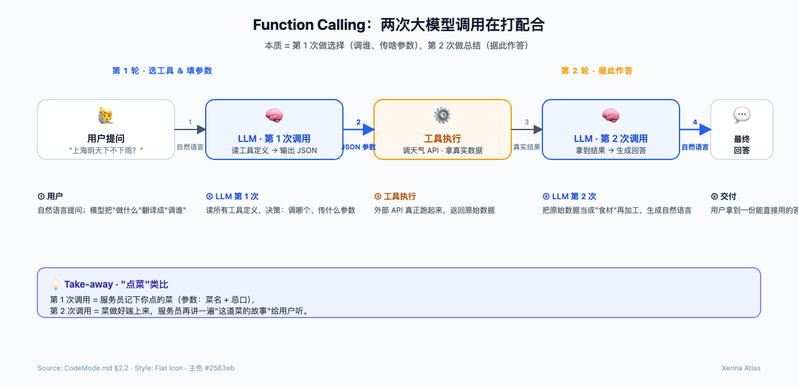
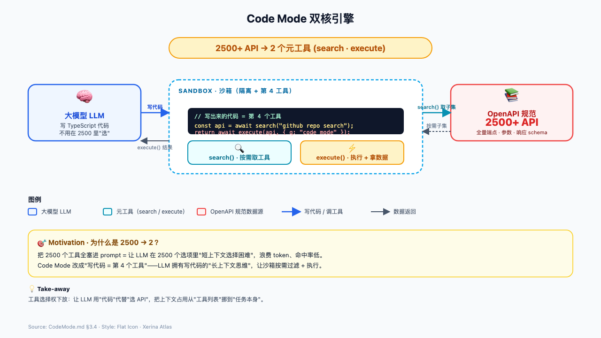
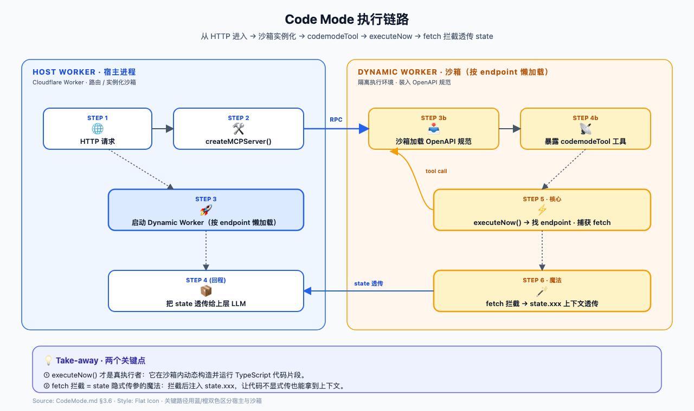
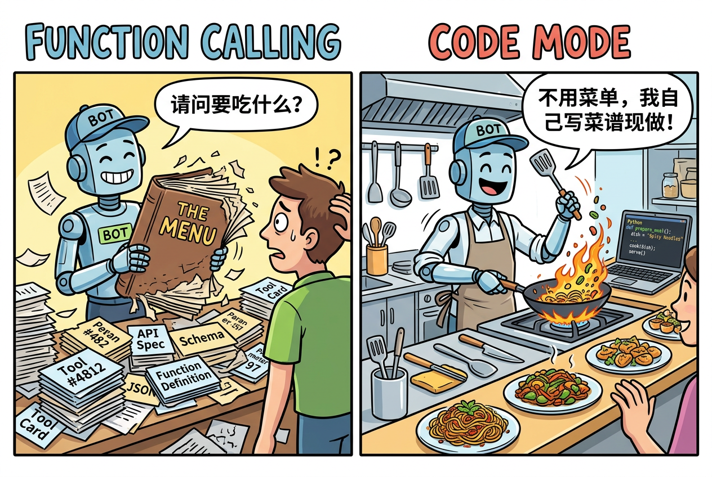
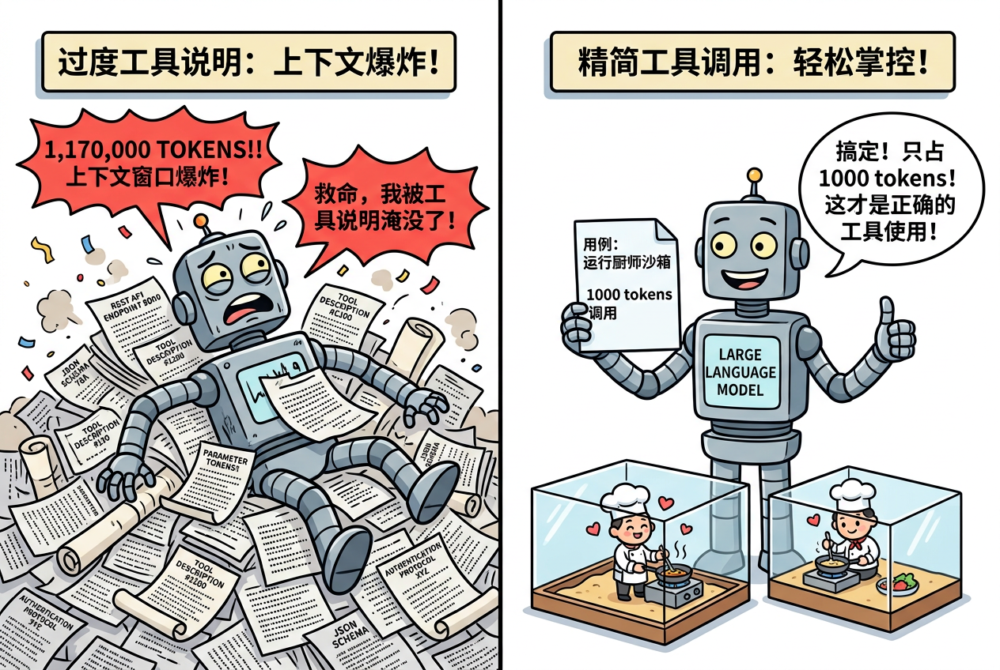
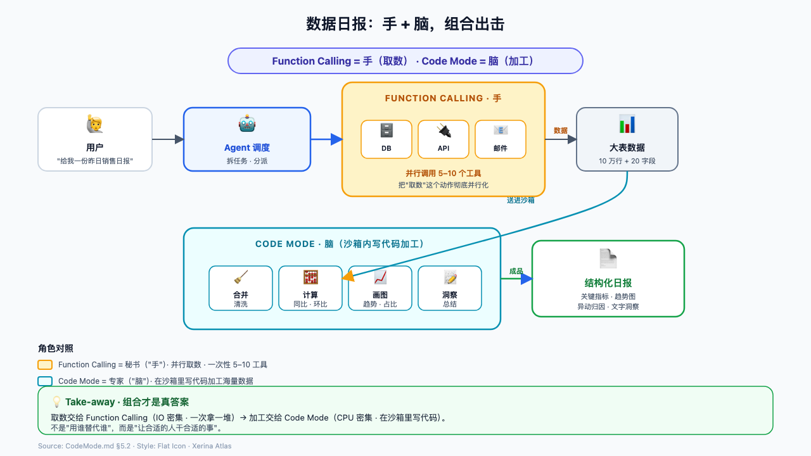

# Function Calling 已死？新神 Code Mode 出现

> 一句话：本文不站队，只想把 **Code Mode** 这个"新神"扒个底朝天，顺便给 **Function Calling** 上炷香——它可能还没死透，甚至要跟新神组队。

---

## 一、AI Agent 圈子的"路线之争"

当代 AI 发展有多快？快到昨天的"标准答案"，今天就成了"历史包袱"。

前两年，我们还在为「让大模型学会**调用工具**」欢呼雀跃——大模型终于从"只会说话的嘴"，进化成了"能动手的四肢"。Function Calling 一度被奉为圭臬，几乎所有 Agent 框架都把它当地基。

可最近，风向变了。

Agent 圈子里冒出一批"异端分子"，他们喊出了一句让很多老工程师血压飙升的话：

> **"Function Calling 该退休了，新神的名字叫 Code Mode。"**

支持的、反对的、吃瓜的，吵成一团。有人甩出 Cloudflare 官方的数据——2500 多个 API 端点被压进 1000 个 token，声称 Function Calling 是"上个时代的糟粕"；也有人冷笑一声："没有 Function Calling，你的 Code Mode 连口都张不开。"

那问题来了，也是最该被讲清楚的三件事：

1. **Function Calling 到底是什么？为什么它曾经封神？**
2. **Code Mode 到底是什么？它凭什么敢来"挑战"旧神？**
3. **Code Mode 到底有什么用？是真革命，还是又一个"新瓶装旧酒"？**

别急，先把键盘放一放。这仨问题，我们一个个拆开说透。

---

## 二、旧神 Function Calling：到底是什么？

要理解新神，得先认识旧神。很多文章把 Function Calling 一句话带过，但**它恰恰是理解 Code Mode 的最佳参照物**，必须讲透。

### 2.1 它解决了一个什么问题？

回到根本：**大模型天生是个"只会说话的哑巴"。** 它再聪明，也查不了实时天气、调不了你公司的数据库、没法给用户下单买咖啡。因为它的知识截止在训练那天，也没有"手"去操作真实世界。

所以人类发明了 Function Calling——**给大模型装上一双手**：你想让它做事，就把"能做的事"定义成一个个**函数/工具**，告诉它"有这些工具可用、每个工具怎么用"；模型自己不动手，而是**决定该用哪个工具、把参数填好**，由外部程序去真正执行。

一句话：**Function Calling = 让大模型"发号施令"，别人动手。**

### 2.2 它是怎么工作的？（底层两次调用）

Function Calling 的工作流程，本质上是**两次大模型调用**在打配合：



拿"点菜"打个比方，这套流程你秒懂：

- 你走进餐厅（用户发需求）——
- 服务员（大模型）翻着菜单（工具说明书）说："先生，我们这儿有宫保鸡丁、麻婆豆腐……你要哪个？"（第 1 次调用：**选工具、填参数**）
- 后厨师傅（外部程序）按你的选择真去炒菜（**真正执行**）
- 菜端上桌，你边吃边点评（第 2 次调用：**看结果、生成回答**）

关键是：**大模型从不自己动手**，它只负责"点单"。真正干活的是后厨——也就是那些预先定义好的、被写进"菜单"的工具。

### 2.3 它凭什么是"旧神"？

因为这套机制**太稳了**：

- **明确可控**：能用哪些工具、参数怎么填，全部写死在工具定义里，模型不会乱来。
- **易于校验**：每次调用都是"选工具 + 填参数"，外部程序能对参数做严格校验（比如防止 SQL 注入）。
- **生态成熟**：OpenAI、Claude、Gemini 全都原生支持，工具定义有统一标准（JSON Schema）。
- **天然适合对接外部系统**：查天气、调支付接口、读写数据库……这类"明确、稳定、动作单一"的外部调用，它就是最优解。

### 2.4 那它有什么"软肋"？

软肋不在能力，在**"吃饭的方式"**——它太能吃了，太被动了。

看一个痛点，你立刻懂：**每个工具都要一份"说明书"（名称 + 描述 + 参数 Schema），而这些说明书会一股脑全塞进模型的上下文窗口（Context Window）。**

- 工具一多就爆炸：50 个工具的定义，可能吃掉 **3000~5000 个 token**。
- 更离谱的是：哪怕这一轮你只用到 1 个工具，另外 49 份"说明书"也**全程陪着**，一字不落。
- 工具超过 20~30 个，模型"点错菜"的概率明显上升。

这就好比你去点个宫保鸡丁，服务员却把**整本菜单连厨师自拍**都端到你面前，还让你"先看看，多了解了解我们餐厅"。你能看完吗？看完你还有心思点菜吗？——**菜单越厚，你被占用的注意力就越多，留给真正"点菜决策"的空间就越小。**

而这个"菜单太厚"的痛点，正是 **Code Mode 出生的直接原因。**

---

## 三、新神 Code Mode：到底是什么？

### 3.1 故事要从一场"上下文爆炸"说起

故事的主角是 **Cloudflare**——一家把自家几千个 API 端点接进 MCP（Model Context Protocol）的公司。

它遇到了一个绕不过去的坎：

> Cloudflare 的 API 有 **2500+ 个端点**。如果按传统 Function Calling 的路子，把每个端点都定义成一个工具、写一份说明书，那整套工具定义会吃掉 **117 万个 token**——这个量级，**直接超过了当前最强基础模型的完整上下文窗口**。模型还没开始干活，就被"说明书"塞满了脑子。

> "代理需要大量工具才能完成有用的工作，可每加一个工具，就会占掉模型的上下文窗口，留给真正任务的空间就越来越少。" —— Cloudflare

这就是业界说的**"工具数量 vs 上下文窗口"的死结**。

Cloudflare 想出了一个"离经叛道"的解法：

> **"我不给你 2500 个工具，我只给你 2 个。你想干嘛，自己写代码。"**

这个解法，就是 **Code Mode**。

### 3.2 Code Mode 的精确定义

先看 Cloudflare 官方原话：

> "不再把每个操作都描述成一个独立工具，而是让模型针对类型化的 SDK **编写代码**，并在一个安全的沙箱里**执行这段代码**。**代码本身就是一份紧凑的计划。**"
>
> *"Instead of describing every operation as a separate tool, let the model write code against a typed SDK and execute the code safely. The code acts as a compact plan."*

翻译成人话，**Code Mode 的核心就是三句话**：

1. **不喂"说明书"，喂"代码能力"**：不再把 2500 个工具定义全塞给模型，而是只给模型一个极小的入口。
2. **模型自己"写计划"**：模型不"点单"了，而是直接写一段代码（JavaScript），把"想做什么、怎么做"用代码表达出来。
3. **在沙箱里"自己执行"**：这段代码在一个安全的隔离沙箱里跑，打通 API、组合多步操作，最后只把结果交回来。

**一句话定义：Code Mode = 让大模型"亲自写代码、亲自执行"，把多步操作编排成一段可运行的程序。**

### 3.3 为什么叫"Code Mode"？名字里藏着真相

这个名字不是随便起的，拆开看有双重含义：

- **"Code"（代码）**：核心创新在于，用**代码**作为和 API 交互的媒介，而不是预先定义好的工具。代码本身就是一种"紧凑的表达"——同样想表达"遍历 100 个文件再汇总"，写代码只要几行，定义 100 个工具却要几千行。
- **"Mode"（模式）**：这是一次**范式的转变**——从"描述操作"（declarative，告诉模型有什么工具）转向"编写代码"（imperative，让模型自己写怎么干）。它是一种全新的**操作模式**，和传统的"工具调用模式"并列。

更妙的是，Cloudflare 并不是一个人在战斗。**Anthropic 也独立探索出了完全相同的思路**（他们叫 "Programmatic Tool Calling" / "Code Execution with MCP"）。两大巨头殊途同归，恰恰说明这不是某家公司的"脑洞"，而是行业公认的下一步方向。

### 3.4 它的核心设计：2500 个 API 压缩成 2 个工具

Code Mode 的"魔力"，就藏在它只暴露的 **2 个工具**里——这就是它的"双核引擎"：

| 工具 | 作用 | 生活类比 |
|------|------|----------|
| `search()` | 模型写 JS 代码，针对 API 的"类型化表示"（OpenAPI 规范）做**过滤**，快速找到自己想要的端点。**完整的规范永远不进入上下文**。 | 精准查资料，只抽需要的几页，绝不把整本书搬回家 |
| `execute()` | 模型写的代码在**沙箱**里真正执行，可发起请求、处理分页、链式组合多步操作。 | 亲自上手干活，边做边调整 |

配合一张图，理解它如何用 2 个工具吃掉整个 API：



关键就在 `search()` 这一步：**模型要什么，就写代码"搜"什么**，搜到了再用 `execute()` 执行。整套 MCP Server 的上下文占用被压到**固定 ~1000 token**，比传统的 117 万 token 减少了 **99.9%**。

> 对比一下，冲击力拉满：
> - 传统 Function Calling：菜单 117 万 token 全端上来，直接把模型撑吐。
> - Code Mode：固定 1000 token，想吃什么现查现做，轻松写意。

### 3.5 它到底"有什么用"？—— 五个价值点

讲完"是什么"，我们系统回答"有什么用"。Code Mode 的价值，可以归纳成五点：

1. **省上下文（核心）**：工具定义从"随 API 规模线性膨胀"变成"固定 ~1000 token"，无论 API 有多大都不变。这是它存在的根本理由。
2. **抗膨胀（可扩展）**：API 新增 1000 个端点，传统方案要重新写工具、塞上下文；Code Mode **一行不用改**，模型通过代码路径自动发现新能力。
3. **能编排（灵活）**：传统工具一次只调一个；Code Mode 能在一次执行里链式、并发地组合多步——遍历、循环、分页、聚合，像写普通程序一样。
4. **渐进式能力发现**：模型先搜到"有什么"，再决定"用哪个"——只用当下需要的，其余完全不在上下文里占位置。
5. **安全沙箱（可控）**：代码在一个与世隔绝的 V8 沙箱里跑，默认断网、无文件系统、支持审批与回滚——放开手让模型写代码，但绝不把生产环境交出去。

### 3.6 它背后怎么"跑"起来的？（原理拆解）

你肯定会担心：**让大模型写代码自己跑，不怕它把服务器掀了吗？**

答案是：**怕，所以把它关进"安全沙箱"。** 下面是 Cloudflare Code Mode SDK（`@cloudflare/codemode`，MIT 开源）的执行链路：



执行链路，一共 6 步：

1. **生成类型**：`createCodeTool` 把工具定义生成 TypeScript 类型签名，喂给模型"阅读"——模型看到的不是一堆 schema，而是一份它能"读懂"的代码类型。
2. **写计划**：模型写一个异步箭头函数，如 `async () => { ... codemode.myTool(args) ... }`，这就是它的"行动计划"。
3. **标准化**：代码经过 AST 解析（acorn）清洗，剥离掉 markdown 代码块标记等杂质。
4. **启沙箱**：`DynamicWorkerExecutor` 通过 `WorkerLoader` 启动一个隔离 Worker（V8 沙箱）。
5. **拦截路由**：沙箱内用 Proxy 拦截 `codemode.xxx()` 调用，通过 Workers RPC 路由回宿主执行真实逻辑。
6. **回传结果**：捕获控制台输出，连同执行结果一起返回给模型。

**安全设计三连**（这是它能"封神"的关键）：

- **默认断网**：外部 `fetch()` / `connect()` 默认被阻止，想联网必须显式放行。
- **无文件系统、无环境变量**：隔离 Worker 里干干净净，防止通过提示注入泄露敏感信息。
- **审批 + 回滚**：敏感操作可标记 `requiresApproval: true`，暂停运行等人批准；还支持 `revert` 做回滚。

### 3.7 上手看一眼：Code Mode 长什么样

光说原理不过瘾，直接看代码。下面是用 AI SDK 组合 Code Mode 的最小示例（节选官方文档）：

```typescript
import { createCodeTool } from "@cloudflare/codemode/ai";
import { DynamicWorkerExecutor } from "@cloudflare/codemode";
import { streamText, tool } from "ai";
import { z } from "zod";

// 1. 定义工具（这一步其实和 Function Calling 一样）
const tools = {
  getWeather: tool({
    description: "Get weather for a location",
    inputSchema: z.object({ location: z.string() }),
    execute: async ({ location }) => `Weather in ${location}: 72°F, sunny`,
  }),
  sendEmail: tool({
    description: "Send an email",
    inputSchema: z.object({ to: z.string(), subject: z.string() }),
    execute: async ({ to, subject }) => `Email sent to ${to}`,
  }),
};

// 2. 创建沙箱执行器
const executor = new DynamicWorkerExecutor({ loader: env.LOADER });

// 3. 关键：把一堆工具"包"成一个 codemode 工具
const codemode = createCodeTool({ tools, executor });

// 4. 交给 LLM，对外只有一个工具
const result = streamText({
  model,
  messages,
  tools: { codemode },
});
```

而大模型在沙箱里"写"出来的**行动计划**，可能是这样的——**一次就把多步操作串起来**：

```typescript
// LLM 生成的"行动计划"（示例）
async () => {
  const files = await state.glob("/src/**/*.ts");        // ① 搜文件
  const results = await Promise.all(
    files.map((f) => codemode.analyzeFile({ path: f }))  // ② 并行分析
  );
  await state.writeJson("/report.json", results);         // ③ 汇总写入
  return results.length;                                  // ④ 只返回结果
};
```

注意这段代码的"含金量"：**这不是让模型选一个工具、传一次参数**，而是让模型"写一段流程"，把读取、遍历、并发、写文件这些操作**像写普通程序一样编排**起来。这正是 Code Mode 和 Function Calling 最本质的分野。

---

## 四、新神 vs 旧神：到底差在哪？（一张图看懂）

我们把两个"神"摆到一张桌上，看个清楚：

| 维度 | Function Calling（旧神） | Code Mode（新神） |
|------|--------------------------|-------------------|
| **本质** | 模型**点单/叫号**，外部程序执行 | 模型**写代码**并自己执行 |
| **动作** | 选工具 + 填参数 | 写代码 = 编排行动计划 |
| **上下文占用** | 随工具数量**线性膨胀**（50 个工具 3~5k token） | **固定** ~1000 token |
| **组合多步** | 一次调一个，靠多次轮询拼接 | 单次执行内链式 / 并发组合 |
| **灵活性** | 受限于预定义函数 | 任意代码，可处理分页、循环、并发 |
| **安全性** | 参数校验 | 沙箱隔离 + 审批 + 回滚 |
| **擅长场景** | 明确、稳定、少数的外部集成 | 复杂、多变、大规模 API 编排 |
| **新增能力** | 要手动加工具、重塞上下文 | 自动发现，一行不改 |

用一张"下馆子"的搞怪图收束两者的差异：



- **Function Calling 是"点菜"**——靠谱、可控、师傅（外部程序）绝不乱来。但前提是**菜单里得有你想要的菜**，而且菜单越厚，你翻得越累，注意力被吃光。
- **Code Mode 是"请了个会做饭的程序员回家"**——你只要说"做一桌分析报表的饭"，他直接进厨房（沙箱）自己配菜、自己炒、自己摆盘，**只把成品端出来**。自由度拉满，但**你得先给他备好一个不会把厨房烧了的"安全厨房"**。

至于 token 差距有多夸张？看这张图就懂了：



---

## 五、回到开头：Function Calling 真的死了吗？

聊到这，回到那个灵魂拷问——**Code Mode 是不是要取代 Function Calling？**

我的答案是：**不会。它俩根本不是"对手"，是"队友"。**

### 5.1 为什么说"不会取代"

看清 Code Mode 的短板，你就明白了：

- **它需要一个安全的执行沙箱**，这不是所有环境都具备的（要 Workers、要 iframe 沙箱）。
- **它默认断网、无文件系统**——那些"只是要调个稳定业务接口"的场景，用 Function Calling 反而更轻、更可控。
- **它只适合"写代码能解决"的事**（计算、遍历、编排）。而"调用一个明确的外部系统动作"——比如**"调支付接口扣款"**——**你更希望它走严格校验、明明白白的 Function Calling**，而不是让模型自由发挥写代码。你敢让 AI 自己写段代码去扣你卡里的钱吗？

### 5.2 一个真实的协作场景

想象一个 Agent 帮你做"数据分析日报"：



1. **第一步，用 Function Calling**：稳稳地调"数据仓库接口"，把订单数据拿回来——这是明确、稳定、需要严格校验的外部调用，正是 Function Calling 的强项。
2. **第二步，用 Code Mode**：拿到数据后，让模型在沙箱里写代码做清洗、聚合、算环比、生成图表——这种"多变、复杂、要组合多步"的活，正是 Code Mode 的主场。

两者接力，一个管"和外部世界安全打交道"，一个管"自己动手解决计算"。**这不叫竞争，这叫分工。**

### 5.3 我的结论

Function Calling 和 Code Mode，就像"**秘书**"和"**专家**"：


> **秘书**（Function Calling）替你对外联络、传话、跑腿，一板一眼，最让人放心；**专家**（Code Mode）关起门来替你研究、计算、写出解决方案，天马行空，效率拉满。
>
> 你不会因为请了专家就把秘书炒了——恰恰相反，**好 Agent 应该既配秘书，又养专家：该叫号叫号，该写码写码。**

所以，"Function Calling 已死"这句话，说到底只是个吸引眼球的标题党。**新神 Code Mode 的出现，不是来砸旧神场子的，而是来和旧神一起把 Agent 的舞台撑大的。** 未来的 Agent，大概率会是个"**双模式混合体**"——在需要严谨外部集成时切到 Function Calling，在需要自由编排计算时切到 Code Mode。

至于谁取代谁？不如各回各家：**该点菜点菜，该下厨下厨。** 菜单留给秘书，厨房交给专家，Agent 才能把饭吃得又稳又香。

---

## 附：参考资料

- [Cloudflare Blog：Code Mode — give agents an entire API in 1,000 tokens](https://blog.cloudflare.com/code-mode-mcp/)
- [Cloudflare Code Mode SDK 开源仓库](https://github.com/cloudflare/agents/tree/main/packages/codemode)
- [Anthropic：Code Execution with MCP（Programmatic Tool Calling）](https://www.anthropic.com/engineering/code-execution-with-mcp)
- [Cloudflare MCP 服务器地址](https://mcp.cloudflare.com/mcp)
