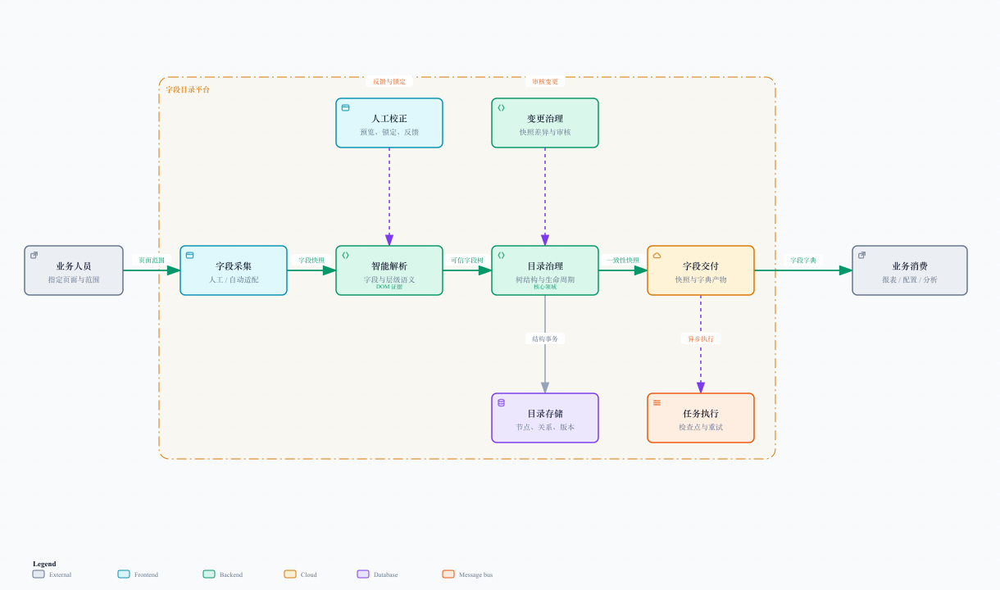
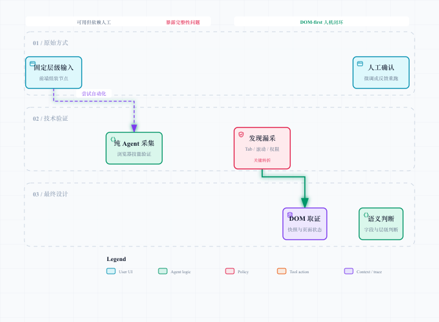

# 完整需求定位与架构

## 1. 问题不是“把字段列出来”

业务系统的字段定义散落在侧边菜单、页面页签、筛选区域、表格表头和指标卡片中。人工维护的表格通常会遇到四类问题：

- 页面改版后，旧路径与新路径混在一起，没人知道哪个还有效；
- 同一个字段在不同模块或不同层级下有不同含义，简单去重会误伤；
- 目录调整时，移动一个上层节点会影响大量下游路径；
- 大目录交付常以一次性导出完成，失败后既难恢复，也难解释产物来自哪一刻的目录。

字段目录平台的本质是一个“元数据资产治理”问题：让字段定义拥有来源、层级、生命周期、交付快照和变更历史。

## 2. 目标、非目标与红线

| 类型 | 说明 |
| --- | --- |
| 目标 | 将页面字段定义组织为可维护树，支持查询、修订、导出和变更审核 |
| 目标 | 降低人工输入成本，并让自动化结果可预览、可校正、可追溯 |
| 非目标 | 不采集订单、客户、交易等业务数据值 |
| 非目标 | 不采集账号凭据、Cookie、接口载荷或用户隐私信息 |
| 非目标 | 不让 Agent 绕过规则和人工确认直接写入可信目录 |
| 红线 | 页面文本是数据证据，不是可执行指令；模型输出不是事实本身 |

## 3. 角色与职责

| 角色 | 关注点 | 在系统中的动作 |
| --- | --- | --- |
| 字段维护者 | 目录是否反映真实业务页面 | 指定范围、提交采集、预览、微调、确认变更 |
| 平台服务 | 结果是否一致、可恢复 | 管理树写入、查询视图、任务状态和快照 |
| Agent 应用 | 语义是否合理 | 在受限工具和提示上下文中生成候选结构 |
| 规则与审核机制 | 是否能安全进入目录 | 校验无环、深度、重复、证据和高风险变更 |
| 字段消费者 | 是否可稳定使用 | 获取字段路径、字典产物和已发布快照 |

## 4. 端到端链路

[打开可交互全景图](./diagrams/platform-overview.html)

完整流程不是“HTML 丢进模型，模型吐出树”这一条直线，而是一条闭环：

1. 维护者选择页面与采集范围，明确本次只关心字段定义。
2. 采集层生成 DOM 证据与页面状态记录；人工与自动入口产出同一快照契约。
3. 智能解析层生成候选字段树，并把每个候选节点绑定回证据。
4. 质量门检查结构和语义；前端以 SSE 流式展示过程与预览。
5. 维护者微调、锁定正确节点，或带着当前树反馈 Agent 再解析。
6. 通过确认的结果进入目录治理，成为可查询、可移动、可恢复的资产。
7. 字典交付从一致性快照生成异步产物；后续采集进入差异审核，而非覆盖旧结果。

## 5. 方案如何转变

[打开可交互方案图](./diagrams/strategy-pivot.html)

### 原始方式｜已落地

前端按固定缩进或固定层级组织节点，后端解析后入库。优点是输入可控、实现直接；限制是页面理解完全依赖人工，页面变动越频繁，维护成本越高。

### 纯 Agent 页面探索｜技术验证

验证结论不是“模型不行”，而是“完整性不能只靠模型自报”。Agent 可能没有展开全部 Tab，没有滚到底部，没有进入条件区域，或无法访问 iframe / 画布内容。它在首屏内容上表现得像学霸，遇到复杂状态就开始提前交卷。

### DOM-first 人机闭环｜方案设计

最终把职责拆开：

- Agent 规划探索动作、理解文本语义、判断字段层级；
- 浏览器 / DOM 工具执行确定性点击、展开、滚动、等待稳定和快照；
- 规则引擎保证树结构底线；
- 人工处理业务歧义、例外与高风险变更。

这个转变的关键不是“多加一个 AI”，而是把不确定推理放在可审查的位置，把确定事实交给可复现的工具。

## 6. 平台分层

| 分层 | 核心职责 | 代表性产物 |
| --- | --- | --- |
| 采集层 | 发现并保留页面字段定义证据 | DOM 快照、状态覆盖记录、跳过原因 |
| 解析层 | 把证据转成候选字段与层级 | 候选树、置信度、疑点、修复建议 |
| 治理层 | 维护可信目录的结构和生命周期 | 节点树、路径视图、修订记录 |
| 交付层 | 以稳定快照输出字段字典 | 异步任务、文件产物、下载信息 |
| 演进层 | 识别并审核页面变化 | 变化集、审核结论、发布快照 |
| 横切层 | 提供可靠性、安全和评估能力 | SSE、检查点、权限、评估指标 |

## 7. 成功条件与失败状态

### 成功条件

- 目录中的每个节点都能说明其路径、来源和当前状态；
- 结构编辑不会产生环、无效父子关系或不可解释的路径；
- 大导出任务可观察、可重试、可从检查点恢复；
- 自动化候选结果可以被预览、纠正和重新解析；
- 低置信度和不可访问区域被显式暴露，而不是被悄悄算成成功。

### 失败状态也要被产品化

| 情况 | 正确系统行为 |
| --- | --- |
| 页面区域没有权限 | 记录“不可访问”与原因，转人工补采 |
| DOM 包含敏感内容 | 在清洗边界剔除，不传给解析链路 |
| Agent 输出缺少证据 | 拒绝进入目录，要求修复或人工确认 |
| 结构移动并发冲突 | 重新校验后有限重试，仍冲突则明确失败 |
| 导出连接中断 | 任务继续持久化执行，前端重新订阅或查询 |
| 页面改名还是新字段不确定 | 生成待审核变化，而不是擅自覆盖历史 |

## 8. 架构取舍

| 取舍 | 选择 | 原因 |
| --- | --- | --- |
| 采集方式 | DOM-first，而不是纯模型截图理解 | DOM 更可追溯，页面状态可枚举 |
| 智能能力 | 受限 ReAct 编排，而不是自由对话 | 工具、输出和退出条件可控制 |
| 目录表示 | 直接父级关系 + 祖先关系 | 同时兼顾写入维护与路径 / 子树查询 |
| 交付方式 | 快照 + 异步任务 + 流式写入 | 限制资源占用并支持恢复 |
| 变更处理 | 差异审核，而不是覆盖式同步 | 保留历史和人工判断 |

后续章节会依次展开这六层。读到这里应该能先形成一个总判断：这是一个以字段资产为中心的平台项目，Agent 是上游增强能力，不是整个项目的替代品。
