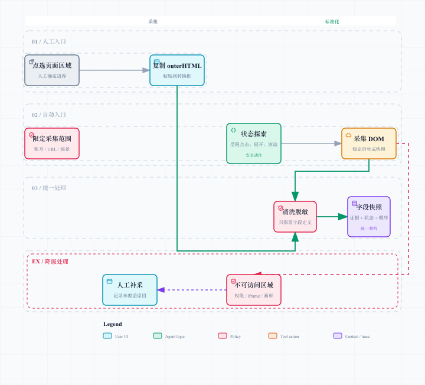
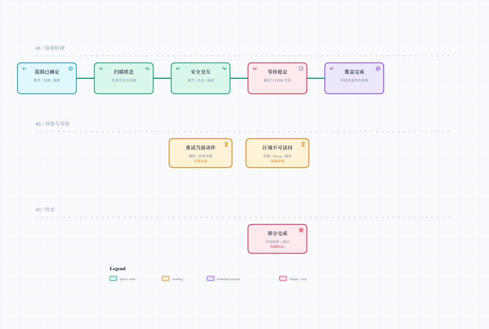

# DOM 字段采集：先把页面事实拿稳

## 1. 采集对象与边界

字段目录平台只需要理解“页面上有哪些可配置、可查看、可筛选的字段定义，以及它们位于什么层级”。因此采集对象包括：

- 侧边菜单、页面、页签、折叠分组与区块标题；
- 字段标签、筛选条件、表格表头、指标名称；
- 可见顺序、所属父级、所属页面状态和来源位置；
- 是否因为权限、跨域或渲染方式而无法确认。

下列内容不进入采集快照：业务值、列表行数据、用户输入、账号标识、Cookie、令牌、接口请求与响应载荷。这个边界不是“以后再补的安全功能”，而是采集契约的第一行。

## 2. 双入口、同一份证据契约

[打开可交互采集图](./diagrams/dom-capture.html)

无论字段来自人工还是自动化，解析层看到的都应是同一类“字段快照”。它至少包含页面标识、采集范围、页面状态、可见文本、DOM 位置线索、顺序、来源方式和跳过原因。

这样做有两个收益：后续 Agent 不需要猜“这段 HTML 是插件来的还是浏览器来的”；当自动化失败时，人工入口可以无缝接管，不会产生两套不兼容的资产格式。

### 人工入口｜已落地思路

人工采集使用 Easy Copy DOM。维护者在浏览器中点选目标区域，插件复制该区域的 outerHTML，再粘贴到平台的转换框。它不是笨办法，而是复杂页面下准确、可控、成本很低的兜底入口：业务人员知道“我就要这个筛选区”，系统不用和隐藏弹层、权限差异玩猜谜游戏。

人工入口要提供三项保护：

1. **范围提示**：提醒只选字段结构区域，避免整页无差别复制。
2. **输入清洗**：移除脚本、样式噪声、事件属性和疑似敏感文本，只保留结构、标签与顺序线索。
3. **即时预览**：粘贴后先展示规范化树，允许人工确认缩进、合并或拆分，而不是直接入库。

### 自动入口｜技术验证后的方案设计

自动模式不让 Agent “自动点击到它开心为止”。它遵循 DOM-first：

1. 先限定可访问账号、允许 URL、页面场景和动作白名单；
2. Agent 只负责规划下一步要探索的状态，例如切换哪个页签、展开哪个分组；
3. 受限浏览器工具执行确定性动作，等待页面稳定后读取 DOM；
4. 将每一个已发现状态的结果、跳过和失败原因写进快照；
5. 统一清洗后交给层级解析。

Agent 是导航员，DOM 工具是相机。导航员很聪明，但不能拿“我感觉前面没有路”代替照片。

## 3. 为什么纯 Agent 自动采集会漏

纯 Agent 采集的技术验证暴露出关键事实：一次首屏抓取不等于页面完整。

[打开可交互生命周期图](./diagrams/page-state-exploration.html)

页面中会存在 Tab、折叠区、懒加载、无限滚动、二次弹窗、依赖上游选择才出现的字段，以及不同角色的权限差异。若模型没进入某个状态，就无法凭文字推理出该状态下的字段；若它仍然返回“已完成”，问题就从漏采变成了静悄悄的错误。

因此，“完成”的定义改为：**所有已发现且允许访问的页面状态，都有快照、明确跳过原因或失败记录。** 它不承诺覆盖所有未来页面和所有账号角色，却保证不会把未知悄悄伪装成已覆盖。

## 4. 页面状态探索怎么做

### 状态发现

浏览器工具从当前页面识别候选交互点：页签、展开按钮、滚动容器、分页入口、筛选弹层和路由入口。每个候选动作都附带来源、可见文本、所在区域和风险等级。

### 安全动作

只允许只读或界面展开类操作，例如切换页签、展开折叠区、滚动和打开不提交的展示面板。禁止提交表单、删除、发送、下载敏感文件、修改配置等产生业务副作用的操作。发现“保存”“确认”“发布”这类按钮时，宁可记录为不可执行，也不让 Agent 去赌一次。

### 页面稳定判断

动作后不应立刻读取 DOM。稳定条件可以组合使用：加载指示消失、关键容器尺寸不再变化、DOM 指纹在短时间内保持一致、网络空闲或达到受控等待上限。超过上限后记录“渲染未稳定”，而不是无限等到天荒地老。

### 覆盖记录

每个状态有唯一状态线索：进入路径、父状态、动作描述和稳定后的 DOM 指纹。若再次遇到等价状态，就跳过重复抓取；若同一状态产生不同内容，则保存为并列证据并标记为动态差异，交给变更治理。

## 5. DOM 清洗与字段化

原始 HTML 不是理想输入。清洗层需要将其转成紧凑、可审查的证据包：

| 处理 | 目的 |
| --- | --- |
| 去脚本、事件属性、样式噪声 | 降低提示注入与无关 token 消耗 |
| 截取目标区域 | 避免整页导航、广告和业务数据干扰 |
| 保留语义标签与可见文本 | 让后续判断知道它像菜单、标签还是表头 |
| 标记 DOM 路径、相邻标题、顺序 | 让候选字段可回溯到页面证据 |
| 过滤业务值与敏感模式 | 防止“采字段”变成“带数据出门” |
| 合并重复节点 | 保留一次字段定义，避免同一区块重复渲染造成噪声 |

清洗不是要把 DOM “洗得只剩一根骨头”。过度清洗会抹掉分组和顺序，清洗不足又会让模型在几千个无关节点里游泳。目标是最小必要证据包：足以解释字段层级，但不携带无关内容。

## 6. 覆盖度与降级策略

| 情况 | 识别方式 | 系统行为 |
| --- | --- | --- |
| 未展开页签 / 折叠区 | 可交互候选未访问 | 进入探索队列，完成后留状态记录 |
| 无限滚动 | 容器可继续滚动且内容指纹变化 | 受控分段滚动，达到上限记录未完全覆盖 |
| 条件显示字段 | 需要特定筛选或上游输入 | 标记所需前置条件，默认不伪造值触发 |
| 权限不足 | 明确无权限、空态或跳转登录 | 记为不可访问，转人工或授权账号补采 |
| iframe | 同源可进入、跨域不可读 | 同源单独建快照；跨域保留边界说明 |
| Canvas / 图片化 UI | 没有可解析 DOM 文本 | 标记为视觉区域，要求人工补充或专用识别方案 |
| 动态抖动 | DOM 指纹持续变化 | 超时后保存当前证据与不稳定状态，不强行判定 |

降级不是失败的同义词。把“为什么没有采到”说清楚，往往比凑出一棵看似完整的树更有价值。调试页面时最怕的不是报错，而是它自信满满地给你一份少了半页字段的答案——我嘞个豆，这才是真正难排查的。

## 7. 工具选型：为什么不绑定某一个插件

Easy Copy DOM 是人工指定区域的实际入口；自动化适配层则应面向能力而不是某个品牌绑定。调研时优先参考社区成熟、维护活跃的浏览器自动化项目：

| 工具 / 项目 | 更适合做什么 | 在本方案中的位置 |
| --- | --- | --- |
| [Playwright MCP](https://github.com/microsoft/playwright-mcp) | 结构化浏览器动作与页面自动化 | 可作为受限浏览器工具适配器 |
| [Chrome DevTools MCP](https://github.com/ChromeDevTools/chrome-devtools-mcp) | DOM、网络与性能级页面诊断 | 适合排查页面状态、稳定性和不可访问原因 |
| [Browser Use](https://github.com/browser-use/browser-use) | Agent 驱动的浏览器任务规划 | 适合验证探索策略，但不替代 DOM 证据规范 |
| [Stagehand](https://github.com/browserbase/stagehand) | 语义化浏览器自动化 | 可作为“语义意图 → 受控动作”的参考实现 |

选型原则不是“谁的 Star 多就把谁塞进生产”，而是能否满足：受控动作、可读 DOM、状态记录、失败可解释、权限隔离和成本可观测。技术栈只是手，字段证据链才是骨架。

## 8. 面试时可以讲的实现细节

- 人工与自动入口输出统一快照，避免下游分支爆炸；
- 自动探索用状态队列、去重指纹、动作上限和明确的 PARTIAL 结果控制成本；
- DOM 快照做白名单清洗，只保留字段定义与层级证据；
- 自动化无法覆盖的区域有人工补采通道，且补采原因可追溯；
- 覆盖度不是“抓到多少标签”，而是“已发现状态的处理闭环比例”。

下一篇会说明：有了可靠的证据包后，Agent 如何在不越界的前提下把它转成层级结构。
