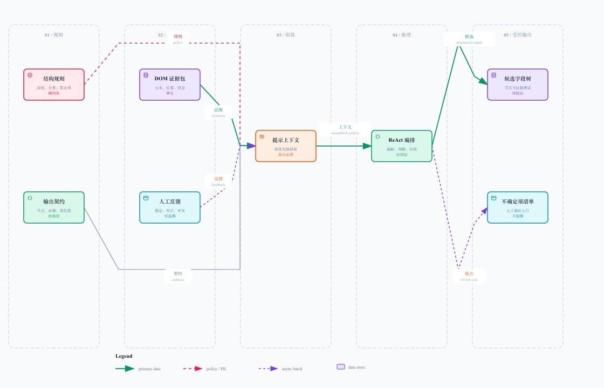
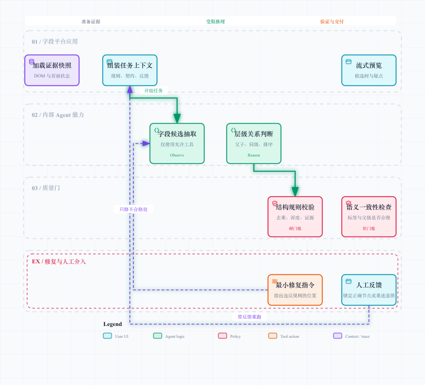
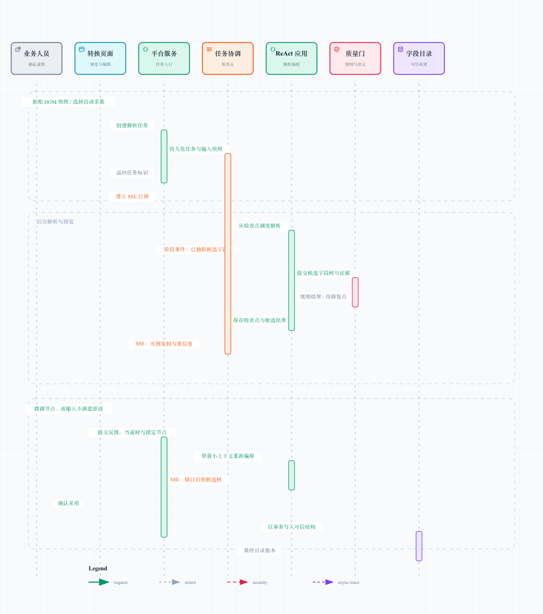

# 智能层级解析：让 Agent 负责判断，不负责瞎编

## 1. 边界先说清

公司内部已有 Agent 平台时，这里不讨论其底层模型、记忆、调度或推理引擎。我负责的设计边界是**应用层编排**：如何组织 ReAct 节点、如何拼装提示上下文、允许什么工具、怎样验证输出、什么时候交给人工。

这里的 ReAct 是 Reason + Act 的 Agent 编排范式，不是前端 React。面试里把两个词讲反，气氛会瞬间从架构评审变成拼写大赛。

解析层的输入不是“整个网页随便看”，而是经过范围清洗的 DOM 证据包；输出不是一段自然语言，而是带节点、层级、顺序、证据和置信度的候选字段树。

## 2. 提示上下文如何组装

[打开可交互提示组装图](./diagrams/prompt-assembly.html)

一个可用的任务上下文分为四层，优先级从高到低：

| 层 | 内容 | 作用 |
| --- | --- | --- |
| 系统规则 | 采集范围、禁止项、最大深度、同级去重、证据要求 | 不能被页面文本或用户反馈覆盖 |
| 输出契约 | 节点类型、父级、顺序、证据引用、置信度、疑点格式 | 把结果限定为机器可验收的结构 |
| 页面证据 | DOM 文本、语义标签、位置、相邻标题、页面状态 | 作为字段判断的事实来源 |
| 修订上下文 | 当前候选树、人工锁定节点、不满意原因 | 只影响本次需要修复的局部 |

拼装时遵循“最小必要”原则：不把所有历史快照、整页无关 DOM 和十轮对话一次塞给模型；只给本次需要判断的区域、必要祖先链和与错误相关的反馈。页面滚了三屏，字段没抓全，Token 倒是先跑完一场半马——这种事不应发生。

## 3. ReAct 应用节点编排

[打开可交互编排图](./diagrams/react-orchestration.html)

### 节点一：加载证据快照

读取经过清洗的 DOM 证据、页面状态和来源范围。此节点不调用页面、不执行新动作，保证一次解析有稳定输入。

### 节点二：组装任务上下文

把结构规则、输出契约、DOM 证据和人工反馈按优先级组合。人工锁定的节点会变成不可随意修改的约束，避免模型在第二轮又把用户刚修好的目录拆掉。

### 节点三：字段候选抽取

识别可能的菜单、页签、分组、字段、表头和指标；对每个候选记录对应 DOM 证据。此阶段宁可多报候选，也不要把它们直接当最终树。

### 节点四：层级关系判断

综合 DOM 嵌套、相邻标题、视觉 / 语义角色和页面状态，判断父子、同级与排序。这里要允许“不确定”：例如“状态”是筛选项还是表头，不能只靠词面拍板。

### 节点五：结构规则校验

检查无环、最大深度、同级名称冲突、非法节点类型、缺失父级和无证据节点。硬规则失败时，生成定位到节点的最小修复指令，不把整页从头再解析。

### 节点六：语义一致性检查

检查字段与父级是否合理，例如字段是否被挂在不相干菜单下，指标是否被当成页面，还是 Tab 与 Section 被混淆。语义检查可产生低置信度和疑点，但不应伪装成绝对错误。

### 节点七：预览与人工回路

将候选树、证据、置信度和疑点推送给前端。用户可以直接微调，也可以反馈“这一组其实属于订单详情页”，带着当前结构和锁定节点进入下一次局部解析。

## 4. 工具要受限，输出要可验收

### 允许工具

- 读取当前任务的 DOM 证据和页面状态；
- 读取当前候选树、人工锁定节点和规则结果；
- 生成候选节点、修订意见与不确定项；
- 在自动采集场景中，申请受白名单约束的浏览器动作。

### 明确禁止

- 访问未授权页面、账户、文件或网络资源；
- 将 DOM 内任何文本当作系统指令执行；
- 读取或输出业务数据值、凭据和会话信息；
- 绕过规则或人工确认，直接写入可信目录；
- 在失败时无限重试或悄悄删掉无法解释的字段。

## 5. 候选字段树必须携带什么

| 信息 | 为什么不能省 |
| --- | --- |
| 节点名称与类型 | 让平台知道它是页面、Tab、分组、字段还是指标 |
| 父级与排序 | 让树可展示、可移动、可导出路径 |
| DOM 证据引用 | 让人能回到页面核验“它为什么在这里” |
| 置信度 | 区分可自动通过、需预览和必须人工确认 |
| 不确定原因 | 把模型的犹豫变成可操作问题，而不是一句含糊解释 |
| 修订来源 | 标记由自动解析、人工编辑还是反馈重跑产生 |

证据绑定是整个方案的核心约束。没有证据的字段不是“低分答案”，而是不可入库答案。

## 6. SSE 预览与反馈为何要分离任务状态

[打开可交互时序图](./diagrams/feedback-sse.html)

前端与后端可以通过 SSE 建立长连接，展示“已抽取候选”“正在校验”“可预览”“正在修复”等阶段事件。但 SSE 只是观察通道，不能当作任务生命线。

正确做法是：先创建持久化任务和输入快照，再订阅 SSE；每一阶段把检查点与候选结果持久化；断线后前端依据任务标识重新订阅或查询。这样网络抖一下，任务不会顺手表演失忆。

人工反馈有两种模式：

- **微调模式**：用户直接移动、改名、合并或删除少量节点，系统记录修订来源；
- **反馈重跑模式**：用户说明整体不一致，并提交当前树与锁定节点，Agent 只围绕冲突区域重组，不覆盖已确认部分。

## 7. 失败与修复策略

| 问题 | 判断 | 处理 |
| --- | --- | --- |
| 输出不是结构化树 | 契约解析失败 | 只重试输出修复节点，附带格式错误说明 |
| 树有环或父级缺失 | 硬规则失败 | 返回违规节点与最小上下文，局部重组 |
| 字段没有 DOM 证据 | 事实不可追溯 | 拒绝入库，标记为待确认 |
| 语义模糊 | 置信度低或多个合理父级 | 预览时突出疑点，交给人工选择 |
| 人工反馈与锁定节点冲突 | 约束不一致 | 优先要求用户澄清，不擅自改锁定结果 |
| 多次修复仍失败 | 超出重试预算 | 结束为可解释失败，保留快照和中间结果 |

## 8. 面试时最值得强调的判断

1. 不是把“提示词工程”当魔法，而是把它放进规则、证据和结构化输出的约束里。
2. 不是让 Agent 接管目录，而是让它提高人工录入与语义整理的效率。
3. 不是追求一次解析 100% 正确，而是让不确定项显性化、可校正、可复盘。
4. 不是描述内部 Agent 引擎细节，而是讲清自己如何把现有能力编排成可靠业务应用。

下一篇进入平台核心：一棵可信字段树如何在移动、删除、恢复和并发编辑中保持一致。
