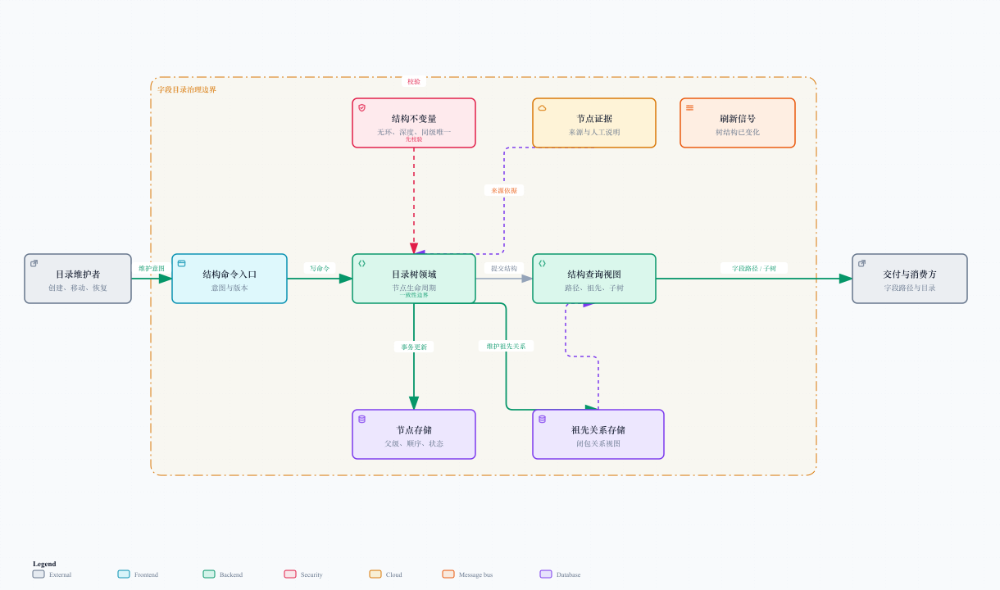

# 字段结构管理：DOM 可以乱，目录树不能乱

## 1. 目录树是平台的核心领域

采集和 Agent 解析解决“字段从哪里来、初始层级像什么”，目录治理解决“哪些结果值得长期相信”。一旦结果进入可信目录，它就不再是一次页面解析的临时文本，而是能够被查询、移动、交付、审核和恢复的资产。

常见节点可以覆盖系统、导航分组、导航项、页面、页签、区块、组件、字段、指标和其他兜底类型。节点类型不是为了把模型输出装进枚举，而是为了让路径、导出和变更审核有一致语义。

[打开可交互治理图](./diagrams/tree-governance.html)

## 2. 为什么同时维护两类关系

一棵树至少有两类事实：

- **直接父级关系**：记录一个节点挂在哪个父级下、同级顺序是什么，适合编辑和展示；
- **祖先关系**：记录一个节点与全部祖先 / 后代的可达关系，适合查询路径、祖先链和完整子树。

只存父级关系时，读一个深层路径要反复向上追溯；只存祖先关系时，维护编辑顺序又不自然。两者结合后，写侧依然直观，读侧则能稳定服务“给我这个字段的完整路径”“导出某页面的全部后代”“判断移动后是否形成环”等需求。

这不是为了炫一个数据库技巧，而是承认字段目录会被频繁读、偶尔改，且每次改动都可能影响一整段路径。

## 3. 结构不变量

任何创建、批量导入、更新、移动、删除和恢复都必须通过同一套规则：

| 不变量 | 意义 |
| --- | --- |
| 节点名称规范化 | 避免全角空格、空名称和肉眼相同但机器不同的重复 |
| 同一平台范围 | 不能把 A 平台的节点挂到 B 平台 |
| 无环 | 祖先不能移动到自己的后代下面 |
| 最大深度 | 防止错误输入生成无限长路径 |
| 同级唯一 | 避免同一父级下出现不可区分的同名节点 |
| 父级有效 | 父级必须存在、未删除且类型允许承载子节点 |
| 版本匹配 | 编辑基于的结构不能已经过期 |
| 证据与来源 | 自动生成或人工修订的节点要能说明来源 |

没有这些底线，目录在小数据量时看起来没问题，等有人把“订单列表”拖进它自己的子孙节点后，整棵树会立刻进入抽象艺术阶段。

## 4. 节点生命周期

### 创建与批量导入

创建时验证父级、名称、类型和顺序；批量导入时先在内存或临时上下文中验证整段结构，再作为一组写入。这样不会出现前半段成功、后半段失败，留下半棵无法解释的小树。

原始前端缩进输入属于这一步的已落地入口：它允许空格、制表符和全角缩进的规范化，合并同父级重复项，并限制节点数量、深度、名称长度和输入大小。输入越早规范，后面越少“为什么这两个看起来一样”的哲学问题。

### 更新

更新只允许修改可变属性，例如展示名、描述、类型或排序；涉及父级变化的操作一律走“移动”，避免普通更新绕过结构校验。

### 移动

移动是最复杂的操作。需要计算受影响范围：原父级路径、新父级路径、当前节点及其全部后代。系统按稳定顺序获取影响范围锁，锁后重新读取关键结构，再确认新父级不在当前子树中，最后在同一事务中更新直接父级关系、祖先关系、顺序和刷新信号。

### 软删除与恢复

删除不等于物理抹除。目录节点采用软删除语义：被删除节点及其子树不再出现在默认查询和交付中，但保留历史、来源和恢复可能。恢复时同样要验证父级是否仍可用、同级名称是否冲突、路径深度是否仍然合法。

## 5. 并发一致性：锁什么，重试什么

两个维护者可能同时移动不同节点，也可能一个人在导出时另一个人正在改树。处理思路不是“给整棵树上一把大锁”，那会把正常编辑也堵住；而是围绕结构影响范围做精细控制。

| 场景 | 保护策略 |
| --- | --- |
| 同一节点被同时编辑 | 版本校验，防止后写覆盖前写 |
| 两次移动影响同一祖先链 | 按稳定顺序锁定影响范围，避免死锁 |
| 锁等待或短暂结构冲突 | 有限次数重试，并在每次重试后重新校验 |
| 不可恢复的结构错误 | 立即失败并说明原因，不盲目重试 |
| 读侧需要最新树 | 结构变化后发布刷新信号，读侧失效或重建缓存 |

这里要区分两种“版本”：编辑校验用的结构版本保护并发；发布 / 审核意义上的修订版本用于追溯。刷新信号只说明“树变了”，不应该冒充审计记录。

## 6. 查询模型：为使用者而建

维护一棵树不能只给一个“查所有节点”的能力。不同消费者需要不同视图：

- 根节点分页：面向目录首页和平台导航；
- 子节点分页：面向某个页面或分组的局部编辑；
- 祖先链：面向面包屑、字段路径和证据解释；
- 有界子树：面向预览、局部导出和权限控制；
- 流式全树：面向大目录交付，避免一次加载全部节点；
- 仅活动节点：默认过滤软删除节点，恢复和审计场景再显式查看历史。

任何查询都应有深度、数量或游标边界。否则一个看似无害的“给我整棵树”会在目录长大后把服务和浏览器一起带走。

## 7. 面试追问的答法

**为什么不只保存 JSON 树？**

JSON 对一次展示方便，但对局部移动、并发编辑、路径查询、软删除恢复和增量交付不友好。目录作为长期资产，需要把结构规则和查询模式变成一等能力。

**为什么不只用父级字段？**

可以，但祖先链和子树查询会随着深度增加反复递归。维护祖先关系是用较小的写入成本换取更确定、更稳定的读性能和环检测能力。

**移动时为什么还要锁后重读？**

因为“我开始校验时它没有环”不代表“我真正提交时它仍没有环”。锁后重读是为了让最终判断基于当前事实，而不是过期快照。

## 8. 可验证的质量点

- 任意节点不会出现在自己的祖先链中；
- 移动后，子树的全部路径同时更新；
- 软删除节点不出现在默认目录与导出中；
- 恢复冲突可解释，不会静默改名；
- 并发冲突要么成功于最新结构，要么明确失败；
- 读侧拿到的路径与交付侧展开的路径一致。

下一篇会把“可信树”变成可恢复的字段字典交付任务。
