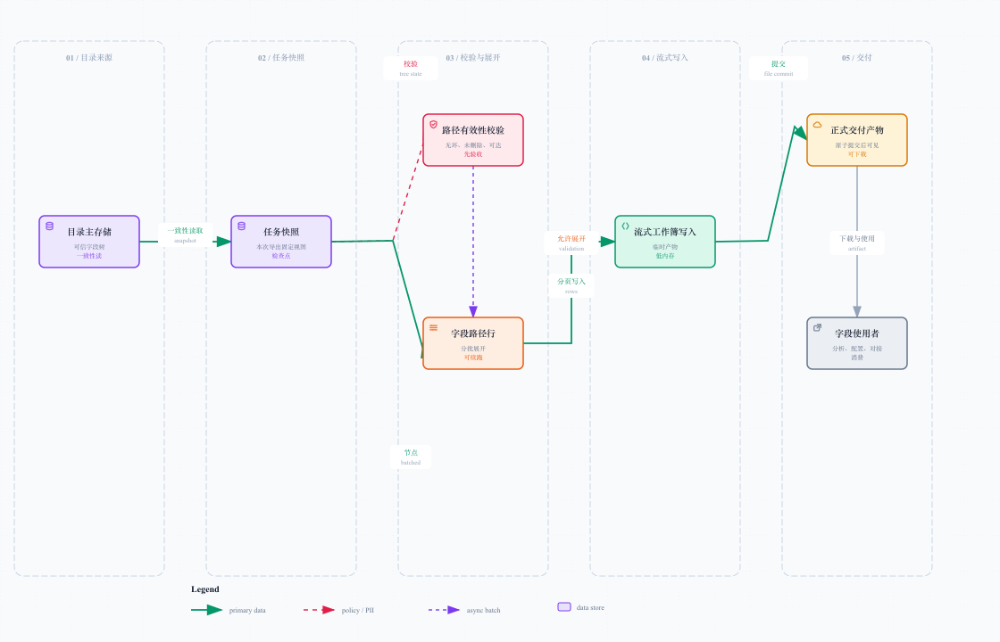
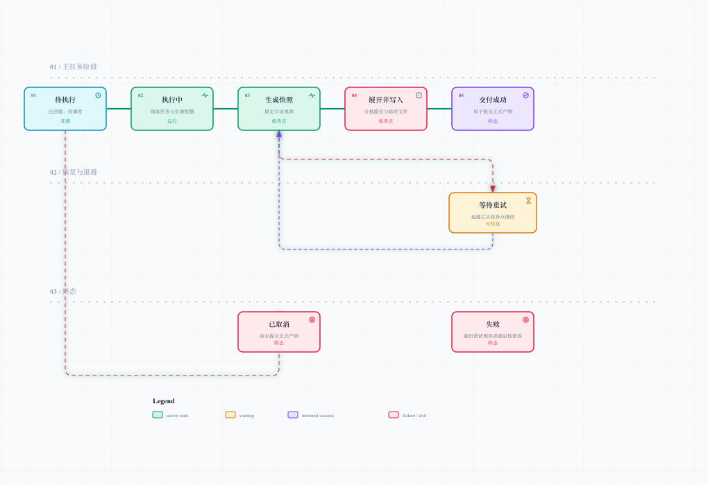

# 字段字典数据交付：让大导出可恢复，而不是祈祷别断

## 1. 交付的不是“当前读到的树”

字段字典一旦开始导出，就必须回答：这份文件来自目录的哪一个一致性时刻？如果导出进行到一半有人移动了目录节点，文件前半部分和后半部分不能来自两棵不同的树。

因此交付从一致性快照开始：固定本次目录视图、节点状态和顺序；后续路径展开、行生成和文件写入都基于该快照，而不是不断回读实时目录。



[打开可交互交付图](./diagrams/delivery-pipeline.html)

## 2. 交付内容怎么组织

字典产物的核心是一条字段路径，例如：

```text
系统 / 一级菜单 / 页面 / 页签 / 分组 / 字段
```

除了路径，还可以带上节点类型、展示名、描述、来源、状态、生成时间和快照标识。重点不是列越多越好，而是确保每一列都能从目录快照解释出来。

对消费者来说，它应当是稳定、可筛选、可复用的定义资产；对平台来说，它必须能被重放、定位和清理。

## 3. 异步任务的分段执行

大目录导出不适合绑在一个同步请求上。一个合理的任务链可分成：

1. 创建任务并做幂等判断，返回任务标识；
2. 在资源配额内领取任务，固定目录快照；
3. 校验路径有效性，排除环、已删除节点和不可达节点；
4. 分批展开字段路径，形成中间行数据；
5. 流式写入临时工作簿或临时文件；
6. 所有阶段成功后原子提交正式产物；
7. 保存完成状态、产物信息和清理时间。

这条链路里，前端可以观察进度，但不承担任务执行。前端关掉页面不影响后台；服务短暂重启后也不需要从第一行重新写。

## 4. 为什么要有中间快照与检查点

目录主存储适合事务与一致性，任务执行的中间状态适合可恢复与隔离。已落地方案将“固定目录快照、有效路径 / 行数据、临时文件”拆成阶段性检查点：

| 检查点 | 已完成的事实 | 重试时可以跳过什么 |
| --- | --- | --- |
| 快照就绪 | 本次目录视图已固定 | 不必再次读取实时目录 |
| 行数据就绪 | 路径已展开并通过校验 | 不必再次遍历整棵树 |
| 文件就绪 | 临时文件已完整写完 | 不必再次生成工作簿 |
| 正式提交 | 可下载产物已原子可见 | 不再重跑任务 |

检查点的价值不只是“快一点”，更是把失败范围缩小。重试不是把同一个错误再表演三遍，而是从最近一次可信完成的位置继续。

## 5. 流式写入与资源控制

导出链路遵循三条原则：

- **游标 / 分批读取**：不一次把全树拉进内存；
- **临时存储隔离**：中间行数据在任务侧保存，避免影响主目录读取；
- **流式工作簿写入**：数据边生成边写入，控制内存峰值。

任务执行还需要有界并发：限制同一时刻运行的导出数量、排队数量、单任务超时、单文件行数和磁盘空间。否则十个人同时点“导出全部”，系统就会获得一场免费的压测，还是无法退款的那种。

## 6. 任务状态机



[打开可交互状态图](./diagrams/export-task-lifecycle.html)

任务应有明确状态，而不是只用“进行中 / 完成”两格：待执行、执行中、生成快照、展开并写入、等待重试、成功、失败、取消。状态的含义需要稳定：

| 状态 | 对用户意味着什么 | 对系统意味着什么 |
| --- | --- | --- |
| 待执行 | 请求已被接受 | 等待资源与调度 |
| 执行中 | 正在处理 | 任务已被领取，不可重复执行 |
| 快照 / 写入阶段 | 可以看到进度 | 最近检查点可恢复 |
| 等待重试 | 暂时不可用但仍有机会 | 遵循退避策略，避免立即抢资源 |
| 成功 | 可下载正式产物 | 文件已原子提交，状态不可回退 |
| 失败 | 需要处理原因 | 保留错误与检查点，确定性错误不重试 |
| 取消 | 用户不再需要 | 停止后不暴露半成品 |

## 7. 幂等、重试与原子提交

### 幂等

同一目录范围、同一快照和同一导出参数重复提交时，应复用已有有效任务或明确返回已有结果，而不是创建两份内容相同的重任务。

### 重试

只对短暂性问题重试，例如资源暂不可用、短暂存储错误或可恢复超时；遵循有限次数和指数退避。目录规则错误、路径非法、参数不合法等确定性错误直接失败，并告诉用户修哪里。

### 原子提交

文件先写入临时位置，确认完整后再提交为正式产物。使用者只能看到“尚未生成”或“完整文件”，不能下载到一半才发现末尾没了的半成品。

## 8. 失败恢复与清理

| 风险 | 处理策略 |
| --- | --- |
| 服务重启 | 从任务状态和检查点恢复，不依赖请求连接 |
| 文件写入中断 | 保留临时产物状态，按策略续写或重建 |
| 重复调度 | 通过条件领取和幂等键防止多人执行同一任务 |
| 产物长期堆积 | 设置保留期与定期清理，清理失败可再次扫描 |
| 目录在导出期间变化 | 继续使用已固定快照，不混入实时变更 |
| 用户反复刷新进度 | 进度更新节流，任务主状态仍是唯一事实来源 |

## 9. 面试时的高价值总结

“我把导出看成一个长期运行、可恢复的后台任务，而不是接口里拼一份文件。关键设计是固定一致性快照、分段检查点、流式写入和正式产物原子提交。这样目录变化、网络断开和短暂错误都不会污染用户最终拿到的字段字典。”

下一篇将继续说明：当页面重新采集后，平台怎样识别并审核“新增、删除、改名、移动”。
