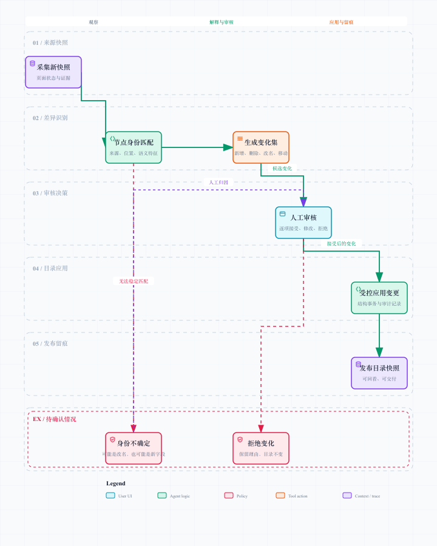

# 采集与变更治理：页面变了，目录不能偷偷失忆

## 1. 为什么“重新采一遍覆盖掉”是坏主意

页面会改名、移动菜单、拆分 Tab、合并区块，也可能因为权限或实验开关暂时少显示一些字段。若每次采集都直接覆盖目录，系统无法回答：

- 这是新字段，还是旧字段改名？
- 这是字段移动，还是同名字段出现在了另一个页面？
- 页面暂时无权限，能不能把旧字段删除？
- 谁确认了这次变化，为什么？

因此，重新采集的结果首先是“新快照”，而不是“新真相”。真相需要经过身份匹配、差异解释和人工审核才能发布。

[打开可交互变更图](./diagrams/change-governance.html)

## 2. 快照是什么

快照固定记录某次采集的字段定义、页面状态、来源范围、采集时间和证据。它是比较的基线，不随当前目录继续编辑而变化。

快照至少应回答四件事：

| 问题 | 快照中的依据 |
| --- | --- |
| 这是谁的页面？ | 平台、页面、场景与授权范围 |
| 当时看到了什么？ | 结构化字段节点与 DOM 证据 |
| 当时页面处于什么状态？ | Tab、折叠、滚动、条件与不可访问说明 |
| 结果由谁产生？ | 人工采集、自动采集、Agent 候选或人工修订 |

## 3. 节点身份不能只看名称

“状态”这个字段在多个模块都可能存在；“创建时间”改成“创建日期”不应被当作删除加新增；一个菜单整体移动也不应让所有后代看起来像全量新建。

节点身份匹配应综合多种线索：

- 稳定的页面范围与来源路径；
- 节点类型与相对位置；
- DOM 位置线索和相邻标题；
- 历史人工确认的映射关系；
- 名称相似度作为辅助，而不是唯一依据；
- 父级、兄弟节点和子树形状变化。

名称相同只是“可能相同”，来源相同且结构连续才更接近“同一个”。如果线索冲突，系统应返回“身份不确定”，绝不能把算法犹豫包装成确定改名。

## 4. 变化集怎么表达

| 变化类型 | 例子 | 审核时关注什么 |
| --- | --- | --- |
| 新增 | 新页面出现一个筛选字段 | 是否真实可用、父级是否正确 |
| 删除 | 旧字段在新快照中不存在 | 是下线、暂不可见还是漏采 |
| 改名 | “创建时间”变为“创建日期” | 是否同一语义、下游是否受影响 |
| 移动 | 字段从 Tab A 移到 Tab B | 路径变化是否合理、是否保留原身份 |
| 类型变化 | 表头被改为筛选项 | 消费方式和词典描述是否要更新 |
| 证据变化 | DOM 结构改变但字段不变 | 是否影响后续自动识别稳定性 |

一个变化集应该带上前后快照、匹配置信度、影响路径、候选解释和建议动作。审核人不需要当侦探，从一堆文本里猜系统到底发现了什么。

## 5. 人工审核是机制，不是补锅

自动化擅长发现变化，人工擅长判断业务语义。审核界面应把变化集变成可以逐条处理的待办：接受、修改、拒绝、延后或要求补充证据。

### 自动可通过的低风险变化

例如新增字段证据充分、父级明确、无同名冲突，且只出现在本次允许范围内。即使自动通过，也要保留审核策略和来源。

### 必须人工确认的高风险变化

- 删除现有字段；
- 身份不确定的改名 / 移动；
- 影响大子树的上层移动；
- 跨页面或跨平台的疑似匹配；
- 自动采集覆盖不足时产生的“消失”结果；
- 低置信度或缺少 DOM 证据的候选。

拒绝变化不是系统失败。拒绝理由会成为下一次匹配、提示上下文和规则优化的重要样本。

## 6. 发布、回看与恢复

审核通过后，变化以受控结构操作进入目录，并产生可回看的发布快照。发布后字典交付读取的是已确认目录，而不是尚未审核的采集结果。

需要保留：

- 变更前后字段路径；
- 审核结论与理由；
- 采集证据与快照标识；
- 操作时间与维护者；
- 是否影响下游交付；
- 必要时的恢复入口。

这里的恢复不是随手把数据库倒回去，而是在保留审计语义的前提下，生成一条新的受控修订。这样才能知道“为什么又改回来了”。

## 7. 与 Agent 解析怎样互相促进

变更治理也反哺上游 Agent：

- 人工接受的改名 / 移动可成为后续身份判断的高质量参考；
- 被拒绝的候选能说明某类 DOM 模式容易误判；
- 经常需要人工补采的页面状态，可调整自动探索优先级；
- 高频不确定项可变成更明确的结构规则或预览提示。

这不是让 Agent 偷偷“学习用户数据”，而是把经过授权、脱敏、可审计的结构修订沉淀为平台规则与模式。页面在变，系统的判断也应该有学习回路，但这条回路必须看得见、能关掉、能解释。

## 8. 面试时的核心表达

“我没有把重新采集理解为覆盖同步，而是把它设计成快照对比和变更审核。节点身份不仅靠名称，还结合来源、位置、父级和历史映射；新增、删除、改名、移动都会变成可审查的变化集。这样平台能在页面变化后持续维护字段资产，而不是每次重新做一份不知从何而来的表。”

## 9. 验收与风险

| 验收点 | 风险防线 |
| --- | --- |
| 同一字段改名后历史可连续追踪 | 不用单一名称相似度直接合并 |
| 页面短暂不可见不触发删除 | 删除变化默认高风险审核 |
| 大范围移动不会导致后代全部重建 | 匹配子树与来源路径，识别结构移动 |
| 变化结论可解释 | 保存前后证据、匹配依据与审核理由 |
| 下游只消费已确认版本 | 采集快照与发布目录分离 |

下一篇覆盖所有章节都共享的工程问题：连接、任务、权限、安全、评估和明确边界。
