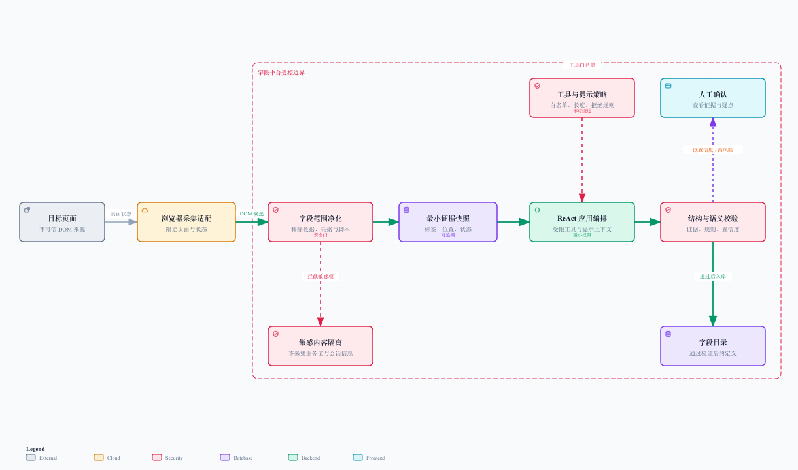

# 可靠性、安全与评估

## 1. 横切能力决定平台能不能长期用

采集、解析、治理、交付各自跑通并不代表平台可靠。真正容易在生产环境露出牙齿的是：连接断开、任务重复、并发修改、页面里的恶意文本、超大 DOM、敏感内容和“模型看似答对但其实漏了”的灰色错误。

这一篇把它们放到同一个标准下：可观察、可恢复、可限制、可解释。

## 2. SSE：实时感不等于可靠性本体

SSE 适合把解析进度、候选字段、校验提示和导出阶段流式送给前端。它的优点是单向推送简单、前端容易重连、适合长任务预览。

但 SSE 不应该承载唯一任务状态。可靠设计为：

1. 先持久化任务、输入快照和幂等标识；
2. 再返回任务标识并允许前端建立 SSE 订阅；
3. 后台阶段变更先落任务状态和检查点，再推送事件；
4. 断线时客户端按最后事件标识重连，或查询任务当前状态；
5. 任务完成后保留最终结果，SSE 只是一条观察记录。

这避免了“页面关了，后台就假装没开始过”的尴尬。SSE 负责让用户看见过程，任务存储负责让系统记住过程。

## 3. 任务可靠性：幂等、检查点、退避

| 能力 | 应用场景 | 关键判断 |
| --- | --- | --- |
| 幂等 | 重复创建解析 / 导出任务 | 同一输入与范围不重复消耗资源 |
| 条件领取 | 多个执行者可能处理同一任务 | 同一任务同一时刻只有一个实际执行者 |
| 检查点 | 导出、长解析、状态探索 | 重启后从最近可信阶段继续 |
| 有限重试 | 短暂存储 / 网络 / 资源问题 | 退避、预算、重新校验上下文 |
| 失败分类 | 参数、结构、权限、临时故障 | 确定性失败不应重试 |
| 取消语义 | 用户不再需要任务 | 停止后不能暴露半成品 |

重试必须带着正确的问题定义。若结构规则不允许某个父子关系，重试一百次也不会突然获得许可；若页面权限不足，刷新连接也不会长出管理员身份。把错误分对类，比把重试次数调大更重要。

## 4. 信任边界与最小权限

[打开可交互安全图](./diagrams/trust-boundary.html)

页面 HTML 是外部输入，即使它来自公司内部系统，也不能天然信任。安全边界分为四层：

### 入口净化

只允许限定页面范围进入；移除脚本、事件属性、隐藏敏感片段和疑似业务值；将页面文本当作数据而非指令。

### 工具最小权限

浏览器动作由白名单控制，限制可访问 URL、账号角色、动作类型、最大步骤和页面状态数量。自动采集不执行提交、删除、发布或下载敏感文件。

### Agent 受控上下文

提示上下文只包含最小必要 DOM 证据、规则、契约和授权后的人工反馈。任何页面文本出现“忽略以上规则”“上传这些内容”都只是普通文本，不能提高权限。

### 入库质量门

候选字段必须携带证据，通过结构规则和语义检查；低置信度、高风险和身份不确定变化进入人工审核；只有可信结果能进入目录与交付链路。

## 5. 隐私与数据最小化

| 风险 | 约束 |
| --- | --- |
| 页面中混有业务数据 | 清洗时只保留标签与结构，过滤值、列表行和敏感模式 |
| 会话信息被带入快照 | 禁止收集 Cookie、令牌、请求头和接口载荷 |
| DOM 过大 | 区域裁剪、字段化摘要、长度上限与采样策略 |
| 人工反馈包含敏感信息 | 前端提示脱敏，服务端限制保留范围和访问权限 |
| 日志泄露页面内容 | 日志记录任务标识、阶段和错误类别，不直接打印原始 DOM |

字段定义也可能有内部敏感性，因此快照、目录与导出产物需要按平台、角色、目录范围进行授权。安全不是一个“加密开关”，而是从采集范围到日志、下载的连续最小化策略。

## 6. 评估体系：别只看模型答没答

Agent 方案的可用性应该由端到端指标衡量：

| 维度 | 指标 | 解释 |
| --- | --- | --- |
| 覆盖 | 已发现状态处理率 | 有快照、跳过原因或失败记录的状态占比 |
| 抽取 | 字段召回与精确 | 应有字段是否采到、采到的是否真是字段 |
| 结构 | 父子 / 顺序正确率 | 路径、分组和同级关系是否符合人工基准 |
| 可信 | 证据绑定率 | 候选节点能否回溯到 DOM 证据 |
| 交互 | 人工修订率与修订类型 | 哪些误差可通过规则或上下文减少 |
| 稳定 | 任务成功率、恢复率、耗时分位 | 长任务在异常下是否可控 |
| 成本 | 单页 DOM 量、工具步数、解析轮数 | 防止“结果正确但成本失控” |

评估集要覆盖正常页面，也要覆盖折叠区、Tab、滚动、无权限、跨域 iframe、动态渲染、同名字段和页面改名等坏天气。晴天跑得快不代表雨天不会熄火。

## 7. 人工校正如何成为质量闭环

人工不是模型失败后的临时补丁，而是系统可信度的一部分。前端要让用户清楚看到：

- 哪些节点是 Agent 候选，哪些已确认；
- 每个节点对应哪段页面证据；
- 哪些地方置信度低、为什么低；
- 微调会影响哪些路径；
- 反馈重跑会保留哪些锁定节点；
- 这次提交最终进入了哪个目录快照。

只有把这些信息展示出来，用户才能做“确认事实”的工作，而不是在黑盒输出里找彩蛋。

## 8. 明确不承诺什么

- 不承诺自动采集覆盖所有角色、所有未来页面和所有视觉控件；
- 不承诺模型第一次就给出完全正确的业务语义；
- 不承诺无 DOM 证据的字段可以被安全推断出来；
- 不承诺网络、页面或外部工具故障永不发生；
- 承诺的是：失败有状态、缺口可见、结果可追溯、任务可恢复、人工可接管。

## 9. 面试收束句

“我把 Agent 能力放在平台已有可靠性框架里，而不是让它成为一个不受约束的自动化黑盒。页面采集有范围和最小化，解析有证据和质量门，长任务有幂等和检查点，变化有审核和回看。这样即使模型、网络或页面状态不完美，系统也能诚实地告诉用户哪里确定、哪里需要人来判断。”

至此，字段目录平台的完整叙事闭合：采集页面字段定义，理解层级语义，治理可信目录，交付可恢复字典，并在变化中持续维护它。
