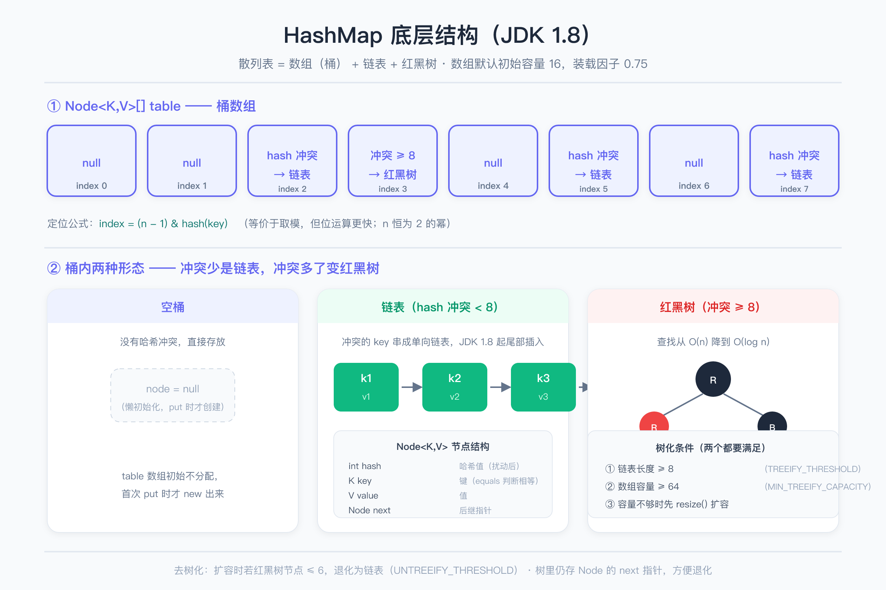
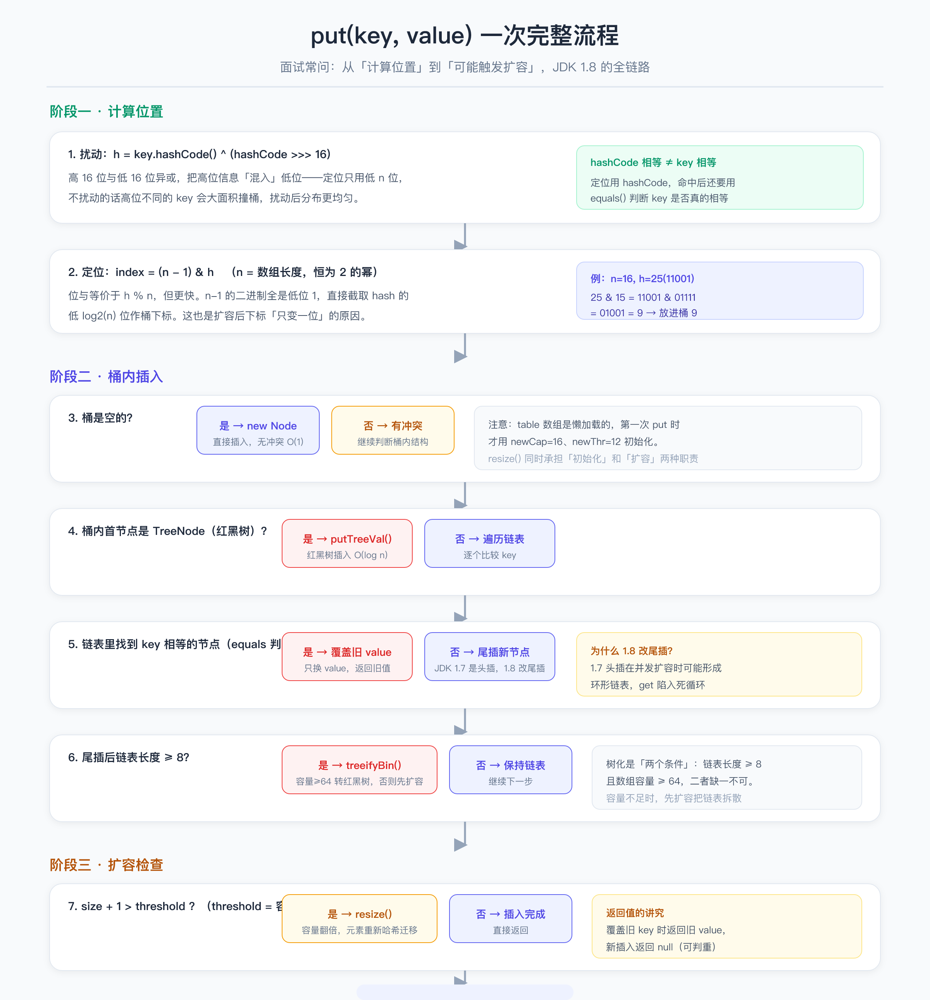
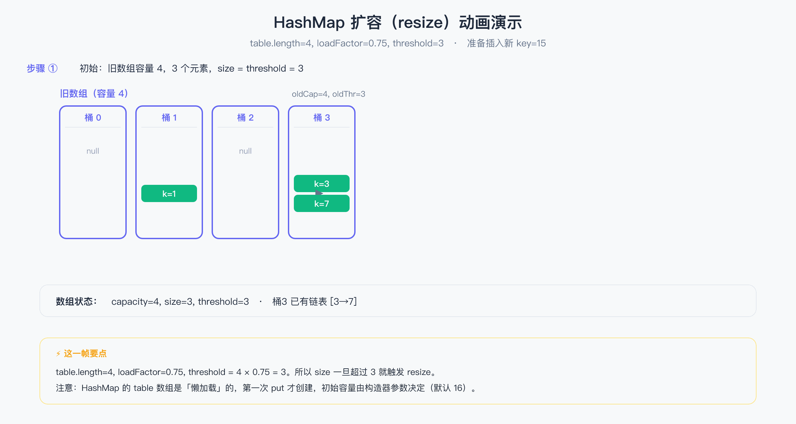

# HashMap 面试，别再背八股

一场 Java 面试常见的开场白：「聊聊 HashMap 的底层结构？」候选人大多答得滚瓜烂熟：数组 + 链表 + 红黑树，1.7 头插，1.8 尾插，初始容量 16，装载因子 0.75……面试官往深处一问，场面就开始尴尬。

这篇文章不讲速记口诀，把 HashMap 从「放进来到拿出来」的每一步拆给你看。

> 配图：图 1 底层架构 · 图 2 put 流程 · 图 3 扩容动画（文末查看）。

---

## 一、一张表看懂 HashMap 进化史

HashMap 不是一天变成现在这样的，看这张表就够了：

| JDK 版本 | 关键改动 | 面试考点 |
|---|---|---|
| 1.2 | 首次引入 HashMap | 替代 Hashtable，允许 null key/value，非线程安全 |
| 1.4 | 引入 LinkedHashMap 等子类 | 保持插入顺序 |
| 1.7 | 数组 + 链表，头插法 | 定位用 hash & (n-1)，扩容 rehash |
| 1.8 | 引入红黑树，尾插法 | 树化条件、高低位拆分、resize 优化 |
| 9+ | Compact Strings 等细节优化 | 面试很少追问 |

一句话版本：1.7 是「数组 + 链表」，1.8 升级为「数组 + 链表 + 红黑树」，顺带修了并发扩容死循环的坑。

---

## 二、底层结构长什么样

HashMap 底层是一张散列表：一个 `Node<K,V>[] table` 数组，每个下标是一个「桶」，桶里要么空着、要么挂一条单向链表、要么挂一棵红黑树。

三个数字要背熟：

- **初始容量 16**：`table` 是懒加载的，第一次 put 才创建数组；
- **装载因子 0.75**：`threshold = 容量 × 0.75`，size 超过 threshold 就扩容；
- **树化阈值 8 / 最小容量 64**：链表长度 ≥ 8 且数组长度 ≥ 64 才转红黑树，否则先扩容把链表拆散。

注意一个细节：定位桶用的是 `index = (n - 1) & hash`，n 恒为 2 的幂——这保证了位与运算等价于取模，同时只有这一个地方用到了「幂等 2」这个约束。

---

## 三、put 一次，背后发生了什么

一次 put 走七个关键步骤：先算位置，再判断桶内结构，最后检查要不要扩容。面试时能按顺序讲下来，基本就能过「底层」这一关。

**扰动函数**：`hash(key) = key.hashCode() ^ (hashCode >>> 16)`。因为定位只用低 n 位，把高 16 位异或进来，让高位信息参与散列，减少撞桶。

**树化与扩容的关系**：链表长度 ≥ 8 时先看容量，容量 < 64 就先扩容（链表被拆散，冲突自然缓解），容量 ≥ 64 才真正转红黑树。这两个条件，缺一个都不树化——这是个高频陷阱题。

---

## 四、扩容 resize：面试的重灾区

扩容是 HashMap 面试里区分「背过」和「懂」的分水岭。先看动态演示，再看文字拆解。

演示里容量从 4 翻到 8，旧桶 3 的链表 `[3, 7, 15]` 被拆成两条：3 留在新桶 3，7 和 15 跑到新桶 7。这就是 1.8 的核心优化——**高低位拆分**。

为什么能拆？因为扩容时 `n-1` 多了一位高位。以 k=7（二进制 111）为例：旧容量 4 时 `(4-1)=11`，`111 & 011 = 3`；新容量 8 时 `111 & 111 = 7`。多出来的那一位正好决定它去低位桶还是高位桶。所以 1.8 扩容**不用 rehash 所有 key**，只需要看一眼 hash 的新增位，常数级判断，还顺便把长链表拆短了。

**头插 vs 尾插**：1.7 用头插，新节点插在链表头；1.8 改成尾插。原因非常经典——1.7 头插 + 并发扩容时，两个线程同时迁移链表，可能把链表「倒过来」，形成**环形链表**，之后 get 一个不存在的 key 会死循环，CPU 直接打满。尾插保证迁移后链表相对顺序不变，从根上消灭了这个环。

不过要说清楚：HashMap 本身**不是线程安全的**，1.8 只是不再「死循环」而已，并发读写依然会丢数据、覆盖 value。要并发请用 ConcurrentHashMap。

**为什么装载因子是 0.75**：官方注释的说法是平衡空间与时间——太小时（如 0.5）频繁扩容浪费空间，太大时（如 1.0）冲突激增查询变慢。0.75 是经过大量测试的折中点。

## 五、高频追问清单

**Q：为什么容量必须是 2 的幂？**
答：两重原因。一是 `(n-1) & hash` 才能等价于取模；二是扩容时才能用高低位拆分把元素均匀分成两半。

**Q：为什么树化阈值是 8？**
答：泊松分布。当装载因子 0.75、哈希足够均匀时，桶内节点数达到 8 的概率约千万分之六，几乎不可能发生。到了这个数说明哈希出问题了，才动用红黑树兜底。

**Q：能放 null 吗？**
答：可以。key 和 value 都能为 null。HashMap 对 null key 特殊处理，hash 为 0，永远落在桶 0。Hashtable 不行。

**Q：两个 key 的 hashCode 一样会怎样？**
答：hashCode 一样只是可能同桶，进桶后还要用 equals 判断是否同一个 key。所以重写 equals 必须重写 hashCode，否则 HashMap 会「认错人」。

**Q：为什么默认容量是 16？**
答：太小了频繁扩容，太大了浪费内存，16 是权衡结果。注意：**指定初始容量 7 时，实际容量不是 7，而是向上取整到 8**——因为容量必须补成 2 的幂，用的是 `tableSizeFor` 函数。

## 写在最后

HashMap 的八股不难背，难的是把「为什么」讲清楚。面试官层层追问的路线基本是：结构 → put 流程 → 扰动函数 → 扩容细节 → 为什么 2 的幂 → 线程安全。这篇文章对应的正是这条线，下次被问到，试着从「一道 put 能走多远」讲起，而不是从定义背起。
