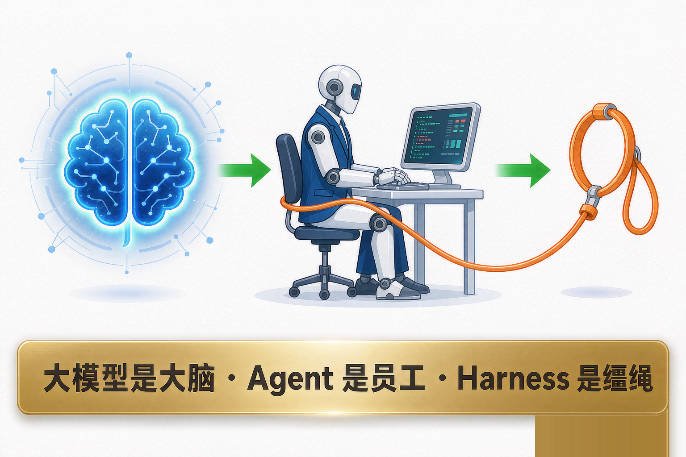
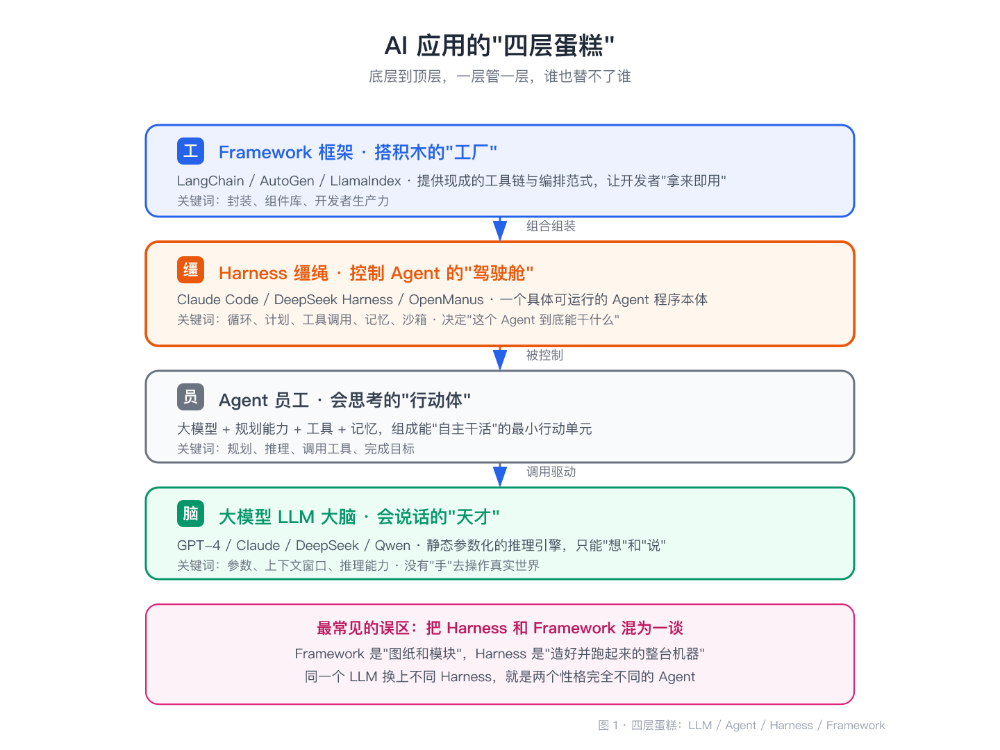
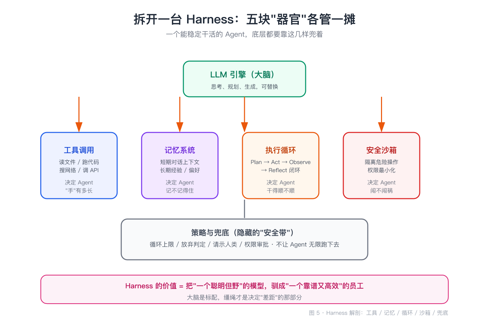
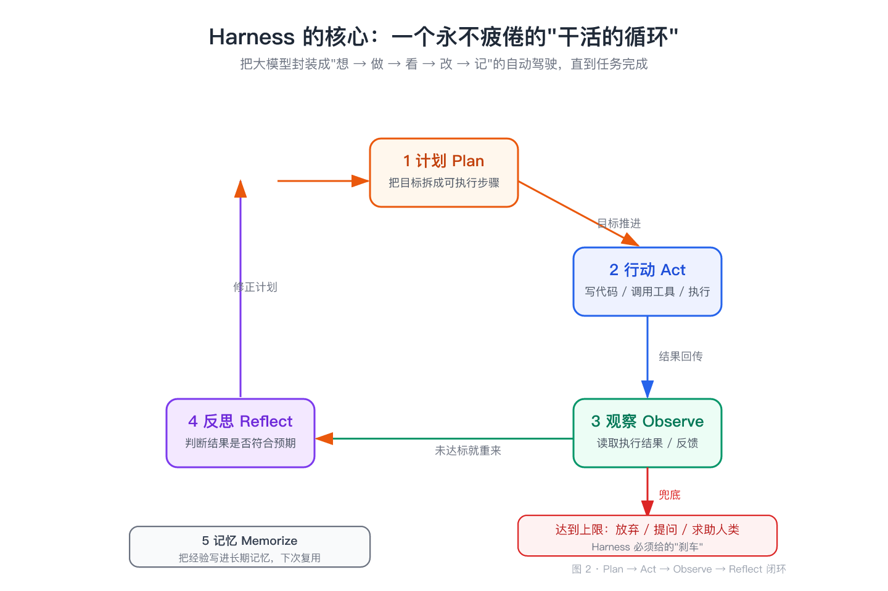
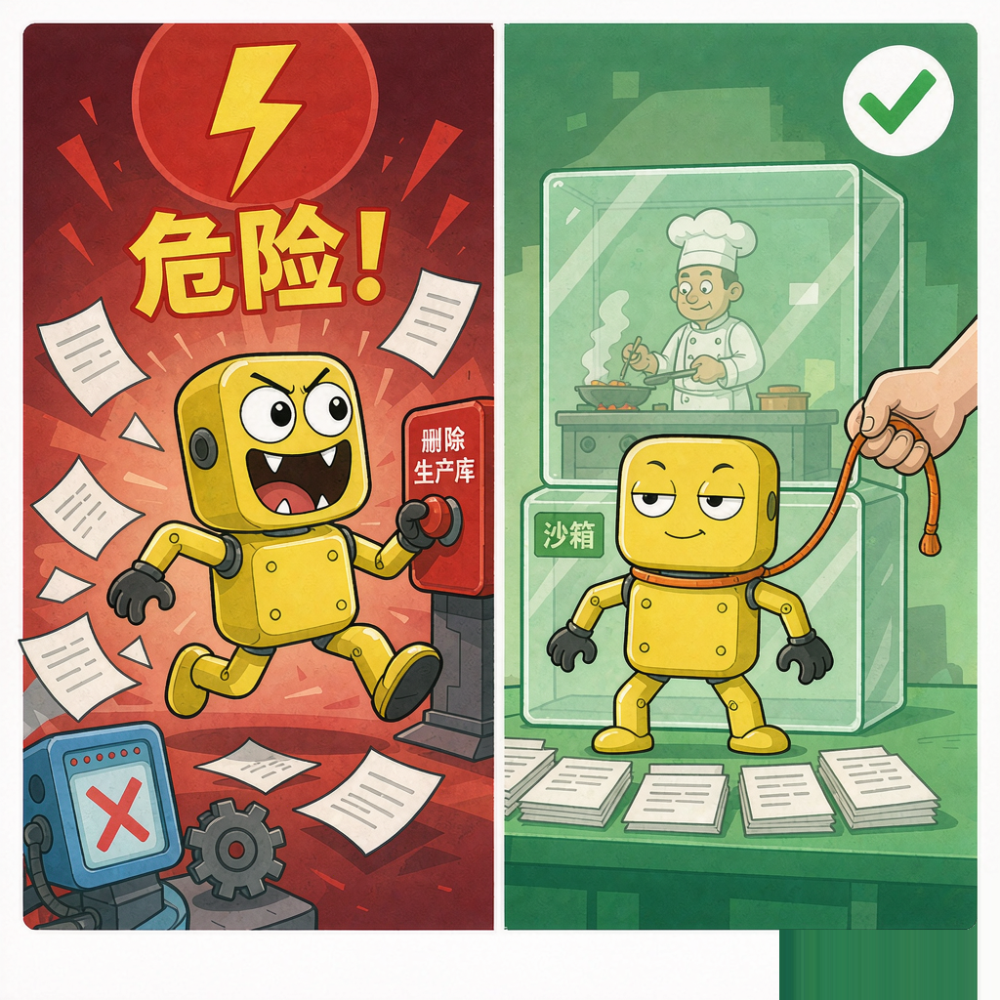
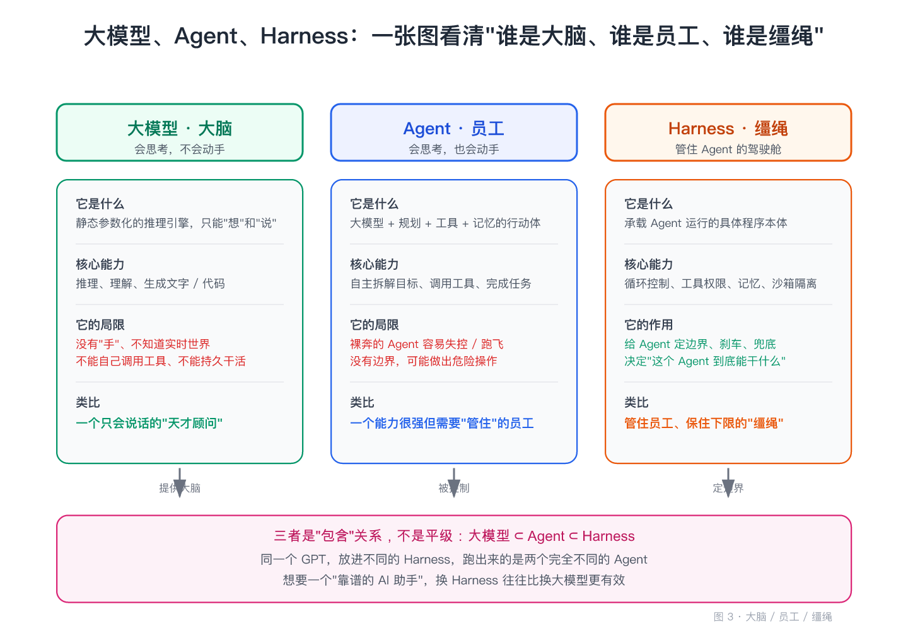
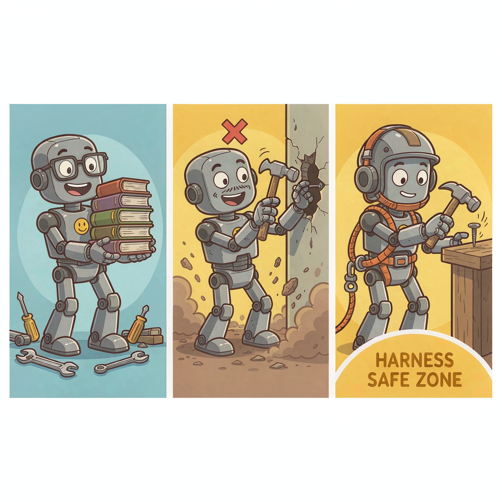
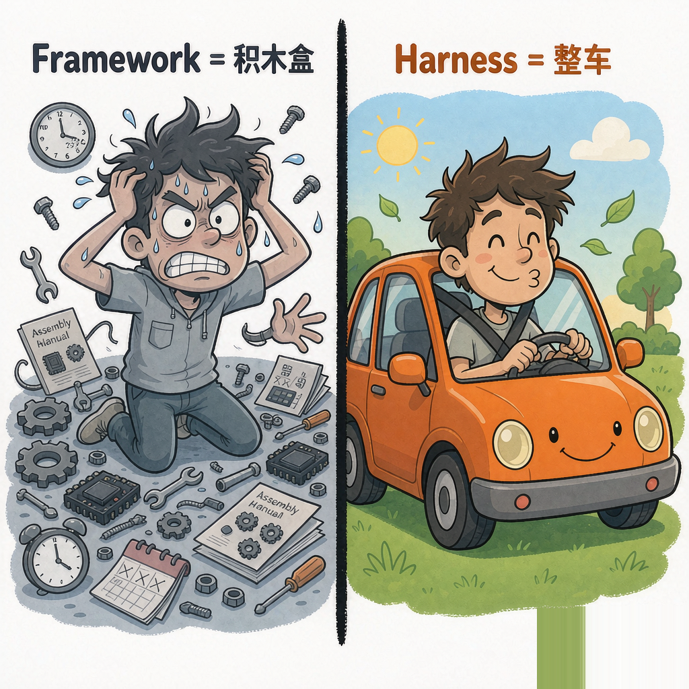
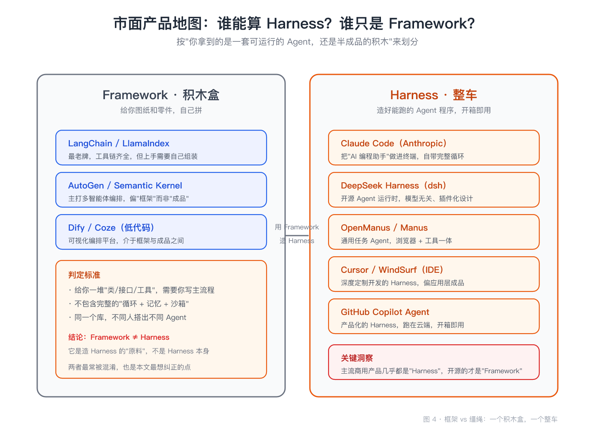

# 大模型是大脑，Agent 是员工，那 Harness 是什么

> 一句话：大模型是"大脑"，Agent 是"员工"，而 **Harness** 是管住员工的那根"缰绳"。这篇文章把这三者的区别、Harness 的价值，以及市面上叫得上号的产品，一次讲透。

---

## 一、先从一个让工程师挠头的词说起

有段时间，技术群里流行一个"灵魂拷问"：

> "我明明已经把 GPT-4 接进来了，也写了工具调用，为什么做出来的东西还是像个玩具？为什么别人家的 AI 助手那么靠谱，我的动不动就乱来？"

问这个问题的，多半刚踩过同一个坑：**以为把大模型接进系统，就等于有了 Agent。**

第一次调通大模型接口时，很多人会兴奋地搓手："我有 AI 了！" 可真跑起来才发现，它只是**一个会说话的接口**。好比你请了个“诺奖级天才”回家当助理，结果发现他只会背书，连开关门都要你手把手教——空有脑子，没有手脚，更没人管着。

你要它查天气，它说"我查不了实时数据"；你要它操作你的数据库，它连数据库长什么样都不知道；你要它连着干十分钟的活，它干到一半就"断片"了。

这时候，圈子里冒出两个词：**Agent**、**Harness**。有人把它们混着用，有人干脆认为它们是一回事。

先别急着下结论。把这两个词和**大模型**放一起，三者其实是清清楚楚的"包含"关系：

- **大模型**是大脑，只会想，不会动手。
- **Agent**是员工，会想也会动手，但可能不靠谱。
- **Harness**是缰绳，管住员工，让它既高效又不乱来。

用一张图先把"四层蛋糕"立起来，后面所有讨论都绕着它转：

看到这张图，很多人的第一反应是："Framework 和 Harness 我也分不清。" 别急，这正是全文要解决的核心问题之一。

---

## 二、前置概念：为什么单有"大脑"干不了活

要理解 Harness 为什么存在，得先明白一个残酷的现实：**大模型天生是个"只会说话的哑巴"。**

### 2.1 大脑的边界

大模型的本质，是一堆**静态参数**组成的推理引擎。它再聪明，也有三条硬伤：

1. **知识过期**：它的知识截止在训练那天，昨天的新闻、今天的股价，它都不知道。
2. **没有"手"**：它无法真的打开文件、点击按钮、操作你的服务器。
3. **状态不持久**：每一次对话结束，它就不记得刚才做过什么。

这三条硬伤，决定了"光有大脑"什么都做不成。你得给它配**手**（工具），配**腿**（执行能力），配**记事本**（记忆），还要给它一套**办事章程**（流程）。

### 2.2 从"大脑"到"员工"：Agent 补上了手

**Agent**，就是把这套东西拼起来之后的产物——大模型 + 规划能力 + 工具 + 记忆，组合成一个能"自主干活"的最小行动单元。

拿"帮我整理这份周报"举例：

- 大脑（大模型）负责想：周报要分哪几块？每块写什么？
- 手（工具）负责做：读取数据文件、生成图表、调用企业微信发出去。
- 记事本（记忆）负责记：上个月周报什么格式？老板喜欢简洁还是详细？

这就是 Agent。听起来很完美，对吧？

但问题来了：**一个能"自主行动"的 Agent，恰恰是最危险的。**

想象一个刚入职、能力很强但完全不懂规矩的新员工：他敢删你的生产库，敢把内部资料发到外网，敢一口气申请 100 台服务器。能力强不等于可靠，**没有边界的能力，等于一场灾难。**

于是，Agent 圈子里开始有人意识到：光有大脑和手还不够，还得有一层东西，专门负责**给 Agent 画边界、定规矩、踩刹车**。

这层东西，就是 Harness。

---

## 三、Harness 到底是什么：不是新概念，是"被遗漏的第三层"

### 3.1 从词源看本质

"Harness" 这个词，英文原意是"马的挽具"——就是骑马时套在马身上的那一整套皮革、缰绳和马镫。它**不是马本身**，但它决定了这匹马**能跑多快、往哪跑、会不会把人摔下来**。

翻译成技术语言：**Harness 是一套让 Agent 稳定、安全、高效运行的"控制程序"本体。**

它不是一个抽象的概念，而是**一个能直接跑起来的具体东西**。你装一个 Claude Code，它是一个 Harness；你跑一个 DeepSeek Harness，它是一个 Harness；你在终端里敲 `manus`，那也是一个 Harness。

换句话说，**Harness 就是"一个具体的、能用的 Agent 程序"**，只不过它把"缰绳"做成了核心。

### 3.2 Harness 到底管什么

拆开一台 Harness，你会发现它主要由五块"器官"组成：

1. **执行循环**：把"想 → 做 → 看 → 改"封装成一个自动循环，让 Agent 能一步步推进任务，而不是一次问答就结束。
2. **工具调用**：决定 Agent 的"手"能伸多长——能读哪些文件、能调哪些 API、能跑什么代码。
3. **记忆系统**：短期上下文 + 长期经验，让 Agent 干到一半不"断片"。
4. **安全沙箱**：把危险操作隔离起来，比如禁止删除生产数据、禁止访问敏感目录。
5. **策略与兜底**：设置循环上限、放弃判定、请示人类——防止 Agent 无限跑下去。

这五块，就是"缰绳"的具体内容。

### 3.3 它的核心：一个"干活的循环"

如果只能记住 Harness 的一个机制，那就记这个：**Plan → Act → Observe → Reflect** 的循环。

- **计划 Plan**：把目标拆成可执行步骤。
- **行动 Act**：写代码、调工具、执行。
- **观察 Observe**：读取执行结果。
- **反思 Reflect**：判断结果对不对，不对就修正计划重来。

这个循环不断滚动，直到任务完成或触及上限。Harness 的价值，就在于它把"让模型自主干活"这件事，从"碰运气"变成了"可控的工程"。

打个比方：裸奔的 Agent 就像放了一匹野马进瓷器店——能跑，但下一秒可能就把货架撞塌。Harness 这根"缰绳"要做的，就是既让马跑起来，又不让它闯祸。看这张图，感受下差距：

你看，同样是那只机器人，套上缰绳前差点删库乱授权；套上缰绳后照样干活，却规规矩矩——缰绳不限制它"能干什么"，而是管住它"该怎么干"。

---

## 四、一张图看懂：大模型、Agent、Harness 到底差在哪

这是全文的核心，我们把它彻底掰开。

三者不是三个并列的东西，而是**层层包含**的关系：

> **大模型 ⊂ Agent ⊂ Harness**

### 4.1 一句话区分

- **大模型**：会思考，不会动手。它是大脑。
- **Agent**：会思考，也会动手，但可能乱来。它是员工。
- **Harness**：管住员工、保住下限。它是缰绳。

### 4.2 全面对比

| 维度 | 大模型 LLM | Agent | Harness |
|------|-----------|-------|---------|
| 本质 | 推理引擎 | 行动单元 | 控制程序 |
| 会不会动手 | 不会 | 会 | 决定会不会 |
| 核心问题 | 想什么 | 做什么 | 怎么安全地做 |
| 记忆 | 无 | 有基础记忆 | 管记忆怎么记、记什么 |
| 工具 | 无 | 能调用 | 管能调哪些 |
| 边界 | 天生无边界 | 边界靠人设 | 边界是核心设计 |
| 类比 | 天才顾问 | 新员工 | 缰绳 / 驾驶舱 |
| 要不要被管 | 不需要 | 需要 | 它就是管理者 |

### 4.3 三种组合，逐个说清

**只放大模型**：啥也干不了，是个"书呆子"。这也是很多人第一次调通 API 后的失落来源。

**大模型 + Agent（无 Harness）**：能力有了，但风险敞口。等于雇了个能力超强但不守规矩的员工，你不知道他下一秒会删你什么。很多自研的"玩具 Agent"就死在这里。

**大模型 + Harness（即真正的 Agent 产品）**：既有能力，又有边界。这才是市面上那些"靠谱 AI 助手"的真相——它们不是模型更强，而是**缰绳系得更好**。

一个反直觉的结论是：**同一个 GPT，放进不同的 Harness，跑出来的是两个完全不同的 Agent。** 想要一个靠谱的 AI 助手，换 Harness 往往比换大模型更有效。这三者的"进化之路"，看这张三格漫画就懂：

从左到右就是：光换大脑（书呆子）没用，光有手（毛手毛脚）危险，加上缰绳（管住它）才算真正能上岗。

---

## 五、Harness 和 Framework：最容易被搞混的一对

如果说大模型、Agent、Harness 是"包含关系"，那 Harness 和 **Framework** 就是"最容易混淆、其实完全不同"的一对。

### 5.1 积木盒 vs 整车

- **Framework（框架）** 是"积木盒"：给你一堆类、接口、工具函数，需要你自己写主流程、自己组装。它提供的是**原料**。
- **Harness（缰绳）** 是"整车"：已经造好、能直接开的 Agent 程序，自带循环、记忆、沙箱。它提供的是**成品**。

同样是帮你做 Agent：

- LangChain 给你链、代理、工具抽象，但你得自己编排逻辑——它是 Framework。
- Claude Code 装完就能在终端里干活，循环、权限、沙箱都内置好了——它是 Harness。

### 5.2 判定标准

怎么快速判断一个东西是 Framework 还是 Harness？问三个问题：

1. 它是给你"类/接口/工具"，还是给你"一个能跑的程序"？
2. 它自带了完整的"循环 + 记忆 + 沙箱"，还是这些都要你自己实现？
3. 同一个库，不同人搭出来的东西是一样，还是千差万别？

答案偏向前者，是 Framework；偏向后者，是 Harness。

**Framework 是造 Harness 的"原料"，不是 Harness 本身。** 这也是行业里最常被混淆、最该被纠正的一点。两者的差别，好比"给你一箱零件自己拼车"和"直接发你一辆整车"：

左边拼零件拼到崩溃，右边开整车走人——这就是为什么市面上的商用产品几乎全是 Harness。

---

## 六、Harness 的价值：它把"AI 能用"变成"AI 好用"

理解了定义，再看价值就顺了。Harness 解决的，是 Agent 从"能用"到"好用"之间那道巨大的坎。它带来的价值，可以浓缩成四个字：**可控、可靠。**

### 6.1 可控：让 AI 有了"下限"

没有 Harness，Agent 的能力是无上限的（好事），风险也是无下限的（坏事）。Harness 通过沙箱、权限、审批，给 Agent 兜住底。这是它最核心的价值——**不是让 AI 更聪明，而是让 AI 更让人放心。**

### 6.2 可靠：把"碰运气"变成"可预期"

同一个任务，裸奔的 Agent 可能这次成功、下次失败；套上 Harness 后，循环、兜底、重试都成了固定流程，结果的可预期性大幅提升。对企业来说，"可预期"比"偶尔惊艳"值钱得多。

### 6.3 省心：把工程复杂度藏起来

记忆管理、上下文压缩、工具权限、错误恢复……这些让 Agent 工程化跑起来的脏活累活，Harness 替你干了。你用的时候只需要关注"让 Agent 干什么"，而不是"怎么让 Agent 别崩"。

### 6.4 一个数据佐证

以 Context Engineering 为例，成熟 Harness 会通过压缩、分层记忆等手段，把 Agent 需要的上下文占用压到固定且可控的范围。比如一些 Agent 运行时能把单次工具调用的上下文开销从"几十万 token"压到"几千 token"，降幅超过 99%。省下的不仅是 token 费用，更是让 Agent 在长任务里不"断片"的能力。

---

## 七、市面上的产品：谁是 Harness，谁只是 Framework

判断一个概念，最有效的办法是看实物。我们把市面上叫得上号的 AI Agent 相关产品摆上桌，按"整车 vs 积木盒"分个类：

### 7.1 主流商用产品，几乎全是 Harness

这些产品你多半用过或听过，它们有一个共同点：**开箱即用，自带完整的控制层**。

| 产品 | 类型 | 特点 |
|------|------|------|
| **Claude Code**（Anthropic） | Harness | 把 AI 编程助手做进终端，自带完整循环、权限审批、沙箱执行 |
| **DeepSeek Harness（dsh）** | Harness | 开源 Agent 运行时，模型无关、插件化设计，重视架构与安全 |
| **OpenManus / Manus** | Harness | 通用任务 Agent，浏览器 + 工具一体，网页端开箱即用 |
| **Cursor / Windsurf** | Harness | 深度定制开发的 IDE 内 Agent，偏应用层成品 |
| **GitHub Copilot Agent** | Harness | 产品化的 Agent，跑在云端，开箱即用 |
| **CodeBuddy** 等 AI IDE | Harness | 将 Agent 循环与编辑器、终端深度集成 |

这里重点说两个有代表性的。

**Claude Code** 算是把"Harness 理念"打出声量的代表。它让我们看到：一个 Harness 可以把"改代码 → 跑测试 → 看报错 → 再改"这一整套开发者日常，压缩成一句自然语言指令，而且每一步都在沙箱里执行，危险操作会弹出确认。

**DeepSeek Harness（dsh）** 则是开源界的旗帜。它的核心设计是"模型无关"——不绑定某一个大模型，而是把 Harness 本身做成一套可插拔的运行时，强调循环、工具、记忆、安全都是独立可配置的模块。对想自研 Agent 的团队来说，它是最好的"整车图纸"。

### 7.2 开源框架，本质是"积木盒"

另一边，这些老牌框架更像是"积木盒"：

- **LangChain / LlamaIndex**：工具链最全，但你需要自己组装主流程。
- **AutoGen / Semantic Kernel**：主打多智能体编排，偏框架而非成品。
- **Dify / Coze**：低代码编排平台，介于框架与成品之间。

### 7.3 怎么选？

一句话：**想快速获得一个靠谱的 Agent，选 Harness（整车）；想深度定制、自研 Agent，用 Framework（积木盒）打底，再往 Harness 方向靠。**

对大多数开发者和企业来说，直接用一个成熟 Harness，比从 LangChain 从零搭要务实得多——这恰好解释了为什么这几年"越开箱即用的 Agent 越火"。

---

## 八、落地：三个场景，告诉你现在就能怎么用

概念讲完，落回现实。Harness 的用处，在三个场景里最明显。

### 8.1 个人开发者：把 AI 编程助手用起来

**痛点**：Copilot 只能"接一句"，复杂重构还得自己来。
**行动**：直接用 Claude Code 或类似 Harness，让它"帮我重构这个模块并跑通测试"，你会立刻感受到"自动循环"和"单句补全"的差别。

### 8.2 企业：让 AI 员工"不闯祸"

**痛点**：把大模型接进业务流程，最怕 AI 乱删数据、乱授权。
**行动**：选带强沙箱和权限审批的 Harness，把"能碰什么、不能碰什么"写进缰绳。企业级 Agent 拼的不是模型智商，而是**控制能力**。

### 8.3 AI 应用开发者：别重复造"缰绳"

**痛点**：很多团队从 LangChain 从零搭 Agent，结果踩遍循环、记忆、安全的坑。
**行动**：优先基于成熟 Harness（如 dsh）二次开发，把精力花在业务逻辑上，而不是重写一套"缰绳"。**除非你要造的是 Harness 本身，否则不要从 Framework 白手起家。**

---

## 结尾：缰绳才是决定差距的那部分

回到开头那个"灵魂拷问"——"我明明接入了大模型，为什么做出来还是像玩具？"

现在答案清楚了：**因为你有的是大脑，缺的是缰绳。**

大模型是时代给每个人的"标配大脑"，它已经不再稀缺。真正拉开差距的，是你有没有一套能把这颗大脑**稳稳地、安全地**用起来，并且让它高效干活的 Harness。

未来的 AI 能力竞争，可能不再是"谁的模型参数多"，而是"谁的缰绳系得好"——谁能把同一个模型，驯成更靠谱、更有用的员工，谁就赢了。

至于该换大模型还是换 Harness？记住这句话：**大脑是标配，缰绳才分高下。**
