# 我是吃八股的蓝色大肥鱼！

> 一个跑在 DeepSeek Harness 上的开源八股陪练插件：考场对话当面试官，右侧面板当教练，问答自动落成能进笔记库的 Markdown。


---

## 一、练八股，为什么非得切出去？

### 1.1 晚上十点，你想练会儿八股

刚在 DeepSeek Harness 里改完一段代码，趁热想练会儿八股。

于是你打开一个刷题网站，或者把一段「你是资深面试官」的 prompt 粘进对话里。答完之后——题目散在网页上，回答散在聊天记录里，第二天醒来什么都不剩。想复盘？只能往上翻，翻到哪算哪。

真正的问题不是「没有地方练」，而是三处断裂：

| 断裂 | 具体表现                                                                                     |
| --- |----------------------------------------------------------------------------------------------|
| 环境断裂 | 你经常需要面试八股，然后又是单纯贴提示词信息在网页ai、对话、选模型，练八股却要切到另一个产品 |
| 角色混叠 | 面试官、标准答案、评分全挤在同一段气泡里，答完还得自己给自己打分                             |
| 结果不留 | 面完就散，第二天全忘，复盘只能翻聊天记录                                                     |

一句话：**练八股这件事，和你写代码的地方、和最后能留下来的东西，是断开的。**

### 1.2 所以我把面试官做进了编码环境

`interview-dsh` 是跑在 DeepSeek Harness（DSH）上的**八股专项陪练插件**：考场对话当面试官，右侧面板当教练，问答落盘成能直接导入笔记库的 Markdown。

它有三个「不是」，先说清楚免得误会：

- **不是独立聊天应用**：说话只发生在 DSH 原本的对话里，面板里没有输入框、没有消息列表、没有气泡。
- **不是把面试官塞进你正在写代码的那条对话**：点开始后，它会在当前项目下**新开**一场考场会话，不污染你手上的上下文。
- **不是闭卷考场**：每题先给你开卷要点，答完立刻给对照和五维评分。这是陪练，目的不是考倒你，是让你当场知道差在哪。

### 1.3 开源地址、协议与当前状态

- 仓库：[jiangnuonnuo/interview-dsh-plugin](https://github.com/jiangnuonnuo/interview-dsh-plugin)，MIT 协议，随便用、随便改。
- 当前只做**八股专项**（Java 并发、MySQL、Redis、消息队列、Spring 这些），项目深挖和混合模式暂时不做。
- 卡片流与滑动切题这块的实机验收还在收尾，其余能力都已可用。

如果它帮到你了，顺手点个 star，我会很开心。


---

## 二、五分钟装上，今晚就能用

### 2.1 DSH 一句话是什么

DeepSeek Harness 是一个**插件化的 Agent 底座**——它不是一个聊天应用，而是一个可以被长能力的运行时：会话、模型、工具、提示词装配、UI 插槽都由它提供，业务以插件的形式挂上去。

想深入了解可以看我的另一篇《用 DeepSeek Harness 写一个 Agent 插件》，这里不展开。

### 2.2 先把 DSH 装好

从官方渠道装好 DSH Desktop 并启动一次。
https://www.runoob.com/deepseek-harness/deepseek-harness-install.html 安装配置教程

作者的环境配置如下：

- DSH Desktop `0.2.17`（`com.yeagoo.dsh-desktop`）
- 实际加载的 harness 为 `@deepseek-ai/dsh 0.1.1-rc.2`

版本不一致时最常出现的现象是「某些服务取不到」，后面 2.4 会说到。

### 2.3 一行命令装上插件

```bash
npx dshpub add jiangnuonnuo/interview-dsh-plugin \
  --ref f54ce0dedcdd33ffc4da019e063ffa45280cae07 \
  --profile web
```

三个参数分别是什么：

- `jiangnuonnuo/interview-dsh-plugin`：GitHub 上的仓库；
- `--ref`：锁定的具体 commit。插件还在快速迭代，锁 commit 能保证你装到的就是本文描述的这一版；
- `--profile web`：装进 `web` 这个 profile。**如果你平时用的不是 `web`，把这里换成你自己的 profile 名**——装错 profile 是最常见的「装不上」原因。

装完重载 DSH 即可生效。整个装配是声明式的：插件包里的 `cordis.patch.yml` 说明了要往 profile 里追加什么，DSH 启动时自动加载。**它不改 DSH 一行源码**，卸载也只是把这一行去掉。

### 2.4 怎么确认装好了

装完重载 DSH，看两件事：

1. **输入框右侧出现「面试」按钮**——这就是插件的入口；
2. **点它能打开面板**，能选主题和难度——这就算装好了。

如果你的环境没有右侧标签栏服务，插件会自动退回成一个右侧抽屉浮层，**这是正常行为，不是装失败**。

装不上时按这个顺序排查：profile 装错 → 构建产物没生成（`backend/dist`、`frontend/dist/client.js`）→ 版本不匹配。**不要靠新建 profile 或升级 Desktop 绕开**，那只会掩盖真正的原因。

---

## 三、三块界面，一场真实面试的形状

### 3.1 三个表面，各管一件事

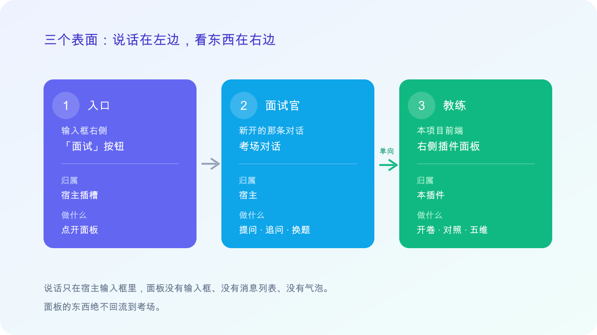

| 表面 | 归属 | 角色 | 你感知到的 |
| --- | --- | --- | --- |
| 输入框右侧「面试」按钮 | 宿主 | 入口 | 点开面板，不做任何别的事 |
| 考场对话（新开的那条） | 宿主 | 面试官 | 提问、追问、提示、换题、结束 |
| 右侧插件面板 | 本插件 | 教练 | 开一场、看开卷要点、看对照与五维、切回已答卡 |

一句话记住：**说话在左边（宿主对话），看东西在右边（插件面板）。**

### 3.2 双会话：左边被面，右边对照

点「开始」之后是两条会话：

- **考场会话**：面试官在这里说话，你的回答也写在这里——用的是你当前会话已经配好的模型，**插件不让你另配 Key**。
- **教练会话**：它的产出只进面板。题目一出来，开卷要点立刻出现在右边。

为什么要分开？因为**面试官不该看见评分和标准答提示词**，你答题时也不该被答案污染。数据只单向流动：考场的问答作为材料交给面板，面板的东西绝不回流到考场，也绝不会变成气泡里的一段话。

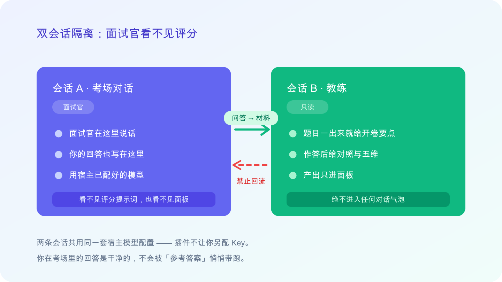

### 3.3 开卷陪练，不是闭卷考场

题目是模型按你选的主题动态生成的，**没有预置题库**——所以你背不了题，只能真答。

每题的流程是：题目出现 → 面板给出开卷要点 → 你在宿主输入框作答 → 面板立刻给出「已覆盖 / 未覆盖 / 评语」和五维评分（基础扎实度、原理理解、场景迁移、深度边界、表达清晰度，1–5 分，允许 .5）。

面试官追问时，面板会**新开一张卡**（`Q1` → `Q1.1`），不会把上一题冲掉。

### 3.4 它现在不做什么

划清边界，免得你有错误期待：

- 只做八股专项，不做项目深挖、不做混合模式；
- 没有时长和倒计时，没有「提示 / 跳过」按钮；
- 不给场末长篇简报——简报就是那些能随时切回去看的逐题卡片；
- 面板不是阅读器，也不提供编辑器。

这些「不做」不是没做完，是**主动划的界**：先把「陪练」这一件事做扎实。

### 3.5 它是长在 DSH 里的一块能力

它是插件，不是又一个独立的聊天产品。

面试陪练需要的会话、模型、提示词装配、文件读写、UI 插槽——DSH 全都已经有了，所以没必要再造一套 Agent 和 Harness，直接复用就行。插件只负责三件事：**面试规则、教练面板、档案落盘**。

---

## 四、为什么不做一个独立应用？因为 DSH 已经把活干完了

### 4.1 动手前，我先列了一张清单

做一场模拟面试到底需要什么能力？会话的创建与流转、模型调用与配置、系统提示词装配、文件读写与沙箱、UI 插槽与生命周期、会话日志——列完之后发现，**这些 DSH 全都有**。缺的只有「面试规则」和「教练面板」这一层业务。

如果从零做一个独立应用，你要自己解决进程生命周期、双端通信、上下文截断、会话存储与恢复、模块隔离、UI 挂载、模型密钥管理、文件权限……每一项都和「面试」本身无关。

| 需要的能力 | 自己造要做什么 | DSH 提供什么 |
| --- | --- | --- |
| 会话 | 设计会话模型与存储 | `sessions`：创建、恢复、轮次 |
| 模型 | 接 API、管 Key、配参数 | `llm` + `agentDefaultModel`，插件不另配 |
| 提示词 | 自己拼 system prompt | `systemPrompt.section`，可挂可摘 |
| 文件 | 自己写 fs 与权限 | `ctx.fs`，带工作区写入策略 |
| UI 表面 | 自己搭前端与挂载点 | 插槽：`conversation.input.right`、`shell.overlay` |
| 装配 | 改宿主源码 | `cordis.patch.yml` + 一行 `dshpub add`，零侵入 |

结论很简单：DeepSeek Harness 本身就是一个天然的 Harness 框架，没必要再去另搞一套 Agent 和 Harness 的东西，**直接复用**就好。

### 4.2 插件只做三件事

- **面试规则**：面试官人设、提问与追问口径、五维评分维度；
- **教练面板**：开卷要点、对照与五维、卡片化回看（只读，不聊天、不评分）；
- **档案落盘**：把本场问答写成能直接导入笔记库的纯 Markdown。

一句话分工：**DSH 负责「怎么说」，插件负责「按什么规则说、怎么呈现、留下什么」。**

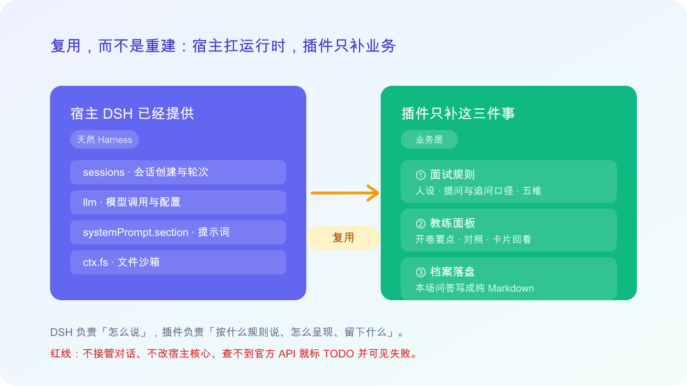

### 4.3 复用不是白拿，它换来三条约束

- 不能改 DSH 核心，只能走官方的 Hook 与插槽；
- 官方 API 的形态只能实测确认——版本一变，可用的符号就变；
- 遇到查不到的能力，只能标 `TODO` 并把失败显示在面板上，**不许猜 API，更不许自己造一个聊天界面绕过**。

省掉的是运行时，多出来的是纪律。

---

## 五、拆开看：让它真正好用的五个机制

### 5.1 双会话隔离：面试官看不见评分

两条会话用的是同一套宿主模型配置，但**看到的东西完全不同**：

- 面试官看不见评分提示词，也不知道面板上写了什么；
- 教练的产出只进面板，永远不进气泡；
- 材料单向流动：考场 → 面板，绝不反向。

直接好处是：你在考场里的回答是干净的，不会被「参考答案」悄悄带跑。

### 5.2 开卷要点：先告诉你该答哪些点

题目一出现，面板就给出这道题的开卷要点——不是标准答案，是「答这道题应该覆盖哪些点」。

要点由教练会话根据题目实时生成。因为题目本身就是模型按主题动态出的，所以要点和题目永远匹配，不存在「题库对不上」的问题。

### 5.3 追问：对话在推进，插件只跟着刷新

一场面试真正有价值的部分是追问。这里的规则是：

- 你**只在宿主输入框作答**，面板里没有任何输入框；
- 插件**不会代替你去催下一问**——追问由宿主的对话自然继续；
- 插件做的事情是「看守」：从对话里抽取出当前待答的那一问（优先取带 `【本题】` 标记的文本，否则跳过结尾那些没有问号的议程句，再取最后一段连续问句）；
- 万一抽歪了，面板上有「刷新本题」可以手动纠正。

所以追问是**对话在推进**，插件只负责跟上并在面板里刷新，不会插嘴。

### 5.4 一问一卡，交卷即评

每一问都是一张卡，编号是 `Q1`、`Q1.1`、`Q1.2`、`Q2` 这种形式——**追问一定新开一张卡，绝不覆写上一张**。

只要你在这张卡下有了新的回答，面板立刻给出两样东西：

- **对照**：已覆盖 / 未覆盖 / 一句评语；
- **五维评分**：基础扎实度、原理理解、场景迁移、深度边界、表达清晰度，1–5 分，允许 .5。

两个细节值得说：**评分只在后端算，前端只负责显示**，所以面板不会自己给出一个假分数；**没答的题不会编造分数**，那一栏就留空。

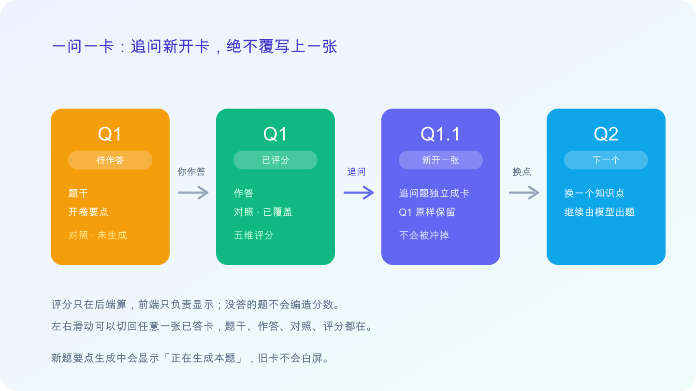

### 5.5 结束这一轮，然后可以继续

点「结束本场」之后发生的事，按顺序是：

1. 停止对考场的看守；
2. 给面试官挂上一段收尾的导演词（这段在隐藏的提示词段里，**不会出现在你的气泡里**）；
3. 向考场发一句「结束面试」——整场只发这一次；
4. 面试官用固定收尾句结束，之后不再提问、不念分数；
5. 工作区写出 `qa.md` 和 `summary.md`；
6. 面板回到入口。

两个设定：**不摘人设、不切会话**——考场那条对话还在，你可以直接在里面再开一轮，新的一轮会落进新的目录，旧的记录一个字都不动。

---

## 六、从点「开始」到拿到总结：一场完整面试实录

### 6.1 开考：选个主题，选个难度

在输入框右侧点「面试」，面板打开。选一个主题（内置 7 个预设：MySQL 索引与优化、Redis 并发与缓存、消息队列、分布式系统设计、Spring / Spring Boot、Java 并发编程、数据库实战场景，也可以自己填），再选难度（初级 / 中级 / 高级，默认中级），点「开始模拟面试」。

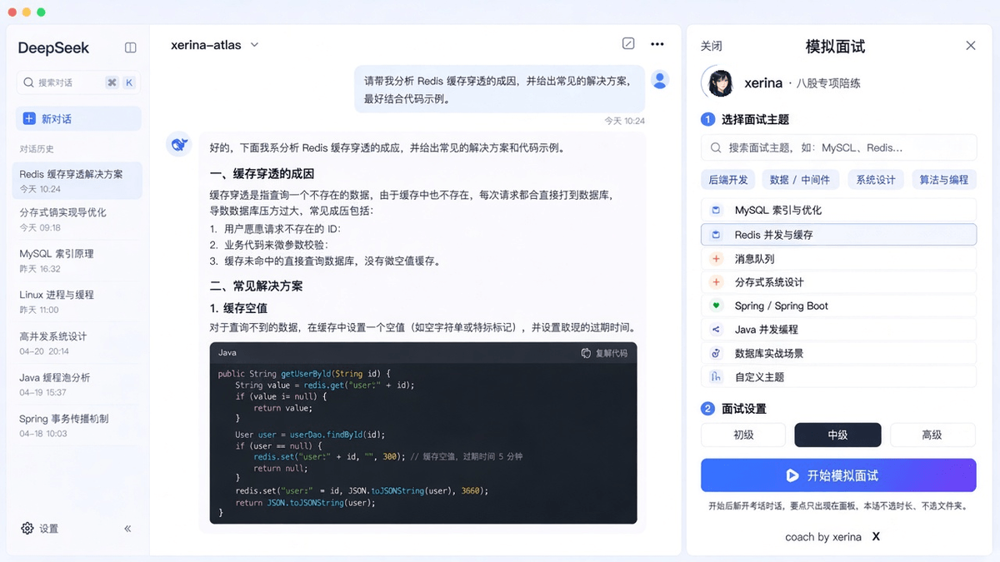

### 6.2 第一问：面试官开口，要点同步出现

当前项目分组下会出现一条新的考场会话，面试官先说明本场的主题与难度，然后**只问一个问题**。

同时右侧面板出现 `Q1` 这张卡，开卷要点跟着题目一起出来。

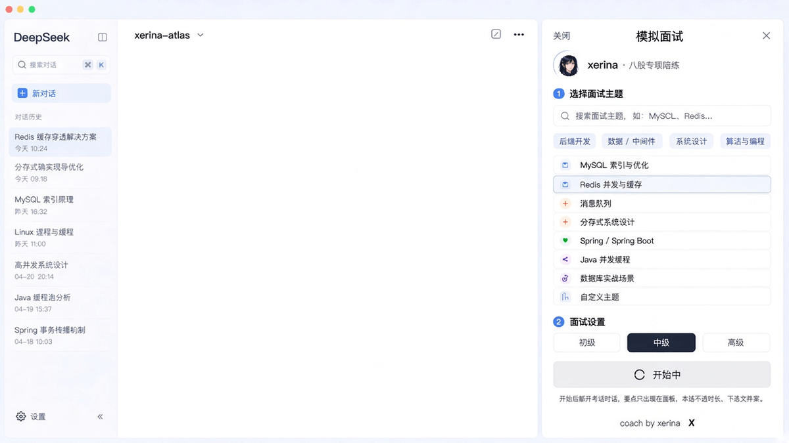

### 6.3 答完立刻看到对照与五维

在宿主输入框里回答。答完，面板立刻给出这题的对照和五维评分，不用等整场结束。

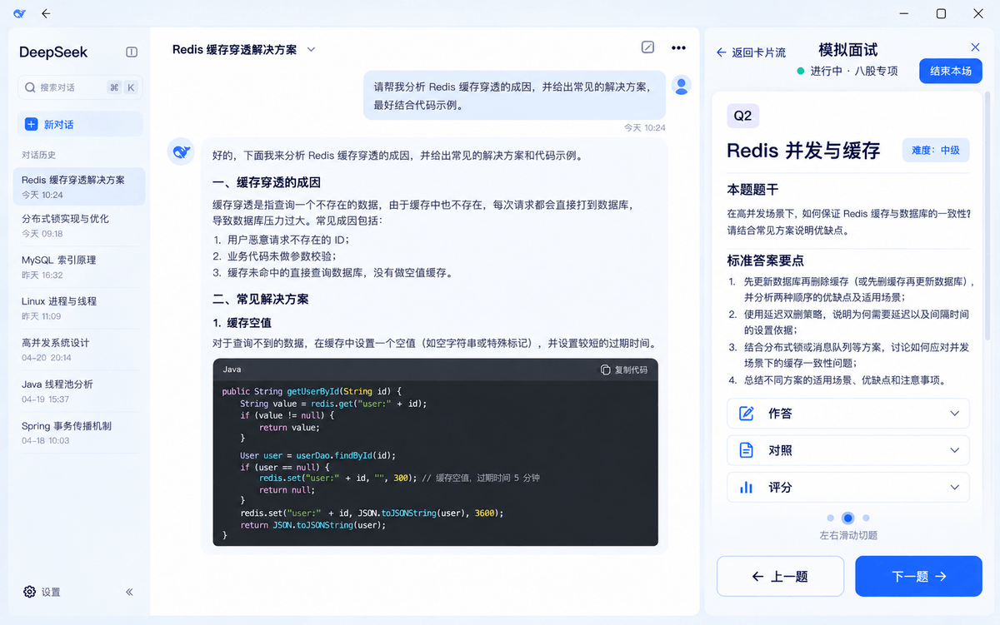

> 注：该项的桌面实机验收还在收尾，图为设计中状态。

### 6.4 追问链：旧卡不会被冲掉

面试官会顺着你的回答追问。这时面板新增 `Q1.1`，`Q1` 保持原样。

在新卡的要点生成完之前，面板会显示「正在生成本题」，这时候旧卡依然可见，不会白屏。

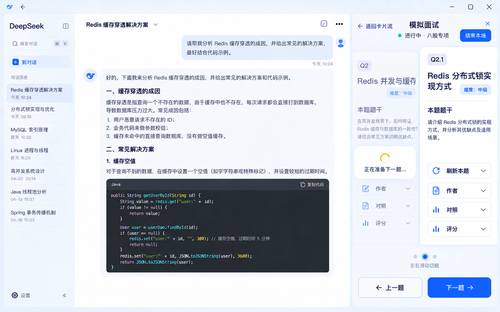

### 6.5 左右滑动，随时切回已答卡

卡片是可以横着切的：左滑看下一题，右滑回上一题。想看完整内容就点当前卡，进入同一面板内的详情态，看完再返回卡片流。

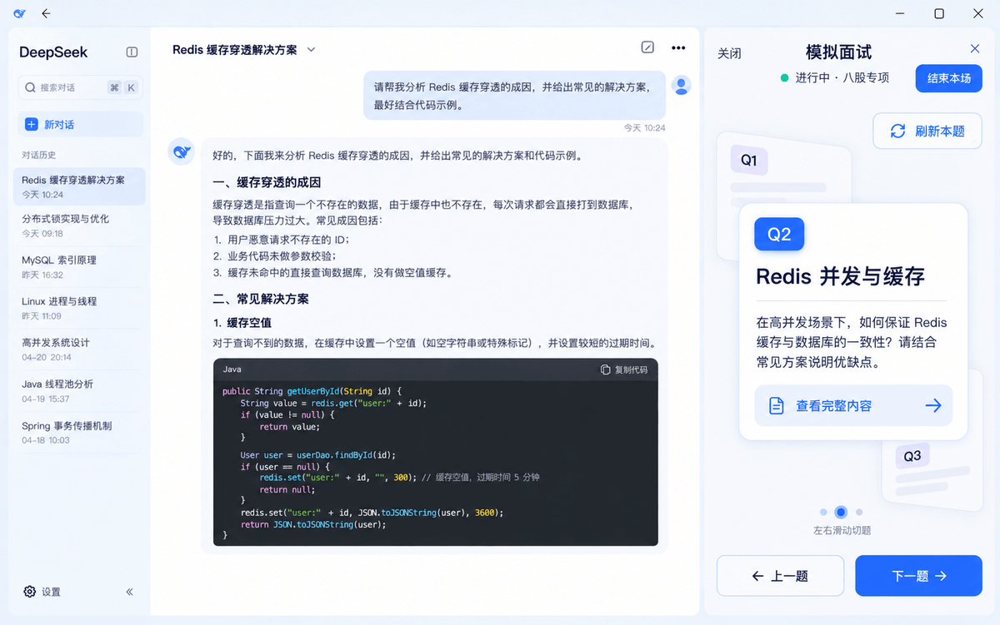

> 注：滑动与生成中占位的实机验收还在收尾，图为设计中状态。

### 6.6 结束本场：两份文档落进工作区

点「结束本场」，面试官用固定收尾句收尾，工作区写出 `qa.md` 与 `summary.md`。面板回到入口，你可以直接再开一轮。

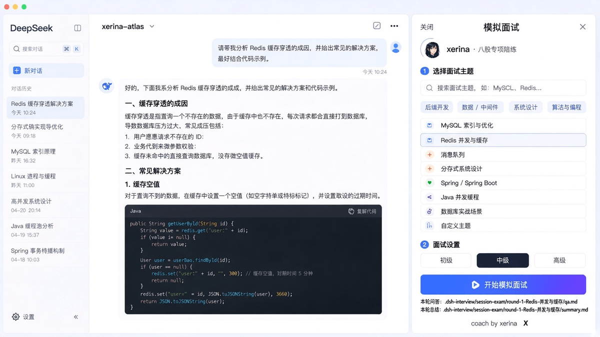

### 6.7 再开一轮，不用新建对话

在同一条考场会话里继续就行，新一轮会落进 `round-2-...` 这样的新目录，上一轮的文件原样保留。

---

## 七、练完就忘？它会给你留下一份能复习的档案

### 7.1 记录落在你当前的工作区

所有东西都写在 `.dsh-interview/` 目录下，结构是固定的：

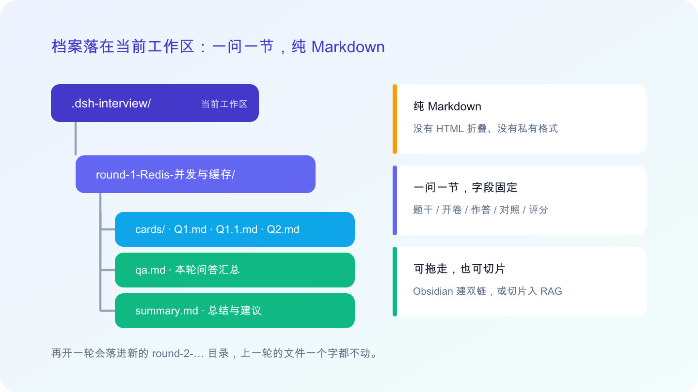

```text
.dsh-interview/
└── <考场 sessionId>/
    ├── index.json                       # 本考场轮次索引：in_progress | ended
    └── round-<n>-<topicSlug>/
        ├── session.json                 # 机器可读的完整记录
        ├── cards/<Q编号>.md             # 人读副本：题干 / 开卷 / 作答 / 对照 / 评分
        ├── qa.md                        # 本轮问答汇总
        └── summary.md                   # 本轮总结与建议
```

`session.json` 是给程序读的，`.md` 是给你读的——而且都是**纯 Markdown，没有任何 HTML 折叠标签**，可以直接拖进任何笔记软件。

### 7.2 拖进 Obsidian，长成你自己的八股图谱

因为一题一节、字段固定，直接把 `.dsh-interview/` 挂进 Obsidian 库就行：按主题建双链、按维度打标签，每张卡片就是一个节点，慢慢会长成你自己的八股图谱。

### 7.3 切片入 RAG，问它「我上次答得怎么样」

同样的结构也适合切片入库。存进去之后你可以直接问它：「这道题我上次答得怎么样？」——比翻聊天记录快得多。

### 7.4 拆一拆，就是一份答题手册

每份记录都已经是「问题 / 你的作答 / 对照 / 评分」三要素齐全，稍微整理一下就是一份可背诵的答题手册：题干 + 完整标准回答 + 注意方向。

**练一次，留下一次的东西**——这才是陪练真正的复利。

---

## 八、这不是 AI 一把梭：一个 SDD 规范驱动的项目

### 8.1 代码是 AI 写的

这个项目的大部分代码是 AI 写出来的，但我没有让它自由发挥。

它跑的是 **SDD（规范驱动开发）** 的流程：每一刀都先写清楚「为什么改、改什么、怎么验收」，再让 AI 去实现；做完就归档，成为下一刀的地基。

为什么要这么麻烦？因为 AI 写代码快，但也容易跑偏方向、容易重复造、容易把没验证的东西当成已完成。有了这套规范，这个项目才敢长期演进，也才敢让别人接手共建。

### 8.2 四份长期生效的规范文档

| 文档 | 作用 |
| --- | --- |
| `AGENTS.md` | 全局硬约束：插件形态边界、增量开发、提交与评审 |
| `docs/architecture/ARCHITECTURE.md` | 分层、依赖方向、适配层、编码规范；改分层先改它 |
| `docs/product/REQUIREMENTS.md` | 产品方向（**不是实现真源**，只用于校正方向） |
| `docs/FORBIDDEN.md` | 已否决的做法与错误边界，防止反复踩同一个坑 |

### 8.3 一刀一能力：每步都有规格，每步都能验证

每一刀走完同一条链路：

```text
proposal（为什么改、改什么） → design（取舍） → specs（行为场景） → tasks（含验收项） → 归档同步主规格
```

规矩只有两条：**一刀只做一件事**；**没验证过的能力不许提前塞进来**。所以你在仓库里看到的那些归档 change，是一个个清清楚楚的小台阶，不是一堆混在一起的提交。

### 8.4 也正因为这样，它还能继续往前长

每一刀做完就归档、成为下一刀的地基——所以下面那些方向不是画饼，是能照着同一套规范一个个加上去的。

---

---

## 九、写在最后：愿君面试顺遂，前程可期

插件每一轮结束时，面试官都会说同一句话：

> 此番 xerina 伴君至此，言尽于此，愿君面试顺遂，前程可期。

这句话也是我想对你说的。

回到开头那个问题：练八股为什么要切出去？其实不用——**你写代码的地方，就可以是被提问的地方；你被问过的每一题，都可以变成你自己的资产。**

如果你也想要这样一场陪练，现在就开一场吧：

```bash
npx dshpub add jiangnuonnuo/interview-dsh-plugin \
  --ref f54ce0dedcdd33ffc4da019e063ffa45280cae07 \
  --profile web
```

仓库在 [jiangnuonnuo/interview-dsh-plugin](https://github.com/jiangnuonnuo/interview-dsh-plugin)，MIT 协议。**觉得有用，点个 star。**

想一起做点什么的话，欢迎 issue 和 PR，只有一条规矩：**功能迭代走 OpenSpec change**——提 PR 前先确认对应的 change 已经存在，或者同步开一个。这样你加的东西不会和别人的撞车，也不会过两个月连自己都看不懂为什么这么写。

如果你想认真主导其中一块，我很乐意给你背书，让你来当那一块的主人。

祝你面试顺利。
