# 用 DeepSeek Harness 写一个 Agent 插件：它是什么、优势在哪、与其他 Harness 怎么选

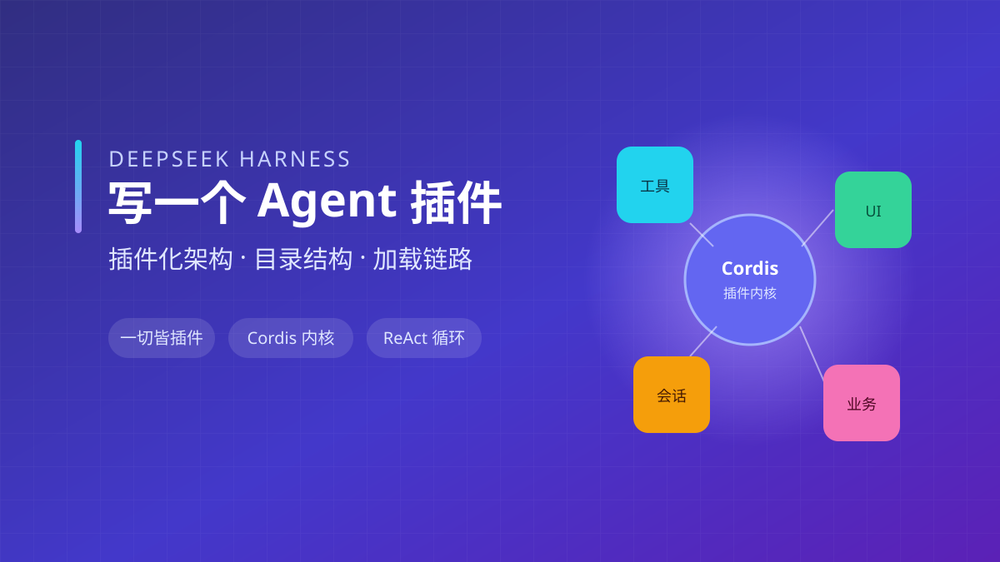

---

## 1. 先给结论：这到底是什么

### 1.1 一句话定义

**Xerina 网页宠物是一个跑在浏览器角落的 AI 搭档（悬浮、可拖拽、不挡交互）的 DSH 插件。** 它把「Agent 人格」做成一个会动的小宠物：加载一张雪碧图做动画、读 `pet.json` 配置状态机、在合适时机切状态（idle、thinking、waiting…），对话智能来自一个 Agent 后端。

它**不是**一个独立 App，而是三件套里的中间那块：

- **宿主（DSH）**：运行时 + UI 容器，负责进程生命周期、上下文供给、会话轨迹、继续/停止；
- **插件（本篇主角）**：描述「我要挂一块 UI、读一份配置、订阅哪些事件」；
- **后端（Agent）**：真正做推理对话的智能来源。

三者关系：宿主提供插槽与生命周期，插件声明「要什么、挂哪里」，后端只管推理。它们通过 Cordis 的 `ctx` 与事件总线连接，互不写死对方。

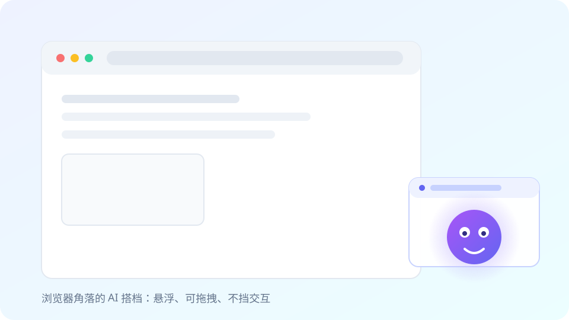

### 1.2 它长什么样、能做什么

- **悬浮 UI**：贴在任意页面角落，可拖拽，不挡页面点击；
- **状态动画**：一张 `spritesheet.webp`，按当前状态切帧区间播放（idle 待机、thinking 思考、waiting 等待…）；
- **配置驱动**：状态机、各状态帧数、雪碧图路径都写在 `pet.json`，改配置不改代码；
- **事件驱动**：订阅宿主发来的状态事件（thinking → waiting → idle），宠物表情随之切换；
- **后端对话**：真正「说话」的智能来自 Agent 后端，宠物只负责「陪伴外壳」。

### 1.3 它由三块组成（再强调一次）

宿主只提供「插槽 + 生命周期」，插件只声明「我要什么、我挂哪」，后端只管推理。三者解耦的好处是：换后端（本地模型 / 远端 API）不用动插件，换 UI 形态（宠物 / 侧边栏 / 浮窗）不用动宿主。

### 1.4 适合谁、不适合谁

- **适合**：想给浏览器加一个轻量 AI 陪伴 / 助手 UI；想学「插件化架构」是怎么落地的；想要能力可审计、可迁移；不想 fork 宿主源码。
- **不适合**：重后端业务编排（那种该用专门的 Agent 框架）；需要强权限命令执行（用编码代理更合适）；只想快速套个聊天框（现成 widget 更省事）。

---

## 2. 为什么需要它：裸模型与 Harness 的差距

### 2.1 模型本身不能「干活」

一个裸模型（无论多大）只是个推理引擎：它读 token、吐 token。它编辑不了你的仓库、跑不了测试、审批不了命令、也调不了你的业务系统。缺的不是「聪明」，而是一层**运行时**——负责把世界喂给它、把它的决定落地、把结果再收回来。

### 2.2 Harness 决定的事

Harness 是模型与真实世界之间的那层运行时，它决定的事包括：

- **上下文如何给**：系统提示词怎么拼、历史怎么截断、工具结果怎么回注；
- **可用工具**：暴露哪些能力、参数怎么校验；
- **执行位置**：代码 / 命令在哪跑、有没有沙箱、能不能联网；
- **状态存储**：会话存哪、能不能恢复 / 分叉 / 回放；
- **继续 / 停止**：一轮任务怎么算推进完、怎么被打断后又接上；
- **人工审批**：敏感操作要不要先等人点确认。

### 2.3 核心公式：Agent = Model + Harness

一句话：**模型是灵魂（负责推理），Harness 是身体与环境（负责落地执行与持续工作）**。没有 Harness，模型是「只会想不会动」；没有模型，Harness 是「空转的机器」。两者合起来才是一个能干活、能持续、能被审计的 Agent。

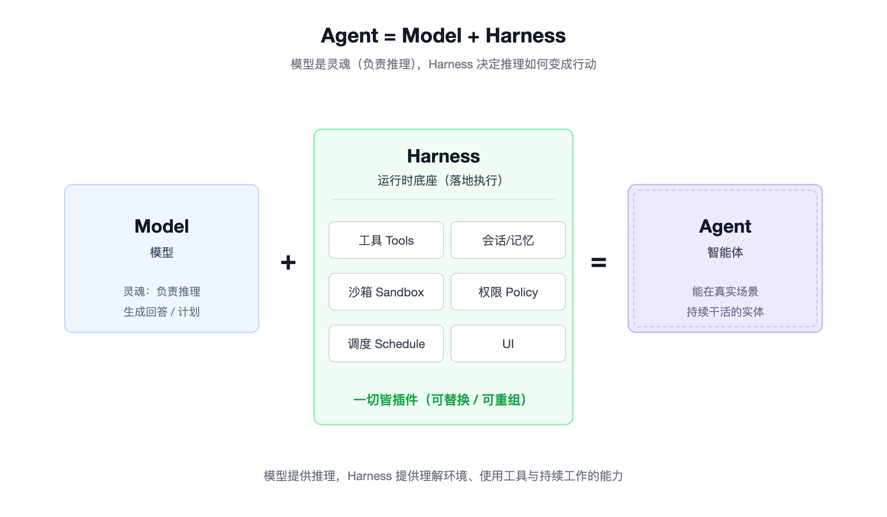

---

## 3. DeepSeek Harness 是什么

### 3.1 一句话定义与定位

DSH（DeepSeek Harness）是一个**基于插件机制构建的 Agent 操作系统底座**——它不是聊天应用，也不是工作流脚本。它把「能力」做成可插拔的插件，默认提示词只有几 k，避免把整个上下文一次性撑爆；真正的能力由插件按需声明、按需加载。

### 3.2 与 Claude Code / Codex 的本质区别

本质是 **底座 vs 成品**：

- Claude Code、Codex 是「已经替你做好决策的成品 Agent」，你用它的产品形态；
- DSH 是「把决策权、能力组合权交还给你的底座」，它暴露插槽和生命周期，业务长什么样由你的插件决定。

换句话说，前两者减少你的决策，DSH 暴露你的决策。

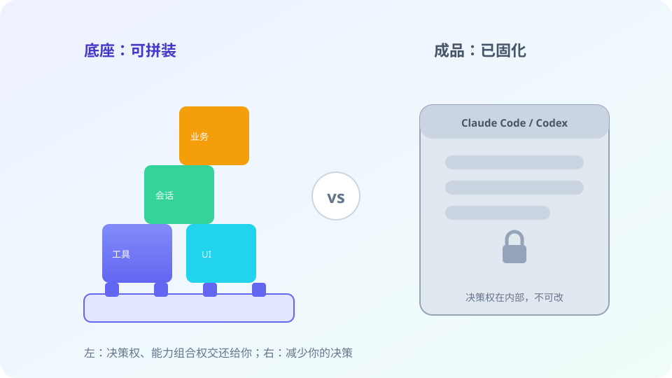

### 3.3 两大设计理念

- **一切皆插件（Capabilities as Plugins）**：从底层工具到上层 UI，没有特权核心，全靠插件树组装。
- **运行有迹可循（Append-only Trajectory）**：所有关键事件只追加写入会话日志，不做覆盖式修改，因此可以恢复、分叉、回放。

---

## 4. 优势在哪：和别的方案比，你得到什么

### 4.1 对比「自己从零搭悬浮宠物」

如果你不用任何 Harness，从零做一个悬浮宠物，你要自己解决：进程生命周期（何时启动 / 退出）、双端通信（宿主 Node ↔ 浏览器）、上下文拼装与截断、会话存储与恢复、模块加载与隔离、UI 挂载与事件订阅……每一项都是易错、且和「宠物」本身无关的脏活。

DSH 把这些全部收归宿主，你只写三件事：**挂 UI + 读配置 + 切状态**。工程重心回到业务，而不是重复造运行时。

### 4.2 对比「拿现成编码代理套壳」

Claude Code / Codex / Cursor 是**成品 Agent**：UI、能力、交互形态都固定，它们不提供「挂一个悬浮宠物 UI」的插槽。你想在浏览器里加一个陪伴宠物，只能在外面另起炉灶——又回到了 4.1 的从零搭。

DSH 把 UI 也当插件，宿主不写死任何业务：「宠物」这种纯前端能力也是一等公民。这是它和成品编码代理最本质的分野。

### 4.3 核心优势清单

- **一切皆插件**：宿主不写死业务，想加能力写插件即可，不用 fork 宿主；
- **上下文小、按需组装**：每个插件只声明自己要的 Cordis 服务，没用到的能力不进上下文，天然抗膨胀；
- **运行有迹可循（Trajectory）**：仅追加日志，可恢复、分叉、回放、审计；
- **能力接缝（Capability Seams）**：替换后端实现即可本地 ↔ 远端迁移，业务插件零改；
- **声明式装配**：`cordis.patch.yml` 零改宿主源码；
- **双端同包**：宿主端 + 浏览器端打进一个 npm 包，宿主零侵入；
- **MIT 开源**：机制透明，可照着改、照着学，而不是对着黑盒猜。

### 4.4 一个判断标准

一句话总结：当你想要「只写业务、不碰宿主、还能随时迁移」时，DSH 是那一层最省心的运行时。

---

## 5. 横向对比：DSH vs 其它 Harness 产品

这一节正面回答「和其他 Harness 比，差在哪」。先统一维度，再上表，最后落到「网页宠物」这个具体场景。

### 5.1 先统一对比维度

为了把「不一样」说清楚，先固定几个维度：

- **定位**：成品 Agent / 底座 / 框架 / 平台；
- **插件化解耦度**：业务能不能不碰宿主源码就扩展；
- **可定制 UI**：能不能在宿主里挂自己的界面（不只是聊天框）；
- **上下文策略**：默认大上下文，还是按需小上下文；
- **可审计性（Trajectory）**：会话能否恢复 / 分叉 / 回放；
- **上手成本**：从 0 到跑通要懂多少；
- **开源**：机制是否透明可改。

### 5.2 对比表

| 产品 | 定位 | 解耦度 | 可定制 UI | 上下文策略 | 可审计 | 上手 | 开源 |
| --- | --- | --- | --- | --- | --- | --- | --- |
| Claude Code | 成品编码代理 | 低（形态固定） | 几乎不能 | 大上下文 / 自动 | 有限 | 低 | 否 |
| OpenAI Codex | 云端编码代理 | 低 | 不能 | 大 | 有限 | 低 | 否 |
| Cursor | 编辑器内编码助手 | 中（rules/cmd） | 不能（编辑器内） | 中 | 有限 | 低 | 否 |
| Aider | 终端编码代理 | 中 | 不能 | 中 | 有限 | 中 | 是 |
| LangChain | 编排框架 | 高（组件拼装） | 需自写 UI | 你控制 | 你自实现 | 高 | 是 |
| Dify / Coze | 低代码 Agent 平台 | 中（节点/插件） | 平台内 | 平台管 | 平台管 | 中 | 部分 |
| 自己从零搭 | 完全自定义 | 你定 | 你定 | 你定 | 你定 | 极高 | — |
| **DSH** | **插件化底座** | **极高（一切皆插件）** | **能（UI 也是插件）** | **按需小上下文** | **原生 append-only** | **中** | **MIT** |

### 5.3 谁适合做「网页宠物」这类纯前端 UI 插件

- **成品编码代理（Claude Code / Codex / Cursor）**：它们根本不提供「挂 UI」的插槽，直接出局；
- **LangChain / 自己从零搭**：能做，但你要自己写运行时和双端通信，工程量最大；
- **Dify / Coze**：平台内 UI 形态固定，很难嵌进任意网页角落；
- **DSH**：UI 是一等插件，`slots.register` 一行挂上悬浮层——正好是「网页宠物」的场景。

### 5.4 DSH 的独特差异小结

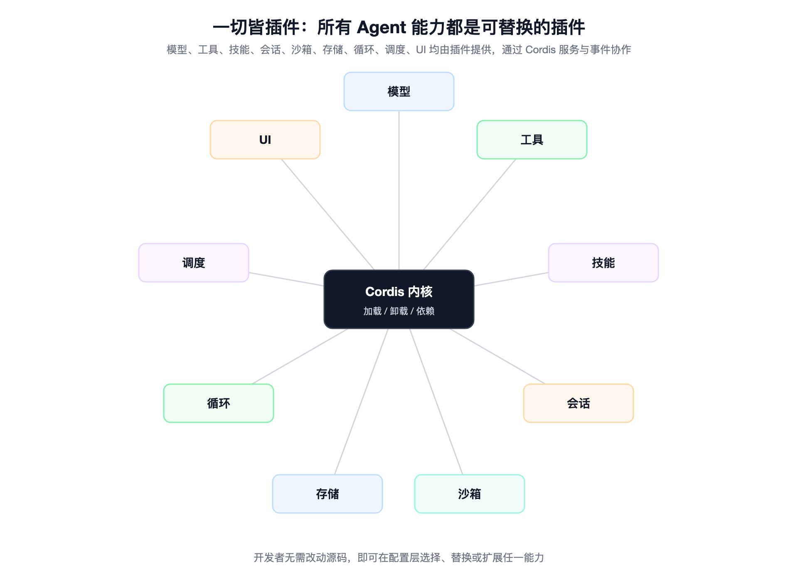

DSH 不跟你抢「该做成什么样」，它只给你插槽、生命周期和事件总线，把「长什么样」完全交给插件。横向看，它是少数把「前端 UI 也当插件」且「上下文按需小」的开源底座——这也是为什么一个悬浮宠物能这么轻量地长出来。

所以回到开头：DSH 不是又一个编码代理，而是一块让你自己长能力的底座。

---

## 6. 核心架构速览

### 6.1 Cordis 内核：插件树而非「特权核心」

DSH 的底层是 **Cordis**（一个 IoC/插件内核）。Cordis 自己**不承载能力**——它只负责插件的加载、卸载、依赖解析。真正干活的，是运行时里一棵**插件树**：每个插件通过 `apply(ctx)` 拿到一个上下文 `ctx`，从 `ctx` 上取服务、挂能力。没有「写死在框架里的上帝对象」，能力都来自这棵树上的节点。

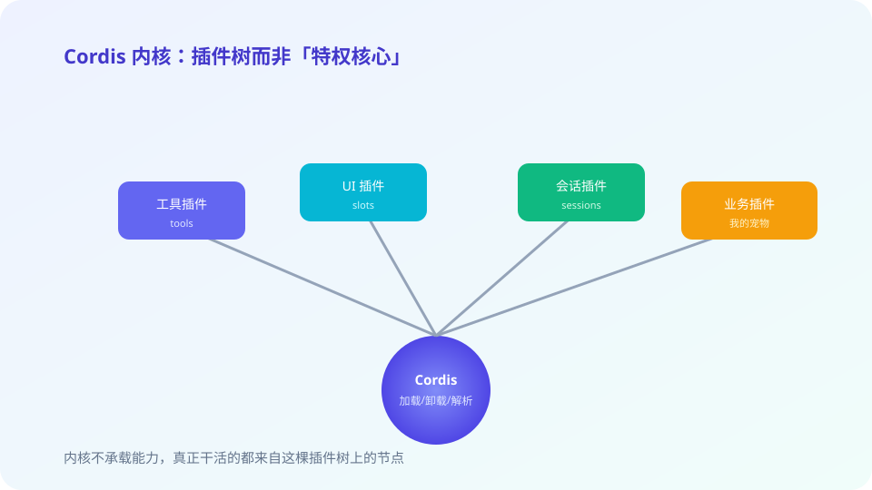

### 6.2 四层结构与五大服务

把运行时竖着切，大致四层：

- **装配层**：解析 profile、安装插件、决定这棵插件树长什么样；
- **核心服务层**：会话、模型、工具、系统提示词、Agent 五大基础服务；
- **执行循环层**：ReAct 循环（turn/step 的推进与流转）；
- **能力扩展层**：你写的业务插件（比如我的网页宠物）挂在这一层。

五大服务分别是：`sessions`（会话状态）、`llm`（模型调用）、`tools`（工具注册与校验）、`systemPrompt`（提示词拼装）、`agents`（Agent 装配与调度）。

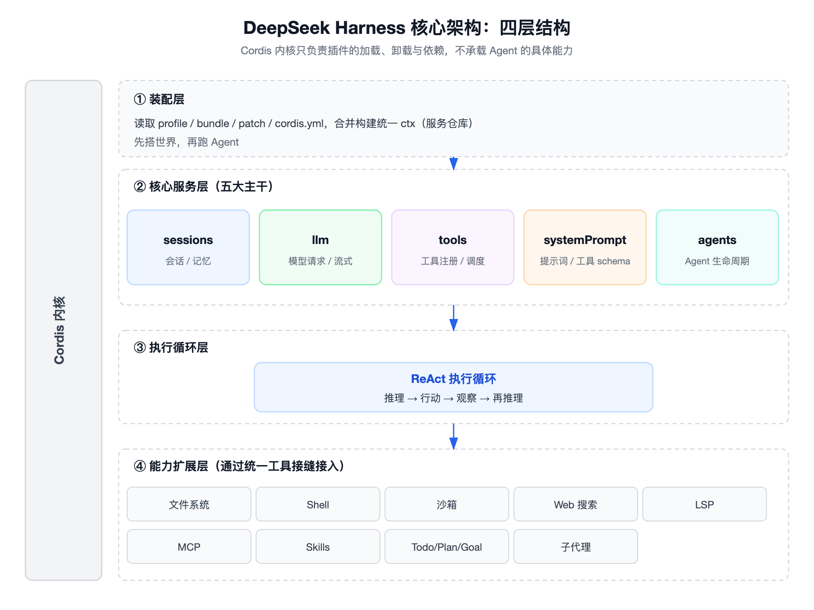

### 6.3 ReAct 执行循环

执行被切成两层粒度：

- **turn（轮）**：一次「任务推进」——从拿到用户意图到产出一段可交付结果；
- **step（步）**：turn 内部的一次「模型请求 + 工具调用」——模型想一步、外部干一步、结果回注，再进入下一步。

循环在「模型决策 → 工具执行 → 结果回注 → 再决策」之间流转，直到 Agent 认为任务完成或触发停止条件。

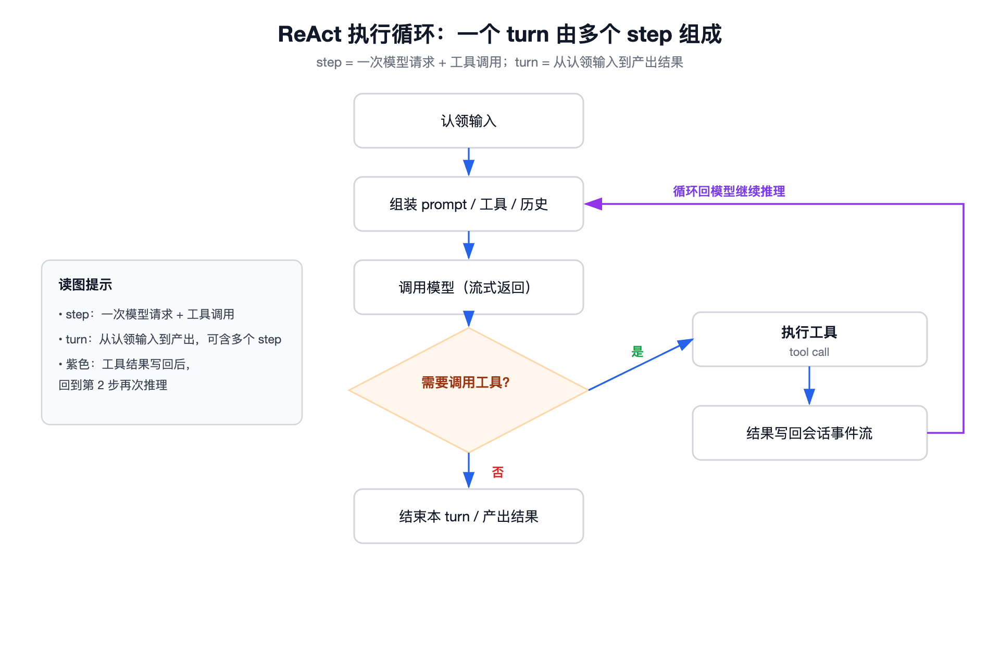

### 6.4 事件源与 Trajectory

Trajectory 是 DSH 的「黑匣子」：一份**仅追加（append-only）**的会话日志，记录系统提示词、思维链、工具调用、子 Agent 调度、上下文注入等。因为它只追加、不覆盖，所以支持：

- **恢复**：断开后从轨迹末尾接着跑；
- **分叉**：从某个历史节点复制一份另起一条线；
- **回放**：把整段决策过程原样重演，便于调试和复盘。

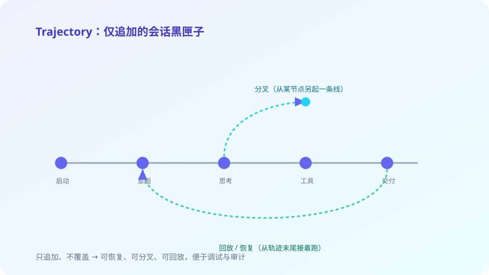

### 6.5 能力接缝（Capability Seams）

插件之间、插件与宿主之间靠 **provider/consumer 边界** 解耦。典型如 `filesystem` 与 `subprocess` 共享同一套执行环境：只要替换背后的后端实现，就能把整个能力从本地迁到远端，业务插件一行不用改。这就是「接缝」的价值——能力可替换、可迁移。

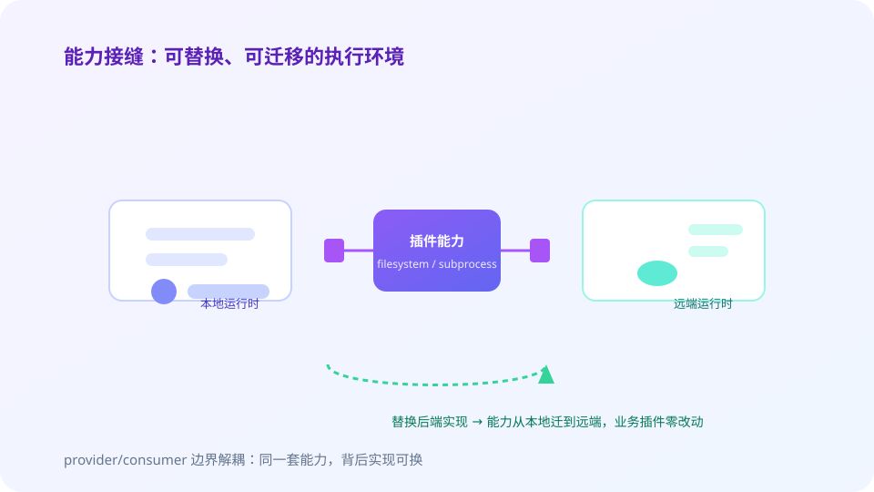

---

## 7. 插件机制：一切皆插件的实现

### 7.1 双端插件

一个 DSH 插件是一个 **npm 包**，但它同时含两端产物：

- **宿主端（Node）**：在 Harness 进程里跑，负责注册能力、读配置、订阅事件；
- **浏览器端（Client）**：在页面里跑，负责渲染 UI（比如悬浮宠物）。

两端打进同一个包，宿主源码零侵入——你不用改 DSH 一行代码就能挂上自己的 UI 和能力。


### 7.2 依赖注入 ctx 与 Cordis 服务/事件

插件的入口是 `export function apply(ctx)`，从 `ctx` 上取能力：

```ts
export function apply(ctx: Context) {
  ctx.slots.register('xerina-pet', () => import('./client/Pet'));
  // ctx.sessions / ctx.llm / ctx.tools 都能直接取
}
```

这跟 Spring 的 IoC 一个道理：你声明「我要 slots 服务、我要 sessions 服务」，Cordis 在装配期把实例注入给你，你只管使用、不管它是怎么被造出来的。

### 7.3 声明式自动装配

`cordis.patch.yml` 在安装期把插件追加进对应 profile 的插件名单，类比 Java 的 SPI 或 Spring Boot 自动装配——**零改宿主源码**。你 `dsh plugin add` 一下，配置文件里就多一行，下次启动自动加载。

### 7.4 插槽扩展点

宿主预留命名插槽（如 `shell.overlay`），插件用 `slots.register(name, factory)` 把 UI 挂上去，还能带顺序控制。我的宠物就是挂在一个悬浮层插槽上，所以它浮在所有页面内容之上、又不挡交互。

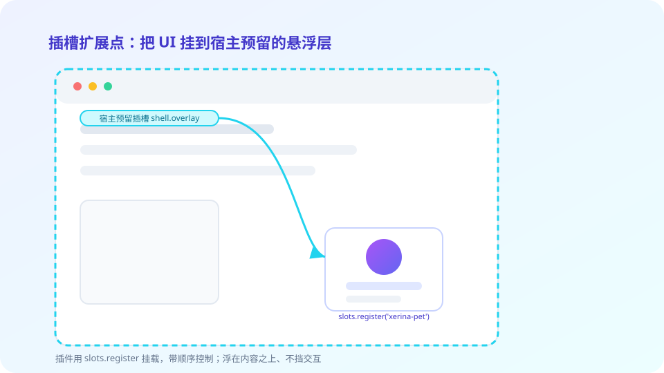

### 7.5 模块隔离

浏览器端产物会被 `__ModuleLoader__.load` 工厂包裹，react 等公共依赖由宿主的模块表 `external` 提供——插件不自带一份 react，避免和宿主冲突、也减小体积。

---

## 8. 插件化的目录结构详解（重点）

### 8.1 一个完整插件项目的目录树

以「Xerina 网页宠物」为例，一个最小可跑的 DSH 插件长这样：

```text
xerina-pet-dsh-plugin/
├── package.json
├── cordis.patch.yml
├── tsdown.config.ts
├── src/
│   ├── index.ts            (宿主端入口：apply(ctx))
│   └── client/
│       ├── index.tsx       (浏览器端入口：导出 Pet 组件)
│       └── Pet.tsx         (悬浮宠物组件：读 pet.json、切状态、播雪碧图)
└── lib/
    ├── index.js            (宿主端构建产物)
    └── client.js           (浏览器端构建产物)
```

逐层说明：

- `package.json`：声明 DSH 契约（bundle patch、client 入口）和导出；
- `cordis.patch.yml`：声明式装进某个 profile 的插件名单；
- `tsdown.config.ts`：一次构建出 Node 端 `lib/index.js` 与浏览器端 `lib/client.js`；
- `src/index.ts`：宿主端，调 `apply(ctx)` 注册插槽、读配置；
- `src/client/Pet.tsx`：浏览器端，真正把宠物画出来；
- `lib/`：上面的源码构建后落在这里，被宿主加载。

### 8.2 package.json：dsh 契约与导出

关键字段：

- `dsh.bundle.patch`：指向 `cordis.patch.yml`，告诉 DSH 安装时怎么装配；
- `dsh.client`：指向浏览器端入口（构建后的 `lib/client.js`）；
- `exports` / `main`：指到 `lib/index.js`（宿主端产物）；
- `name` 与 profile：插件名决定它在插件树里的身份，profile 决定它被装进哪套运行时配置。

### 8.3 cordis.patch.yml：声明式自动装配

内容极简，作用很大——安装期把本插件追加进目标 profile 的插件名单：

```yaml
# cordis.patch.yml（示意）
patches:
  web:
    plugins:
      - xerina-pet-dsh-plugin
```

宿主启动时按 profile 读这份名单，自动 `apply(ctx)`。整个过程不碰宿主源码，符合「一切皆插件」。

### 8.4 tsdown.config.ts：Node + 浏览器双产物

配置一次产出两端：

```ts
// tsdown.config.ts（示意）
import { defineConfig } from 'tsdown';

export default defineConfig({
  entry: ['src/index.ts', 'src/client/index.tsx'],
  format: ['esm'],
  outDir: 'lib',
  external: ['react', 'react-dom'], // 公共依赖交给宿主模块表
});
```

`external: ['react', 'react-dom']` 是关键：浏览器端产物里不打包 react，由宿主以 `external` 方式提供，避免重复实例。

### 8.5 src/index.ts：宿主端实现

宿主端只做「副作用注册」，不画 UI：

```ts
// src/index.ts
import type { Context } from '@cordisjs/core';

export function apply(ctx: Context) {
  // 把浏览器端宠物挂到悬浮层插槽
  ctx.slots.register('xerina-pet', () => import('./client/index'));
  // 读 pet.json / spritesheet 配置、订阅状态事件都在这里接
}
```

`apply` 里不写重逻辑，能力声明清楚即可；真正的渲染在 client 端。

### 8.6 src/client：浏览器端 UI 与逻辑

`Pet.tsx` 是被 `__ModuleLoader__` 注册后渲染的 React 组件：它读 `pet.json`（状态机、雪碧图路径、各状态帧数），按当前状态切 `spritesheet.webp` 的帧区间做动画，并监听宿主发来的状态事件（thinking → waiting → idle）。宠物悬浮、可拖拽、不挡交互——这就是「悬浮宠物」的落地。

### 8.7 加载链路：从安装到挂载

完整链路：

1. `dsh plugin add xerina-pet-dsh-plugin` → 写 profile 配置 + `cordis.patch.yml` 生效；
2. `dsh web` 启动宿主（默认 `http://127.0.0.1:3080`）；
3. 页面加载 `lib/client.js` → `__ModuleLoader__` 注册 `Pet` 组件；
4. 宿主 `apply(ctx)` 执行 → `ctx.slots.register('xerina-pet', …)` 挂上悬浮层；
5. 宠物渲染、订阅事件、按 `pet.json` 播动画。

从「装插件」到「宠物浮在页面上」，每一步都是声明式、可审计的。

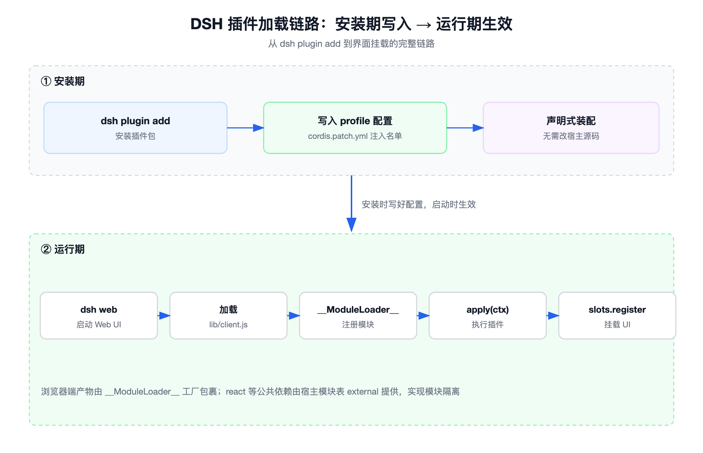

---

## 9. 四种运行模式（简表）

| 模式 | 特点 | 典型用途 |
| --- | --- | --- |
| 标准 | 完整上下文、完整工具 | 日常对话 / 编码 |
| PTC（Plan-To-Code） | 先出计划再执行 | 大改动前先对齐方案 |
| 极简 | 最小上下文、快 | 轻量问答 |
| 创造 | 放开探索 | 头脑风暴 / 生成式任务 |

模式只是「上下文与自由度」的不同档位，插件机制不变。

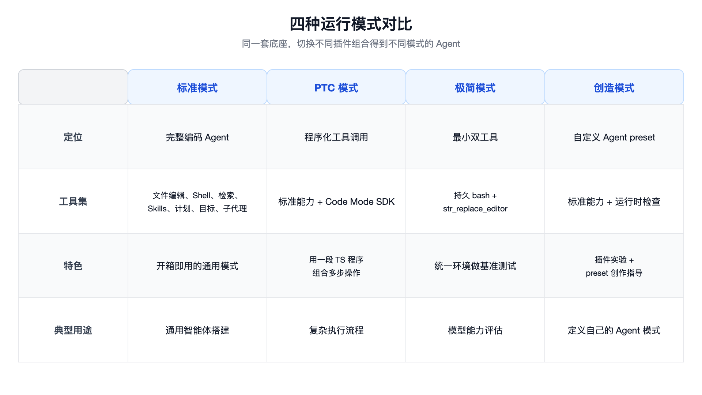

---

## 10. 快速上手与调试

### 10.1 安装与启动

```bash
npx @deepseek-ai/dsh web
# 默认 http://127.0.0.1:3080
```

源码方式：`git clone` 官方仓库后本地起。

### 10.2 安装一个社区插件作参考

以 `WaLiOffice` 插件为例，看别人怎么组织目录与 patch：

```bash
dsh plugin --profile web add walioffice-dsh-plugin
```

装完去 `node_modules/` 或插件目录里看它的 `package.json` / `cordis.patch.yml` / `src/client`，对照本文 §8 的目录树，理解别人怎么挂 UI、怎么读配置。

### 10.3 本地调试我的插件

- 把插件 `npm link` 或 `dependencies` 指向本地包，改完即时生效；
- 浏览器开 `http://127.0.0.1:3080`，看宠物是否挂载、状态切换是否顺；
- 踩坑多在两端产物：`external` 漏了 react 会双实例、插槽名拼错宠物不显示、`pet.json` 帧数算错会跳帧。

---

## 11. 边界、坑与 FAQ

### 11.1 什么时候不该用 DSH

- 你要的是「一个能跑命令、改代码的编码代理」：直接用 Claude Code / Codex 更省事，DSH 不替你做决策；
- 你要的是「企业低代码 Agent 平台」：Dify / Coze 的界面和治理更现成；
- 你只想嵌一个聊天框：现成 widget 比写一个插件更快。

### 11.2 常见坑

- **双实例 react**：`tsdown.config.ts` 的 `external` 漏了 `react`/`react-dom`，浏览器端自带一份 react，与宿主冲突；
- **宠物不显示**：插槽名拼错（必须是宿主预留的 `shell.overlay` 这类命名插槽），或 `slots.register` 的 name 与挂载处不一致；
- **动画跳帧**：`pet.json` 里各状态帧数算错，雪碧图帧区间对不上；
- **配置不生效**：`cordis.patch.yml` 没写进对应 profile，宿主启动时没 `apply` 你的插件。

### 11.3 几个高频问题

- **能挂多个 UI 吗？** 能，`slots.register` 多次、不同 name 即可，靠顺序控制上下层。
- **后端能换吗？** 能，能力接缝让 `llm` 后端在本地 / 远端之间零改迁移。
- **上下文会爆吗？** 默认几 k 提示词、按需加载，插件只声明自己要的服务，天然抗膨胀；真要更多上下文再切「标准 / PTC」模式。
- **插件能上架分享吗？** 能，它就是一个普通 npm 包，发版后别人 `dsh plugin add` 即可。

---

## 12. 总结

回到开头三个问题：

1. **这插件是什么**：一个跑在浏览器角落、可拖拽、不挡交互的 AI 搭档（悬浮宠物），由「宿主 DSH + 插件 + Agent 后端」三块组成，插件只描述「挂 UI / 读配置 / 订阅事件」。
2. **优势是什么**：相对从零搭，你只写三件事；相对成品编码代理，UI 也是一等插件；再加上一切皆插件、上下文按需小、Trajectory 可审计、能力可迁移、声明式零侵入、MIT 开源。
3. **和其他 Harness 比**：成品代理（Claude Code/Codex/Cursor）不给你挂 UI 的插槽，框架（LangChain）要你自己写运行时，平台（Dify/Coze）UI 形态固定；DSH 是唯一把「前端 UI 也当插件」且「上下文按需小」的开源底座，正好适配「网页宠物」这类轻量陪伴 UI。

如果你也想做一个浏览器里的 AI 搭档，照着 §8 的目录树和 §10 的启动命令，半小时就能让宠物浮在页面上。