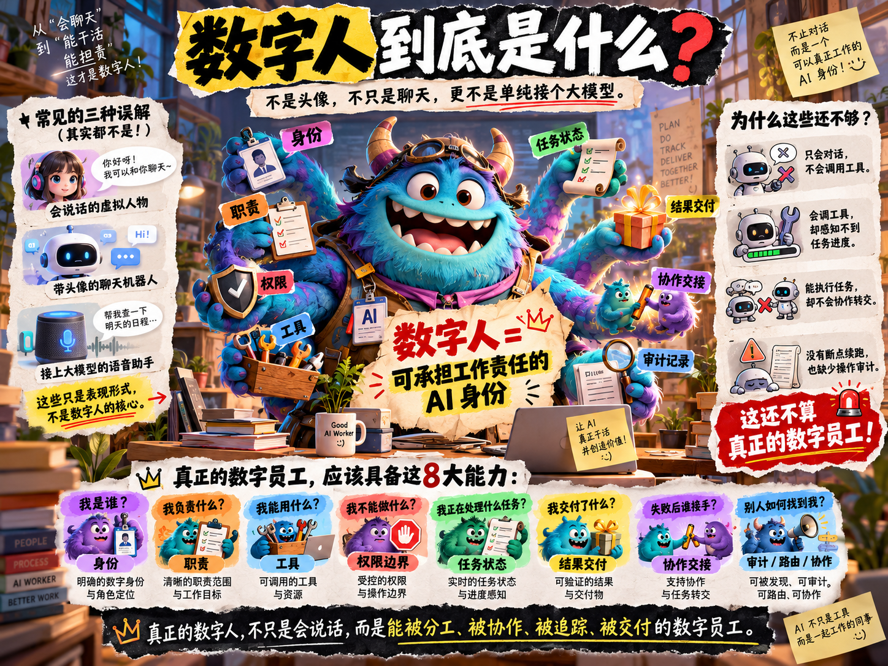
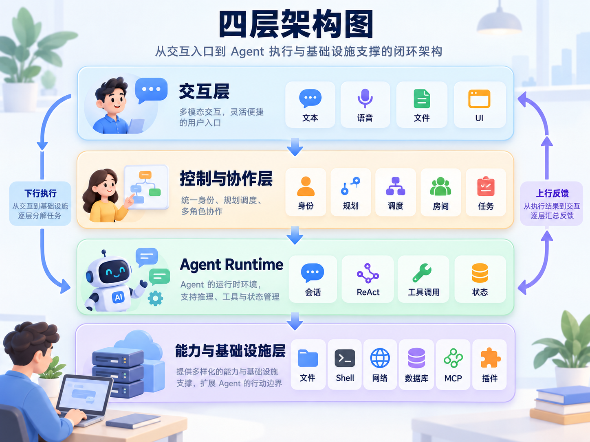
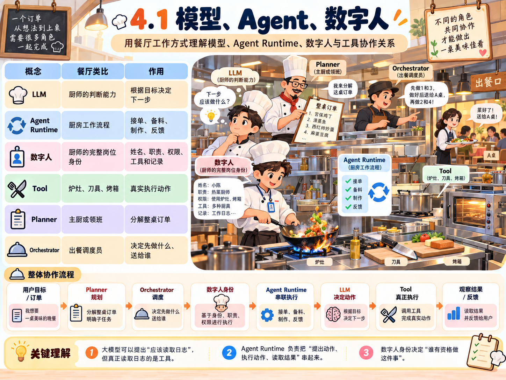
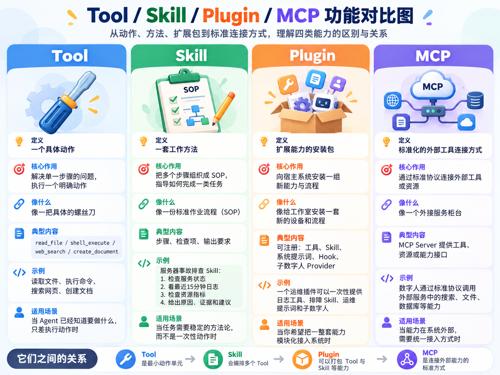
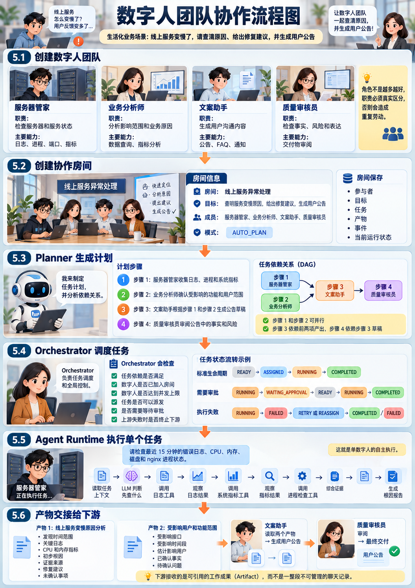
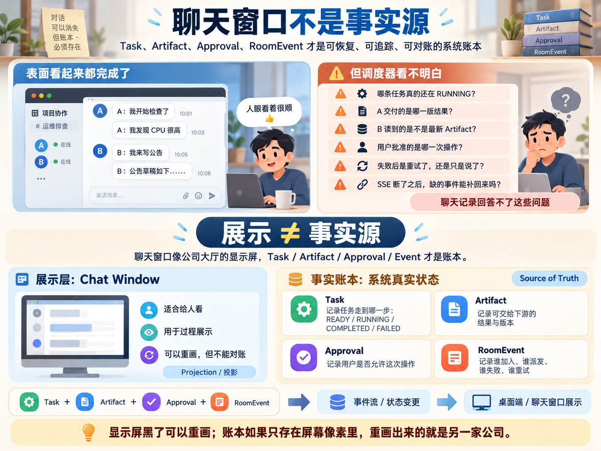
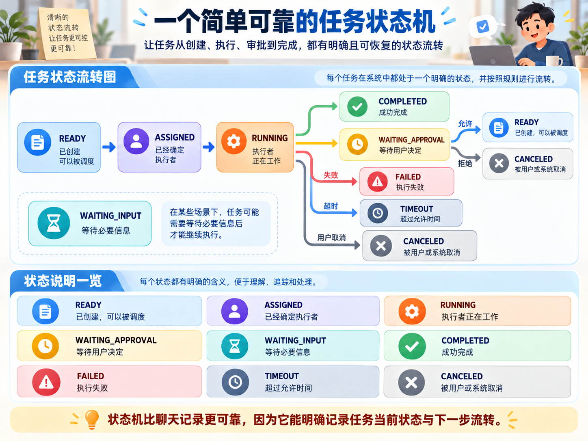

# Phase 1：数字人总体架构和领域模型

> 一句话：本文是数字化员工系列的第一部分，把"数字人到底是什么、由哪些部分组成、怎么协作、状态如何流转"彻底讲透——读完你就知道，一个真正的数字员工和普通聊天机器人之间，隔着一整套完整的架构体系。

---

## 一、各大公司追求的数字人到底是什么

很多人第一次接触"数字人"，会先想到三类印象：

- 一个会说话的虚拟人物；
- 一个带头像的聊天机器人；
- 一个接上大模型的语音助手。

这些都属于数字人的表现形式，但还没有触及数字人的核心。

倘若它仅能对话，却无法调用工具；能调用工具，却无法感知任务进度；可以执行任务，却不支持任务转交、断点续跑与操作审计 —— 那它本质上只是**会说话的功能模块**，算不上真正的数字员工。

我们首先搞清楚一个清楚的认知：

> **数字人不等于虚拟形象，也不单纯是一个大模型。**数字人是可承担工作责任的 AI 身份

它要像一名真正的员工一样，至少需要回答：

- 我是谁？
- 我负责什么？
- 我能使用哪些工具？
- 我不能做什么？
- 我现在正在处理哪项任务？
- 任务做到哪一步了？
- 我交付了什么结果？
- 如果我失败了，谁可以接手？
- 其他数字人如何找到我并把任务交给我？

---

## 二、用一个工作场景理解数字人

### 2.1 场景：一家由数字员工组成的"智能工作室"

想象咱们开了个小工作室，客户甩来一句需求： "咱们线上服务今天卡得厉害，帮忙查清楚为啥、给修复方案，顺便写一份给用户的致歉公告。"

要是丢给单个普通 Agent 去硬扛，那就是强行逼出一个全能超人，一个人包揽运维、排查、写文案一堆活儿，忙得手忙脚乱，想到哪做到哪，完全没章法，累死个人，结果顺序全乱。

但换成一套数字员工团队干活，画风就像正常公司项目组： 接待员（相当于项目经理）先吃透客户诉求，掂量这件事有多紧急； 调度员（开发小组长）负责拆任务、派活儿； 运维数字人埋头扒服务器指标、进程、日志，排查服务状态； 分析数字人统计影响面，看看多少用户被卡； 文案数字人拿着确认好的故障原因写用户公告； 审核数字人盯一遍公告内容，核对事实、风险和措辞； 最后调度员收拢所有产出，打包整套方案交给客户。

说白了就是按职责分工、协同推进任务，跟咱们现实里的开发团队一模一样。只不过所有人换成数字人来调度执行，相当于把一整个团队的协作模式，直接蒸馏到 AI 系统里，哈哈

### 2.2 数字人就是团队一名员工

| 现实工作室 | 数字人系统 |
| --- | --- |
| 员工姓名和岗位 | 数字人身份和职责 |
| 员工的工作地点或联系方式 | Runtime 连接端点 |
| 员工掌握的技能 | 工具、Skill、能力标签 |
| 员工可以进入哪些系统 | 工具权限和资源范围 |
| 经理安排工作 | Planner 和 Orchestrator |
| 工单 | Task |
| 会议室 | Collaboration Room |
| 交付的报告或文件 | Artifact |
| 工作日志 | Event |
| 审批流程 | Approval |
| 部门之间的协作协议 | DSH、A2A 等协议 |
| 工作台和看板 | 桌面端控制面 |

所以数字员工就是一个意义上作为牛马的 '你' ，一个可以取代你成为你的Agent 的调度系统，你的地位将被特殊化一套harness缰绳，然后你就可以解放

---

## 三、数字人的总体架构

### 3.1 一个数字化员工的整体工作流程

先看一条完整链路：

这里有一个容易混淆的地方：

- Planner 负责"应该拆成哪些工作"；
- Orchestrator 负责"什么时候派、派给谁、能不能并行"；
- Agent Runtime 负责"某个数字人如何完成自己的那项工作"；
- LLM 负责"在当前上下文中下一步做什么"；
- Tool Executor 负责"真正执行动作"。

如果把这些角色都叫成"AI 在思考"，系统就会变得难以理解。

### 3.2 四层架构

关于数字化员工的执行，大概可以四层架构图

#### 第一层：交互层

交互层，可想得知是用户的体验的交互处，也就是入口处，可以为我们口中的前端工程，但是其实一些大佬使用，完全可以用cli 的命令作为交互，这才是最直接的方式

它负责：

- 接收用户输入； 流式展示返回内容； 把工具调用过程展示出来； 实时显示任务跑到哪一步； 弹出审批卡片； 展示报告、各类文件； 支持用户随时取消、重试或者换个人接手任务。

#### 第二层：控制与协作层

- 这一层就像公司里的项目管理 + 任务调度中台。 职责： 维护所有数字人花名册； 登记每个数字人会干什么、职责边界； 做任务规划拆解； 创建任务，定义任务之间的依赖关系； 管控并发，防止任务扎堆； 处理任务交接； 收集所有产出物； 处理重试、改派、取消逻辑； 向上统一推送事件。

#### 第三层：Agent Runtime

这一层是"某个数字人真正干活的地方"。

- 这里就是单个数字人真正埋头干活的地方。 负责： 保存会话上下文； 从消息收件箱拿任务； 调用大模型； 判断要不要拉起工具； 执行工具； 接收工具返回结果； 继续循环推进； 处理取消、超时、审批拦截； 把整个执行流程记录到会话日志。 ReactLoopAgent、AgentRunFactory、Inbox、ToolCallExecutor 共同构成这一条核心执行链路

#### 第四层：能力与基础设施层

这一层提供数字人可以使用的能力：

- 给数字人提供各种可用技能底座： 文件读写； Shell 终端能力； 网页搜索、页面抓取； 数据库访问； MCP Server； Java 插件； Node 桥接； 调用远端其他数字人

---

## 四、数字人由哪些部分组成

### 4.1 数字人身份

先想象一张员工档案： 他描述的就是这个数字人的身份信息

~~~text
数字人身份
├─ id：唯一身份
├─ displayName：展示名称
├─ avatarRef：头像或图标
├─ purpose：职责描述
├─ roleTags：能力标签
├─ approvalPolicy：审批策略
├─ concurrencyLimit：并发上限
└─ ownerScope：所属工作区或用户范围
~~~

例如：

~~~text
id：dh_ops
名称：服务器管家
职责：服务器巡检、日志排查、部署风险分析
能力标签：server-ops、linux、incident-response
审批策略：写操作需要审批
并发上限：2 
~~~

### 4.2 连接端点

同一个数字人身份，可以连接到不同的 Runtime：

~~~text
服务器管家
  ├─ 开发环境 Runtime
  ├─ 测试环境 Runtime
  └─ 生产环境 Runtime
~~~

因此要把"身份"和"连接"分开：

| 身份信息 | 连接信息 |
| --- | --- |
| 名称 | Base URL |
| 职责 | 协议版本 |
| 能力标签 | 凭据引用 |
| 审批策略 | 健康状态 |
| 并发上限 | 延迟和连接错误 |

在数字人项目中，DigitalHumanService 管理数字人身份与端点，远端接入通过 Agent Card 探测能力。

### 4.3 Agent Run：一次正在工作的实例

"服务器管家"是一个持久身份；  
"服务器管家正在检查 10:00 的 CPU 告警"是一次 Agent Run。

一个数字人可以先后处理很多任务：

~~~text
服务器管家
  ├─ Agent Run 1：检查 CPU 告警
  ├─ Agent Run 2：分析磁盘占用
  └─ Agent Run 3：生成部署检查报告
~~~

Agent Run 通常拥有：

- 当前任务；
- 当前会话；
- 当前工具目录；
- 当前工作目录；
- 当前审批上下文；
- 当前事件监听器；
- 当前执行状态。

这就是为什么要区分"数字人"和"运行中的数字人"。

---

## 五、不要混淆这些概念

### 5.1 模型、Agent、数字人

我们以一张图来理解完整的概念分层，相比语言描述更加的透彻

### 5.2 Tool、Skill、Plugin、MCP

### 5.3 数字人与多数字人

数字人在委派子任务时，主要分为两种协作模式，逻辑完全不一样，但是他们都是数字员工在Agent runtime 的运行时自主派发数字员工的，就和subagent 的概念是一致的，但是唯一不同的是，subagent 偏向派发一个子智能体去做某件事，但是这个子智能体原本并没有任何职工化，他也是一个单独的Agent 能力，但是数字化团队，由于每个数字人的职责与工具等调用非常的清楚，边界隔离性大，分工更加的具体，并且通常具有下面两者委派模式：

#### Spawn：重新派一个人处理

父数字人只下发**纯粹的任务指令**，不携带冗余上下文。 子数字人开启全新会话，从零独立思考、完整执行任务

#### Fork：把当前工作副本交给副手

父数字人把**当前会话上下文、已有结论、工作进度**同步给子数字人。 子数字人基于现有信息接续工作，不用重复复盘、重复推理

多数字人协作的核心并不是堆砌多个聊天窗口，必须具备完整的协同机制，需要完成的协作空间（会议），明确的任务关系（DAG）图，时间推送机制，可复用的交付产物等等

咿？那我有一个困惑了，上述讲了数字人与多数字人？**他们和Agent 任务调度的编排，有什么不一致？**这不是听着大差不差的吗，不是一直存在Agent 的编排以及中心调度智能体 Supervisor 的实现？

#### Agent 的任务编排，中心调度及数字人

听着像，是因为三件事都在说「把活分给别人做」。拆开之后，做决定的人、交接的东西，都不一样。

~~~text
Planner           拆成哪些步骤、依赖谁、派给哪个数字人（DAG 只建一次）
Orchestrator      现在能不能派、上游失败怎么办、下游何时醒来（建完后反复跑）
Agent Runtime     领到自己那一格之后怎么干：调工具、Spawn / Fork
~~~

**Agent 任务编排**，比如 LangGraph 的图、Supervisor，回答的是「下一步走到哪个节点」。节点多半是同一张图里的角色，跟这一次运行一起生灭，上下文常常是一份大家一起改的共享状态。它和本文的 Planner + Orchestrator 是同一层：负责流转，不负责员工身份。

**中心调度**就是 Orchestrator，不是另一个更聪明的数字人。它不设计 DAG，也不钻进某一格里决定先查日志还是先查磁盘。每次任务状态一变，它再看一遍：

- 依赖是否都已完成；
- 执行者是否还在房间、并发是否已满；
- 上游失败时，还在等待的下游要不要停；
- 可以派时，把上游产物写进指令，交给那个数字人的 Runtime；
- 全部任务进入终态后，房间才算结束。

审批通过、重试、改派、某一格做完，都会再叫它一次。所以它不是建完 DAG 就退场。

**数字人**是这张图上的长期员工。花名册、职责、工具权限、审批策略、并发上限、连接端点，都先于某一次任务存在。别人通过目录找到他，而不是因为他被写进了某张图。下游收下的是可引用的 Artifact，不是一整段聊天，也不是一份人人可改的共享状态。

正在执行的数字人改不了 DAG。任务只有两个来源：用户 @，或 Planner 生成后由 Orchestrator 创建。格子内部只多两件旁路的事：

- **Spawn / Fork**：父数字人在自己的 Runtime 里拉一个临时副手。副手不是房间里的员工，不成为新节点，结果只回到父数字人。它和 subagent 是同一条链路，差别只在上下文带不带过去。
- **向同事问一句**：回复末尾可以写 `[[ASK:@成员名] 问题]`。对方做一次短答复，答案注回当前任务，依赖关系不变。

因此：编排决定格子之间怎么走；Orchestrator 按这张图反复派活；数字人只对自己领到的那一格负责。Spawn / Fork 发生在格子内部，和中心调度不是同一条链路。

---

## 六、从"线上异常"看一次完整协作

> 业务背景：用户体验的生成报告，产品经理的流程发现，给出下一个一个任务
>
> "线上服务变慢了，请查清原因、给出修复建议，并生成用户公告。"

 四名数字人通过 `purpose` 和 `roleTags` 区分职责。职责不可区分时，Planner 无法做有效路由，只会生成重复任务。`Room` 是本次协作的边界，保存参与者、目标、Task、Artifact 和 Event。执行者必须已加入房间，且未达到 `concurrencyLimit`，Orchestrator 才会派发。

**计划与调度。** 图中模式为 `AUTO_PLAN`：用户未指定执行者，Planner 读取能力卡，生成一次 Task DAG。步骤 1 与步骤 2 的 `dependsOn` 为空，可并行；步骤 3 依赖二者的 Artifact；步骤 4 依赖步骤 3。用户显式 `@` 某一数字人时不调用 Planner，直接创建单条 Task，随后仍进入同一调度路径。

DAG 创建后不再由数字人改写。每次任务状态变化，Orchestrator 重新扫描 `READY` 任务：依赖全部为 `COMPLETED`，且执行者并发未满，才转为 `ASSIGNED` 并注入上游产物。审批恢复、重试、改派和任务终态都会再次触发调度。上游进入 `FAILED`、`CANCELED` 或 `TIMEOUT` 时，仍在等待的下游必须进入明确终态，不能永久停留在 `READY`。全部任务终态后，房间状态收敛为 `done`。

**单任务执行与交接。** Agent Runtime 只执行已经派发的 `instruction`，在该 Agent Run 内完成工具调用循环。Spawn、Fork 以及对房间成员的定向提问都发生在这次 Run 内部：不新增 `CollaborationTask`，不修改 `dependsOn`。下游任务的输入是上游 Artifact，并保留生产者、来源任务和 TraceId；会话消息只是这些事实的展示，不能作为调度依据。

---

## 七、领域模型：边界设计，领域架构设计

### 7.1 DigitalHuman：数字人

~~~text
DigitalHuman                              长期存在的数字人身份，先于某一次任务存在
├─ id
├─ displayName
├─ avatarRef
├─ purpose                                 职责说明，同时作为 Planner 的能力摘要
├─ roleTags                                能力匹配
├─ approvalPolicy                          敏感操作如何审批
├─ concurrencyLimit                        同时接收任务的上限
├─ endpoint                                实际连接的 Runtime
└─ healthState
~~~

### 7.2 Endpoint：连接端点

~~~text
Endpoint                                   如何找到这个数字人；与身份分离
├─ endpointType                            local-dsh / remote-dsh / a2a
├─ baseUrl
├─ credentialRef                           凭据引用，不进入身份信息
├─ protocolVersion
└─ healthState                             远端不可达时身份仍保留
边界：同一身份可切换开发、测试、生产；更换 Token 不修改身份；本地与远端用同一套目录。
~~~

### 7.3 Room：协作房间

~~~text
CollaborationRoom                          一组数字人处理一个目标的边界
├─ roomId
├─ workspaceId
├─ title
├─ objective                               本次协作的总体目标
├─ participants                            哪些数字人属于这次协作
├─ tasks                                   任务归属本房间
├─ artifacts                               产物归属本房间
├─ eventLog                                用户应看到的协作事实
├─ orchestrationMode                       如 AUTO_PLAN
└─ runState                                协作何时开始、暂停、结束
~~~

### 7.4 Participant：参与者

~~~text
Participant                                数字人在某个房间里的成员记录，不是长期身份
├─ participantId
├─ digitalHumanId                          指向 DigitalHuman
├─ roomRole                                同一数字人在不同房间角色可以不同
├─ presence
├─ joinedAt
└─ activeTaskIds
边界：质量审核员在一个房间可以是 reviewer，在另一个房间可以是 observer。
~~~

### 7.5 Task：任务

~~~text
CollaborationTask                          协作系统调度的最小工作单元
├─ taskId
├─ roomId
├─ title
├─ instruction                             要执行的指令
├─ assignedTo                              执行者
├─ requestedBy                             user 或 orchestrator
├─ state                                   当前状态，供调度判断是否完成、失败后如何处理
├─ dependsOn                               上游任务
├─ inputArtifactIds                        输入产物
├─ outputArtifactIds                       输出产物
├─ timeout                                 允许执行的时间
└─ traceId                                 追踪编号
边界：一条用户消息可以产生多条 Task。缺指令、执行者、状态、依赖、输入、输出、超时或追踪编号时，无法判断谁负责、是否完成、失败后怎么办。
~~~

### 7.6 Artifact：产物

~~~text
Artifact                                   任务留下的、可引用或继续加工的结果
├─ artifactId
├─ roomId
├─ taskId                                  哪个任务生产
├─ producerId                              谁生产
├─ kind                                    markdown、文档、表格、补丁、命令结果、图表、图片、结构化数据、审核结论
├─ title
├─ contentRef
├─ provenance                              使用了哪些工具、来源于哪些事件、由哪个 TraceId 串联
└─ createdAt
边界：下游引用 Artifact，不引用上游整段会话。
~~~

### 7.7 Event：事件

~~~text
Event                                      系统已经发生的一件事实，协作变化的账本
├─ PARTICIPANT_JOINED
├─ PLAN_CREATED
├─ TASK_CREATED
├─ TASK_ASSIGNED
├─ TASK_STATE_CHANGED
├─ MESSAGE_CREATED                         聊天消息只是事实的一种展示
├─ TOOL_CALL
├─ TOOL_RESULT
├─ APPROVAL_REQUIRED
├─ APPROVAL_RESOLVED
├─ ARTIFACT_CREATED
├─ HANDOFF_REQUESTED
└─ ERROR
边界：刷新页面、断线重连和判断重试，都从事件与任务状态恢复，不从聊天记录恢复。
~~~

---

## 八、为什么聊天消息不能作为唯一事实源

刷新一次页面，问题就露馅：

- 哪条任务还在 `RUNNING`，哪条只是嘴上说开始了？
- A 的结果交出去没有，交的是哪一版？
- B 写公告时读的是不是 A 的最新 Artifact？
- 用户批准的是哪一次工具调用，批准之后执行了没有？
- A 失败后有没有自动重试，还是聊天气氛到了，人没到？
- 这条消息是草稿、结论，还是工具报错？
- SSE 断了之后，屏幕上缺的那几条事件，能不能补回来？

聊天记录回答不了这些。它是展示，不是事实源。拿它恢复系统，等于对着监控回放去对账。

事实要分开记：

| 事实 | 记在哪里 |
| --- | --- |
| 任务走到哪一步 | Task 的状态 |
| 可交给下游的结果 | Artifact |
| 用户允不允许这次操作 | Approval |
| 谁加入、谁派发、谁失败 | RoomEvent |
| 界面上那几句对话 | 上述事实的一种投影 |

---

## 九、状态模型：让系统知道工作进行到哪一步

### 9.1 房间状态与任务状态

房间 `runState` 只表示整场协作收没收口，不表示 DAG 跑到第几步。任务 `state` 才是每一格的调度依据。成员 `presence` 只描述这个人当前的样子，不参与依赖判断。

| 写入时机 | 房间 | 任务 |
| --- | --- | --- |
| 创建房间 | `idle` | — |
| 用户消息进入 `postMessage` | `running` | 新建任务为 `READY`，执行者已写入 `assignedTo` |
| `schedule()` 决定派发 | 不变 | `READY` → `ASSIGNED`，上游 Artifact 拼进指令 |
| `runTask()` 调用 Runtime 之前 | 不变 | `RUNNING`，presence 为 `working` |
| Runtime 正常返回 | 不变 | `COMPLETED`，归档 Artifact，presence 为 `done` |
| 等待审批 | 不变 | `WAITING_APPROVAL` |
| 审批通过、提问后续跑、自动或手动重试、改派 | 重试和改派时回到 `running` | 原任务回到 `READY` |
| 失败且不再恢复、执行中断超过 1 分钟 | 不变 | `FAILED` |
| 用户取消 | 若此后全部任务终态，则为 `done` | 当前任务 `CANCELED` |
| `schedule()` 扫完且没有新派发 | 全部任务已是终态时 `done` | 不再改动 |

终态只有 `COMPLETED`、`FAILED`、`CANCELED`、`TIMEOUT`。6 分钟超时走失败分支，实际写成 `FAILED`。某一个数字人先完成，房间仍是 `running`。

数字人自己的 Spawn / Fork 不写这两套状态。子执行结束只把工具结果交回父执行，父任务在此期间一直是 `RUNNING`。

### 9.2 级联关系

`schedule()` 是协作服务对已有 DAG 的一轮扫描。它不创建任务，也不修改 `dependsOn`。DAG 只在这次消息里建一次：用户 `@` 建单条任务，或 `AUTO_PLAN` 按计划建好多条。之后每一轮 `schedule()` 按这个顺序处理：

1. 把丢失执行线程、仍停在 `RUNNING` 或 `ASSIGNED` 超过 1 分钟的任务收成 `FAILED`。
2. 做级联：顺着已有 `dependsOn` 往下收口，不新增节点。
3. 扫描剩余的 `READY` 任务。依赖全部 `COMPLETED`，且执行者并发未满，才写成 `ASSIGNED`，把上游产物拼进指令，提交 `runTask()`。已经 `RUNNING` 的任务不会被这轮改派。
4. 若全部任务都已是终态，并且这一轮没有新派发，房间写成 `done`。

级联的命中条件：任务自己还是 `READY` 或 `ASSIGNED`，且任一上游已经是 `FAILED`、`CANCELED` 或 `TIMEOUT`。命中后一次写完：任务改为 `FAILED`，执行者 presence 改为 `idle`，追加 `ERROR`（`UPSTREAM_FAILED`）和 `TASK_STATE_CHANGED`。扫描循环到没有新的下游可收为止。步骤 1 失败后，依赖它的步骤 3、再依赖步骤 3 的步骤 4，会在同一次级联里依次变成 `FAILED`。

`RUNNING` 和 `COMPLETED` 不在级联扫描范围内，不会被上游失败打断。没有依赖的并行任务也不受影响，例如步骤 1 失败时，无依赖的步骤 2 仍可派发。

`schedule()` 在这些时机触发：计划或 `@` 刚建完、`runTask()` 的 `finally`、审批通过、手动重试、手动改派。用户取消不调用它，而是把当前任务写成 `CANCELED` 后直接做上面的级联，再判断房间是否 `done`。Spawn / Fork 和向同事提问发生在 `RUNNING` 内部，也不调用 `schedule()`；只有这条任务回到 `READY` 或进入终态之后，才会由上面的时机再触发一轮。

### 9.3 委派、取消之后怎么变

中心委派发生在 `ASSIGNED`：执行者是建任务时写好的人，改派只更换 `assignedTo`，依赖不变，任务回到 `READY` 后重新调度。

数字人执行中的委派不改变这张图。Spawn / Fork 是当前 `RUNNING` 任务内部的子 `AgentRun`；`[[ASK:@成员名]]` 只把答复写回原任务指令，再把原任务置为 `READY`。两条路径都不调用 `createTask`。

取消一条未终态任务时：打断执行线程，该任务写成 `CANCELED`，presence 改为 `idle`，然后按 8.2 级联仍在等待的下游。已终态的任务再取消是空操作。要换一套计划，只能再发一条消息，在同一房间旁边新建任务；旧任务的依赖不会被覆盖。

