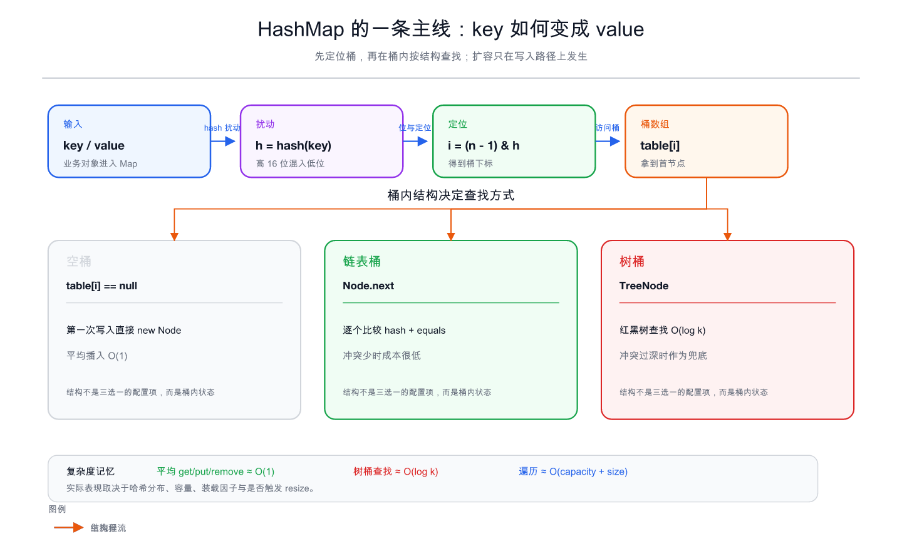
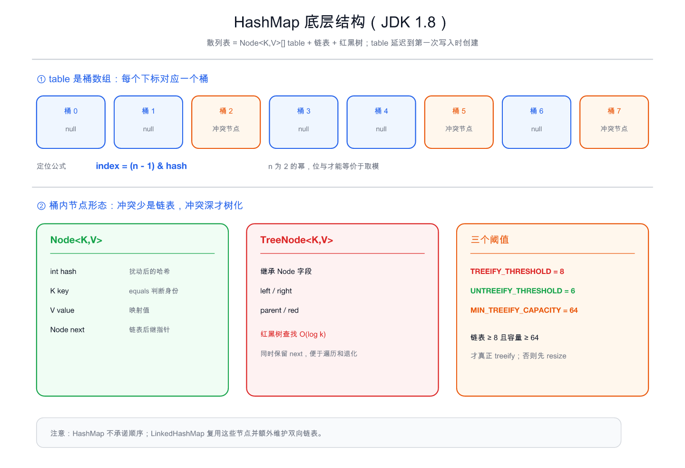
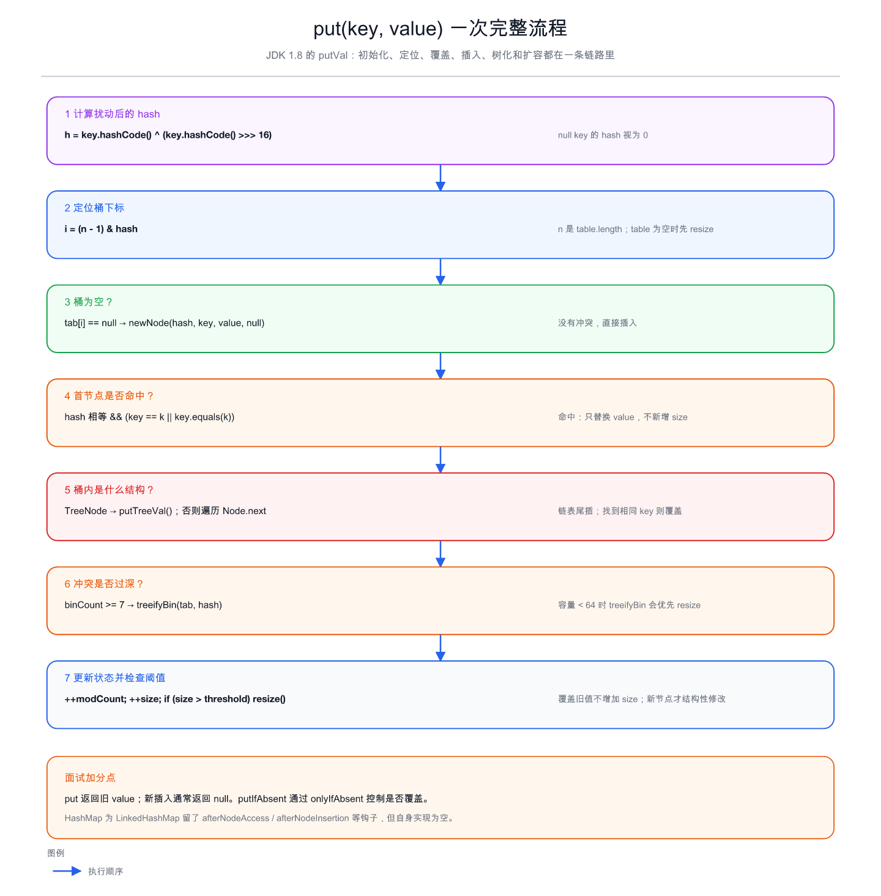
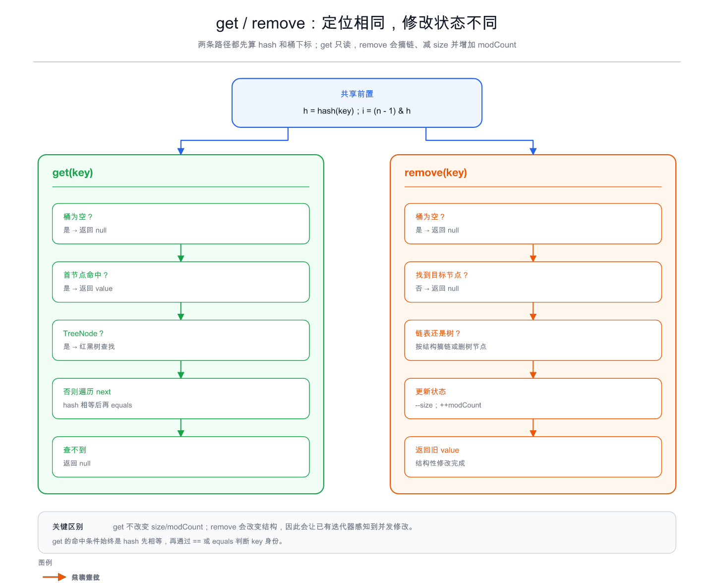
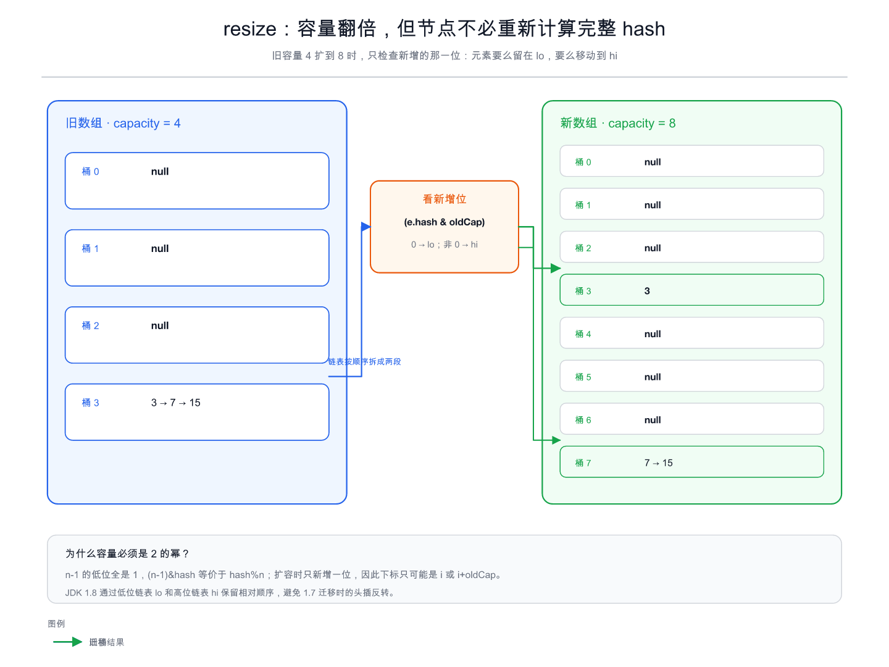
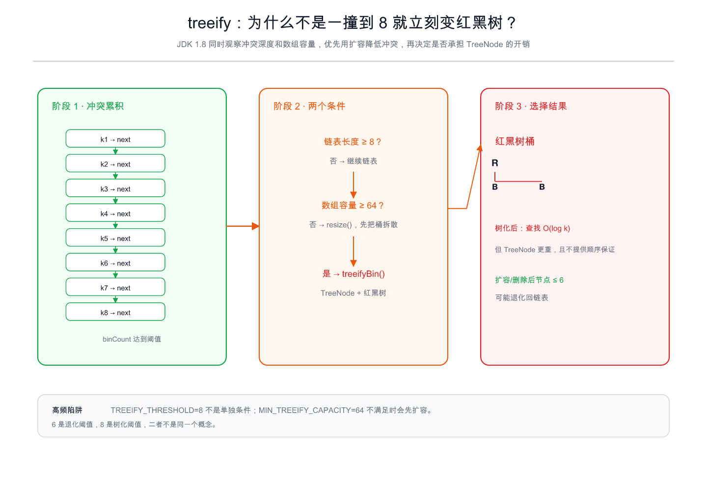
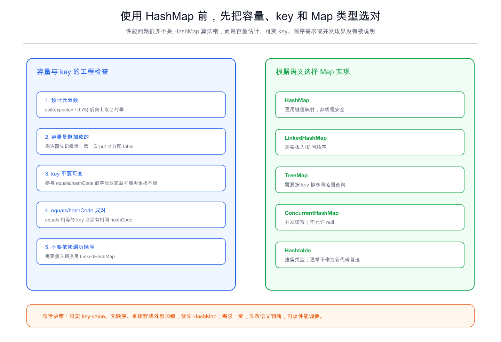
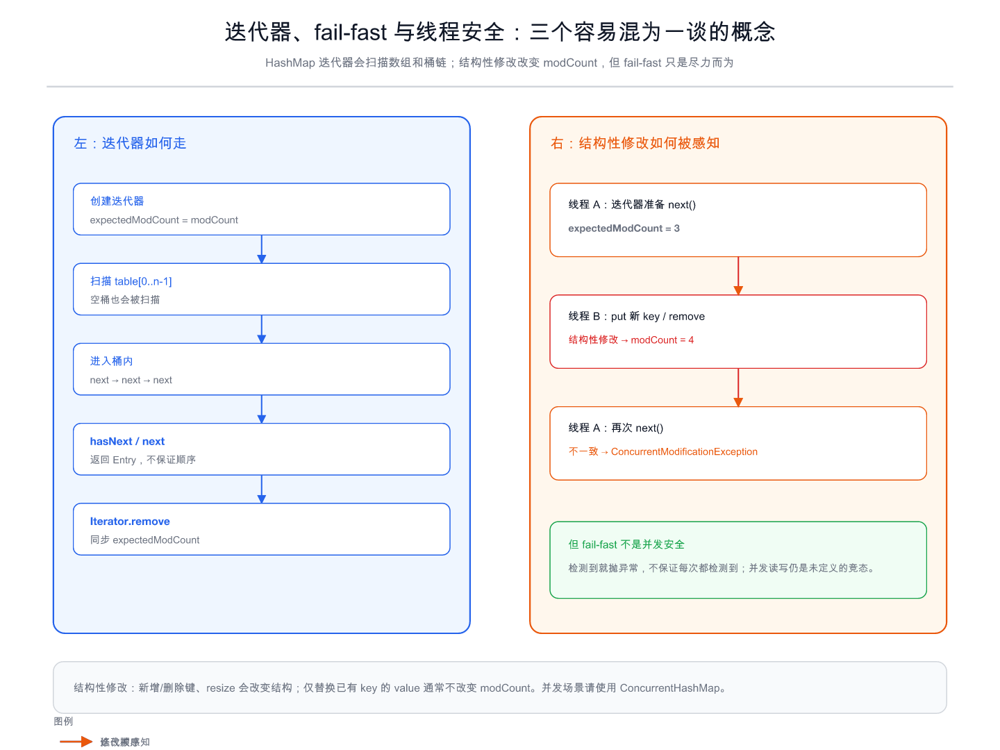

# HashMap 深度拆解：从 hash 到 resize，彻底搞懂 Java 集合中的核心实现

> 如果面试官只问一句“HashMap 的底层结构是什么”，回答“数组 + 链表 + 红黑树”就够了；但如果继续追问“为什么容量是 2 的幂”“扩容时为什么不用重新计算所有 hash”“树化为什么要同时看 8 和 64”，背口诀就不够用了。

这篇文章以 **JDK 1.8 的 `java.util.HashMap`** 为主线，把一个键值对从进入 Map 到被取出来的全过程拆开：它怎样计算位置，怎样处理冲突，怎样覆盖旧值，何时转红黑树，扩容到底搬了什么，迭代器为什么会抛 `ConcurrentModificationException`，以及实际写业务时如何选容量、设计 key 和选择 Map 实现。

文章中的源码方法名以 JDK 8 为准。不同 JDK 版本可能在实现细节、JIT 优化和字段布局上有所变化，但理解这条主链，足以覆盖绝大多数集合类面试题和日常排查。



## 一、先建立整体模型：HashMap 到底解决什么问题

HashMap 维护的是一组映射关系：

```java
key -> value
```

它希望做到两件事：

1. 给定 key，尽快找到对应 value。
2. 插入、删除时，不需要像数组或链表那样从头扫描全部元素。

最朴素的做法是把 key 转成一个整数，再把整数映射到数组下标。问题是：不同 key 可能映射到同一个下标，这就是**哈希冲突**。HashMap 的完整解法可以概括为：

> 用哈希函数把 key 分布到桶数组；同一个桶里的冲突节点用链表串起来，冲突过深时用红黑树降低查找成本；元素变多后扩容并重新分配桶。

因此，HashMap 不是“一个数组”，而是一张动态散列表：

```text
HashMap
└── Node<K,V>[] table
    ├── table[i] == null
    ├── table[i] -> Node -> Node -> Node       // 链表桶
    └── table[i] -> TreeNode                   // 红黑树桶
```

这里有一个面试中很重要的边界：**HashMap 只保证映射关系，不保证遍历顺序**。如果业务依赖插入顺序，应该看 `LinkedHashMap`；如果依赖 key 排序和范围查询，应该看 `TreeMap`；如果需要并发读写，应该看 `ConcurrentHashMap`。

## 二、底层结构：table、Node 和 TreeNode



### 2.1 `table` 是桶数组，不是“已经装满的数组”

JDK 8 中的核心字段可以简化为：

```java
transient Node<K,V>[] table;
transient int size;
int threshold;
final float loadFactor;
transient int modCount;
```

- `table`：桶数组，每个位置叫一个 bucket。
- `size`：当前键值对数量，不是数组容量。
- `loadFactor`：装载因子，默认 `0.75f`。
- `threshold`：扩容阈值，通常等于 `capacity * loadFactor`。
- `modCount`：结构性修改次数，迭代器用它做 fail-fast 检测。

构造 `new HashMap<>()` 时，`table` 并不会马上分配。默认构造器只记录默认装载因子，第一次 `put` 时才通过 `resize()` 创建容量为 16 的数组。这是**延迟初始化**：没有写入就不为桶数组付出内存成本。

### 2.2 Node 里为什么要同时保存 hash、key、value 和 next

JDK 8 的节点大致是：

```java
static class Node<K,V> implements Map.Entry<K,V> {
    final int hash;
    final K key;
    V value;
    Node<K,V> next;
}
```

查找一个节点时，先比较保存下来的 `hash`，只有 hash 相等时才继续比较 key。这样可以先用整数比较过滤大量不可能命中的节点，再调用 `equals()`。

`next` 是链表后继指针。即使节点后来进入红黑树，JDK 8 仍然保留节点的 `next` 关系，原因有两个：

- 遍历 HashMap 时仍要沿着桶内节点访问。
- 扩容或节点数量下降时，树桶可能重新退化成链表。

`TreeNode` 在 `Node` 的基础上增加 `left`、`right`、`parent` 和颜色信息，用于维护红黑树。树化并不是把 key/value 复制到另一套对象中，而是把桶内节点升级为具有树链接的节点结构。

## 三、哈希定位：为什么是扰动函数加位与

### 3.1 扰动函数把高位信息混入低位

JDK 8 的 `hash()` 可以概括为：

```java
static final int hash(Object key) {
    int h;
    return (key == null) ? 0 : (h = key.hashCode()) ^ (h >>> 16);
}
```

它做了两件事：

1. `null` key 的 hash 直接视为 0。
2. 普通 key 将原始 hash 的高 16 位右移后，与原 hash 异或。

为什么要把高位混进来？因为桶下标计算只使用 hash 的低若干位。如果容量为 16，真正参与定位的只有低 4 位；如果某类 key 的高位变化很大、低位却相同，就会集中撞到同一个桶。扰动函数让高位差异也有机会影响低位，改善分布。

注意：扰动函数不是“把 hash 变得绝对唯一”，也不是替代 `equals()`。它只是在有限容量下尽量减少碰撞。

### 3.2 `hashCode` 相同不等于 key 相同

HashMap 的命中条件本质上是：

```java
hash 相等 && (key == 已有key || key.equals(已有key))
```

所以两个不同 key 即使 hashCode 相同，也可以同时存在于同一个桶中；它们会被链表或红黑树继续区分。

反过来，重写 `equals()` 时必须同时重写 `hashCode()`：

```java
final class UserKey {
    private final long id;

    @Override
    public boolean equals(Object o) {
        return o instanceof UserKey && ((UserKey) o).id == id;
    }

    @Override
    public int hashCode() {
        return Long.hashCode(id);
    }
}
```

如果两个对象 `equals()` 为 `true`，却产生不同 hashCode，它们可能被放进不同桶里，Map 就无法按契约找到它们。这不是 HashMap 的 bug，而是 key 违反了对象相等契约。

### 3.3 为什么下标是 `(n - 1) & hash`

桶下标计算为：

```java
index = (table.length - 1) & hash;
```

当 `n` 是 2 的幂时，`n - 1` 的二进制低位全是 1：

```text
n = 16       00010000
n - 1 = 15   00001111
```

于是 `hash & 15` 等价于 `hash % 16`，但位运算成本更低。更关键的是，这个性质为扩容时的高低位拆分做了铺垫：容量翻倍只新增一位判断，节点下标只会留在原位置，或者移动 `oldCap` 的距离。

因此“容量必须是 2 的幂”不是为了好看，而是同时服务于：

- 用位与快速定位。
- 扩容时利用新增位快速拆桶。

### 3.4 `null` key 为什么总在桶 0

`hash(null) = 0`，所以：

```java
(n - 1) & 0 == 0
```

`null` key 可以正常存取，但只能有一个，因为 Map 的 key 不能重复；后续再次 `put(null, newValue)` 会覆盖旧 value。`null` value 则没有这个限制，多个不同 key 都可以映射到 `null`。

## 四、put：一个键值对是怎样进入 HashMap 的



入口通常是：

```java
public V put(K key, V value) {
    return putVal(hash(key), key, value, false, true);
}
```

真正的核心逻辑在 `putVal()`。可以把它拆成下面七步。

### 第 1 步：计算扰动后的 hash

先调用 `hash(key)`，而不是直接使用 `key.hashCode()`。这解释了源码中经常出现的两个 hash：一个是 key 自己返回的原始 hashCode，一个是 HashMap 内部保存和定位用的扰动后 hash。

### 第 2 步：初始化 table 或计算桶下标

如果 `table` 为空或长度为 0，`putVal()` 会先调用 `resize()` 初始化数组；之后用：

```java
i = (n - 1) & hash
```

得到下标。

第一次 put 的 resize 既承担“初始化”，也承担“扩容”职责，这是很多人读源码时容易忽略的地方。

### 第 3 步：桶为空，直接创建节点

如果 `tab[i] == null`，说明没有冲突，直接：

```java
tab[i] = newNode(hash, key, value, null);
```

这条路径不需要比较 key，平均情况下是非常短的 O(1) 路径。

### 第 4 步：首节点命中，覆盖旧 value

如果桶不为空，HashMap 先检查桶的首节点：

```java
if (p.hash == hash
        && ((k = p.key) == key || (key != null && key.equals(k)))) {
    e = p;
}
```

命中后不会创建新节点，也不会增加 `size`，只会根据 `onlyIfAbsent` 决定是否替换 value：

```java
V oldValue = e.value;
if (!onlyIfAbsent || oldValue == null) {
    e.value = value;
}
return oldValue;
```

这就是为什么：

```java
map.put("a", 1); // 返回 null
map.put("a", 2); // 返回 1
```

`putIfAbsent` 本质上复用了同一套逻辑，只是要求已有 value 不被覆盖。

### 第 5 步：桶内是树还是链表

如果首节点没有命中，HashMap 看桶内结构：

- `p instanceof TreeNode`：调用 `putTreeVal()`，按红黑树规则查找或插入。
- 否则：沿 `next` 遍历链表。

链表遍历时，每个节点都先比较 hash，再比较 key。找到相同 key 就覆盖；遍历到尾部仍没找到，就在尾部插入新节点。

JDK 1.7 常被概括为“头插法”，JDK 1.8 改成了尾插法。尾插法会保留链表的相对顺序，避免 1.7 在并发扩容时因头插反转链表而形成环。

但要把这句话说完整：**尾插法修复的是一个典型环链风险，不代表 HashMap 因此变成线程安全。** 并发读写仍可能发生数据丢失、覆盖、可见性问题和状态不一致。

### 第 6 步：冲突过深，尝试树化

链表新增节点后，如果桶内节点数量达到树化条件，会调用 `treeifyBin()`。这里的“条件”不是只有链表长度，还要看数组容量：

- 链表长度达到 `TREEIFY_THRESHOLD = 8`。
- 数组容量达到 `MIN_TREEIFY_CAPACITY = 64`。

容量不到 64 时，HashMap 会优先扩容，而不是立即创建红黑树。原因是容量太小时，很多碰撞可能只是桶太少造成的；扩容后元素会被拆到更多桶里，冲突可能自然下降。

### 第 7 步：更新 size、modCount，并检查扩容阈值

只有插入了新节点，才会执行类似：

```java
++modCount;
++size;
if (size > threshold) {
    resize();
}
```

覆盖已有 key 的 value 通常不是结构性修改：`size` 不变，`modCount` 也不因这次覆盖而增加。这个区别会在迭代器和 fail-fast 中再次出现。

## 五、get 和 remove：读取与修改的两条路径



### 5.1 get：先定位，再按桶结构查找

`get(key)` 的主线是：

1. 计算扰动后的 hash。
2. 计算桶下标。
3. 取桶首节点。
4. 首节点命中就返回 value。
5. 未命中时，按链表或红黑树继续查找。
6. 找不到返回 `null`。

因为 `null` 既可能表示“key 不存在”，也可能表示“key 存在但 value 就是 null”，所以判断存在性应该用：

```java
map.containsKey(key)
```

而不是仅仅判断 `map.get(key) != null`。

`containsKey()` 仍然是一次查找，只返回节点是否存在；不要为了判存在先 `containsKey()` 再 `get()`，那会查两次。若业务允许，Java 8 的 `getOrDefault()`、`putIfAbsent()` 和 `computeIfAbsent()` 能把一些“查一次再决定”的逻辑表达得更直接。

### 5.2 remove：找到节点后摘链或删树节点

`remove(key)` 先复用同样的 hash 和桶定位，找到目标节点后：

- 链表桶：让前驱节点跳过目标节点。
- 树桶：按红黑树删除规则调整结构，必要时退化为链表。
- `--size`。
- `++modCount`。
- 返回被删除节点的旧 value。

如果 key 不存在，返回 `null`，也不会修改 `size`。如果 value 本身可能为 null，同样要用 `containsKey()` 区分“没删到”和“删到了一个 value 为 null 的节点”。

## 六、扩容 resize：为什么是 HashMap 面试的分水岭

扩容不是简单地“创建一个更大的数组再把对象复制过去”。JDK 8 的扩容过程同时处理：

1. 第一次初始化 table。
2. 容量翻倍。
3. 阈值重新计算。
4. 旧桶拆分到新桶。
5. 树桶必要时退化或重新树化。



### 6.1 什么时候扩容

默认情况下：

```text
capacity = 16
loadFactor = 0.75
threshold = 16 * 0.75 = 12
```

当插入新节点后 `size > threshold`，才触发 resize。这里是“超过”而不是“达到”：size 为 12 时仍不扩容，插入第 13 个新节点后才扩容。

扩容一般将容量翻倍：

```text
oldCap = 16  -> newCap = 32
oldThr = 12  -> newThr = 24
```

最大容量受 `MAXIMUM_CAPACITY = 1 << 30` 限制。到达上限后，阈值通常设为 `Integer.MAX_VALUE`，不再继续创建更大的数组。

### 6.2 高低位拆分为什么成立

假设旧容量为 4：

```text
oldCap = 4       0100
oldCap - 1 = 3   0011
```

旧下标只看 hash 的低两位。扩到 8 后：

```text
newCap = 8       1000
newCap - 1 = 7   0111
```

新下标多看了一位，也就是 `oldCap` 对应的那一位。因此节点只有两种去向：

```java
if ((e.hash & oldCap) == 0) {
    loTail.next = e;       // 仍在原下标 i
} else {
    hiTail.next = e;       // 移到 i + oldCap
}
```

例如旧桶 3 中有 `[3, 7, 15]`，旧容量为 4，新容量为 8：

- `3 & 4 == 0`，留在桶 3。
- `7 & 4 != 0`，移动到桶 `3 + 4 = 7`。
- `15 & 4 != 0`，也移动到桶 7。

这就是“高低位链表拆分”：不需要对每个 key 重新调用 `hashCode()`，也不需要重新做一次完整取模，只需检查 hash 的新增位。

### 6.3 JDK 8 扩容为什么还要保留顺序

JDK 8 使用 `loHead/loTail` 和 `hiHead/hiTail` 分别构造低位链表和高位链表，并通过尾插保持原有相对顺序：

```text
旧桶：a -> b -> c
低位：a -> c
高位：b
```

这和 JDK 7 的头插迁移不同。JDK 7 头插会在迁移中反转链表；当多个线程同时扩容时，可能出现 A 线程看到旧链表、B 线程又修改 next 指针的竞态，最终形成环。之后一次查找可能在环里无限循环。

JDK 8 尾插避免了这类典型环链问题，但它没有解决并发安全的根本问题：没有同步、没有 happens-before，读写依然可能互相覆盖或看见不一致状态。

### 6.4 树桶在扩容时会怎样

树桶也要按照新增位拆成低位和高位两组。拆分后，如果某一组节点数量很少，就可能退化为链表；如果仍然足够多，则继续保持树结构。

这解释了三个容易混淆的数字：

- `8`：树化阈值，冲突链达到这个量级才考虑红黑树。
- `64`：最小树化容量，容量太小时先扩容。
- `6`：退化阈值，树桶节点变少时可退回链表。



## 七、红黑树：它解决的是最坏冲突，不是让 HashMap 变成有序 Map

### 7.1 为什么要树化

链表桶中查找需要从头到尾比较，桶内有 k 个节点时，最坏是 O(k)。如果恶意 key 或糟糕的 hash 分布让大量元素挤在同一个桶里，整个 Map 的性能就会被拖成线性。

红黑树是一种近似平衡的二叉搜索树，树高为 O(log k)，因此树桶的查找、插入和删除可以降到 O(log k)。它是对异常碰撞的兜底，不代表正常情况下 HashMap 每次查找都要走红黑树。

### 7.2 为什么不从第一个冲突节点就树化

红黑树节点比普通链表节点占用更多空间，插入和删除还要维护颜色、父子指针。正常哈希分布下，短链表往往比树更省、更快。

因此 HashMap 选择“冲突深 + 容量够大”才树化：

```text
链表 < 8：继续链表
链表 ≥ 8 且容量 < 64：先扩容
链表 ≥ 8 且容量 ≥ 64：转红黑树
```

常被引用的“泊松分布”只能帮助理解这个阈值为什么很保守：在哈希分布足够均匀、装载因子为 0.75 的情况下，一个桶积累到 8 个节点的概率极低。真正的工程含义是：达到这个程度，应该把它当作异常碰撞或特殊输入处理。

### 7.3 树桶仍然没有顺序保证

红黑树只为查找效率服务，不是 `TreeMap`。HashMap 的迭代顺序仍然不稳定，扩容、删除、JDK 版本变化都可能改变遍历结果。不要把一次运行中“看起来有序”的输出当作契约。

## 八、容量、装载因子和构造器：参数到底怎样影响性能



### 8.1 默认容量为什么是 16，装载因子为什么是 0.75

这两个默认值是空间和时间的折中：

- 容量过小：元素更容易撞桶，链表更长，扩容更频繁。
- 容量过大：空桶多，初始化和遍历的空间成本更高。
- 装载因子太小：提前扩容，浪费空间。
- 装载因子太大：虽然节省桶数组空间，但冲突增多，查询成本上升。

`0.75` 不是数学上唯一正确的值，而是 JDK 对常见使用场景做出的默认折中。它不保证所有业务都最佳，尤其是内存极紧或元素规模极大的场景，应该基于数据分布和压测调整。

### 8.2 指定初始容量并不等于立即分配数组

```java
HashMap<String, Integer> map = new HashMap<>(7);
```

容量参数会通过 `tableSizeFor()` 向上取整到 2 的幂，所以 7 会被处理为 8；但 `table` 仍然可能要到第一次 put 才真正创建。

另外，构造器记录的初始容量和第一次 resize 后的 threshold 不是一回事。以默认装载因子为例：

```text
new HashMap<>(7)
初始记录的容量目标：8
第一次 put 后 table.length：8
第一次 put 后 threshold：8 * 0.75 = 6
```

### 8.3 预计装入 N 个元素，容量怎么估

如果明确知道预计元素数量，可以按下面的思路估算：

```text
目标容量 ≈ ceil(expectedSize / loadFactor)
再向上取整到 2 的幂
```

例如预计放入 1,000,000 个元素，按 0.75 估算至少需要约 1,333,334 的桶容量，向上取 2 的幂后是 2,097,152。这样可以减少中途 resize 的次数。

不过容量估算不是越大越好：

- 预计数量只是上限，实际可能很小，过大的数组会浪费内存。
- `HashMap<>(1_000_000)` 并不意味着 table 立刻占满 1,000,000 个桶。
- 大容量会让迭代器扫描更多空桶。

## 九、复杂度：平均 O(1) 不是无条件承诺

| 操作 | 正常平均 | 链表桶最坏 | 树桶典型 | 额外说明 |
|---|---:|---:|---:|---|
| `put` | O(1) | O(n) | O(log k) | 可能触发 resize |
| `get` | O(1) | O(n) | O(log k) | 依赖 hash 分布 |
| `remove` | O(1) | O(n) | O(log k) | 删除树节点要维护结构 |
| 遍历 | O(capacity + size) | 同左 | 同左 | 要扫描 table 的空桶 |

更准确地说，HashMap 的 O(1) 是在以下假设下的平均复杂度：

- hashCode 分布较均匀。
- key 遵守 `equals/hashCode` 契约。
- 不把全部元素人为制造到同一个桶。

扩容本身是 O(size)，但不是每次 put 都发生，所以从一连串插入的摊销角度看，单次插入仍可视为平均 O(1)。如果业务对延迟峰值敏感，提前估算容量可以减少扩容带来的瞬时成本。

## 十、迭代器与 fail-fast：它不是并发安全机制



### 10.1 迭代器不保存“有序列表”

HashMap 的迭代器通常要：

1. 从 `table[0]` 扫到 `table[n - 1]`。
2. 跳过空桶。
3. 进入非空桶，沿 `next` 访问节点。
4. 继续扫描后面的桶。

所以遍历复杂度与 `capacity + size` 有关，而不只是 size。一个容量很大、实际只放少量元素的 Map，遍历可能比预期更浪费。

### 10.2 `modCount` 和 `expectedModCount`

创建迭代器时，它会记录当时的结构修改次数：

```java
expectedModCount = modCount;
```

每次 `next()`、`remove()` 等关键操作都会检查二者是否一致。新增 key、删除 key、resize 等结构性修改会改变 `modCount`；迭代器自身的 `remove()` 会在删除后同步 `expectedModCount`，因此是允许的安全删除方式：

```java
Iterator<Map.Entry<K, V>> it = map.entrySet().iterator();
while (it.hasNext()) {
    if (shouldRemove(it.next())) {
        it.remove();
    }
}
```

### 10.3 为什么修改 value 通常不触发异常

把已有 key 的 value 替换掉，通常不改变桶结构和 `size`，因此不会增加 `modCount`。但新增或删除 key 会改变结构，通常会让后续迭代器操作抛出 `ConcurrentModificationException`。

### 10.4 fail-fast 是“尽力而为”

`ConcurrentModificationException` 的意义是尽快暴露“迭代期间结构被修改”的错误，不是提供锁，也不是提供跨线程一致性保证。由于并发读写本身存在竞态，检测不保证每次都能及时发生。

## 十一、线程安全：HashMap 为什么不能直接用于并发写

HashMap 没有对 `put`、`get`、`remove` 做同步，也不提供安全发布保证。并发使用时可能出现：

- 两个线程同时插入，部分更新互相覆盖。
- `size` 与实际节点数量不一致。
- 一个线程看见旧 table，另一个线程正在 resize。
- 业务层以为“看到一个 value”就代表数据已经完整发布。

JDK 8 的尾插法避免了 JDK 7 那种典型“并发扩容环链”风险，但不能把 HashMap 当成线程安全容器。根据场景选择：

```java
// 单线程或外部已经提供严格互斥
Map<K, V> map = new HashMap<>();

// 需要一个同步包装，并且能接受同步开销
Map<K, V> map = Collections.synchronizedMap(new HashMap<>());

// 多线程高并发读写
Map<K, V> map = new ConcurrentHashMap<>();
```

使用 `Collections.synchronizedMap()` 迭代时仍要在同步块中持有锁：

```java
synchronized (map) {
    for (Map.Entry<K, V> entry : map.entrySet()) {
        // 读取 entry
    }
}
```

`ConcurrentHashMap` 与 HashMap 的语义也不完全一样：它不允许 null key 和 null value，因为并发环境下 `null` 无法清晰区分“没有映射”和“映射值为 null”。

## 十二、key 的工程设计：可变对象是最隐蔽的坑

参与 `equals()` 和 `hashCode()` 的 key 字段，在放入 Map 后不应该再变化。

错误示例：

```java
class User {
    Long id;

    @Override
    public int hashCode() {
        return Objects.hash(id);
    }

    @Override
    public boolean equals(Object o) {
        return o instanceof User && Objects.equals(id, ((User) o).id);
    }
}

User user = new User();
user.id = 1L;
Map<User, String> map = new HashMap<>();
map.put(user, "Alice");

user.id = 2L;       // hashCode 变了
map.get(user);      // 可能返回 null
map.remove(user);   // 可能也删不掉
```

节点仍然躺在原来的桶里，但查找时会根据新 hash 去另一个桶，因此像“消失”了一样。更糟的是，原节点还可能一直占着旧桶，导致内存和逻辑问题。

更稳妥的 key 通常具备：

- 字段不可变，使用 `final`。
- `equals()` 和 `hashCode()` 基于同一组字段。
- 不把数据库实体中可能变化的字段直接作为 Map key。
- 多字段 key 使用不可变值对象或 `record`（在支持的 JDK 版本中）。

## 十三、HashMap、LinkedHashMap、TreeMap、ConcurrentHashMap 怎么选

| 类型 | 核心结构/特性 | 是否保证顺序 | 是否允许 null | 并发语义 |
|---|---|---|---|---|
| `HashMap` | 桶数组 + 链表/红黑树 | 不保证 | 允许 null key/value | 非线程安全 |
| `LinkedHashMap` | HashMap 节点 + 双向链表 | 插入或访问顺序 | 允许 null key/value | 非线程安全 |
| `TreeMap` | 红黑树 | 按 key 排序 | 通常不接受 null key | 非线程安全 |
| `ConcurrentHashMap` | 并发控制的哈希表 | 不保证 | 不允许 null | 面向并发读写 |
| `Hashtable` | 早期同步哈希表 | 不保证 | 不允许 null | 遗留同步类型 |

选择顺序应该是：先看语义，再看性能，最后才看实现细节。不要因为“HashMap 平均 O(1)”就拿它替代需要排序、顺序或并发语义的 Map。

## 十四、常见误区与面试追问

### Q1：HashMap 的默认容量是 16，创建时就分配了吗？

不是。默认构造器是延迟初始化，第一次 put 时才创建 table。指定初始容量时，构造器通常先记录一个向上取整后的容量目标。

### Q2：为什么容量必须是 2 的幂？

因为 `(n - 1) & hash` 才能等价于取模，并且扩容时可以通过新增位把节点拆到原下标或原下标加 oldCap，无需重新计算完整 hash。

### Q3：HashMap 是如何解决 hash 冲突的？

不同 key 映射到同一桶时，先用链表串起来；冲突链过深且容量足够大时，链表转红黑树。命中判断始终是 hash 加 equals。

### Q4：链表长度达到 8 就一定树化吗？

不一定。还要求 table 容量至少为 64；容量不足时先扩容。`8` 是树化阈值，`64` 是最小树化容量，`6` 是退化阈值。

### Q5：JDK 1.7 和 1.8 的 HashMap 有哪些关键区别？

JDK 1.7 主要是数组 + 链表，扩容迁移常用头插；JDK 1.8 引入红黑树，链表改尾插，并利用高低位拆分优化 resize。JDK 8 避免了典型环链风险，但仍然不是线程安全。

### Q6：两个 key 的 hashCode 一样，HashMap 会认为它们是同一个 key 吗？

不会。hash 相同只说明它们可能在同一桶，最终还需要 `==` 或 `equals()` 判断是否为同一个 key。

### Q7：为什么 `get()` 返回 null，不能说明 key 不存在？

因为 HashMap 允许 value 为 null。使用 `containsKey()` 才能区分“没有 key”和“有 key 但 value 为 null”。

### Q8：为什么遍历 HashMap 的顺序会变？

HashMap 不提供顺序保证。扩容会改变桶分布，删除和树化也可能改变遍历路径；不要依赖某次运行中的输出顺序。

### Q9：HashMap 的时间复杂度是 O(1) 还是 O(log n)？

正常平均是 O(1)；链表桶最坏是 O(n)，树桶查找典型是 O(log k)。这里的 n 是冲突节点规模，k 是单个桶中的节点数，不能简单把所有情况都说成一个复杂度。

### Q10：`ConcurrentModificationException` 是不是说明 Map 线程安全？

不是。它是迭代器对结构性修改的 fail-fast 提示，还是尽力而为；HashMap 的并发读写仍然不安全。

### Q11：`new HashMap<>(7)` 的容量是 7 吗？

不是。容量必须是 2 的幂，7 会向上取整到 8；同时数组仍然是延迟分配的。

### Q12：为什么重写 equals 必须重写 hashCode？

如果 equals 相等的两个对象 hash 不同，它们会被定位到不同桶，HashMap 无法按相等关系找到对象，违反 Map 的基本契约。

## 十五、面试时怎样把 HashMap 讲成一条完整的链

可以按下面的顺序回答，避免一上来只背常量：

> JDK 8 的 HashMap 底层是桶数组，桶内冲突节点先用链表保存，冲突达到阈值且容量足够大时转成红黑树。put 时先对 key 的 hashCode 做高低位异或扰动，再通过 `(n - 1) & hash` 定位桶；桶为空就直接插入，首节点或链表/树中命中相同 key 就覆盖 value，否则新增节点。新增后更新 size 和 modCount，超过 `capacity * loadFactor` 时扩容。扩容容量翻倍，利用 hash 的新增位把节点拆到原下标或原下标加 oldCap，JDK 8 用尾插保留相对顺序。get 和 remove 使用同样的定位与 equals 判断；remove 会改变结构。HashMap 不保证顺序，也不是线程安全容器，并发场景应使用 ConcurrentHashMap。`equals` 和 `hashCode` 必须成对实现，key 也不能在放入后发生变化。

这段话背后，每一句都能继续展开：

```text
结构 → hash → index → put → 冲突 → treeify → resize
     → get/remove → iterator → 并发边界 → 工程选型
```
