# 插件机制 2.0：Jev 如何把 DSH 变成可复盘的八股训练场

> 把 DeepSeek Harness 变成你的技术面试训练场：左边接受提问，右边看懂自己，答完还能把薄弱点带走。

**开源项目地址：[github.com/jiangnuonnuo/interview-dsh-plugin](https://github.com/jiangnuonnuo/interview-dsh-plugin)**

> 本文以 `interview-dsh` 2.0.0 的当前实现为准，重点解释插件怎样接入 DSH，以及一场面试怎样从开场走到工作区档案。
>
> 文中的“蓝色大肥鱼”统一指原型图里的蓝发猫耳女仆角色：她抱着西瓜，是整篇文章的讲解角色；商场、后厨、柜台、总控和教练只是她在不同比喻里的工作装扮。

这是我开源的 interview-dsh 2.0.0：不是 README 里摆着的一张产品海报，而是一套可以直接装进 DSH、真正陪你开口练习的八股训练场。现在先点 Star，再装插件；你的一次支持，会变成下一版面试官、更多主题和更完整评估的燃料。

如果你练八股的方式是“打开一个聊天窗口，问一句，再打开另一个窗口找答案”，那 2.0.0 版本想做的事情很简单：

**把面试官、教练和复盘本，直接请进你正在写代码的 DSH 工作区。**

输入栏右侧点一下「面试」，选主题和难度，新的考场就位。面试官在 DSH 对话里提问，右侧面板负责给出开卷要点、作答对照和五维反馈。你不用来回切网页，也不用把一整场问答复制进笔记软件。

这一次，Jev 也加入了队伍。

它像一位坐在场边的分诊教练：不抢面试官的话筒，也不替你写评语，而是快速判断这次作答覆盖到了哪一层，帮助系统决定是继续追问、留在原卡补齐，还是换到下一个正式问题。默认关闭也没关系，没连通、没配置或结果无法映射时，练习仍会走原来的对照流程。

这不是给聊天窗口贴一张“面试”标签，而是把 DSH 变成一套能持续训练、即时反馈、自动复盘的八股系统。你每回答一次，就多一份可以回看的训练记录；你每结束一场，工作区就多一份可以继续复习的材料。

对于准备校招、社招和技术面试的同学，这个项目的目标很直接：**把“我好像看过”训练成“我现在能讲清楚，追问也接得住”。**

从当前仓库的实现看，2.0.0 不是一个独立聊天应用，而是一套接在 DSH 生命周期上的插件：`backend/` 放 Host 侧的会话编排、评估和落盘，`frontend/` 放 Client 侧的入口与教练面板，`shared/` 放跨端契约，根目录的 `lib/` 才是桌面端实际加载的运行产物。面试官仍然由 DSH 原生对话驱动，插件只负责把训练能力接到官方入口和面板上。

---

## 一、先看体验：一场面试怎样开始

整场练习可以浓缩成一条很短的路线：

1. 打开一个 DSH 项目工作区。
2. 点击输入栏右侧的「面试」。
3. 选择八股主题和难度。
4. 插件在当前项目分组下新开，或复用一条考场会话。
5. 面试官在 DSH 原对话里开口提问。
6. 右侧面板同步展示本题的开卷要点。
7. 你在原输入框里作答。
8. 面板给出本题对照与五维反馈，并保留成一张卡。
9. Jev 若已开启，会辅助判断这张卡该继续深挖、补齐，还是进入下一题。
10. 点击「结束本场」后，问答汇总和总结写进当前工作区，方便继续复习。

这里有一个关键设计：**插件不另造一个聊天窗口。**

真正说话的地方仍然是 DSH 的原对话。右侧面板是教练席，负责看题、看要点、看反馈和翻卡片。这样练习时不会出现“面试官在一个窗口，答案在第二个窗口，笔记在第三个窗口，最后只剩浏览器历史记录”的经典场面。

这是开卷陪练，不是闭卷审讯。你可以看要点，但要自己把答案说出来。

---

## 二、用一个比喻讲清楚：DSH 和插件到底是什么关系

把 DeepSeek Harness 想象成一座已经营业的技术面试园区。

园区里有会话、智能体、模型、工具、系统提示和网页界面。它负责把整套基础设施运转起来。插件不是另起炉灶建一座新园区，而是在园区里开一家有明确分工的小店。

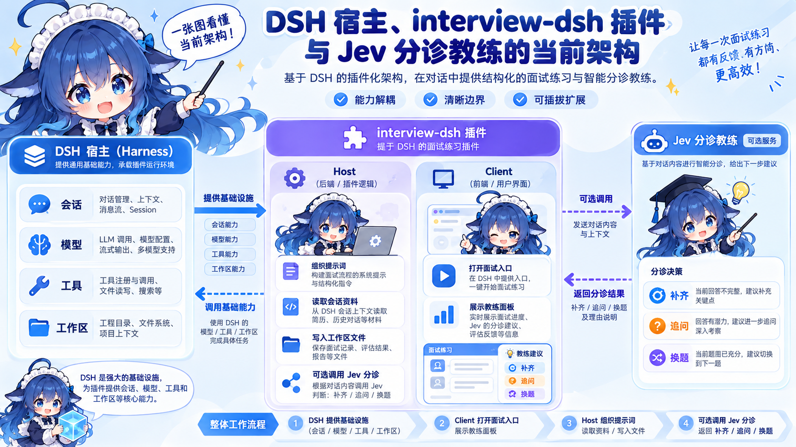

### Harness、Host、Client 分别是什么

- **Harness 是整座商场。** 它提供会话、模型、工具、系统提示、工作区和网页容器，负责让 Agent 在一个可运行的环境里持续工作。DSH 就是这座商场，插件借用它的基础设施，不另起一个聊天应用。
- **Host 是后厨。** 它跑在插件后端，接收 DSH 注入的 `agents`、`llm`、`agentDefaultModel` 和 `fs`，负责组装提示词、编排考场会话、读取日志、生成对照、调用 Jev 并把材料写进工作区。
- **Client 是柜台。** 它跑在 DSH 网页端，只挂官方 Slot，提供「面试」按钮和右侧教练面板；它不自建消息列表、不直接写文件，也不做评分判定。
- **Remote / Typert 是传菜口。** 它把 Client 能调用的服务名、方法名和参数形状固定下来，让柜台能按合同向后厨下单。
- **Cordis 是商场总控台。** 它按照插件清单解析依赖、注入服务并安排加载顺序；它本身不承载面试业务。
- **Jev 是场边分诊教练。** 它读取本次作答的覆盖档位，帮助系统选择补齐、追问或换题，不代替 DSH 的生成模型。

| 现实里的东西 | 在插件里的角色 | 它负责什么 |
|---|---|---|
| 面试园区 | DeepSeek Harness（DSH） | 提供会话、模型、智能体、工具和网页环境 |
| 一家入驻店铺 | interview-dsh 插件 | 把八股陪练能力接进 DSH |
| 后厨 | Host | 组装提示词、编排会话、读取日志、生成对照、保存档案 |
| 柜台 | Client | 挂上「面试」按钮，打开教练面板，展示卡片和状态 |
| 传菜口 | Remote / Typert | 让柜台按约定的方法调用后厨 |
| 商场总控台 | Cordis | 按清单加载服务，把依赖放进运行上下文 |
| 营业执照 | 根 package.json | 告诉 DSH 插件叫什么、入口在哪里、要带哪些文件 |
| 已经做好的菜 | lib/ | 桌面端真正加载的 JavaScript 运行产物 |
| Jev | 场边分诊教练 | 根据作答覆盖情况辅助判断下一步走向 |

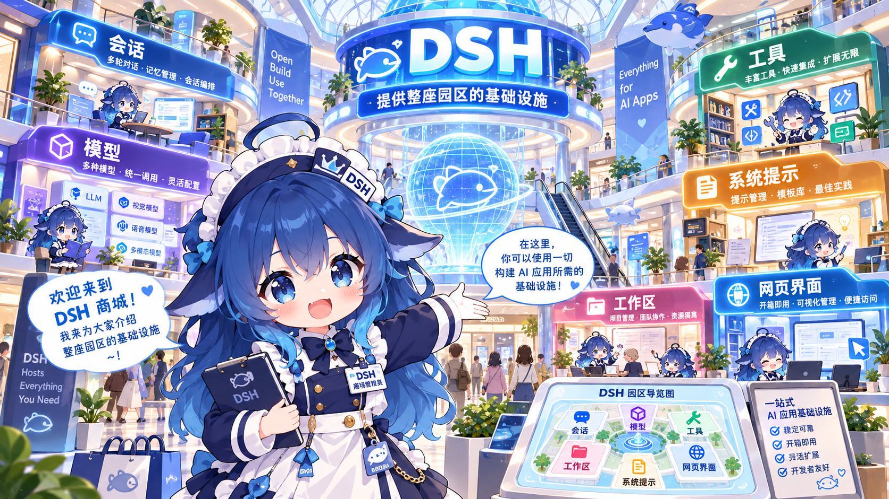

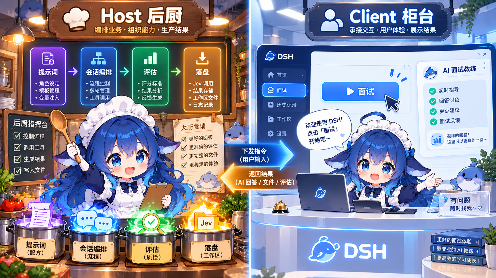

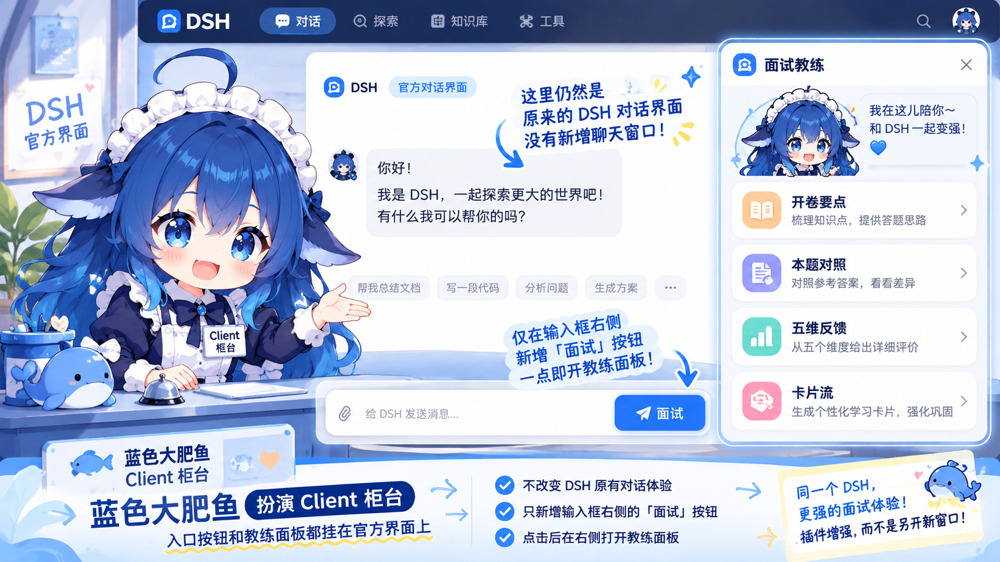

所以，插件不是“把一套聊天应用塞进 DSH”。它更像是：

> **向 DSH 借场地、借电、借厨房设备，再把自己的柜台和业务接上去。**

DSH 负责让对话正常运转；插件负责把这场对话变成八股专项陪练。

---

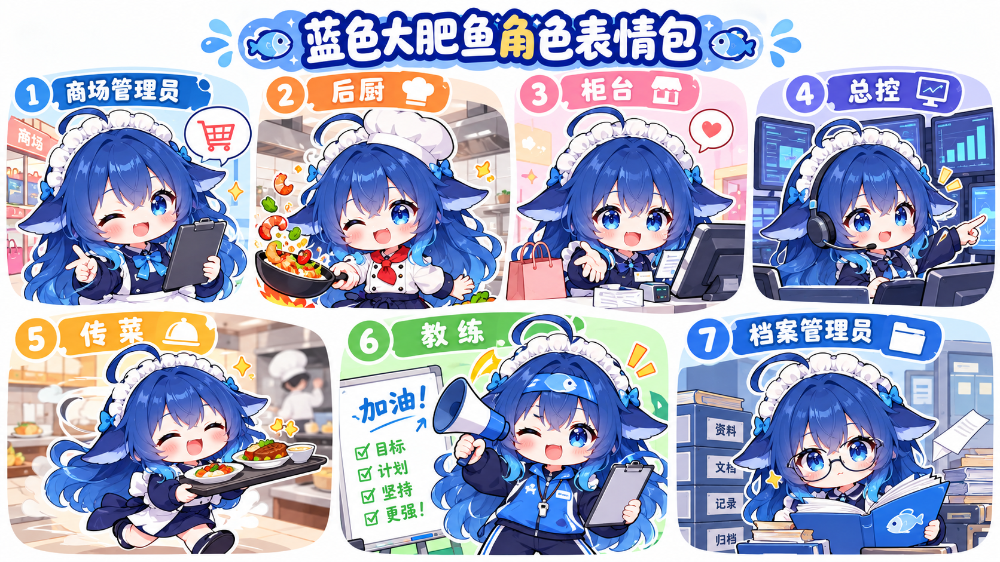

## 三、2.0.0 到底升级了什么

### 1. 从“答完再看”变成“边练边判断”

传统练习容易卡在一个尴尬位置：你答完了，系统给一段长长的评语，但下一步该继续追问，还是换个知识点，并不总是清楚。

2.0.0 引入可选的 Jev 后，系统会多一个判断环节：

- 作答覆盖不足：留在原卡，继续补齐。
- 方向对了但深度不够：沿着同一知识点追问。
- 已经达到当前目标：进入下一个正式问题。
- 同一知识点最多追问三次，避免在一个坑里搭帐篷。
- Jev 未开启、密钥未配置、连接失败或结果无法映射时，自动回到原来的对照补全流程。

Jev 做的是“这次回答落在哪一档”的判断，不负责替你写面试官台词，也不替代 DSH 当前配置的生成模型。

### 2. 开卷要点先到，反馈随后到

面试官提出问题后，右侧面板先给出本题的开卷要点。你可以先看考察范围，再组织自己的回答。

作答完成后，面板展示本题对照和五维反馈。每道题都变成一张可以切回去看的卡片，复盘时不需要在聊天记录里考古。

### 3. 继续使用你熟悉的 DSH 对话

插件不会自建消息列表、输入框或气泡。你已经在 DSH 里使用的模型和对话体验继续保留，插件只在官方入口和面板位置增加陪练能力。

这也是它适合学习群体的原因：练习八股的动作没有被拆散，学习材料也能回到项目工作区里继续使用。

---

## 四、为什么 2.0.0 值得现在就装

### 你缺的不是更多题库，而是更高频的开口次数

收藏一百篇面经，不等于能在面试里讲出一段完整答案。2.0.0 把准备动作压缩成一个入口：点「面试」、选主题、开口回答。练习的阻力越小，你每天真正说出口的答案就越多。

### 你得到的不是一次性聊天，而是一条复盘流水线

题目、开卷要点、作答、对照、五维反馈和总结会沿着同一条链路留下来。今天答错的题，不会在聊天记录里“阅后即焚”；下次打开项目，它仍然可以被找到、被重答、被追问。

### 你练的是面试现场的节奏

面试官先问，你先答；答得不完整，就在同一知识点继续追；达到目标，再换下一个正式问题。Jev 让这条节奏更像真实面试里的判断，而不是答完一题就机械翻页。

### 这是一个可以继续进化的开源底座

它现在先服务八股专项，后面可以继续扩展更多主题、提示词模板、评估维度和训练方式。你今天装的是一个插件，长期得到的是一套越来越懂技术面试的训练基础设施。

---

## 五、插件是怎样被 DSH 加载的

一份 TypeScript 源码不能直接成为 DSH 插件。桌面端认的是插件根目录里的清单，以及已经构建好的 lib/。

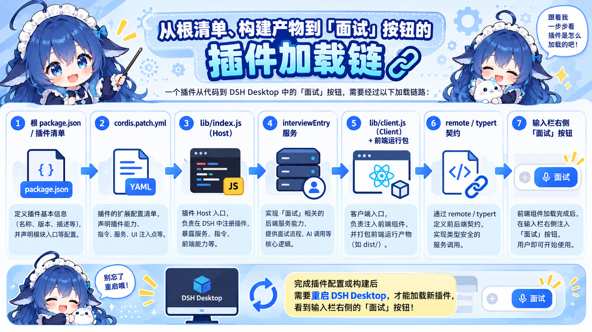

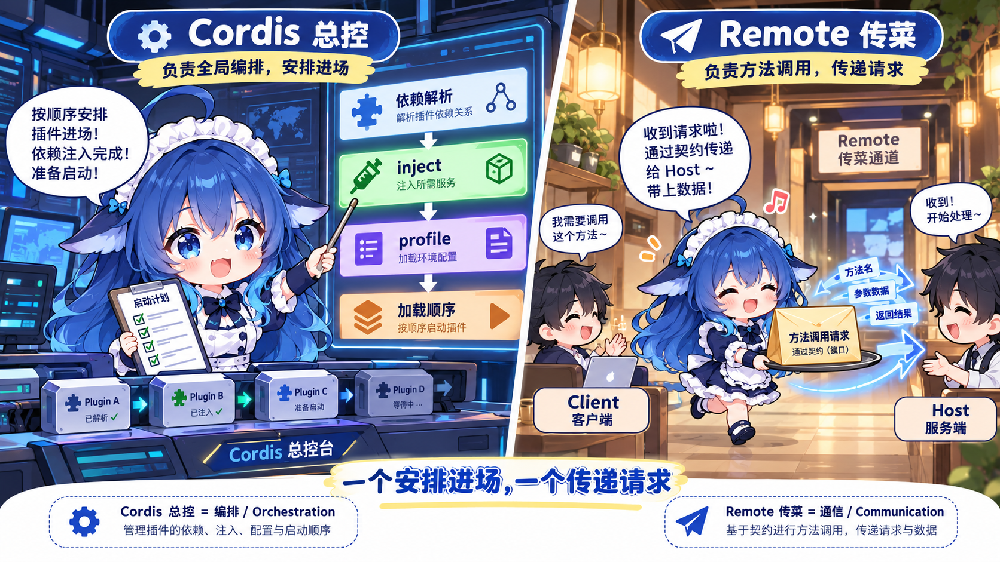

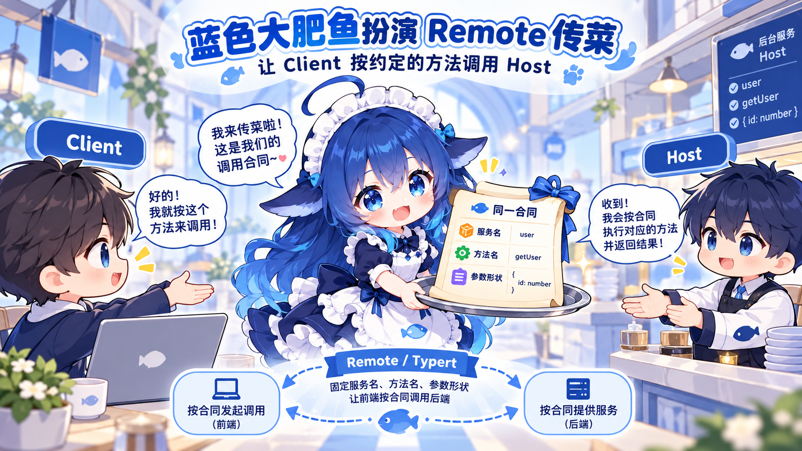

### 第一步：根清单登记店铺信息

package.json 会告诉 DSH：

- 插件名称是 `interview-dsh`，并与 `cordis.patch.yml` 里的 `id`、`name` 保持一致。
- `main` / `exports["."]` 指向 Host 的 `lib/index.js`。
- `exports["./client"]` 指向 Client 的 `lib/client.js`。
- `exports["./typert"]` 指向 Host 与 Client 共用的方法描述 `lib/typert.host.js`。
- `dsh.bundle.patch` 指向 `cordis.patch.yml`，把插件插入对应 profile 的加载表。
- `dsh.client.platform` 为 `web`，`dsh.client.inject` 声明 Client 需要的官方前端运行包。
- `files` 把 `lib`、补丁、README 和许可证带进发布包。

补丁文件中的 id 和 name 也必须与包名一致：

    - insert:
        - id: interview-dsh
          name: interview-dsh

这张清单就是插件的“营业执照”。没有它，桌面端不知道该找谁，也不知道先开后厨还是先摆柜台。

### 第二步：构建出桌面端真正要吃的 lib/

开发时写的是：

- backend/src/infra/dsh/：Host 适配。
- frontend/src/infra/dsh/：Client 适配。
- backend/src/typert.host.ts 与前端 remote 描述：传菜口的合同。

执行 npm run build 后，桌面端读取的是：

- lib/index.js
- lib/client.js
- lib/typert.host.js

桌面端不会替你编译 TypeScript，也不会直接运行 backend/、frontend/ 源码。源码是厨房备菜区，lib/ 才是可以端上桌的成品。

### 第三步：重启后先开后厨，再摆柜台

DSH Desktop 完全退出并重新打开后，加载顺序大致是：

1. DSH 先准备自己的基础服务，例如 agents、llm、agentDefaultModel 和 fs。
2. Cordis 读到插件补丁，加载 lib/index.js。
3. Host 根据 inject 取到所需服务，执行 apply。
4. Host 把 interviewEntry 服务挂进运行时。
5. DSH 再加载 lib/client.js 以及官方前端运行包。
6. Client 执行 apply，在输入栏右侧挂上「面试」按钮，并准备好 shell.overlay 面板。
7. Client 通过 remote 挂上与 Host 相同的方法描述。

一句话概括：

> **先把后厨接通，再把柜台打开，最后把传菜单对齐。**

因此，安装后必须完全重启 DSH Desktop。看到输入栏右侧出现「面试」，才说明插件已经从清单、Host、Client 一路走通。

---

## 六、点击「面试」之后，整条业务链路怎样走

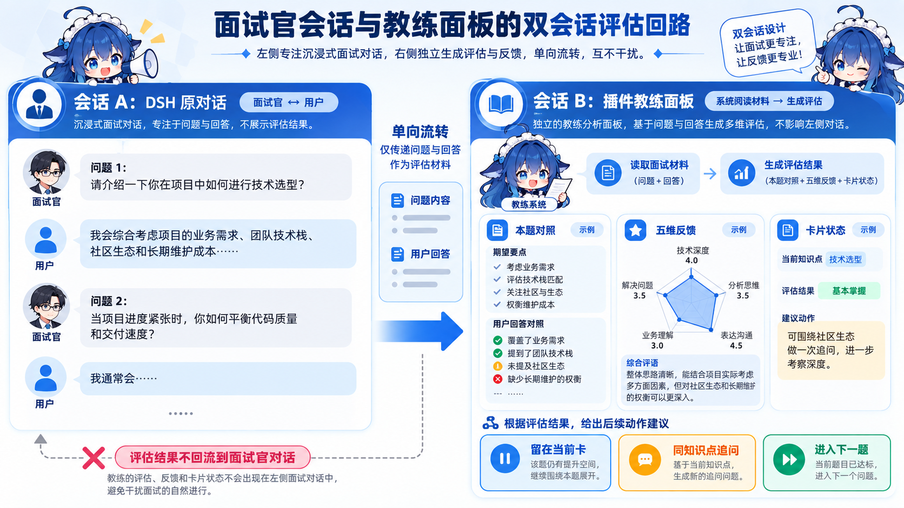

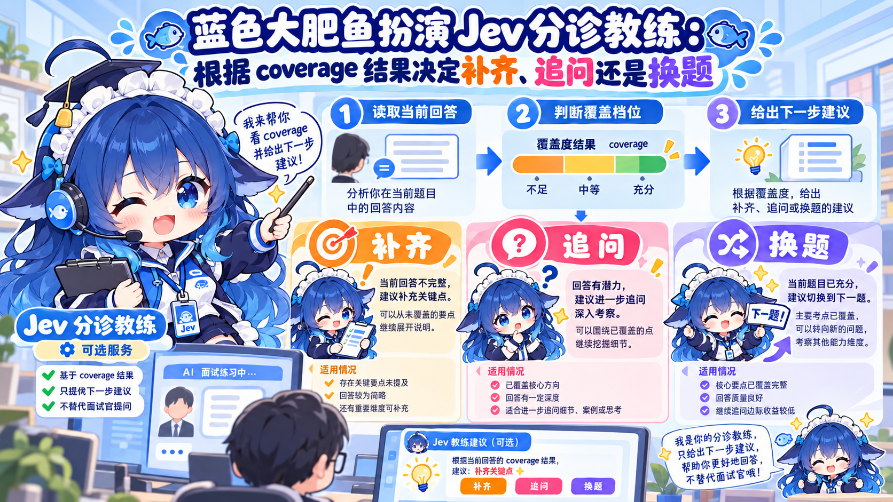

当前实现把一场面试拆成两条互相隔离的路径：会话 A 是 DSH 原对话，负责让面试官自然提问和接收你的回答；会话 B 是插件教练面板，负责读取本轮材料、生成对照、展示反馈和承接 Jev 的 coverage 结果。A 的问答材料可以单向交给 B，但评估结果不会回写成面试官气泡。

### 1. 点击按钮只打开入口面板

按钮的任务很克制：打开插件面板。

它不会偷偷新建聊天，也不会把你正在写代码的会话改造成考场。主题、难度和面试设置都在入口面板完成。

### 2. 确定项目归属，再创建考场会话

开始面试时，Client 会确认当前工作区，并优先在项目分组下新开考场会话。如果当前宿主会话本身就是已经结束一轮的插件考场，则复用这条会话开启新一轮。

这一步很重要：面试记录跟着项目走，后续的问答卡、汇总和总结才能在同一个工作区里找到。当前实现创建考场会话时优先带上 `workspaceId`，让会话进入项目分组；只有拿不到工作区时，才退回用 `cwd` 创建。

### 3. Host 把面试官人设交给这条考场会话

Host 通过 DSH 提供的 agents 能力，为考场会话挂上面试官角色和当前轮次需要的提示词。

面试官的内容口径来自项目里的面试官提示词模板。适配层负责把能力交给正确的会话，不在适配层临时手写一套平行人设。

### 4. 面试官在原对话里开口

开始本场时，Client 只向考场会话发送一次可见开场句：

> 开始本场八股专项模拟面试。

之后的问题、追问、提示和换题，都由 DSH 原来的对话继续完成。知识链、评分提示和结构化 JSON 只放在系统段或插件面板里，不挤进用户能看到的聊天气泡。

### 5. 用户作答，面板开始看守这一轮

你在 DSH 原输入框里回答。Client 观察考场会话的轮次状态，Host 读取需要的会话材料，再调用 DSH 的模型能力生成本题对照。

如果 Jev 已开启，它会在这一步辅助判断作答覆盖档位。这个结果只影响卡片判断和下一步编排：

- 继续留在当前卡；
- 在同一知识点下开追问；
- 达到目标后进入下一个正式问题。

它不会把自己的判断塞回面试官气泡，也不会替换 DSH 当前使用的生成模型。

### 6. 面板把结果整理成可回看的卡片

一张题卡会逐步拥有：

- 题目；
- 开卷要点；
- 你的作答；
- 本题对照；
- 五维反馈；
- 追问编号与当前状态。

你可以在卡片流里左右切换，也可以进入同一面板里的详情状态查看完整内容。旧卡不会因为新题出现就消失，正在生成的新题会显示生成状态。

### 7. 结束本场，先收尾，再落盘

点击「结束本场」后，插件会先停掉轮次看守，撤下本轮知识链，再让面试官完成一次固定收尾。

随后 Host 通过 DSH 的工作区文件能力，将本轮材料写入：

- 每轮问答卡；
- qa.md 问答汇总；
- summary.md 本轮总结。

这些文件属于当前项目和考场会话，可以拿去继续整理成自己的复习资料。Host 通过 DSH 提供的 `ctx.fs` 写入 `.dsh-interview/<考场 sessionId>/round-<n>-<slug>/`，每轮保存 `session.json`、`cards/<id>.md`、`qa.md` 和 `summary.md`；会话根目录另有 `index.json` 标记进行中或已结束。Jev 的开关与密钥状态写在同一工作区的 `.dsh-interview/config/jev.json`，只在连通成功后落盘，前端不会拿到密钥明文。面板回到入口，同一条考场会话也可以再开一轮。

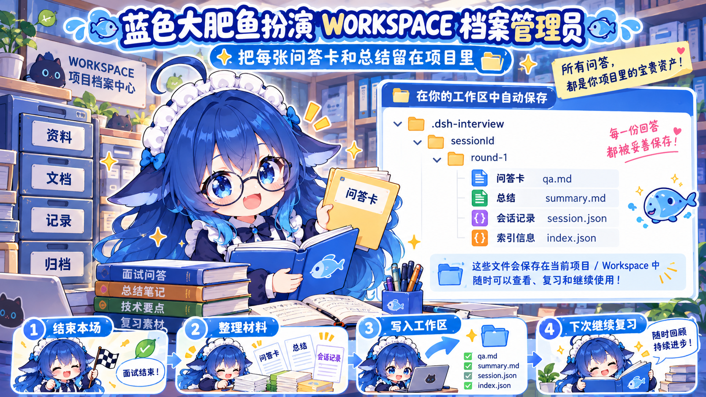

---

### 这套边界为什么重要

- Host 只在 `backend/src/infra/dsh/` 接触 DSH SDK；领域服务不依赖 DSH，避免业务规则被宿主 API 绑死。
- Client 只在 `frontend/src/infra/dsh/` 使用官方 Client API；功能组件通过 port 调用共享契约，不自建消息列表、输入框或气泡。
- 文件写入统一经过 Host 的 `ctx.fs`，前端不直接写磁盘，路径解析也不依赖进程内缓存。
- Jev 是可选的 coverage 分诊服务，不替换 DSH 当前生成模型；关闭、未配置、连接失败或结果无法映射时，流程回退到原有对照补全。

## 七、为什么它适合练八股

### 不用离开编码环境

你可以在正在写 Java、改 SQL、看 Redis 配置的 DSH 工作区里直接开始练习。练习和项目属于同一个上下文空间，复盘材料也能回到项目目录。

### 不是背题库，而是练回答路径

主题可以覆盖 Java、MySQL、Redis、消息队列、分布式系统设计等常见方向。面试官按主题和难度动态出题，真正训练的是“听到问题后，怎么组织一段能继续追问的答案”。

### 每一道题都能留下反馈

开卷要点帮助你看清考察范围，对照和五维反馈帮助你看清缺口，Jev 帮助系统决定这道题该补、该追，还是该换。练习结束后，材料还会落成 Markdown，下一次复习可以直接接着看。

### 适合反复练，不怕答得不完整

一点没答上，不会立刻把你扔进下一题；缺口较大时，会留在原卡继续补。已经把同一知识点追到上限，就换一个正式问题，避免练习变成“同一题无限续杯”。

---

## 八、一个开源项目，怎样做成可持续的产品

开源的意义，是先把真正有用的能力交到用户手里；商业化的意义，是让项目有预算持续维护、持续接入新能力、持续服务更多学习者。这个项目可以形成一条清晰的收入路径：

| 方向 | 用户得到什么 | 项目的收入来源 |
|---|---|---|
| 开源核心 | 免费使用基础八股陪练、面板和本地复盘链路 | 扩大用户规模、积累口碑和贡献者 |
| Jev 与高级评估 | 更细的能力分档、更多评估策略、更高频的调用额度 | 订阅费或按调用量计费 |
| 个人 Pro 能力 | 自定义面试官、专属主题、长期学习记录和高级报告 | 个人会员或增值包 |
| 团队与机构版 | 私有部署、团队题库、统一学习进度、权限和数据管理 | 训练营、学校和企业的授权费、服务费 |
| 内容与服务 | 主题课程、专项题卡、真人模拟面试和求职训练 | 课程收入、内容包收入和陪练服务费 |
| 社区与生态 | 赞助、联合活动、插件生态合作 | GitHub Sponsors、品牌合作和生态分成 |

这套模型不是一上来就收门票，而是让免费用户先获得明确价值，再为更强的评估、更完整的内容、更稳定的服务和团队能力付费。**开源核心负责把人带进来，专业能力和服务负责把项目养起来。**

换句话说，这个项目的盈利方式很清楚：基础插件免费扩大影响力，高级评估和个人 Pro 形成订阅收入，训练营、学校和企业版形成授权与服务收入，课程、题卡和真人陪练形成内容收入。只要用户愿意持续练习，项目就有持续提供价值、持续获得收入的空间。

所以，给项目点一个 Star 并不是“顺手收藏一个仓库”这么简单。Star 会帮助它被更多准备面试的人看到，会增加贡献者和合作机会，也会让后续的 Pro 能力、课程内容和团队服务有真实的用户基础。

如果你正在练 Java、MySQL、Redis、消息队列或分布式系统，欢迎直接试用；如果你愿意让它继续变强，欢迎在 [GitHub 项目主页](https://github.com/jiangnuonnuo/interview-dsh-plugin) 点 Star、提 Issue、提交 PR。

---

## 九、现在就把 DSH 变成你的八股陪练场

当前对外版本是 **2.0.0**。把下面这条命令复制到 DSH Desktop 使用的环境里：

    npx dshpub add jiangnuonnuo/interview-dsh-plugin --ref 095cd540953d405a9140751e4ceeb1e168160208 --profile web

安装完成后，完全退出并重启 DSH Desktop。回到项目工作区，看到输入栏右侧的「面试」，就可以开始第一场。

如果你已经安装旧版，先卸载，再安装 2.0.0：

    dsh plugin --profile web remove interview-dsh
    npx dshpub add jiangnuonnuo/interview-dsh-plugin --ref 095cd540953d405a9140751e4ceeb1e168160208 --profile web

主题选一个，难度定一个，先回答第一问。

**八股不是背到会，而是问到能答、追到不慌、复盘还能找到。**

欢迎来到 interview-dsh：你的 DSH 八股专项陪练搭子。

**项目地址：[https://github.com/jiangnuonnuo/interview-dsh-plugin](https://github.com/jiangnuonnuo/interview-dsh-plugin)**

如果它帮你把一道题讲清楚了，请在 GitHub 点一个 Star。下一次版本的更强面试官，可能就从你的这一颗 Star 开始。
