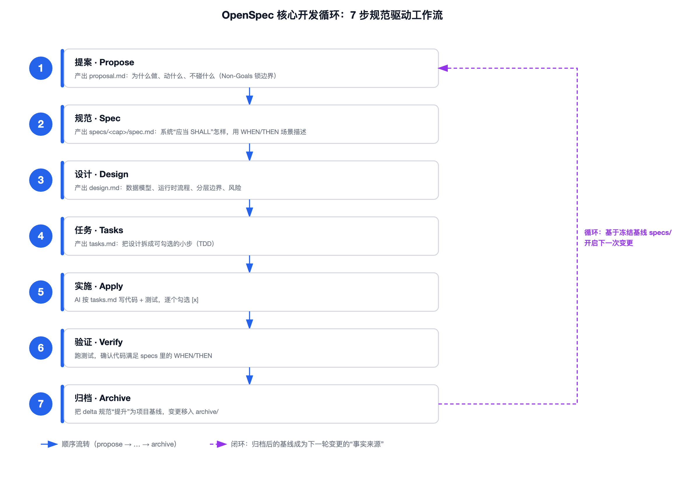
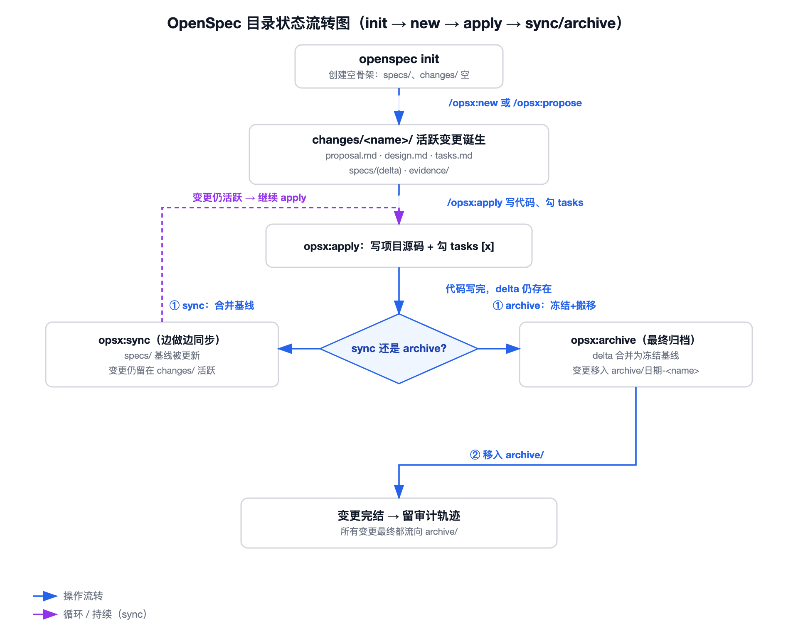
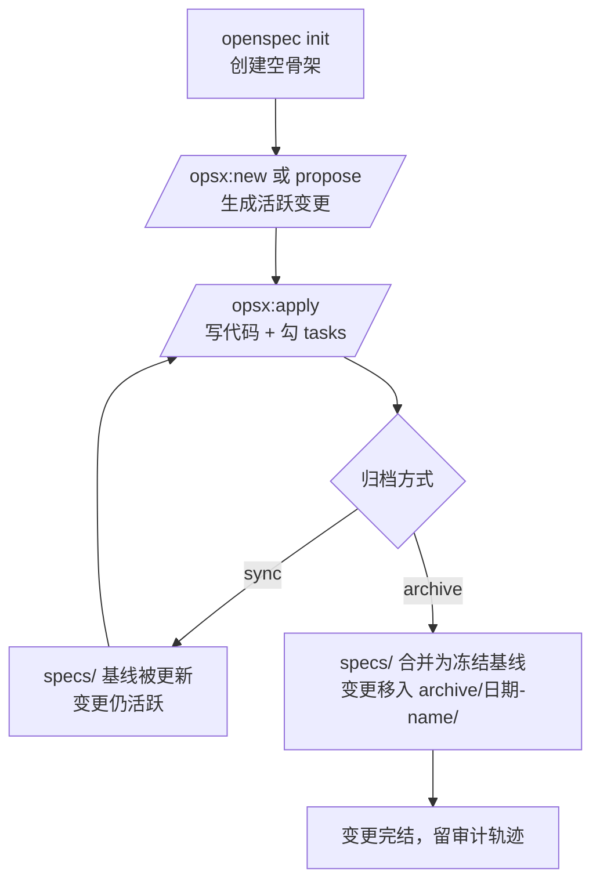
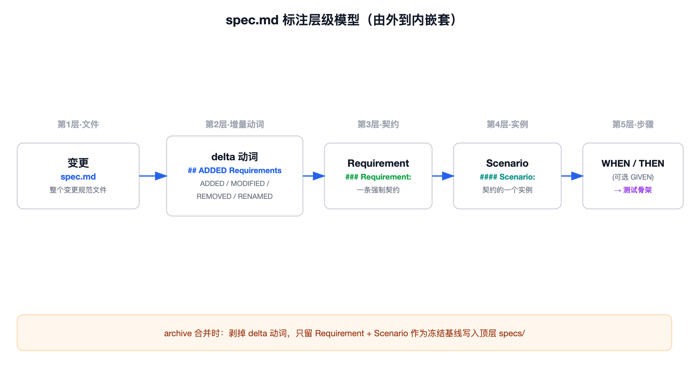
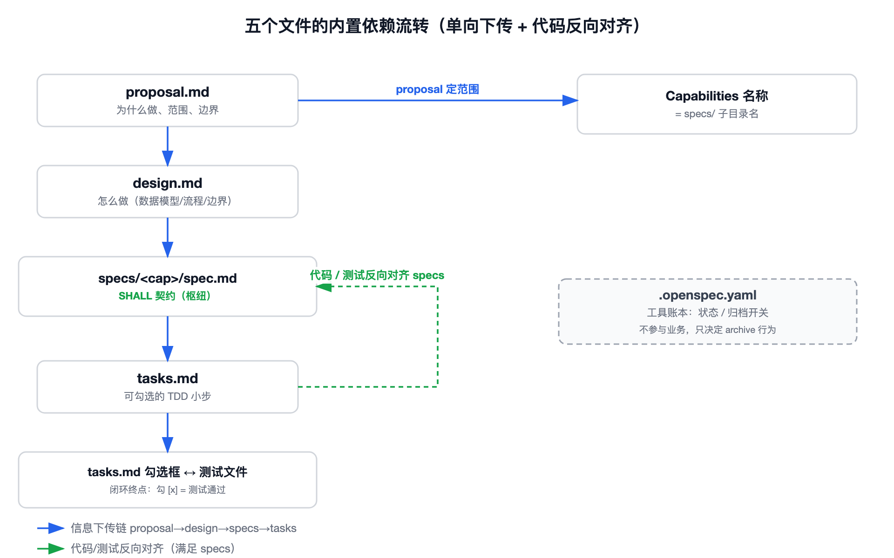
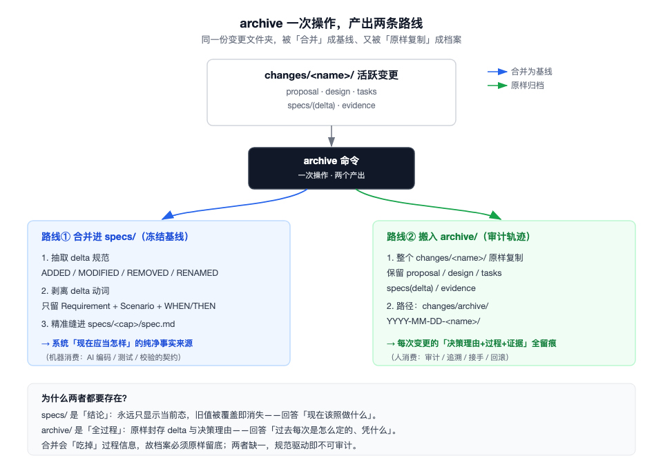
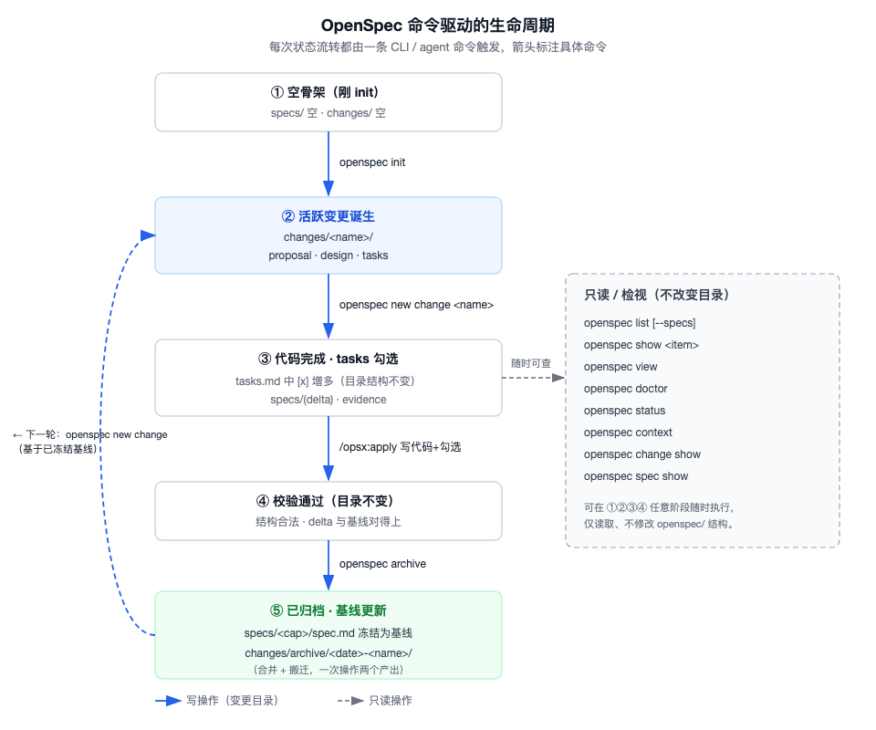
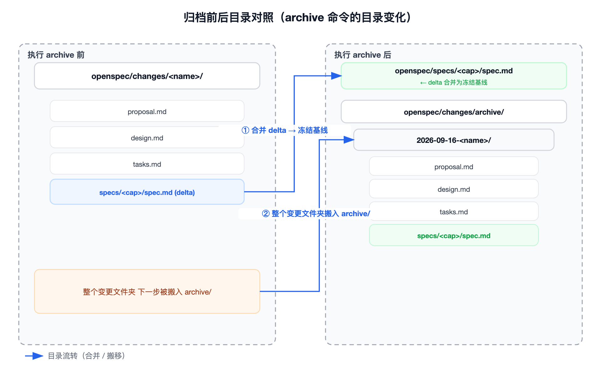

# OpenSpec（SDD 规范驱动开发）完全指南


> 如果你是一个重点的 AI 编程领域的开发者，难免会遇到AI执行的指标偏移的问题，执行过程不可控，结果不可控，记录决策无记录，甚至在没有了解任何业务需求的背景下，
> AgentCode 直接接手了项目开发，使得整个项目的开发周期、过程，以及收尾、维护都带来不小的难度。
> 可以和我一起来学习 OpenSpec skill ，规范驱动开发的设计技能
---

## openspec 技能是什么？为什么存在这个技能？

### 1，openspec skills 的定义、SDD 开发流程、它带来的思想

**OpenSpec 是什么 ？**

OpenSpec 是一个**面向 AI 编码助手的"规范驱动开发（Spec-Driven Development，SDD）"框架**。它本质上是一套约定 + 一个命令行工具（`openspec` CLI），核心做法是：

> 用 **Markdown 文件** 当作"规范（spec）"来驱动整个软件开发，而不是靠口头需求、散落的注释或 AI 自己拍脑袋。

你在项目里建一个 `openspec/` 目录，所有"要做什么、怎么设计、怎么验收、改了什么"都写进这个目录的 Markdown 文件里。AI 助手（Cursor、Claude、CodeBuddy 等）在改代码前，必须先读这些规范；改完之后，规范会被"归档"成项目的基线事实来源。

**SDD 的开发流程（核心循环）**

传统 AI 编码容易"直接动手改代码，需求却不清不楚，过程记录也没有文档归类"。SDD 把它扭转成一个有序的闭环：

```
1. 提案(propose)  → 写 proposal.md：为什么做、动什么、不碰什么
2. 规范(spec)     → 写 specs/<cap>/spec.md：系统"应当(SHALL)"怎样，用 WHEN/THEN 场景描述
3. 设计(design)   → 写 design.md：数据模型、流程、分层边界、风险
4. 任务(tasks)    → 写 tasks.md：把设计拆成可勾选的小步（TDD）
5. 实施(apply)    → AI 按 tasks.md 写代码 + 测试，逐个勾选 [x]
6. 验证(verify)   → 跑测试，确认代码满足 specs 里的 WHEN/THEN
7. 归档(archive)  → 把本次变更的规范"提升"为项目基线，变更移入 archive/
```

下面这张图把 7 步串成一条"顺序流转 + 闭环回归"的流水线：前 6 步是单次变更的正向生产链，第 7 步归档后，冻结的基线又成为下一轮变更的"事实来源"，于是整体构成一个持续运转的规范驱动环。



归档之后，这份规范就成了项目"当前事实来源"。下一次任何改动，都要基于这份冻结的基线再写"增量规范"。

**它带来的思想（为什么值得学）**

- **规范是事实来源，不是文档附属品**：代码可以删、注释会过期，但 `openspec/specs/` 永远描述"系统现在应当怎样，当时是什么样的，应该做成什么样的"。
- **边界优先（Non-Goals）**：每次变更必须写明"不做什么"，从根上阻止范围蔓延。
- **AI 在约束内工作**：AI 不能越过 proposal 的边界、不能违背 spec 的 SHALL 契约，评审者一眼就能发现越界。
- **可审计**：每一次改动都有 proposal/design/tasks/specs/evidence 全套留存，出了问题能追溯到当初为什么这么定。
- **人和机器共读**：规范用固定关键字（ADDED / Requirement / Scenario / WHEN / THEN）写成，既人能看懂，工具也能解析成结构化模型去校验、去生成测试。

### 2，openspec 的 GitHub 开源地址、Star 星数

- **GitHub 仓库**：https://github.com/Fission-AI/OpenSpec
- **官方网站**：https://openspec.dev/
- **星标情况**：官方站点披露其已获得约 **68.4k GitHub Stars**，被 **26.5 万+** 开发者/项目使用；属于当前 SDD 领域最主流的开源实现之一。
- **一个有趣的细节（dogfooding）**：OpenSpec 这个项目**自己也是用 OpenSpec 管理的**——它的仓库里就有 `openspec/` 目录，你可以直接去 `github.com/Fission-AI/OpenSpec/tree/main/openspec` 看一份"大规模真实范例"。

---

## openspec 的架构设计

### 1，大体目录设计

下面这棵树是 OpenSpec 项目的**标准骨架**。每一个节点都有固定含义，工具靠这套结构来识别"哪里是基线、哪里是草稿、哪里是归档"。

```
openspec/
├── config.yaml                      # 项目级配置（schema: spec-driven）
├── specs/                           # ★基线规范库（事实来源，frozen）
│   └── <capability>/               #   一个"能力"一个文件夹
│       └── spec.md                 #     只有 Requirements + Scenarios，无 delta 关键字
│
├── changes/                        # ★变更工作区（活跃草稿）
│   ├── <active-change>/            #   正在开发的变更
│   │   ├── proposal.md             #     提案：Why / What / Impact / Non-Goals
│   │   ├── design.md               #     设计：数据模型、流程、边界、风险
│   │   ├── tasks.md                #     任务清单：- [ ] 勾选框（TDD 步骤）
│   │   ├── .openspec.yaml          #     变更元数据（命名/状态/跳过标记）
│   │   ├── specs/                  #     ★增量规范（delta）
│   │   │   └── <capability>/
│   │   │       └── spec.md         #     用 ADDED/MODIFIED/REMOVED/RENAMED 描述差异
│   │   └── evidence/               #     证据：ER图、决策记录、验收SQL、截图
│   │
│   └── archive/                    # ★已完结变更的坟墓（审计轨迹）
│       └── YYYY-MM-DD-<change>/    #   原样保留 proposal/design/tasks/specs/evidence
│
└── schemas/                        # （可选）自定义 spec 模板/模式
```

**逐节点说明（配生活类比）**

下面每个节点都配一个生活类比，可以帮助我们更好的理解每一个目录的关系。类比主线：**把 OpenSpec 想象成"写一本书 + 出版社三审三校"**——`specs/` 是已经出版的"定稿书架"，`changes/` 是编辑桌上的"草稿文件夹"，`archive/` 是"已完结书稿的档案馆"。

| 节点 | 角色 | 关键特征 | 生活类比 |
|---|---|---|---|
| `config.yaml` | 项目配置 | 声明 `schema: spec-driven`，可自定义规则（上下文、各产物写法约束、操作流程建议） | **出版社的"编辑手册"**：规定全社用统一字体、投稿必须含"不做什么"章节、字数上限等。不写也能印书，但写了全社风格就一致了 |
| `specs/` | **基线规范库** | 冻结的"事实来源"，只有纯净 Requirements+Scenarios，没有 delta 动词 | **书店里已上架的"定稿书"**：读者（AI/开发者）以它为准，内容不再改动；后续任何修订都基于它再出新版 |
| `specs/<capability>/` | 一个"能力" | `<capability>` 名字 = proposal 里写的 Capabilities 名，一个能力一本"册子" | **定稿书架上的一个分类格**：比如"用户系统""支付"各占一格，互不串味 |
| `changes/` | **变更工作区** | 所有进行中与已归档的变更都在这里，是日常最活跃的目录 | **编辑部的"在制稿件区"**：桌上摊着的草稿、旁边堆着的已归档稿，全在这一个区 |
| `changes/<active-change>/` | 活跃变更 | 正在开发，可被 `apply`/`sync`/`archive` 操作 | **编辑桌上正在审的"那一篇稿子"**：铅笔改、贴便签、跑校样，都发生在这一个文件夹里 |
| `changes/<active-change>/specs/` | **增量规范** | 用 delta 动词（ADDED/MODIFIED/REMOVED/RENAMED）描述"相对基线改了什么" | **给已出版书开的"修订补丁单"**：不是重写整本书，而是写"第 3 章新增一段、第 5 章删掉一句"——出版社照单改 |
| `changes/<active-change>/evidence/` | 证据 | 设计图、决策记录、验收 SQL、截图，给评审和后人留痕 | **审稿附上的"调研笔记与样张"**：为什么这么改、参考了哪张图、实测跑了什么，全塞这里备查 |
| `changes/archive/` | **归档区** | 做完的变更搬到这里，原样保留 proposal/design/tasks/specs/evidence 全部产物 | **出版社的"完稿档案馆"**：书印完，整份草稿+校样+笔记封存，将来有人质疑"当初为啥这么写"能调出来看 |
| `schemas/` | 可选模板 | 自定义 spec 的写法/校验模式（多数人用默认即可） | **可选的"专用稿纸模板"**：比如科幻社用带星际坐标栏的稿纸；不提供就用通用稿纸 |

### 1.2 完整的流转图：结构之间怎么流转

OpenSpec 把开发过程变成**目录状态的有序流转**。下面一张图讲清"经过什么操作，目录会变成什么样"。



**ASCII 流转图（备用）**

```
                         openspec init
                              │
                              ▼
                 ┌───────────────────────┐
                 │ 初始化后的空 openspec/  │
                 │  specs/ 空             │
                 │  changes/ 空           │
                 └───────────┬───────────┘
                             │  /opsx:new 或 /opsx:propose
                             ▼
                 ┌───────────────────────┐
                 │ changes/<name>/        │  ← 活跃变更诞生
                 │  proposal.md           │
                 │  design.md             │
                 │  tasks.md              │
                 │  specs/<cap>/spec.md   │  (delta: ADDED…)
                 │  evidence/             │
                 └───────────┬───────────┘
                             │  /opsx:apply（写项目源码，勾 tasks [x]）
                             ▼
                 ┌───────────────────────┐
                 │ changes/<name>/        │  ← 代码写完，规范仍是 delta
                 │  tasks.md 中 [x] 增多   │
                 └───────────┬───────────┘
                             │
              ┌──────────────┴───────────────┐
              │                               │
        /opsx:sync                      /opsx:archive
              │                               │
              ▼                               ▼
  specs/<cap>/spec.md 被更新      specs/<cap>/spec.md 被合并（frozen 基线）
  changes/<name>/ 仍活跃          changes/<name>/ ──搬入──► changes/archive/YYYY-MM-DD-<name>/
              │                               │
              └──────────────► 所有变更最终都流向 archive ◄┘
```

**Mermaid 版（若你的文档站点支持渲染）**



**节点解释（每个箭头代表什么操作、目录怎么变）**

- **`init` → 空骨架**：创建 `openspec/{specs/,changes/,config.yaml}`，此时 `specs/` 和 `changes/` 都是空的。
- **`new`/`propose` → 诞生活跃变更**：在 `changes/` 下新建 `<name>/` 文件夹，并填入 proposal/design/tasks/specs/evidence 脚手架。
- **`apply` → 写代码**：只动**项目源码**和 `tasks.md` 的勾选框，`openspec/` 结构不变。
- **`sync` → 提前同步基线**：把变更里的 delta 规范**合并进顶层 `specs/`**，但变更文件夹**留在 `changes/` 仍活跃**（用于边做边让基线反映进展）。
- **`archive` → 最终归档（最关键）**：① 把 delta 合并进 `specs/` 成为冻结基线；② 把整个 `changes/<name>/` **搬进** `changes/archive/YYYY-MM-DD-<name>/`。归档后该变更不再影响活跃规范。
- **`validate`/`list`/`show`**：只读操作，目录纹丝不动。

### 2，展开分别介绍

#### 2.1 config.yaml 是什么文件，可以约束什么？

**定位**：OpenSpec 的**项目级配置文件**，放在 `openspec/config.yaml`。它在 `init` 时生成，声明本项目使用哪种规范模式，并可以写入自定义规则。

**核心字段（实测最小结构）**

```yaml
schema: spec-driven
```

就这一行，告诉工具"本项目用 spec-driven 模式"。但 `config.yaml` 真正强大的地方在下面三个**可选**区块（默认是注释掉的模板）：

```yaml
# ① 项目上下文：AI 创建产物时会看到，等于给 AI 的"项目说明书"
context: |
  Tech stack: Java 21, Spring Boot, MyBatis
  我们采用 TDD，单元测试统一放在各模块的 src/test/ 下
  业务领域：待开发的业务服务

# ② 按产物类型自定义规则（per-artifact rules）
rules:
  proposal:
    - 提案必须包含 Non-Goals 章节
    - 提案控制在 500 字以内
  tasks:
    - 每个任务拆分不超过 2 小时工作量
  design:
    - 涉及表结构变更必须先附 ER 图

# ③ 按操作类型给 AI 的建议（operations guidance）
operations:
  apply:
    guidance:
      - 测试总结保持简洁
  archive:
    guidance:
      - 归档前先总结本次产出
```

**它能约束什么？（为什么大公司爱用）**

- **统一团队规范**：大公司不同团队写 proposal/design 风格不一，`rules` 可以强制"提案必须有 Non-Goals""任务不超过 2 小时"，新人照着模板就不会跑偏。
- **注入项目上下文**：`context` 把技术栈、约定、领域知识喂给 AI，AI 生成的规范自动贴合项目实际（比如知道测试放哪个目录）。
- **约束操作流程**：`operations` 能给 `apply`/`archive` 这类操作加上团队自己的 checklist。
- **适配私有流程**：完全可配置，不需要改 OpenSpec 源码就能把自己的研发规范"焊"进工具里。

> 一句话：`config.yaml` 是 OpenSpec 的"项目宪法"——不强写也能跑，但写上之后，整个团队的规范产出就被统一管起来了。

#### 2.2 `changes/<active-change>/` 里这 5 类文件，各自的职责和边界

一个活跃变更文件夹里通常有以下几类文件（外加 `evidence/`）。它们**职责严格分离**，不会互相串味：

> **演示示例说明**：下文逐文件讲解时，会穿插一段从真实项目摘出的「MySQL 控制面持久化」变更片段作为**演示示例**。你无需了解该业务背景——重点是看它如何组织 `proposal`/`design`/`tasks`/`specs` 这几类文件。示例里出现的 `mysql-control-plane-persistence`、`mcp_datasource` 等名字，只是那次真实任务的命名，换成你自己的业务即可。

```
changes/<active-change>/
├── proposal.md      # 为什么做、范围、边界
├── design.md        # 怎么做（方案）
├── tasks.md         # 按什么顺序做、怎么验
├── .openspec.yaml   # 工具账本（状态/开关）
├── specs/           # 系统应当怎样（契约）
│   └── <cap>/spec.md
└── evidence/        # 设计图/决策/验收留痕
```

##### 2.2.1 proposal.md - 提案文件

**定位：变更的"立项书"**。给评审者和未来的自己看——这件事值不值得做、动哪些东西、不碰哪些东西。它**没有实现细节**，只有本次变更的范围和边界。

**标准章节**：

| 章节 | 放什么 | 演示示例 |
|---|---|---|
| `## Why` | 当前痛点 | 数据源/模板散落在 App Config 和内存 Registry，无法管多数据源 |
| `## What Changes` | 具体改哪些（逐条） | 用通用 `mcp_datasource`、让 `mcp_protocol_mysql` 直接存 SQL 等 7 条 |
| `## Capabilities` | 本变更产出的能力名 | `mysql-control-plane-persistence`（后面当 specs/ 子目录名） |
| `## Impact` | 影响面（按分层） | DB 新增两表、Domain 删固定模板语义、Infra 实现 PO/Mapper… |
| `## Non-Goals` | **明确不做什么** | 不改 `data_warehouse`、不做生产迁移/RBAC、保存阶段不执行 SQL |
| `## Development Reset` | （本项目特有）开发清库策略 | 允许清空重建控制库，但保留真实 `data_warehouse` |

**存放边界（关键点）**

- ✅ 放：业务动机、范围、影响清单、明确排除项。
- ❌ 不放：具体表字段类型、代码、SQL 实现、测试代码（那些属于 design / 代码层）。
- **`Non-Goals` 不是装饰，是边界锁**。例如写"不修改 data_warehouse"，后面任何改动想碰它，评审一眼就能拦住。这就是 SDD "边界优先"思想的落点。

##### 2.2.2 design - 设计文件

**定位：技术方案书**。把 proposal 的"改什么"落地成**数据模型、运行时流程、分层边界、安全链路、风险**。是 `tasks.md` 和代码的直接依据。

**标准章节**：

| 章节 | 放什么 | 演示示例 |
|---|---|---|
| `## Context` | 现状问题回顾 | 三个结构性问题：数据源靠 App Config、MySQL Tool 未走 Gateway 绑定、模板表重复 MCP 身份 |
| `## Goals / Non-Goals` | 设计目标 + 设计层排除 | Goals：通用数据源、SQL 即协议记录；Non-Goals：不做生产迁移 |
| `## Final Control-Plane Model` | **最终数据模型字段矩阵** | `mcp_datasource` 11 字段全列出；`mcp_protocol_mysql` 字段矩阵 |
| `## Relationship` | 表/实体关系图 | `mcp_gateway_tool ─protocol_type=mysql→ mcp_protocol_mysql ─FK→ mcp_datasource` |
| `## Runtime Flow` | 关键流程逐步描述 | `tools/list` 4 步、`tools/call` 4 步 |
| `## Domain/Infra/App Boundaries` | **分层职责边界** | Domain：编排+校验链；Infra：PO/Mapper/加解密，不承载业务；App：IoC 装配 |
| `## Safety and Lifecycle` | 安全校验链路 + 状态机 | JSqlParser 责任链顺序；只有 DISABLED/ENABLED 两态，默认禁用 |
| `## Development Acceptance` | 开发期验收口径 | 清库重建、写 HTTP 基础数据 + 真实 data_warehouse 绑定 |
| `## Risks / Trade-offs` | 取舍与风险 | 密文入库增加密钥责任；逻辑关联不能用多态 FK 等 |

**存放边界**

- ✅ 放：字段矩阵、ER 关系、流程步骤、分层边界、风险权衡。
- ❌ 不放：可勾选任务清单（tasks.md）；需求契约（specs/）；代码实现（源码）。
- `design.md` 的字段矩阵，就是后面 `specs/` 里 Requirement 和代码的"母本"——三者必须保持一致。

##### 2.2.3 tasks.md - 任务清单

**定位：可执行的 TDD 勾选清单**。把 `design` 拆成带 `- [ ]` 的小步，每步应是"可独立验证"的。它是开发者的进度看板，也是归档前的验收表。

**结构**

```markdown
## 1. Schema freeze and development reset
- [ ] 1.1 冻结 mcp_datasource、mcp_protocol_mysql 的字段/类型/约束/索引
- [ ] 1.2 删除独立 mcp_mysql_template 设计
...
## 6. Real MySQL acceptance
- [ ] 6.1 启用真实 data_warehouse 数据源执行 tools/list
- [ ] 6.2 执行真实 tools/call -> JDBC -> data_warehouse 验证只读结果
...
## 7. Documentation and verification
- [ ] 7.3 执行全量 Maven 测试、OpenSpec 校验、git diff --check
- [ ] 7.4 仅全部完成后归档
```

**编号约定**：`阶段.序号`（如 `3.2`），便于在对话/评审里精确引用某一步。

**存放边界**

- ✅ 放：可勾选、可独立验证的小步；每步注明验收口径（写测试/跑真实调用/跑全量构建）。
- ❌ 不放：长篇设计说明（design）；需求契约（specs）；未拆分的巨型任务。
- **这是 SDD "规范→任务→测试"闭环的枢纽**：例如 `InMemoryMysqlRegistryTest`、`MysqlExecutionMetricsTest`、`MysqlTemplateParameterBinderTest` 这类测试文件，正是 `tasks.md` 里对应勾选框的测试落地，勾选框和测试文件一一映射。

##### 2.2.4 .openspec.yaml —— 变更元数据

**定位：OpenSpec 工具自己读的"变更身份证"**。通常不是你手写的，由 `/opsx:new` 或 `propose` 自动生成。它描述这个变更本身的元信息，**不参与业务表述**。

**默认模型（字段含义）**：

```yaml
name: add-mysql-control-plane-persistence   # 变更名（kebab-case，即文件夹名）
status: active                               # active / archived
created: 2026-09-16                          # 创建日期
schema: spec-driven                          # 使用的规范模式
# 以下两个是"归档行为开关"：
skip_specs: false        # true=纯重构无规范差异，归档时跳过 specs 合并
retire_capabilities: false # true=本变更删除了某能力全部需求，归档时删除对应 specs/<cap>/spec.md
```

**作用功能**

- `name` / `status` / `created` / `schema`：工具用来识别"这是哪个变更、活没活跃、什么时候建的、用哪套模式"。
- `skip_specs: true`：当变更是纯重构/纯文档、没有任何规范差异时，告诉 `archive` "别去合并 specs"。
- `retire_capabilities: true`：当本变更把某个能力的全部需求都删了，告诉 `archive` "归档时把 `specs/<cap>/spec.md` 整个删掉（能力退役）"。
- 这些开关决定了 `archive` 时目录到底"怎么变"——是合并进基线、还是跳过、还是删除基线。

> 它就像工具的"内部账本"：人一般不用管，但理解它能帮你搞懂 archive 的边界行为。

##### 2.2.5 `specs/<capability>/spec.md` —— 增量规范

**定位：整个变更里最权威的文件**。用 `Requirement`（系统应当 SHALL 做什么）+ `Scenario`（WHEN/THEN 场景）写成**可验收契约**。代码和测试都要对着它写、对着它验。

**模型：spec.md 里所有标注都是有固定含义的关键字（schema 字段）**，OpenSpec 工具靠它们把文档解析成结构化模型：



```
变更(spec.md)
 └─ delta 动词 (## ADDED Requirements)        ← "对基线做什么操作"
     └─ Requirement (### Requirement:)         ← "一条强制行为契约"
         └─ Scenario (#### Scenario:)          ← "该契约的一个具体实例"
             └─ WHEN / THEN (**WHEN**/**THEN**) ← "可判定的前置+断言"
```

###### 2.2.5.1 逐层拆解每个标注的含义

**① `## ADDED / MODIFIED / REMOVED / RENAMED Requirements` —— "增量动词"**

最外层的操作标记，告诉 `archive`/`sync` "这段差异要怎么处理基线"：

| 标注 | 含义 | 对基线做什么 |
|---|---|---|
| `## ADDED Requirements` | 本次**新增**的需求 | 合并时**追加**到 `specs/<cap>/spec.md` |
| `## MODIFIED Requirements` | **修改**基线已有需求 | 合并时**替换**那条（需引用原名） |
| `## REMOVED Requirements` | **删除**基线某需求 | 合并时从基线**移除** |
| `## RENAMED Requirements` | 把能力/需求**改名** | 合并时**重命名** |

在上面的演示示例中，变更目录 `add-mysql-control-plane-persistence` 下的 spec.md 整篇都是 `## ADDED Requirements` → 说明这是个**全新能力**，归档时会整体作为新基线写入顶层 `specs/`。

**② `### Requirement:` —— "一条行为契约"**

- 格式：`### Requirement: <一句话描述系统应当怎样>`
- 含义：一个**独立、可验收的能力条款**，是 spec 的最小单元。
- 强制用语：描述里用义务级关键词——`SHALL`(=MUST 强制)、`SHOULD`(推荐)、`MAY`(可选)，这是 RFC 2119 规范用语。
- 演示片段（取自上文那个「MySQL 控制面持久化」真实变更）：
  > `### Requirement: The control plane SHALL persist generic datasource records`
  > `Gateway MUST persist each datasource reference, type, JDBC address... Plaintext passwords MUST NOT be persisted or logged.`

**③ `#### Scenario:` —— "契约的一个具体实例"**

- 含义：把抽象 Requirement **具象成一个可演示的例子**。一个 Requirement 下可有多个 Scenario（正常路径 + 边界/异常）。
- 作用：Scenario 就是**测试用例的蓝图**——每个 Scenario 后面都会对应至少一个测试。
- 例如：`#### Scenario: Disabled datasource fails closed`（异常/失败关闭场景）。

**④ `**WHEN**` / `**THEN**`（可选 `**GIVEN**`）—— "Gherkin 步骤断言"**

从 BDD 的 Gherkin 语法（Given/When/Then）借来，写"可判定"步骤：

| 标注 | 含义 | 回答 |
|---|---|---|
| `**GIVEN**`（可选） | 前置上下文/初始状态 | 在某种已存在条件下… |
| `**WHEN**` | 触发动作/事件 | 当…发生时 |
| `**THEN**` | 可观测期望结果（断言） | 那么…应当成立 |

- 为什么加 `**粗体**`：这是 OpenSpec 的**解析约定**——工具靠 `**WHEN**`/`**THEN**` 把步骤切成结构化字段，方便抽取成测试骨架。不是装饰，是机器识别的边界标记。
- 演示片段：
  ```markdown
  #### Scenario: Disabled datasource fails closed
  - **WHEN** a MySQL protocol points to a datasource whose status is `DISABLED`
  - **THEN** the bound Tool is absent from `tools/list` and cannot execute
  ```
  → 翻译成测试：`Given` 某数据源状态 DISABLED，`When` 查 tools/list，`Then` 该 Tool 不出现且不可执行。

**义务强度体系（Requirement 描述里的用词）**

| 词 | 强度 | 含义 |
|---|---|---|
| `MUST` / `SHALL` | 绝对强制 | 不满足即违约 |
| `MUST NOT` | 绝对禁止 | 出现即违约（上面的演示片段就用了 `MUST NOT be persisted`） |
| `SHOULD` / `SHOULD NOT` | 推荐 | 有理由可不遵守但须说明 |
| `MAY` | 可选 | 自由裁量 |

###### 2.2.5.2 谁在"消费"这些标注？

这套标注不是给人看看而已，是被工具链消费的：

1. **`openspec validate`**：解析 Requirement/Scenario 结构，检查 delta 动词是否合法、MODIFIED 是否真引用了基线已有需求。
2. **`/opsx:apply` 写测试时**：把每个 Scenario 的 WHEN/THEN 当模板，生成测试骨架（这就是测试文件——如本例中的若干 `*Test` 文件——的来源）。
3. **`archive` 合并时**：按 `## ADDED/MODIFIED/REMOVED/RENAMED` 把内容**精准缝进**顶层 `specs/<cap>/spec.md`，并**剥掉 delta 动词**，只留纯净的 Requirement+Scenario 作冻结基线。
4. **后续变更引用时**：新变更写 `## MODIFIED Requirements` 必须指向已冻结基线的某条 `### Requirement:` 标题。

##### 2.2.6 这五个文件的内置流转图、依赖关系

五个文件不是平列的，而是**单向依赖、信息下传、代码反向对齐**的关系：



```
proposal.md  ──"为什么/动什么"──► 定 Capabilities 名字
     │                                     │
     ▼                                     ▼
design.md    ──"怎么做"──────────► specs/<cap>/spec.md（SHALL 契约）
     │                                     ▲
     ▼                                     │ 代码/tests 必须对齐
tasks.md    ──"按什么顺序做/验"──► 勾选框 ↔ 测试文件
     │
.openspec.yaml ── 工具账本（状态/归档开关），不参与业务
```

**依赖与流转要点**

- **`proposal → design → specs → tasks` 是信息下传链**：proposal 定范围 → design 定方案 → specs 定契约 → tasks 定步骤。
- **`specs` 是枢纽**：design 的字段矩阵要和它一致；tasks 的勾选框要对齐它的 Scenario；代码/测试反向满足它。
- **`tasks.md` 的勾选框 ↔ 对应测试文件** 是闭环终点：勾一个 `[x]`，就代表对应 Scenario 的测试通过。
- **`.openspec.yaml` 独立**：只被工具读，不影响上述业务四件套的内容，但决定 archive 时它们"怎么被归档"。
- **生命周期终点**：当 tasks 全勾完、validate 通过，执行 `archive`，`specs` 的 delta 被提升为顶层基线，整个变更文件夹搬进 `archive/`。此时 proposal/design/tasks/specs/evidence 全部"定格"为审计轨迹。

#### 2.3 spec ★基线规范库

**定位：项目"当前应当怎样"的唯一事实来源（frozen baseline）。** `openspec/specs/` 是 OpenSpec 的心脏——它不描述"某次变更改了什么"，而是描述"系统现在稳定成什么样"。活跃变更里的 delta 规范，最终都在 `archive` 时**合并、剥壳、冻结**成这里的纯净基线。

**基线 spec.md 的"纯净性"（与 change 内 delta 的最大区别）**

活跃变更里的 `specs/<cap>/spec.md` 长满 delta 动词（`## ADDED/MODIFIED/REMOVED/RENAMED Requirements`）；而基线里的同名文件**只保留 `### Requirement:` + `#### Scenario:` + WHEN/THEN**，没有任何 delta 动词——因为 delta 只用于"相对上次基线改了什么"，基线本身不需要"差异"二字。

**基线怎么来、怎么变**

| 时机 | specs/ 里发生什么 | 谁触发 |
|---|---|---|
| `init` 后 | `specs/` 为空（还没有任何能力） | `openspec init` |
| 第一次 `archive` | 首个能力的 delta 被整体写入，成为该能力的第一条基线 | `opsx:archive` |
| 后续 `archive` | 新 delta 按 ADDED/MODIFIED/REMOVED 精准缝进已有基线 | `opsx:archive` |
| `sync` | 提前把 delta 合并进基线，但变更仍活跃（基线"抢跑"反映进展） | `opsx:sync` |
| `retire_capabilities: true` | 该能力全部需求被删，对应 `specs/<cap>/spec.md` 整份移除（能力退役） | `opsx:archive` |

**基线被"消费"的三种场景**

1. **AI 写代码/测试的契约源**：后续变更的 `specs/` delta、本次的 `tasks.md` 勾选框，都对着基线写、对着基线验。
2. **后续变更的引用锚点**：新变更要 `## MODIFIED Requirements` 时，必须指向已冻结基线的某条 `### Requirement:` 标题——不能凭空造需求。
3. **`openspec show` / `validate` 的只读基准**：评审者和工具随时能看"系统现在应当怎样"，并校验新 delta 是否与基线冲突。

> 一句话：`specs/` 是"出版社已上架的定稿书"。读者（AI、开发者、评审者）以它为唯一准绳；任何修订都基于它再出"增量补丁"，而不是直接涂改原书。

##### 2.3.1 一个常见疑惑：archive 明明把变更搬进了 `archive/`，为什么还要"并入" `specs/`？

初学者几乎都会在这里卡住：**「`archive` 命令把整个变更文件夹搬进了 `changes/archive/`，那既然每次实现都"归档"进了 `specs/`，`changes/archive/` 存在的意义到底是什么？」**

这个疑惑的根源是**把"归档"理解成了单一动作**。实际上 `archive` 是**一次操作、两个产出**——它不是"把变更塞进 specs/"，而是同一份变更文件夹，被拆成两条完全不同的路线：

**路线① 合并（merge）—— 产出"结论"，写进 `specs/`**

把变更里的 delta 规范（`ADDED / MODIFIED / REMOVED / RENAMED`）**抽取出来**，**剥掉 delta 动词**，只留纯净的 `Requirement + Scenario + WHEN/THEN`，然后**精准缝进** `specs/<cap>/spec.md`。结果是一条"系统现在应当怎样"的冻结基线——它**主动丢弃了** proposal（为什么做）、design（怎么设计）、tasks（怎么拆的）、evidence（怎么验证的），以及"这条是新增还是修改的"痕迹。

**路线② 复制（copy）—— 产出"全过程"，搬进 `archive/`**

把整个 `changes/<name>/` 文件夹**原封不动**搬进 `changes/archive/YYYY-MM-DD-<name>/`。proposal、design、tasks、specs(delta)、evidence **全部原样保留**，连同 delta 的 diff 痕迹一起定格——留下"当时怎么想的、怎么设计的、怎么验证的"完整证据链。



**为什么两者缺一不可？看一个具体例子：把限流阈值从 100 改成 500**

| 信息 | `specs/`（合并后） | `archive/<change>/`（原样） |
|---|---|---|
| 当前阈值是多少 | 只显示 **500** | `## MODIFIED`：`- 100` / `+ 500`（能看到改之前是 100） |
| 为什么改成 500 | ❌ 没有 | `proposal.md`：压测发现 100 被打满、业务要求支撑 500 QPS |
| 怎么落地的 | ❌ 没有 | `design.md`：阈值改为配置项、接入配置中心 |
| 怎么验证的 | ❌ 没有 | `tasks.md` + `evidence/`：TDD 步骤 + 压测报告 |

**关键痛点**：半年后有人问"限流阈值为什么是 500，以前不是 100 吗？"——`specs/` 里**查不到任何痕迹**（100 已被覆盖消失），只能去 `archive/` 翻那次 change 的 `MODIFIED` 记录和 proposal 才找得到答案。

所以两条路线各回答一个不同的问题：

- `specs/` 回答「**现在该照做什么**」——写给机器（AI 编码 / 测试 / 校验）的契约，永远是去重后的当前态；
- `archive/` 回答「**过去每次是怎么定的、凭什么**」——写给人（审计 / 追溯 / 接手 / 回滚）的历史，是 per-change 的增量快照。

正因为路线①的"合并"会**吃掉**过程信息，路线②的"原样留底"才必须存在——两者缺一，规范驱动就不可审计。

> 类比收尾：`specs/` 是**法律汇编的"现行正文"**，只印当前生效条款，旧条文被覆盖即消失；`changes/archive/` 是**立法档案室的"全部议案卷宗"**，每份议案的草案、辩论、修订 diff 都原样封存。查"现在该遵守哪条"看汇编，查"这条法律当年为什么这么改"只能翻卷宗。

#### 2.4 schemas 自定义 spec 模板

**定位：`openspec/schemas/` 是"可选的规范写法模板库"。** 多数项目用 OpenSpec 内置的 `spec-driven` 默认模式就够；当你需要对 spec 的**结构、关键字、校验规则**做团队级定制时，才在这里放自定义 schema（如 `requirement-types`、`scenario-types`）。

**它能定制什么（与 config.yaml 的区别）**

`config.yaml` 的 `rules` 只是"给 AI 的软性写作建议"（例如"提案必须含 Non-Goals"）；而 `schemas/` 是**机器可校验的硬模板**——它规定 spec 里允许出现哪些 Requirement/Scenario 类型、各自必填哪些字段，工具 `validate` 时按它查。

**最小结构示例（自定义一种"性能需求"类型）**

```yaml
# openspec/schemas/requirement-types/performance.md
---
name: Performance
description: 系统在特定负载下的性能契约
inherits: Requirement
required_fields:
  - metric          # 指标名，如 p99 延迟
  - threshold       # 阈值，如 < 200ms
  - condition       # 触发条件
---
```

写好后，在 `config.yaml` 里声明采用：

```yaml
schema: spec-driven
schemas:
  - requirement-types/performance.md
```

**何时该用 / 何时不必**

- ✅ 用：团队有强约束的规范类型（安全、合规、性能、可观测性），且希望 `validate` 自动拦住"漏填字段"的 spec。
- ❌ 不必：普通业务功能变更，默认 `spec-driven` 的 Requirement/Scenario/WHEN/THEN 已足够；硬上模板反而拖慢提案。

> 一句话：`schemas/` 是"出版社可选的专用稿纸"——科幻社用带星际坐标栏的稿纸，言情社用通用稿纸。默认不提供，工具就按通用模板干活；提供了，写 spec 的人就被这套硬模板"框"住，产出更整齐、可被机器校验。


#### 2.5 核心 CLI 命令执行面板（小白必看的操作手册）

理解了文件，还要理解"敲什么命令，目录会变什么样"。先分清**两类命令**，否则很容易把 agent 命令当成 CLI 命令：

- **`openspec` CLI**：在终端直接运行的命令（本机已装 `openspec`，可通过 `openspec --help` 查看全部）。
- **`/opsx:*` agent 命令**：AI 编程助手（Cursor / CodeBuddy / Claude）里的"智能体命令"，本质是对 CLI 之上的封装——例如 `/opsx:apply` 让 AI 写代码并勾选 tasks、`/opsx:archive` 内部调用 `openspec archive`。**纯 CLI 里并没有 `apply` / `sync` / `propose`**，这些是 agent 层才有的。

下面先把**全部 `openspec` CLI 命令**按用途列全，再附 agent 命令速查，最后用一张"命令驱动的生命周期"图串起来。

**① 生命周期 / 写操作（会改变目录）**

| 命令 | 作用 | 目录变化 |
|---|---|---|
| `openspec init [path]` | 初始化 OpenSpec 骨架 | 创建 `openspec/{specs/,changes/,config.yaml}` |
| `openspec new change <name>` | 新建变更目录 + `.openspec.yaml` 脚手架 | 新增 `changes/<name>/` |
| `openspec archive [change] [-y] [--skip-specs] [--no-validate]` | **归档（最关键）**：delta 合并进 `specs/` + 搬入 `archive/` | ① `specs/<cap>/spec.md` 成冻结基线 ② `changes/<name>/` 移入 `archive/<date>-<name>/` |
| `openspec update [path]` | 重新生成/更新 instruction 文件（注入给 AI 的提示） | 更新 `openspec/` 下的指令文件 |

**② 只读 / 检视（不改变目录，可随时跑）**

| 命令 | 作用 |
|---|---|
| `openspec list [--specs \| --changes]` | 列出活跃变更或基线规范（默认列变更） |
| `openspec show [item]` | 查看某个变更 / spec 内容 |
| `openspec view` | 交互式仪表盘（specs + changes 一览） |
| `openspec change show [name]` | 以 JSON / Markdown 查看某变更提案 |
| `openspec change list` | 列出活跃变更（**已废弃**，改用 `openspec list`） |
| `openspec change validate [name]` | 校验单条变更提案 |
| `openspec spec show [spec-id]` | 查看某条基线规范 |
| `openspec spec list` | 列出所有基线规范 |
| `openspec spec validate [spec-id]` | 校验基线结构 |
| `openspec status [change]` | 显示某变更的 artifacts 完成度 |
| `openspec context` | 打印当前 OpenSpec root 的工作上下文 |
| `openspec doctor` | 报告目录关系健康度 |
| `openspec validate [item] [--all \| --changes \| --specs \| --archived \| --strict]` | 校验变更与基线结构合法性（提交前 lint 用 `--archived`） |
| `openspec instructions [artifact]` | 输出给 AI 的富化指令（artifacts / apply / archive） |
| `openspec templates` | 显示某 schema 下所有 artifacts 的模板路径 |
| `openspec schemas` | 列出可用的 workflow schemas |

**③ 配置 / 元信息（全局与实验性）**

| 命令 | 作用 |
|---|---|
| `openspec config` | 查看 / 修改全局配置 |
| `openspec schema` | 管理 workflow schemas（实验性） |
| `openspec store` | 创建 / 管理 store（本机注册的独立 OpenSpec 仓库） |
| `openspec workset` | 组合 / 保存 / 打开个人工作视图（纯本地） |
| `openspec completion` | 管理 shell 自动补全 |
| `openspec feedback <msg>` | 提交对 OpenSpec 的反馈 |
| `openspec -V` / `--version` | 打印版本号 |
| `openspec help [cmd]` | 查看某命令帮助 |

**④ agent 命令速查（随附，封装在 AI 助手内）**

| 命令 | 对应 CLI / 作用 |
|---|---|
| `/opsx:new` · `/opsx:propose` | 一键生成变更全套产物（≈ `new change` + 自动写 proposal/design/tasks/specs） |
| `/opsx:ff` | 在变更目录内补齐所有产物 |
| `/opsx:continue` | 只创建依赖链里"下一个就绪"的产物 |
| `/opsx:apply` | 写**项目源码**并把 `tasks.md` 的 `- [ ]` 勾成 `- [x]`（CLI 无此命令） |
| `/opsx:sync` | 提前把 delta 合并进 `specs/`，变更仍活跃（CLI 无此命令） |
| `/opsx:archive` | 归档，内部调用 `openspec archive` |
| `/opsx:bulk-archive` | 多个活跃变更按创建时间顺序批量归档 |
| `/opsx:verify` | 校验代码是否匹配产物 |
| `/opsx:explore` | 纯聊天探索思路，零产物 |

**命令驱动的生命周期（目录随命令流转）**

下图中每个状态节点代表 `openspec/` 当时的样子，箭头标注触发该次流转的具体命令；蓝色为"写操作（改动目录）"，灰色为"只读操作（随时可查、不改目录）"。注意 `apply` 这一步由 agent 完成（CLI 无 `apply`），其余均可纯终端驱动。



**归档前后的目录对照**



> 特殊情形：若变更删除了某能力全部需求且声明 `retire_capabilities: true`，归档时对应 `specs/<cap>/spec.md` 会被删除（能力退役）。纯架构重构无规范差异可标 `skip_specs: true` 跳过合并。

---


