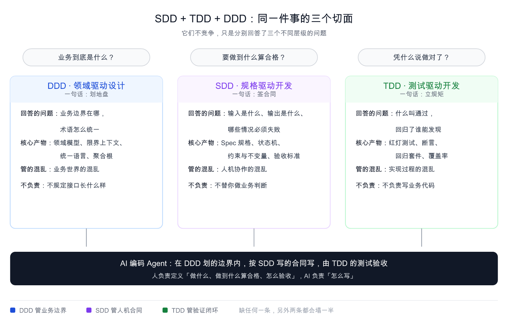
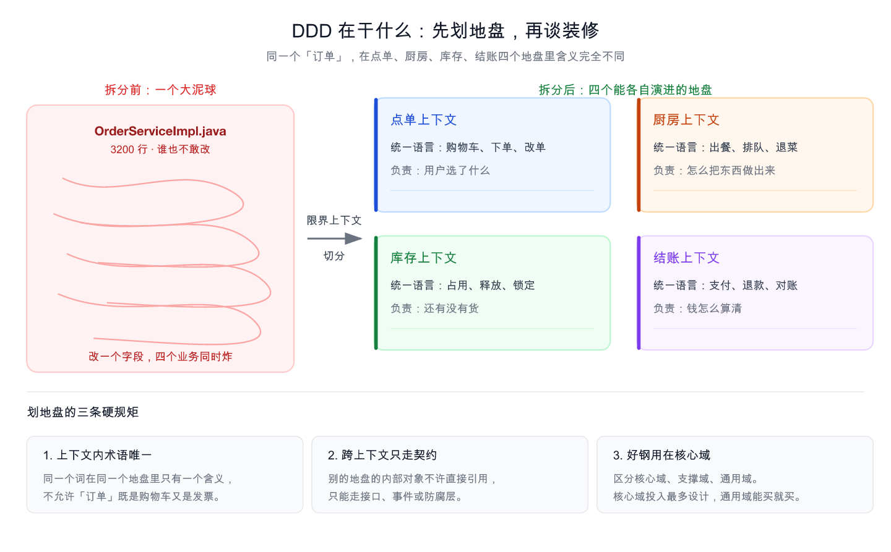
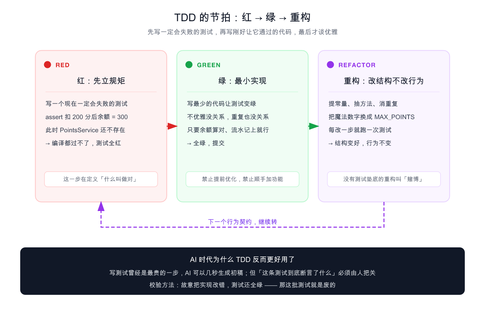
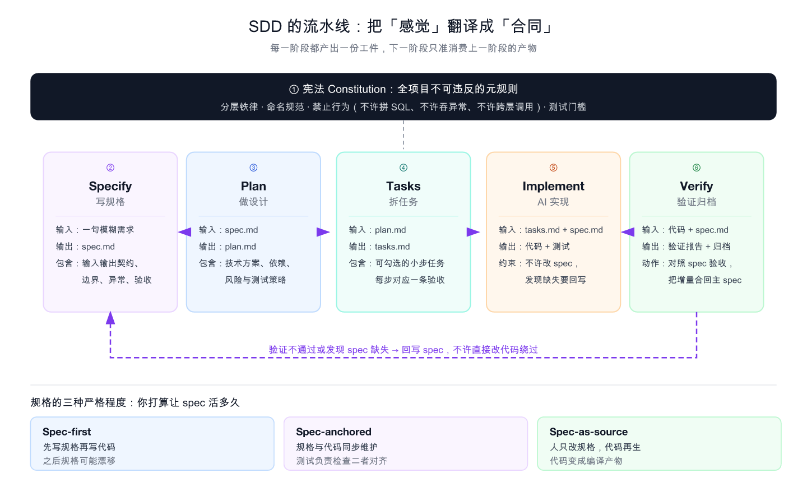
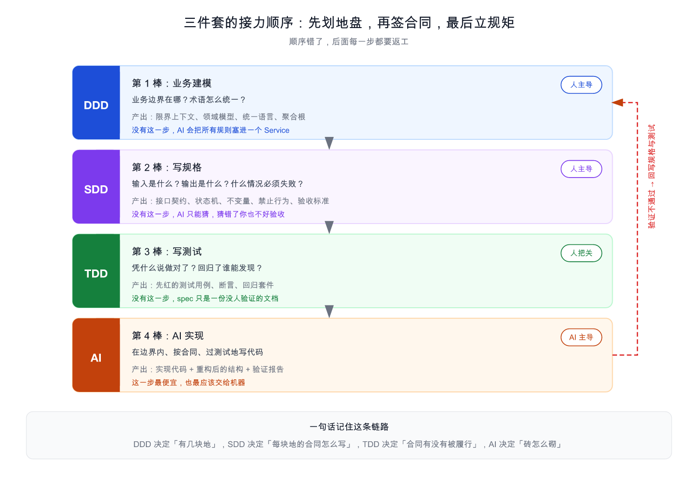
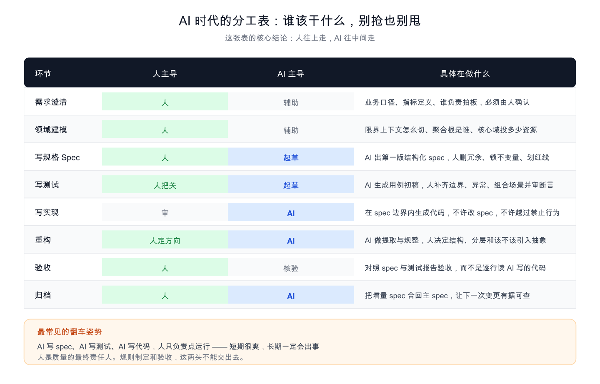
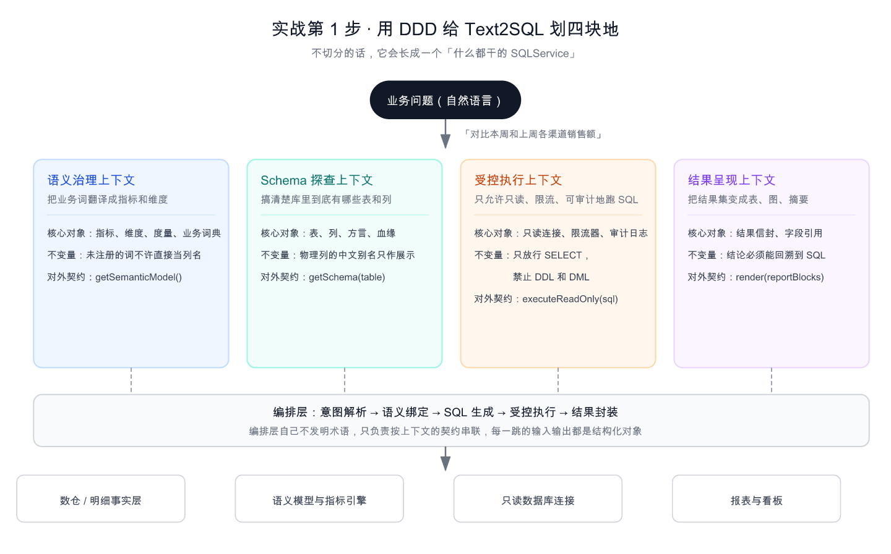
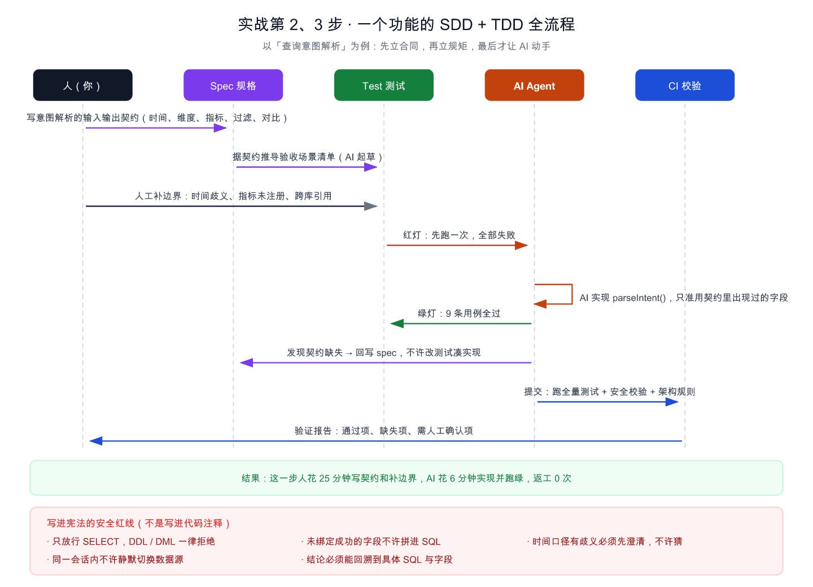
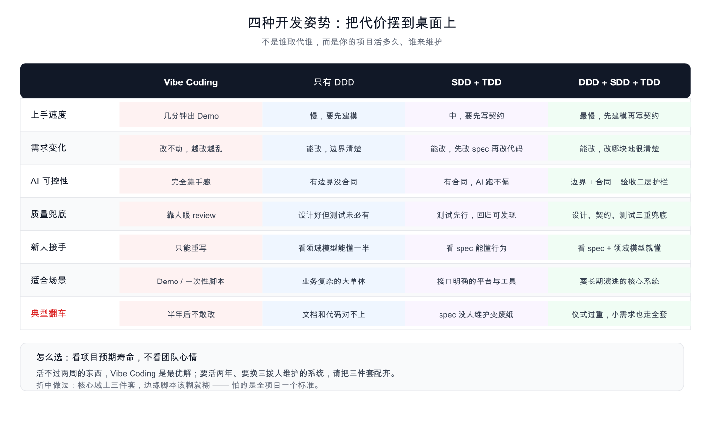
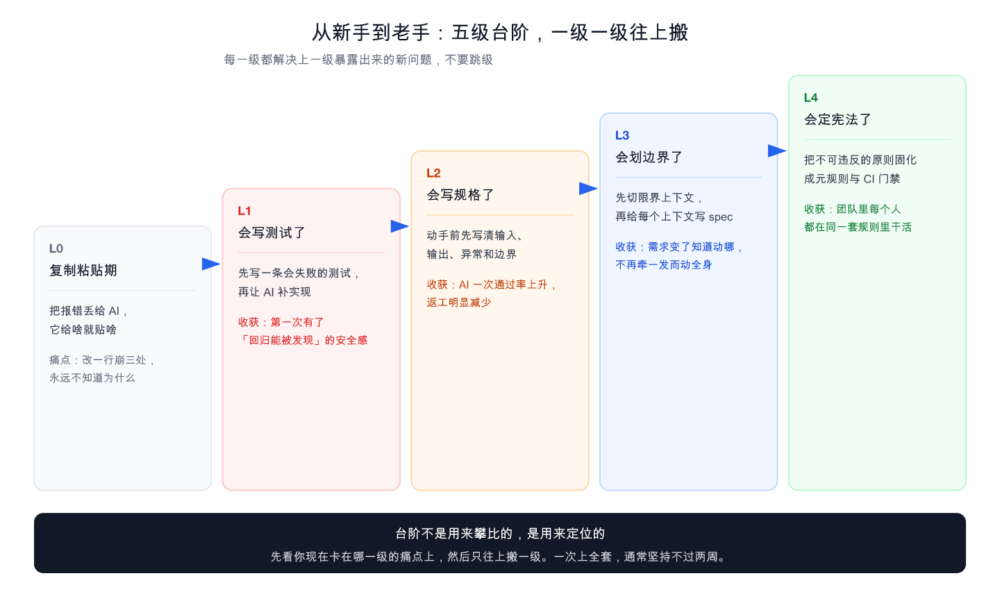

# SDD 签合同，TDD 立规矩，DDD 划地盘：AI 编程三件套从入门到上手

> 副标题：AI 把「写代码」这件事的价格打到接近于零之后，真正变贵的，是「说清楚要什么」和「证明做对了」。


---

## 一、先讲一个真实到有点扎心的场景

周五下午，产品丢过来一句话：「做一个能查报表的 AI 助手，业务同学用大白话问，它直接给数。」

你打开 AI 编程工具，把这句话原样贴进去。

20 分钟后，一个能跑的 Demo 出来了。你当场在群里发了个截图，收获 6 个赞。那一刻的爽，是真的。

三周后，需求加到了第 8 条：要支持对比周期、要按渠道下钻、要能导出、要区分口径、要加权限、要限流、要审计、要能解释「这个数是怎么算出来的」。

你再打开那个项目，发现里面只有一个 `SqlAgentService.java`，1800 行，里面塞着提示词拼装、SQL 生成、字段白名单、结果渲染和一堆 `if (question.contains("上周"))`。

你想改第 9 条需求。你盯着屏幕看了十分钟，最后关掉了编辑器。


这不是段子。这是 2025 到 2026 年大量团队的真实轨迹，行业里给它起了个名字：**Vibe Coding**，凭感觉写代码。

它的问题从来不是「AI 不够聪明」。微软研究院的 Shuvendu Lahiri 给过一个很准的说法：AI 生成的代码是**看起来合理**，不是**天然正确**。用户真正想要什么、程序实际做了什么，中间有一段语义距离。AI 编程的大部分翻车，都卡在这段距离里。

所以真正的破局点，不是换一个更聪明的模型，而是给这段距离装上三道护栏：

- **DDD** 负责：这块业务到底有几块地，每块地的术语是什么。
- **SDD** 负责：每块地的合同怎么写，什么情况必须失败。
- **TDD** 负责：凭什么说合同被履行了，改坏了谁能第一时间发现。

三道护栏立起来，AI 才能放开跑。这篇就干一件事：**把这三个缩写，从「听过」讲到「能用」。**

---

## 二、新手村：三个 D 到底在干嘛

### 2.1 一句话版本

先把结论拍在桌上：

> **DDD 划地盘，SDD 签合同，TDD 立规矩。AI 砌砖。**

如果只能记住一个比喻，记这个：**盖一栋楼**。

| 角色 | 对应 | 干什么 | 产物 |
| --- | --- | --- | --- |
| 城市规划师 | DDD | 这块地是住宅、那块是商业，路怎么修 | 规划图、地块边界 |
| 设计师 + 法务 | SDD | 层高多少、承重多少、水泥什么标号，写进合同 | 施工图纸、合同条款 |
| 监理 | TDD | 每道工序做完先验收，不合格不许进下一道 | 验收单、检查清单 |
| 施工队 | AI | 按图纸和合同把活干完 | 楼 |

你会发现一件很有意思的事：这三个角色**没有一个在比谁砌砖快**。因为砌砖这件事，现在最便宜。



三个 D 分别回答三个不同层级的问题，谁也替代不了谁：

- **DDD 问**：业务边界在哪？术语怎么统一？
- **SDD 问**：输入是什么？输出是什么？什么情况必须失败？
- **TDD 问**：凭什么说做对了？回归了谁能发现？

分不清它们，往往是因为它们总被一起提起；但它们解决的，是三个**不同层级**的混乱。

### 2.2 DDD：先划地盘，再谈装修

DDD（Domain-Driven Design，领域驱动设计）是 Eric Evans 在 2003 年那本《领域驱动设计：软件核心复杂性应对之道》里提出来的。它解决的是一个特别朴素的问题：

> 当业务需求疯狂变化时，你的系统还能不能稳住。

很多人对 DDD 的印象停留在一堆名词上——聚合根、值对象、限界上下文、防腐层。其实它的核心思想朴素到极致：**不要把所有业务规则揉进一个几百行的 Service 里，让业务对象自己对自己的行为负责，最终让「代码结构 = 业务结构」。**

拿一家餐厅来说。「订单」这个词，在前厅、后厨、仓库、收银台四个地方，压根不是一回事：

- 前厅的订单：客人选了什么、要不要加辣、能不能改单。
- 后厨的订单：第几个出、要不要退菜、占用哪个灶台。
- 仓库的订单：占了哪些料、什么时候释放。
- 收银的订单：怎么付、退多少、怎么对账。

如果你把它们塞进一张 `order` 表和一个 `OrderService`，那你迟早会写出「加个字段，四个业务同时炸」的代码。

DDD 的解法，就是给这四个地方各划一块地，叫**限界上下文（Bounded Context）**。同一块地里，一个词只有一个含义；跨地交流，只能走契约（接口、事件、防腐层），不许直接伸手进别人家院子里拿东西。



划地盘有三条硬规矩，记住它比记住名词有用得多：

1. **上下文内术语唯一。** 同一个词在同一块地里只有一个含义，不允许「订单」既是购物车又是发票。
2. **跨上下文只走契约。** 别的地盘的内部对象不许直接引用。
3. **好钢用在核心域。** 先区分核心域、支撑域、通用域。核心域（你赚钱的那块）投入最多设计，通用域（发短信、文件存储）能买就买、能抄就抄。

第三条尤其重要。DDD 最大的翻车姿势，就是给全系统每一个模块都做「标准 DDD 建模」，最后建模成本比写业务还高，团队怨声载道。**DDD 是投资，不是宗教，投在能产生复利的地方。**

### 2.3 TDD：先立规矩，再动手

TDD（Test-Driven Development，测试驱动开发）由 Kent Beck 在极限编程（XP）中推广。它只有一个节拍，三步，循环：

1. **红**：写一个现在一定会失败的测试。此时实现还不存在，它必然失败。
2. **绿**：写最少的代码让测试通过。不优雅没关系，重复也没关系。
3. **重构**：在测试全绿的安全垫上优化结构，全程不许改变外部行为。

很多人把 TDD 理解成「先写测试再写代码」，这是典型的本末倒置。**测试只是载体，TDD 的本质是「行为契约先行」**——写测试的过程，就是逼你想清楚接口怎么设计、入参出参是什么、异常怎么处理、边界在哪。

写不出一条清晰的测试，通常不是测试能力问题，是需求没想清楚。



用一个生活例子讲透这个节拍：

> 你要请人装修。**红** = 你先写一份验收单：「墙面平整度误差不超过 3 毫米，插座高度 30 厘米，共 12 个」。这份单子现在还没有任何一面墙能满足它。
>
> **绿** = 施工队照着单子把活做完，不管他中间用了什么土办法。
>
> **重构** = 你看活干完了，让他把线槽走直、把多余的材料清走，但插座数量和高度一个都不能动。

如果反过来，先装修再补验收单，你猜会发生什么？你会对着一面已经贴好瓷砖的墙说「这里其实该有个插座」，然后砸掉重来。

TDD 诞生二十多年，公认有效但普及率一直不高，卡在三个现实问题上：

1. **上手门槛高。** 新手既想不清用例，又控制不住写实现的冲动，很容易写成「先写代码再补测试」的伪 TDD。
2. **前期效率低。** 业务逻辑简单时，写测试的时间比写实现还长。
3. **维护成本高。** 需求一变，测试跟着改，改不好就变成「业务对了，测试挂了」。

有意思的是，**AI 恰好把这三个痛点都削平了**。测试用例的初稿、业务代码的实现，都可以让 AI 起草，人只需要定义行为规则、把控断言有效性。TDD 从「耗时的开发规范」变成了「低成本的质量保险」。

但有一件事 AI 削不平：**这条测试到底断言了什么，必须由人负责。**

校验方法极其简单，推荐每个人都试一次：故意把实现代码改错，跑一遍测试。如果测试还全绿，那这批测试就是废的。AI 生成的测试里，这种「恒真断言」非常多，比如测积分扣减只断言「方法没抛异常」，却不断言「余额真的变少了」。

### 2.4 SDD：先签合同，再让 AI 动手

SDD（Specification-Driven Development，规格/规范驱动开发）是这三个里最年轻的一个，也是 AI 时代冒出来的新答案。

一句话讲透：**先定义系统必须是什么样，再动手写代码。**

它的思想源头并不新——Bertrand Meyer 的**契约式设计（Design by Contract）**：软件模块之间通过明确的契约交互，前置条件、后置条件、不变式，构成契约的三要素。TCP、HTTP、Raft、Kafka 这些撑起整个互联网的基础设施，全都是先有规格、再有实现。

新在哪？新在**这份合同的读者从人变成了 AI**。

在没有 AI 的年代，SDD 门槛极高：你得有很强的抽象能力，还得懂形式化方法，基本只有顶级架构师玩得转。现在不一样了——AI 可以几秒钟把一句模糊需求推导出结构化的第一版规格，人只需要做三件事：**删冗余、改错误、锁死不变量和禁止行为。**



一份能拿去喂 AI 的规格，建议长这样（六个维度，缺一个 AI 就可能跑偏）：

```markdown
## 功能标识：intent-parser
**核心职责**：把一句自然语言问句，解析成结构化的查询意图。

### 输入契约
| 参数 | 类型 | 约束 | 说明 |
| --- | --- | --- | --- |
| question | String | 非空，长度 ≤ 500 | 用户原始问句 |
| dataSourceId | String | 非空，必须已注册 | 数据源标识 |

### 输出契约
- 正常返回：QueryIntent{ timeRange, dimensions, metrics, filters, comparison }
- 异常返回：抛出 AmbiguousTimeException / MetricNotRegisteredException

### 业务规则
1. 时间词必须解析为绝对区间（「上周」→ 2026-08-24 ~ 2026-08-30）。
2. 「上周」在有对比语境时指上一个完整自然周，无对比语境时指最近 7 天。
3. 指标名必须在语义模型中已注册，未注册不许猜。

### 不变量
- 输出的 timeRange 永远不为 null，且 start ≤ end。
- 任何字段都不允许出现未在语义模型注册的物理列名。

### 明确禁止行为
- 不许直接拼接 SQL 字符串。
- 不许在未确认数据源时静默切换库。
- 时间口径有歧义时，不许猜，必须进入澄清流程。

### 验收标准
- 9 条用例全绿（正常 4、边界 3、异常 2）。
- 覆盖率 ≥ 85%，且核心分支 100%。
```

注意最后两条：**「明确禁止行为」和「不变量」是 SDD 的灵魂。** 正面描述告诉 AI 该做什么，禁止清单告诉 AI 哪里是红线。AI 天生倾向于只写 happy path，你不写禁止项，它大概率不会主动加。

规格还有三种严格程度，选哪种取决于你的系统要活多久：

| 严格程度 | 含义 | 适合 |
| --- | --- | --- |
| Spec-first | 先写规格再写代码，之后规格可能漂移 | 原型、短期项目 |
| Spec-anchored | 规格与代码同步维护，测试负责检查对齐 | 大多数生产系统 |
| Spec-as-source | 人只改规格，代码由系统重新生成 | 协议、SDK、高度确定的中间层 |

**别一上来就冲 Spec-as-source。** 那条路很酷，但对规格质量的要求也极高，规格写歪了，代码会整齐划一地一起歪。

---

## 三、进阶级：三个怎么配合，谁先谁后

### 3.1 顺序不能反

三件套不是并列的三个选项，是一条**接力链路**：



顺序为什么不能反？把每一棒抽掉，你就能看见后果：

**去掉 DDD，直接写 SDD。** 你会写出一份非常严谨、非常详细、但边界划错的合同。指标口径、字段绑定、SQL 生成、结果渲染全部混在一个规格里。三周后这份规格自己就变成了一座屎山，只是这座屎山有目录。

**去掉 SDD，只有 DDD + TDD。** 你的领域模型很漂亮，限界上下文切得很清楚，测试也红绿跑得很欢。但你和 AI 之间没有共同的事实源——你跟它说「按那个口径来」，它不知道「那个」是哪个。每次对话都要重新解释一遍技术约束，这些约束最后都丢在了聊天记录里。

**去掉 TDD，只有 DDD + SDD。** 你有一份漂亮的规格，没人验证。两周后代码和规格开始漂移，一个月后规格变成废纸。这是最常见的一种残缺，因为它前期看起来「完全没问题」。

一句话总结这条链路：

> **DDD 决定「有几块地」，SDD 决定「每块地的合同怎么写」，TDD 决定「合同有没有被履行」，AI 决定「砖怎么砌」。**

### 3.2 人和 AI 到底谁干哪一段

这是落地时争论最多的问题。直接给一张分工表，别再靠感觉抢活：



三条判断标准，帮你快速定位该不该交给 AI：

1. **这件事错了你能不能验收？** 能验收的交给 AI，不能验收的自己来。所以「写实现」可以交，「定口径」不能交。
2. **这件事的上下文在不在仓库里？** 在仓库里的 AI 看得见，在业务方脑子里的 AI 看不见。所以「领域建模」要人先想清楚。
3. **这件事错了代价多大？** 代价可逆的放手干，代价不可逆的（资金、权限、数据删除）必须人签字。

最常见的翻车姿势只有一个：**AI 写规格、AI 写测试、AI 写代码，人只负责点运行。**

短期确实很爽。但你要清楚，这个流程里人已经不再提供任何信息增量了——三份东西都是同一个模型的输出，它们会一起错，而且错得自洽。

> 人是质量的最终责任人。规则制定和验收这两头，交出去的时候，责任交不出去。

---

## 四、老手段位：AI 时代它们到底是什么地位

### 4.1 先摆数据：AI 把产出和偏差一起推高了

AI 编程提效是真的，副作用也是真的。把几个公开研究摆在一起看，结论比任何观点都有说服力：

| 数据 | 来源 | 说明 |
| --- | --- | --- |
| 任务完成速度 +55.8% | 95 名开发者的随机对照实验 | 提效是真实的 |
| 资深开发者反而慢了 19% | METR 针对成熟代码库的研究 | 但成熟项目里可能是负收益 |
| AI 采用率每 +25%，交付稳定性 −7.2% | DORA 报告 | 稳定性在下降 |
| 合并 PR +98%，评审时间 +91%，Bug +9% | Faros AI 追踪一万多名开发者 | 产出涨了，缺陷也涨了 |

这四个数字放一起，意思非常清楚：**AI 能把产出推高，也会把偏差推高。**

换句话说，AI 编程的主要矛盾已经不是「写不写得出来」，而是「怎么在写得飞快的同时，不把系统写歪」。三件套解决的正是后半句。

另一组数据讲的是同一件事的另一面。GitHub 的 Copilot 使用报告提到，使用结构化需求描述的开发者，代码生成一次通过率比自然语言描述高出 47%，缺陷率下降 32%。这个数字背后的逻辑很朴素：**输入质量决定输出质量。** 你给 AI 的是「帮我写个登录接口」还是一份带边界和异常的接口契约，结果差一个量级。

### 4.2 真正的迁移：从「实现层」上移到「契约层」

这才是三件套在 AI 时代最重要的地位。

过去一个工程师的核心产出是代码，评价他的标准是「写了多少、写得多快」。现在代码这件事正在被 AI 迅速拉平，价值的重心往上挪了一层：

- **你值多少钱，取决于你能不能把模糊的业务需求，翻译成精确、可执行、可验证的行为契约。**

这不是倒退，是升级。软件开发从来不是为了写代码，是为了解决业务问题。代码只是载体。当 AI 能承担大部分载体工作的时候，人就该回到问题本身：理解业务、划定边界、制定规则、设计验证。

所以这三件套在 AI 时代的定位应该是这样理解：

- **DDD 是业务层的翻译官。** 把模糊的业务，翻译成清晰的业务模型和边界。这一步 AI 给不了标准答案，因为它不知道你公司靠什么赚钱。
- **SDD 是人机协作的协议层。** 把业务模型，翻译成 AI 能执行、且不可突破的强约束。这一步决定了 AI 的自由半径。
- **TDD 是系统层的审计员。** 把「做对了」这件事从主观判断，变成可重复运行的客观事实。这一步决定了你能不能放心重构。

### 4.3 工具地图：同样叫 SDD，落点完全不同

现在社区里的 SDD 工具很多，容易挑花眼。它们真正的区别不在功能多少，而在**把复杂度放在哪里**：

| 工具 | 复杂度放在哪 | 适合谁 |
| --- | --- | --- |
| GitHub Spec Kit | 放在**宪法**里（`.specify/memory/constitution.md`） | 约束强、长期维护的团队 |
| OpenSpec | 放在**变更文件夹**里（proposal / specs / design / tasks） | 老代码库、需要追踪每次变更 |
| BMAD-METHOD | 放在**角色分工**里（分析、产品、架构、开发…） | 想让 AI 扮演一整个小研发组织 |
| GSD | 放在**上下文管理**里（主会话只留 30%~40%） | 高频 Agent 工作流的个人开发者 |
| Superpowers | 放在 **Agent 行为**里（强制 TDD + 两阶段 review） | 想让 AI 像资深工程师一样干活 |

选择逻辑很简单，先诊断你自己的病：

- 问题是原则容易漂移 → Spec Kit。
- 问题是老代码库改动难追踪 → OpenSpec。
- 问题是上下文越聊越脏 → GSD。
- 问题是 Agent 老忘记流程 → Superpowers。
- **问题是系统设计和代码质量本身就差 → 先别上工具，先练基本功。**

最后这条是认真的。METR 那个「资深开发者慢 19%」的研究提醒我们：瓶颈可能不在规格质量，而在代码库质量和系统设计质量。SDD 能减少「看起来合理但不合规」的代码，但它治不了架构债。

还有一点值得单独说：Superpowers 这类框架里有一条特别狠的 TDD 约束——**如果代码先于测试出现，就删掉代码，重新走红绿重构。** 听起来很教条，但这恰恰是 AI 时代最需要的纪律：AI 天然想一口气把实现写完，你必须用机制逼它先证明「什么叫做对」。

---

## 五、实战：用三件套从零撸一个 Text2SQL 报表 Agent

理论讲完，跑一个真家伙。

**需求**：业务同学用大白话问「对比本周和上周各渠道销售额」，系统给出一张表、一张图和一段结论，且每个数字都能追溯到具体 SQL。

这个需求我见过太多团队做成一坨：一个 `SqlAgentService` 里塞满提示词拼装、字段白名单和字符串判断。下面用三件套重做一遍。

### 5.1 第 1 步 · DDD：先切出四块地

先别碰代码，先回答一个问题：这件事涉及几个「术语体系」？

答案不是「一个 AI 服务」，而是四块完全不同的地：



- **语义治理上下文**：管「销售额」到底指什么。核心对象是指标、维度、度量、业务词典。不变量：**未注册的业务词不许直接当物理列名用**。
- **Schema 探查上下文**：管库里到底有哪些表哪些列。核心对象是表、列、方言、血缘。不变量：**物理列的中文别名只用于展示，不参与生成。**
- **受控执行上下文**：管 SQL 怎么跑。核心对象是只读连接、限流器、审计日志。不变量：**只放行 SELECT，DDL 和 DML 一律拒绝。**
- **结果呈现上下文**：管结果怎么变成表、图、结论。核心对象是结果信封、字段引用、渲染模板。不变量：**每个结论必须能回溯到具体 SQL 和字段。**

这四条不变量，就是四道护栏。中间那条编排链路（意图解析 → 语义绑定 → SQL 生成 → 受控执行 → 结果封装）自己不发明任何术语，只负责按契约把这四块地串起来。

切完你会发现一个明显的好处：**需求变了，你知道该动哪一块。** 「加一个新指标」属于语义治理；「换一种图」属于结果呈现；「数据库换方言」属于 Schema 探查。它们不会互相污染。

### 5.2 第 2 步 · SDD：给「意图解析」写一份能当合同的规格

挑链路的第一环，按六个维度写规格（完整版见 2.4 节那份模板，这里给关键片段）：

```markdown
## 功能标识：intent-parser
**核心职责**：把自然语言问句解析为结构化查询意图 QueryIntent。

### 输入契约
| 参数 | 类型 | 约束 |
| --- | --- | --- |
| question | String | 非空，长度 ≤ 500 |
| dataSourceId | String | 非空，必须已在数据源注册表 |

### 输出契约
QueryIntent{ timeRange, dimensions, metrics, filters, comparison }
异常：AmbiguousTimeException / MetricNotRegisteredException

### 业务规则
1. 时间词必须解析为绝对区间：「上周」→ 2026-08-24 ~ 2026-08-30。
2. 有对比语境时「上周」= 上一个完整自然周；无对比语境时 = 最近 7 天。
3. 指标名必须在语义模型已注册，未注册抛异常而非猜测。

### 不变量
- timeRange 永远非 null，且 start ≤ end。
- 输出中不允许出现未注册的物理列名。

### 明确禁止行为
- 禁止拼接 SQL 字符串。
- 禁止在未确认数据源时静默切换库。
- 时间口径有歧义时禁止猜测，必须进入澄清流程。

### 验收标准
9 条用例全绿（正常 4 / 边界 3 / 异常 2）。
```

这份规格不到 400 字，但它把边界、异常、不变量和红线全写死了。**不管人写还是 AI 写，照着它做出来的结果是收敛的。**

写规格有三个能立刻提效的小技巧：

1. **加反例。** 除了写「积分必须为正整数」，再加一句「不允许传入 0 和负数」。说清什么不允许，比只说允许什么更有效。
2. **给示例。** 复杂输入输出配 1 个正例 + 1 个反例，理解偏差会大幅下降。格式类约束尤其如此，示例比文字描述管用得多。
3. **限定实现约束。** 明确告诉 AI 不能用什么、必须用什么，比如「必须用 `ConcurrentHashMap` 保证线程安全，不许用 `synchronized` 修饰方法」。

### 5.3 第 3 步 · TDD：把规格翻译成一批会红的测试

规格写完，先写测试。这一步 AI 可以起草，但断言必须由人核。

```java
class IntentParserTest {

    private IntentParser parser;

    @BeforeEach
    void setUp() {
        parser = new IntentParser(semanticModel, dataSourceRegistry);
    }

    // —— 正常流程 ——
    @Test
    void should_parse_absolute_time_range_when_question_has_last_week() {
        QueryIntent intent = parser.parse("上周各渠道销售额", "ds_main");

        assertThat(intent.timeRange())
            .isEqualTo(Range.of("2026-08-24", "2026-08-30"));
    }

    @Test
    void should_mark_comparison_when_question_asks_compare() {
        QueryIntent intent = parser.parse("对比本周和上周各渠道销售额", "ds_main");

        assertThat(intent.comparison()).isPresent();
    }

    @Test
    void should_bind_registered_metric() {
        QueryIntent intent = parser.parse("上周各渠道销售额", "ds_main");

        assertThat(intent.metrics()).containsExactly(MetricId.of("gmv"));
    }

    // —— 边界 ——
    @Test
    void should_reject_question_over_length_limit() {
        String tooLong = "销".repeat(501);

        assertThatThrownBy(() -> parser.parse(tooLong, "ds_main"))
            .isInstanceOf(IllegalArgumentException.class)
            .hasMessageContaining("问句长度");
    }

    @Test
    void should_reject_unregistered_data_source() {
        assertThatThrownBy(() -> parser.parse("上周销售额", "ds_not_exist"))
            .isInstanceOf(DataSourceNotRegisteredException.class);
    }

    @Test
    void should_return_empty_dimensions_when_question_has_none() {
        QueryIntent intent = parser.parse("上周总销售额", "ds_main");

        assertThat(intent.dimensions()).isEmpty();
    }

    // —— 异常 ——
    @Test
    void should_throw_when_metric_not_registered() {
        assertThatThrownBy(() -> parser.parse("上周各渠道的星辰大海值", "ds_main"))
            .isInstanceOf(MetricNotRegisteredException.class);
    }

    @Test
    void should_throw_when_time_is_ambiguous() {
        // 「最近」在没有基准日上下文时是歧义词，必须进澄清而不是猜
        assertThatThrownBy(() -> parser.parse("最近一段时间各渠道销售额", "ds_main"))
            .isInstanceOf(AmbiguousTimeException.class);
    }
}
```

写这批测试的时候，你会立刻发现规格里的漏洞——比如「最近一段时间」到底算多久？规格没写。这时候**回头补规格，而不是改测试迁就实现**。

这是 SDD + TDD 最关键的一条纪律：**测试红着的时候，改规格或改实现都行，唯独不许改测试让它绿。**

### 5.4 第 4 步 · AI 实现 + 对照验收

契约和测试都就位了，最后才轮到 AI 上场。



给 AI 的指令里必须包含三样东西：**spec 全文、已有测试、以及「不许改测试」这条硬约束。** 发现契约缺失，让它回写 spec 提案，而不是自己发挥。

工程上还有一层容易被忽略的：**把宪法级规则挂进 CI，而不是写进代码注释。**

```java
// 用 ArchUnit 把架构约束变成可执行的门禁
@AnalyzeClasses(packages = "com.example.report")
class ArchitectureTest {

    @ArchTest
    static final ArchRule presentation_should_not_access_execution =
        noClasses().that().resideInAPackage("..presentation..")
            .should().accessClassesThat().resideInAPackage("..execution..");

    @ArchTest
    static final ArchRule execution_should_only_use_readonly =
        classes().that().resideInAPackage("..execution..")
            .should().onlyDependOnClassesThat()
            .resideInAnyPackage("..execution..", "java..", "javax.sql..");
}
```

再配上一条安全测试，把「只放行 SELECT」这条红线钉死：

```java
@Test
void should_reject_non_select_statements() {
    assertThatThrownBy(() -> executor.execute("DELETE FROM fact_order", ctx))
        .isInstanceOf(UnsafeSqlException.class);

    assertThatThrownBy(() -> executor.execute("SELECT 1; DROP TABLE dim_channel", ctx))
        .isInstanceOf(UnsafeSqlException.class);
}
```

**这一步的意义在于：把口头规则变成机器会拦的规则。** 人会忘，CI 不会。

### 5.5 结果长什么样

按这个流程跑完一个中等复杂度的模块，人的时间分布大概是：

| 环节 | 人 | AI | 说明 |
| --- | --- | --- | --- |
| 切限界上下文 | 30 分钟 | — | 想清楚有几块地 |
| 写规格 | 25 分钟 | 起草 3 分钟 | 人删冗余、锁红线 |
| 写测试 | 20 分钟 | 起草 2 分钟 | 人补边界、审断言 |
| 实现 + 重构 | 5 分钟 | 6 分钟 | AI 实现，人定重构方向 |
| 对照验收 | 10 分钟 | 自动跑 | 看报告，不看代码 |

一共 90 分钟，其中 AI 只承担了不到 15 分钟的机械劳动。**看起来 AI 干得很少，但这 15 分钟恰恰是过去最让人痛苦的 15 分钟**——改动、调试、补边界、改完这里崩那里。

更重要的是后面的账：三周后加第 9 条需求，你打开的不是 1800 行的 `SqlAgentService`，而是一份 spec + 9 条测试 + 四个各自独立的包。你知道该动哪里，也知道改完会不会崩。

---

## 六、对比篇：一张表看懂三件套，也看懂你该站哪



文字版展开一遍，重点是最后两行：

| 维度 | Vibe Coding | 只有 DDD | SDD + TDD | DDD + SDD + TDD |
| --- | --- | --- | --- | --- |
| 上手速度 | 几分钟出 Demo | 慢，要先建模 | 中，要先写契约 | 最慢，先建模再写契约 |
| 需求变化 | 改不动，越改越乱 | 能改，边界清楚 | 能改，先改 spec | 能改，改哪块地很清楚 |
| AI 可控性 | 完全靠手感 | 有边界没合同 | 有合同，跑不偏 | 边界 + 合同 + 验收 |
| 质量兜底 | 靠人眼 review | 设计好但测试未必有 | 测试先行 | 设计 + 契约 + 测试 |
| 新人接手 | 只能重写 | 看模型能懂一半 | 看 spec 能懂行为 | 看 spec + 模型就懂 |
| 适合场景 | Demo、一次性脚本 | 业务复杂的大单体 | 接口明确的平台工具 | 要长期演进的核心系统 |
| 典型翻车 | 半年后不敢改 | 文档和代码对不上 | spec 没人维护变废纸 | 仪式过重，小需求也走全套 |

关于最后一行，值得多说一句：**三件套不是道德勋章。**

写个临时脚本、做个技术验证、赶一个明天就扔的 Demo，请放心大胆 Vibe Coding，那是当前场景下的最优解。真正的错误不是「用了 Vibe Coding」，而是**用 Vibe Coding 的方式去维护一个要活三年的核心系统**，或者反过来，**给一个 30 行的脚本配齐宪法、规格、任务和 CI**。

判断标准只有一条：**这个项目预期活多久，以及下一拨维护的人是谁。**

---

## 七、坑位图鉴：八个最容易翻车的姿势

这八个坑，按踩中频率从高到低排列。

1. **把规格写成需求文档。** 一写就是十几页业务背景，就是没有一句可验证的契约。规格不是给产品看的，是给 AI 和下一个接手的人看的。单个方法的规格控制在 300 到 500 字，超了就是冗余。
2. **测试与实现强绑定。** 测试里到处反射调私有方法、验证内部变量、Mock 底层实现。改一行实现代码，十个测试跟着挂。正确做法：**只测公共接口的外部行为。**
3. **追求 100% 覆盖率。** 覆盖率是参考指标，不是目标。给 getter/setter 写测试凑数是纯浪费。核心业务分支要求 100%，边缘代码低一点没关系。**比覆盖率更重要的是业务场景覆盖率。**
4. **完全信任 AI 生成的测试。** AI 生成的测试 happy path 很全，异常和组合场景漏得厉害，还存在「测试和实现一起错」的情况。初稿可以 AI 出，审核必须人做。
5. **跳过重构。** 测试一绿就提交。AI 生成的代码风格本来就不统一，几个迭代下来没人能维护。重构花的 5 分钟，能省后续几小时。
6. **规格和代码不同步。** 需求变了只改代码不改规格，一个月后规格变废纸。铁律：**改代码先改规格，再改测试，最后改实现。**
7. **全项目一个标准。** 核心域上三件套，边缘脚本该糊就糊，这才是成熟。怕的是要么全糊、要么全上。
8. **把 AI 当主角。** AI 写规格、AI 写测试、AI 写代码，人点运行。这套流程里人已经不再提供信息增量了，三份产物会一起错，而且错得很自洽。

第 8 条是所有坑里最危险的一个，因为它短期体验最好。

---

## 八、从新手到老手：五级台阶

别急着一步到位。下面是五级台阶，每一级解决上一级暴露出来的新问题。



| 级别 | 标志 | 你会得到什么 |
| --- | --- | --- |
| L0 复制粘贴期 | 把报错丢给 AI，它给啥就贴啥 | — |
| L1 会写测试了 | 先写一条会失败的测试，再让 AI 补实现 | 回归能被发现的安全感 |
| L2 会写规格了 | 动手前先写清输入、输出、异常和边界 | AI 一次通过率上升，返工减少 |
| L3 会划边界了 | 先切限界上下文，再给每个上下文写规格 | 需求变了知道该动哪 |
| L4 会定宪法了 | 把不可违反的原则固化成元规则与 CI 门禁 | 团队里每个人都在同一套规则里干活 |

上手建议只有一句：**先定位你现在卡在哪一级的痛点上，然后只往上搬一级。**

- 如果你现在每次改完代码都提心吊胆 → 先上 L1，从下一个函数开始，先写一条会失败的测试。
- 如果你已经写测试，但 AI 老是理解错你要什么 → 上 L2，动手前花 5 分钟写个小规格。
- 如果你规格也写了，但需求一变就全乱 → 上 L3，先把限界上下文切出来。
- 如果你一个人跑得很顺，但团队里其他人接不住 → 上 L4，把规则变成 CI 里的门禁。

一次上全套，通常坚持不过两周。

---

## 九、写在最后：先把规矩立起来，AI 才敢放手跑


回到开头那个场景。

三周后你关掉编辑器的那一刻，真正让你崩溃的不是代码量，而是**你不知道改了会崩哪里**。那种不确定感，才是 AI 编程最大的隐性成本。

三件套做的事情，说到底就是消灭这种不确定感：

- **DDD 让你知道有几块地，改 A 不会动到 B。**
- **SDD 让你知道每块地的合同长什么样，AI 跑不出这个圈。**
- **TDD 让你知道改坏了会在几秒内被发现，而不是在客户投诉时。**

所以这几年我最想说的一句话是：

> **AI 能当一个顶级的高级程序员，但它当不了那个决定系统生死的架构师。**

写代码这件事正在变得极其便宜，这是好事。但便宜不等于没有代价——当产能不再是瓶颈，**正确性、可维护性、可追溯性**就会立刻顶上来变成新的瓶颈。三件套就是给这三个新瓶颈准备的答案。

最后，给一个可以今天就做的行动清单，不用等团队同意、不用换工具链：

1. **今天**：给你正在写的下一个函数，先写一条会失败的测试。就一条。
2. **本周**：给这个模块补一份 300 字的规格，重点是异常分支和禁止行为。
3. **本月**：挑一个你最不敢改的模块，把它的边界切出来，哪怕只是画在纸上。
4. **下个季度**：把团队里最常吵架的三条技术规则，变成 CI 里会自动拦的门禁。

别等「有时间了再搞工程规范」。AI 写得越快，你越没有那个「有时间」的时刻。

先把规矩立起来。规矩立住了，AI 才敢真的放手跑。

