# 维基百科只是冰山一角：一文搞懂 Wiki 到底是什么，以及它和 RAG 的真实关系

> 副标题：别再把 Wiki 当成「百度百科」了——它可能是 AI 时代最被低估的「基础设施」。

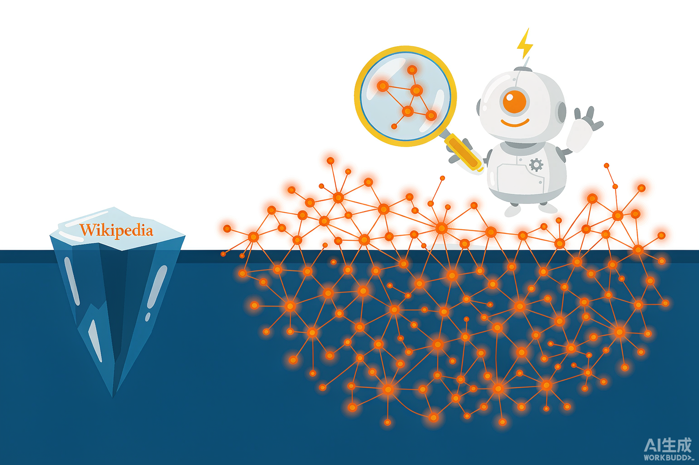

---

## 一个让人瞬间懵圈的场景

上周，做运营的朋友小 A 跑来问我：

> "我想让 AI 自动回答公司产品的售后问题，技术同学说要搞 RAG，还补了一句：『底层知识库最好是个 Wiki』。我就纳了闷了，Wiki 不就是维基百科吗？我们公司又不是维基百科，哪来的 Wiki？"

如果你听完也有这股懵，恭喜你，这篇就是专门写给你看的。

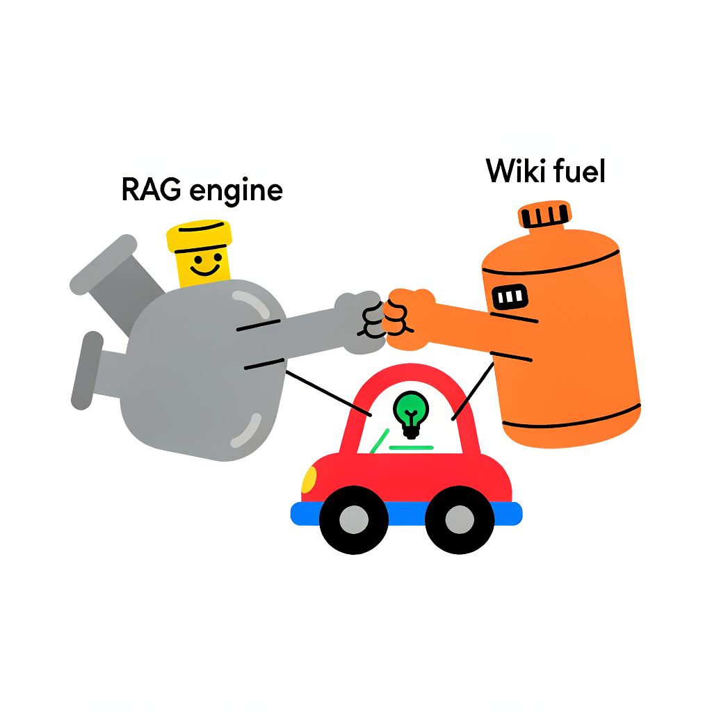

今天我们不追热点、不堆黑话，就干一件事：**让一个小白，十分钟内真正搞懂 Wiki 是什么、怎么运转、有什么用，以及它和最近大火的 RAG 到底啥关系。**

先扔一句话在开头，看完你会更懂：

**Wiki 是「存放知识的仓库」，RAG 是「使用知识的机制」——它俩不是对手，而是搭档。**

---

## 一、RAG 先讲清楚，但它不是今天的主角

要讲清楚 Wiki，必须先提 RAG，因为很多人是冲着 RAG 才第一次听说 Wiki 的。

### 1.1 大模型有个毛病：嘴上说得好，真不一定靠得住

用过 ChatGPT 的人都知道，大模型写起小作文一套一套的，但一问到专业细节，它就开始"一本正经地胡说"。这就是行业常说的 **幻觉（Hallucination）**。

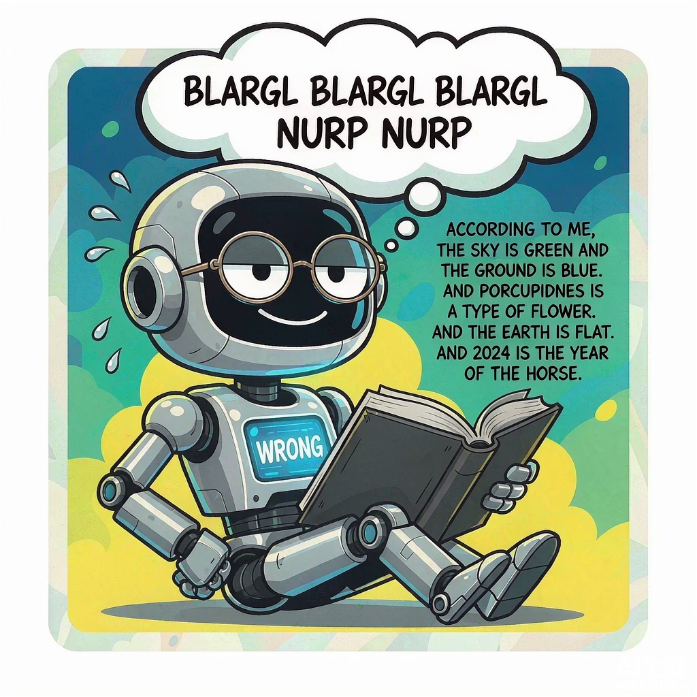

更麻烦的是，模型还有 **知识截止日期** ——它不会自动知道今天的新闻、你公司昨天更新的产品说明、或者你私下写的一份调研笔记。

怎么办呢？

2019—2020 年左右，学界想出一个办法：**与其让模型硬背所有东西，不如让它在回答问题的时候，先去查一本「外部参考书」，把查到的东西临时塞进上下文窗口，再组织语言回答。**

这就是 **RAG（Retrieval-Augmented Generation，检索增强生成）** 的核心思想。

### 1.2 学术出处

这个概念最早系统化落地的论文，是 Lewis 等人 2020 年发表在 NeurIPS 的 **《Retrieval-Augmented Generation for Knowledge-Intensive NLP Tasks》**（Lewis et al., 2020, NeurIPS, arXiv:2005.11401）。

他们的关键洞察可以粗暴概括为一句话：

> 把大语言模型看作一个 **参数化记忆（parametric memory）**——知识全在模型权重里；再给它加一个 **非参数化记忆（non-parametric memory）**——也就是一个可检索的外部知识库（比如维基百科的稠密向量索引）。

这样，模型回答问题时，先去非参数化记忆里翻资料，再生成答案。知识更新？更新外部数据库就行，不用重新训练模型。

### 1.2.1 一张图看懂：模型的「脑子」 vs 外接的「参考书」

为什么非要外接知识？根子在大模型的 **参数化记忆** 上。

模型的全部知识，是在训练时「烤」进权重里的。这带来两个绕不开的毛病：

- **知识有截止日期**：训练数据截止到某一天，之后的事它真不知道。
- **会一本正经地编**：权重里没有的事实，它也会顺着语境「补」出一个听起来合理的答案——这就是幻觉。

而 RAG 给模型接上的，是一个 **非参数化记忆**：一个独立在外面、可随时更新的向量知识库。它不进权重，所以更新知识不用重训模型；它带着来源，所以答案能溯源。

两者怎么配合，看这张图最直观：

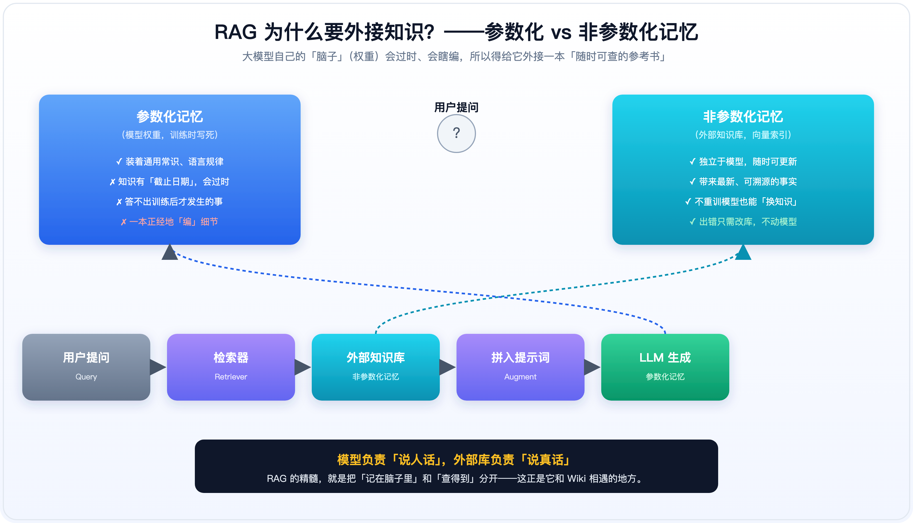

记住一句话：**模型负责「说人话」，外部库负责「说真话」。RAG 的精髓，就是把「记在脑子里」和「查得到」分开——这正是它和 Wiki 相遇的地方。**

### 1.3 RAG 的工作流程

RAG 跑起来大概是这样的：

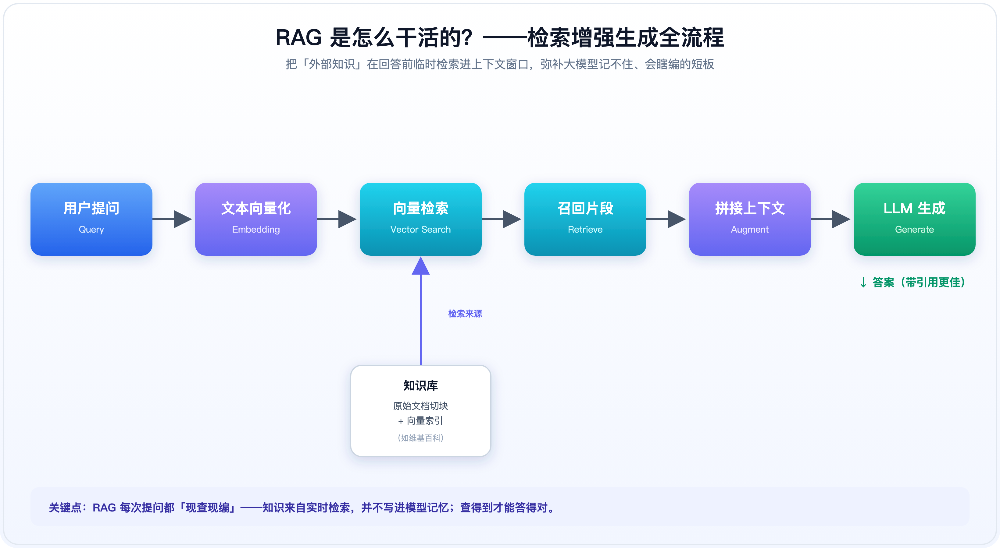

翻译成大白话：

1. 你提一个问题。
2. 系统把问题转成一串数字（向量）。
3. 在一个预先建好的向量库里，找到最相关的几段文档。
4. 把这些文档片段和你的问题一起，塞进大模型的提示词里。
5. 大模型看着这些材料，组织语言给出回答。

听起来很美好对不对？但 RAG 其实有几个隐形的短板：

- **每次提问都「现查现编」**，检索失败，答案大概率也错。
- **文档切块很粗暴**，把一段话拦腰截断，上下文丢了。
- **答完即弃**，不会把这次学到的知识沉淀下来。
- **算力成本不低**，每次都要重新走一遍检索和生成。

于是，有人开始想：

> "既然 RAG 的核心短板是『知识太原始、太零碎』，那我们能不能先把知识整理成一份更好用、更可信、更容易被检索的形式？"

答案就是：**Wiki**。

---

## 二、Wiki 到底是什么？从 1995 年夏威夷说起

### 2.1 这个词不是维基百科首创的

很多人一听到 Wiki，脑子里只有"维基百科"五个字。其实不是。

**Wiki 这个词，1995 年就诞生了。**

那一年，美国程序员 **Ward Cunningham** 做了一个叫 **WikiWikiWeb** 的网站。"Wiki Wiki" 来自夏威夷语，意思是 **"快一点、快一点"**。

他做这个东西，是为了方便一帮软件开发者一起写设计模式文档。传统的方式是大家各自写 Word、发邮件、FTP 上传网页，更新一次特别慢。Cunningham 想：能不能让大家直接在网页上编辑，保存后别人立刻能看到，而且页面之间还能互相链接？

于是 WikiWikiWeb 诞生了。它的核心设定就三条：

1. **任何人都能编辑**：不用懂 HTML，打开页面直接改。
2. **页面之间自由链接**：用 `[[另一个页面]]` 这种简单语法互相跳转。
3. **历史版本可回溯**：改错了能恢复，改了什么一目了然。

这三条规则加在一起，创造了一个此前不存在的东西：**一个由众人共同维护、可以无限生长、彼此关联的知识网络。**

这就是 **Wiki 的本源**。

维基百科（Wikipedia）是 2001 年由 Jimmy Wales 和 Larry Sanger 把这个模式搬到百科全书上的结果，它是 Wiki 最成功的应用，但**绝不是 Wiki 的全部**。

### 2.2 Wiki 的三条基因

理解了源头，Wiki 的定义就很好记：

> **Wiki 是一种「开放协作、超链接互联、版本可追溯」的知识组织方式。**

把它拆开，就三条基因：

- **可协作编辑**：写文档不再是少数人的权力，懂行的人都能来补一句。
- **超链接互连**：知识点不是孤立的一页纸，而是织成一张网，想看相关内容一点就跳过去。
- **集体智慧沉淀**：好的内容会被反复打磨，留下引用、版本、讨论记录。

下面这张图就是 Wiki 知识网的形象表达：

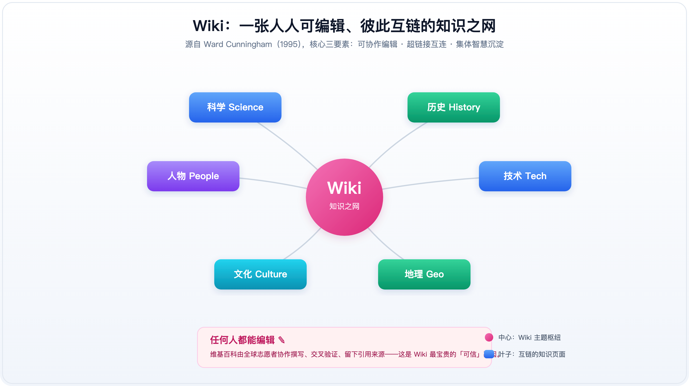

中心节点是主题枢纽，周围是互链的知识页面，所有人一起维护、一起链接。

### 2.3 维基百科为什么这么能扛？

Wikipedia 把 Wiki 这三条基因发挥到了极致。

它现在是世界上最大的自由知识库之一：英文版超过 **670 万条** 条目，全语言版本合计超过 **6000 万条**（数字还在持续增长）。

更重要的是，它不是一本死的书，而是一个**活的系统**：

- 任何页面都有引用区，关键主张必须给出来源。
- 编辑历史完全公开，你可以看到过去 20 年每一行字是怎么变的。
- 有讨论页、中立性原则、可供查证原则等治理机制。

这些特征，正是大模型最缺的东西：**可验证、可溯源、有结构。**

### 2.4 Wiki 的运转原理：一份知识是怎么被「养」出来的？

很多人以为 Wiki 就是「一个能编辑的网页」，其实它真正的原理是一套 **协作飞轮**：

1. 任何人发现知识空白，就能新建或编辑页面；
2. 写下事实，并附上引用来源；
3. 用 `[[链接]]` 把相关页面连起来，知识从点变成网；
4. 每次保存都会留下版本，改错了能回滚；
5. 别人在讨论页里挑刺、补充，有问题的内容被修正；
6. 如此循环，零散信息慢慢沉淀成一份可信、可溯源、持续生长的知识库。

下面这张工作流图，把刚才六步连成了闭环：

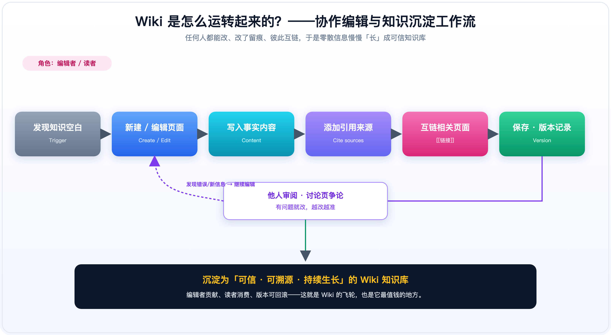

再配一张「单个 Wiki 页面解剖图」，你就能明白为什么它比普通文档更可信：

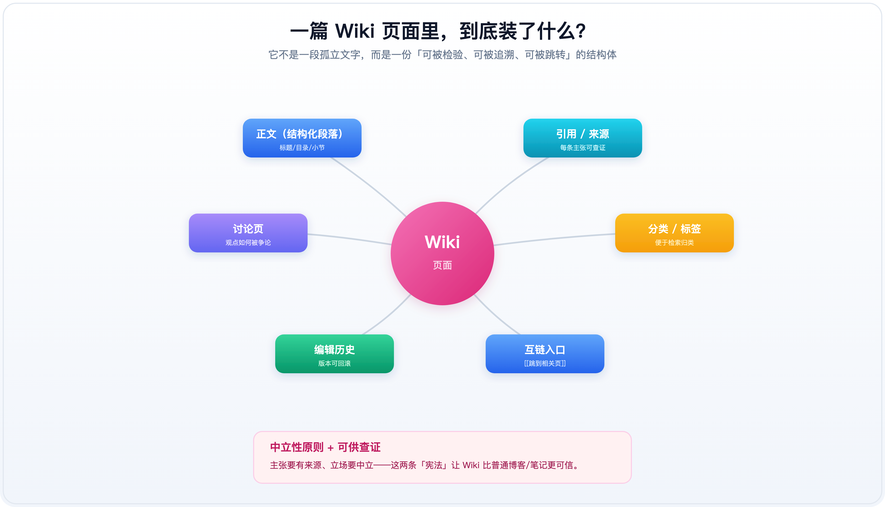

一篇 Wiki 页面不是孤零零一段字，而是被「引用、讨论、历史、互链、标签」五件套武装起来的结构体。尤其是 **中立性原则**（立场要客观）和 **可供查证原则**（主张必须有来源），这两条像宪法一样约束着每一条内容——这恰恰是大模型自己生成文字时最缺的纪律。

所以 Wiki 的原理一句话就能讲透：**它靠人类的协作 + 透明的流程 + 可追溯的结构，把「谁写的、依据什么、改了什么」全部摊在阳光下，从而让知识变得可信。**

---

## 三、Wiki 有什么用？我们为什么需要它？

讲到这里，可能有同学会问：

> "Wiki 听起来挺好的，但现在有 RAG、有向量数据库、有搜索引擎，我还需要 Wiki 吗？"

**答案是需要，而且可能比过去更需要。**

### 3.1 对人：Wiki 是知识管理的「最省方案」

试想一下你公司的知识现状：

- 产品文档在 Confluence 或飞书。
- 技术方案在 GitHub 和内部 Wiki。
- 会议纪要散落在群聊和邮件里。
- 一些老员工脑子里的经验根本没写下来。

找人问问题的时候，你经常听到的回答是："你去问一下小王"或者"我找找那个文档发你"。

Wiki 的做法是把这些知识**提前整理、交叉链接、公开可见**。你搜一个关键词，不仅能看到定义，还能看到相关的背景、历史、负责人、常见问题。它省的不是一点点时间，而是**组织记忆**。

### 3.2 对 AI：Wiki 是 RAG 最优质的「弹药库」

对大模型来说，Wiki 至少有三层价值：

#### 价值一：知识质量高

Wikipedia 是目前公认的、最适合用来训练/增强大模型的外部知识源之一。它的文本规范、事实密度高、表达中立，比随便抓的网页干净得多。

#### 价值二：自带引用和结构

Wiki 页面有标题、目录、段落、引用链接。RAG 检索时可以利用这些结构，而不是在一大段原始文字里硬切。

#### 价值三：已经被人类验证过

一个能在 Wikipedia 上存活下来的条目，通常经历过多轮编辑和争论。它不是某个人的主观笔记，而是一种**社会化的可信表达**。

### 3.3 学术研究佐证：WikiChat

2023 年，斯坦福 OVAL 团队发表了一篇很有代表性的论文 **《WikiChat: Stopping the Hallucination of Large Language Model Chatbots》**（arXiv:2305.14292，EMNLP 2023 Findings）。

他们做了一个以 Wikipedia 为知识源的开域聊天机器人。基本思路是：

1. 用户提问。
2. 系统从 Wikipedia 中检索相关页面。
3. 用 LLM 过滤掉检索结果里可能不准确的部分。
4. 生成回答，并且把对应 Wiki 页面作为引用。

实验结果很惊人：这个系统大幅降低了大模型在事实性问题上的幻觉率，被称为 **"几乎不会幻觉的聊天机器人"**。

这个例子特别能说明 Wiki 和 RAG 的关系：

> **RAG 提供了「检索+生成」的引擎，Wiki 提供了「可信、结构化、带引用」的油料。** 没有好油料，引擎再强也是白搭。

---

## 四、Wiki 和 RAG，到底差在哪？

终于到了最核心的对比。很多小白搞不清这两个概念，是因为它们经常一起出现，但本质完全不同。

### 4.1 一句话区分

- **Wiki**：知识库本身，是「仓库」。
- **RAG**：使用知识的方法，是「机制」。

用个生活比喻：

> **Wiki 像是一本写好的、带目录和脚注的参考书。**
> **RAG 像是一个考试时帮你翻书、摘句子、再组织答案的助手。**

你让助手翻书，书的质量直接决定答案的质量。如果书里全是乱码、断章取义，助手再聪明也没用。

### 4.2 全面对比图

下面这张图把两者的区别整理得更清楚：

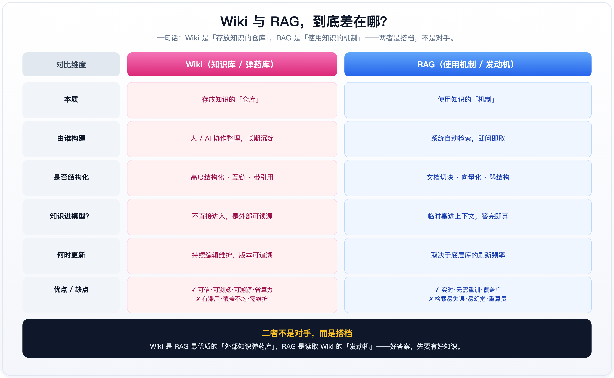

### 4.3 文字再展开

| 维度 | Wiki | RAG |
|------|------|-----|
| **本质** | 存放知识的仓库 | 使用知识的机制 |
| **由谁构建** | 人或 AI 协作整理，长期沉淀 | 系统按查询自动检索，即问即取 |
| **是否结构化** | 高。有页面、链接、目录、引用 | 弱。通常是文档切块和向量索引 |
| **知识是否进模型** | 不直接进，是外部可读源 | 临时塞进上下文，答完即弃 |
| **何时更新** | 持续编辑维护，版本可追溯 | 取决于底层库的刷新频率 |
| **优点** | 可信、可浏览、可溯源、省算力 | 实时、无需重训、覆盖广 |
| **缺点** | 有滞后、覆盖不均、需要维护 | 检索易失误、易幻觉、重复计算贵 |

所以请记住：

> **Wiki 和 RAG 不是二选一。**
>
> **Wiki 是 RAG 最好的外部知识源；RAG 是读取 Wiki 最高效的工具。**

### 4.4 为什么谁也替代不了谁？

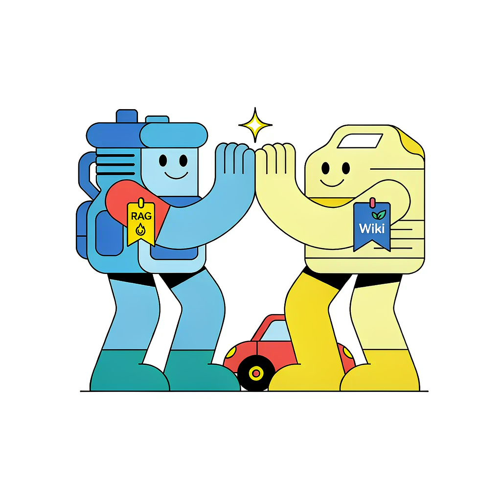

光说「搭档」可能还是抽象，我们把三种组合摆出来对比一下，你就彻底明白了：

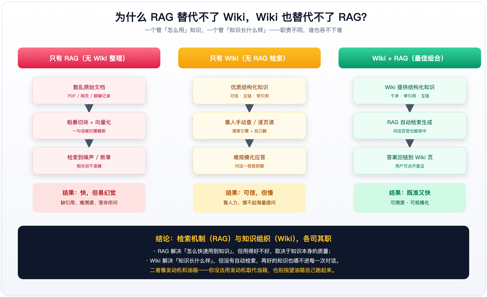

- **只有 RAG，没有 Wiki 整理**：知识还是一堆散乱的原始文档，切块、向量化后，检索到的常常是被拦腰截断、相关但不准确的片段。结果就是——快，但容易幻觉、没法溯源。RAG 再强，喂给它的是垃圾，出来的也是垃圾。
- **只有 Wiki，没有 RAG 检索**：知识质量很高，但靠人手动搜索、逐页翻读。一个客服机器人一天要答上万次提问，靠人肉翻 Wiki 根本扛不住；而且问法一变，人工检索就抓瞎。
- **Wiki + RAG（最佳组合）**：Wiki 提供干净、带引用、互链的结构化知识；RAG 负责自动检索并把答案回链到具体 Wiki 页面，用户可以点开查证。既准、又快、可溯源。

结论很清楚：**RAG 解决的是「怎么快速用到知识」，但用得好不好，取决于知识本身的质量；Wiki 解决的是「知识长什么样」，但没有自动检索，再好的知识也喂不进每一次对话。** 一个像发动机，一个像油箱——你没法用发动机取代油箱，也别指望油箱自己跑起来。

---

## 五、新内容：LLM Wiki —— 让 AI 自己建 Wiki

如果你觉得前面的 Wiki 还停留在"人写维基百科"的阶段，那接下来这部分就是 **"新 Wiki"**。

### 5.1 传统 RAG 的痛点：每次都从原始文档「现算」

传统 RAG 的问题我们已经说过：

- 原始文档被切成一小块一小块，丢进向量库。
- 每次用户提问，都要重新做一遍检索、拼接、生成。
- 如果文档本身很乱、重复、互相矛盾，RAG 就会被带偏。

这就像你每次考试，都把整间图书馆的书搬到考场里，然后在考场上临时翻、临时编。效率低，还易出错。

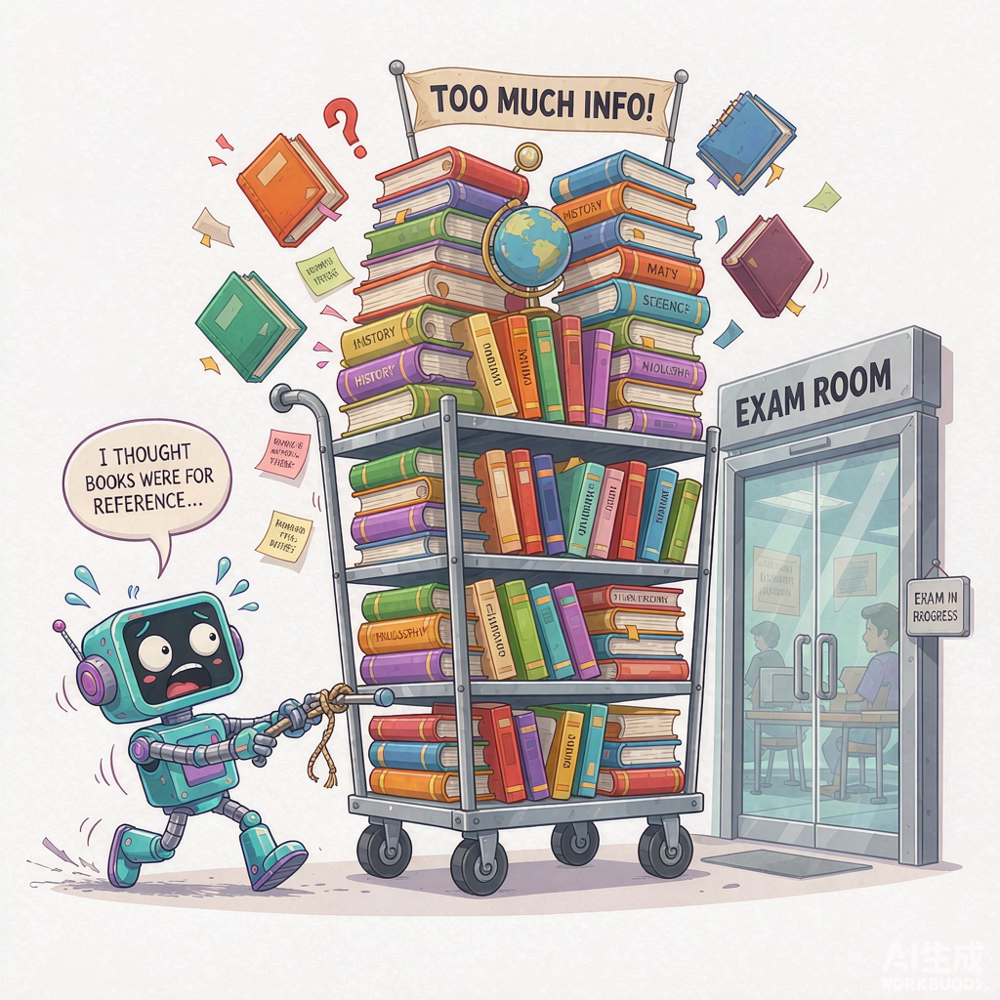

### 5.2 LLM Wiki 的解法：先把知识「编译」成百科

2025 年，前特斯拉 AI 总监 Andrej Karpathy 在一篇被广泛讨论的 Gist 笔记里，提出了一种值得关注的范式 **LLM Wiki**（Karpathy, 2025）。

核心思路是这样的：

> 与其让 RAG 每次提问都从原始文档里现查现编，不如让 LLM 预先把知识 **"编译"** 成一份结构化的 Wiki——提取实体、关系、摘要、引用，持续维护。等到用户提问时，直接从这个已经整理好的 Wiki 里检索和生成。

我把这个过程画成了一张图：

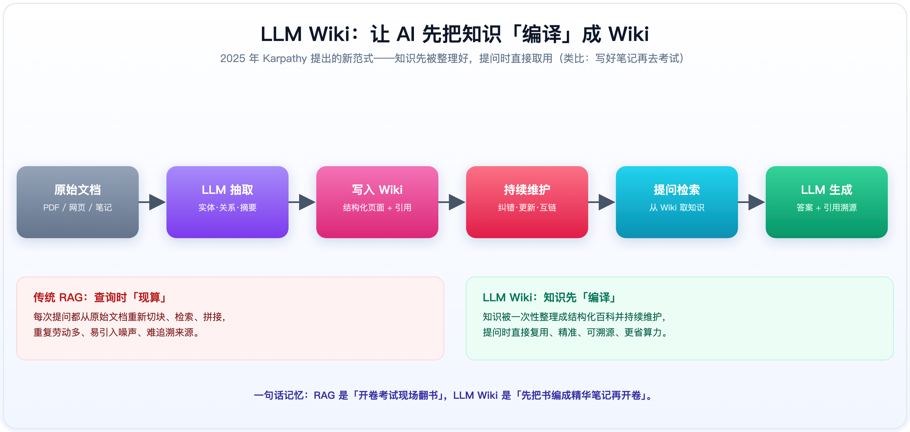

这个范式的优势很明显：

- **可复用**：知识整理一次，后续多次查询直接用。
- **可溯源**：每个知识点都能追溯到原始文档。
- **更精准**：结构化 Wiki 比原始切块更适合检索。
- **更省算力**：避免每次从原始文档重新抽取和组织。

用一个生活比喻：

> **传统 RAG 是「开卷考试现场翻书」。**
> **LLM Wiki 是「先把书编成精华笔记，再开卷」。**

### 5.3 它和经典 Wiki 的关系

LLM Wiki 并不是要取代经典 Wiki，而是把"整理知识"这件事从人手里，**部分或全部地交给了 AI**。

但两者的精神是一致的：

- 都要 **结构化**。
- 都要 **互相关联**。
- 都要 **可追溯、可验证**。

**人类 Wiki + AI 维护 = 未来最有可能落地的知识形态。**

---

## 六、普通人怎么用？给你三个落地场景

讲到这里，估计你还是想问："道理我懂了，但我怎么用？"

下面三个场景，覆盖了个人、企业、AI 应用三种典型情况。

### 场景一：个人知识管理

如果你用 Obsidian、Notion、Logseq 等工具写笔记，其实你已经在用 Wiki 思想了：

- 用 `[[ ]] ` 链接相关笔记。
- 给每篇笔记打上标签和目录。
- 定期整理、合并、修正旧内容。

**行动建议**：从今天开始，不要只收藏文章，而是用自己的话写一段摘要，并把它链接到已有笔记上。这就是 Mini Wiki 的雏形。

### 场景二：企业内部 Wiki + RAG

越来越多的公司把内部文档（产品手册、技术方案、FAQ、培训材料）整理成 Wiki，然后再接 RAG 做问答机器人。

**行动建议**：如果你要选型 RAG 产品，不要只问"能不能接我的 PDF"，要问清楚：

1. 它能不能识别文档里的标题、列表、表格、引用？
2. 检索到的片段能不能告诉我来自哪一页、哪一行？
3. 知识库更新后，答案会不会跟着变？

这些问题的背后，其实就是在问：**你的 RAG，吃的是一个 Wiki，还是一堆散乱的文档？**

### 场景三：AI 应用开发

如果你在做 AI 应用，Wiki 思想能直接提升产品质量：

- 在做客服机器人前，先把常见问题和答案整理成一份结构化 FAQ（小型 Wiki）。
- 在做研报助手前，先把数据源整理成"实体-事件-关系"表。
- 在做医疗/法律等高风险领域时，更要强调**引用溯源**，让模型像 Wiki 编辑一样"没来源的不说"。

---

## 七、结尾：为什么 Wiki 在 AI 时代反而更重要了？

写到这里，我想收回到开头那个问题：

> "Wiki 不就是维基百科吗？"

现在答案应该很清楚了：

**维基百科只是 Wiki 最成功的例子。Wiki 其实就是一种让知识被「共同整理、交叉链接、持续验证」的方法。**

在大模型时代，我们有了前所未有的"生成能力"，但生成能力的瓶颈正在从"会不会写"转向"有没有可信赖的东西可写"。

RAG 解决的是"怎么用外部知识"；
Wiki 解决的是"外部知识本身长什么样"。

你可以没有 RAG，直接读 Wiki；
但你很难想象一个真正靠谱的 RAG，背后没有一个像样的 Wiki。

所以，下一次再有人提到 Wiki，不要只想到维基百科。

**Wiki 是 AI 时代最被低估的基础设施之一。搞懂它，你就已经比 80% 的"RAG 从业者"走得更远了。**
