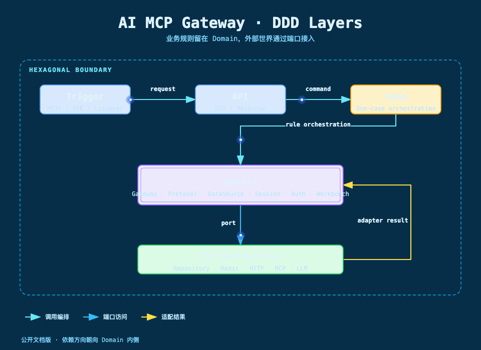

# DDD 分层与系统架构：把协议变化挡在领域边界之外

图要回答的问题：请求如何进入系统，业务规则在哪里，外部依赖如何被替换。核心结论是 Domain 不依赖 MySQL、Redis 或具体 HTTP 客户端，Infrastructure 通过端口实现外部访问。

## 模块如何对应架构层

| 层次 | 模块 | 当前职责 |
| --- | --- | --- |
| API | `ai-mcp-gateway-api` | DTO、分页、响应和对外服务接口 |
| Trigger | `ai-mcp-gateway-trigger` | Admin Controller、MCP Controller、Redis Listener |
| Case | `ai-mcp-gateway-case` | 管理用例、MCP 会话用例、Streamable HTTP 编排 |
| Domain | `ai-mcp-gateway-domain` | 领域对象、业务规则、端口和领域服务 |
| Infrastructure | `ai-mcp-gateway-infrastructure` | Repository、DAO、Redis、HTTP、MCP、LLM 适配器 |
| App | `ai-mcp-gateway-app` | Spring Boot 启动、Bean、线程池和环境配置 |
| Types | `ai-mcp-gateway-types` | 公共异常、常量和枚举 |

## Trigger 只做协议入口

`McpGatewayController` 负责读取路径、请求头和请求体，将 Streamable HTTP 的 GET、POST、DELETE 转成 Case 命令，并把领域结果写回 JSON 或 SSE。它不判断工具是否属于能力包，也不决定数据源是否允许写入。

`AdminController` 负责把管理 DTO 变成命令，覆盖数据源、网关、协议、能力包、语义卡片、访问令牌、工具测试和 LLM 测试等入口。

## Case 负责场景编排

Case 层把一次业务场景串起来：Streamable HTTP Service 先识别 initialize，再恢复会话、执行限流和处理 JSON-RPC；会话 GET 则交给专门的监听用例完成准入、回放、打开流和结束处理。

## Domain 负责规则

领域层包含六类规则：协议分析与映射、数据源执行安全、工具调用策略、能力包生命周期、授权与限流、会话与消息处理。它们通过 `adapter/port` 和 `adapter/repository` 声明对外需要什么，而不把数据库表结构、Redis 客户端对象或 HTTP SDK 暴露给上层。

## Infrastructure 负责适配

Repository 负责 MySQL 读写，Redis 负责会话和运行时投影，Gateway 负责 HTTP、上游 MCP 和 LLM。`dao/po` 是持久化模型，不能上升为领域实体；适配器出现连接异常时，应返回领域可理解的结果或异常，而不是改变领域规则。

## 为什么不把所有逻辑写进 Service

工具协议存在多种执行方式，项目使用策略工厂选择 HTTP、数据源或上游 MCP；数据源调用存在多个连续校验，项目使用安全责任链；会话 GET 存在准入、回放、打开和结束阶段，项目使用节点式编排。这样新增一种工具协议时，不需要修改所有已有分支。
