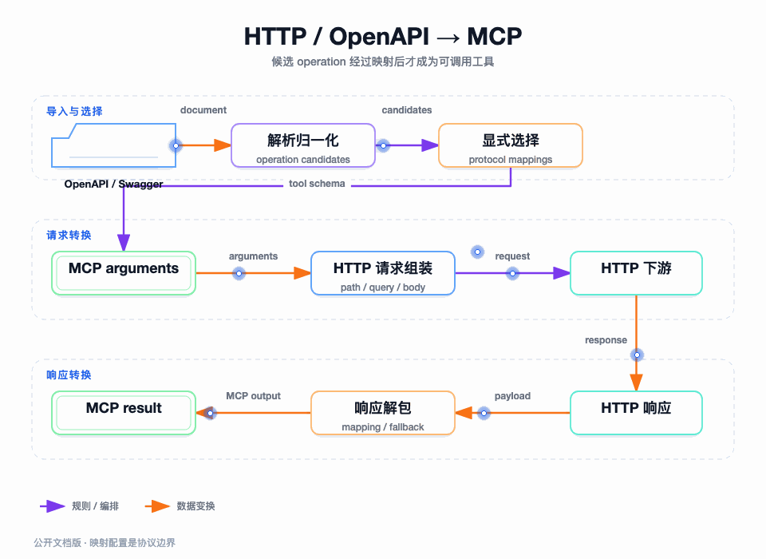

# HTTP 与 OpenAPI 转 MCP：先生成契约，再允许执行

图要回答的问题：OpenAPI 文档中的 operation 如何变成 MCP 工具，以及 MCP 参数如何安全地落到 HTTP 请求。候选、选择、映射和执行是不同阶段，不能一次完成。

## 我为什么不直接把 operation 全部暴露出去

OpenAPI 文档通常比某个 AI 场景需要的能力更宽。直接暴露会带来工具数量过多、废弃接口进入运行面、参数描述不稳定和高风险 operation 无法治理等问题。因此项目先解析并生成候选列表，再由管理侧选择 operation。

## 解析和归一化

`ProtocolAnalysis` 通过文档解析端口读取 Swagger 2 或 OpenAPI 3，再由归一化服务统一 operation、参数、请求体、响应体和警告信息。解析结果先用于预览，只有经过选择的 operation 才能形成 HTTP 协议配置。

## 请求映射

执行时，`ProtocolExecuteService` 将 MCP arguments 转为 Map，读取协议映射的叶子节点，按映射位置组装 Path、Query、Header、Cookie 和 Body。结构节点只描述层级，真正参与请求组装的是叶子映射。

如果没有 request mapping，系统保留旧工具的透传兼容行为；如果映射存在但没有可执行叶子节点，也会回退到兼容路径，避免老配置因为新映射逻辑直接失效。

## 响应解包

响应处理先判断是否需要解析 body。Header-only 映射不强行解析响应体；JSON Object/Array 按映射提取字段并重建 MCP 结构；JSON Scalar 和纯文本按原始语义返回。当配置期望结构化字段却没有取到值时，系统回退原始响应文本，避免把错误包装成空成功结果。

## 失败边界

文档解析失败停在预览；参数映射不完整停在执行前；HTTP 连接、超时和非预期响应属于下游执行失败；响应解包无匹配字段则保留原始响应。这样每一层的失败都能被测试和定位。
