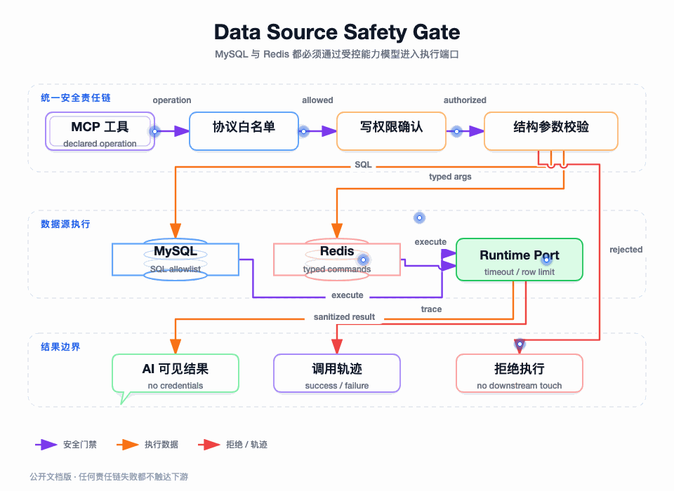

## 我为什么不把数据库和 Redis 暴露成“万能工具”

AI 能理解“查询员工信息”，不代表它应该接收数据库连接字符串、Redis 客户端或任意命令。让模型自己生成 SQL 或 Redis 原生命令，会把资源范围、危险操作、返回数据量和副作用判断交给概率模型；即使模型大多数时候生成正确，偶发的一次错误也可能造成数据泄露或大范围修改。

我把数据源接入的目标定义为：**把原始资源变成有限、可描述、可测试、可拒绝的 MCP 工具**。工具参数只表达业务动作需要的字段，凭证只在执行适配器内部使用；安全检查发生在 `IDataSourceRuntimePort` 之前，任何未通过责任链的请求都不会触达 JDBC 或 Redisson。

图要回答的问题：一次 MySQL/Redis 工具调用经过哪些安全门禁，哪些拒绝分支在进入真实数据源之前结束，读写操作如何区分。

## 数据源对象保存什么，绝不保存什么

管理侧的数据源对象包含来源类型、地址、端口、数据库名或 Redis database、连接超时、查询超时、最大返回条数、写开关、启停状态和版本。凭证单独进入 secret 记录，使用 AES-GCM 加密保存，密钥版本由环境配置或密钥管理系统提供。

运行时读取数据源时，`DataSourceRuntimePort` 完成以下动作：

1. 从配置仓储读取数据源和加密 secret，并要求两者都存在。
2. 只有真实执行路径才要求数据源状态为 `ENABLED`；管理端预览可以读取元数据，但不会因此获得执行权限。
3. 校验加密算法和 key version，使用 `IDataSourceCredentialCipherPort` 解密。
4. 按来源类型创建一次 JDBC Connection 或 RedissonClient，执行完成后关闭连接/客户端，不驻留明文凭证。

下列内容不能进入 MCP schema、工具返回值和普通日志：密码、完整连接 URL、解密后的 credential、Redis 客户端对象以及包含敏感字段的请求摘要。工作台可以记录请求和响应摘要，但应该在企业环境继续做字段脱敏和审计分级。

## 先看支持的操作模型

`DataSourceOperationEnum` 是 AI 可以触达的操作白名单。它同时携带来源类型、是否写操作、操作名、描述和 input schema；因此 `tools/list` 能直接暴露有限参数，而不是暴露一个 `command` 字段。

| 数据源 | 读操作 | 写操作 | 关键限制 |
| --- | --- | --- | --- |
| MySQL | `list_tables`、`describe_table`、`select` | `insert`、`update`、`delete` | 写操作必须开启数据源写权限并显式确认 |
| Redis String | `string_get` | `string_set` | 可选 TTL 只能在规定范围内 |
| Redis Hash | `hash_get`、`hash_get_all` | `hash_set`、`hash_delete` | field、value 结构化传入 |
| Redis List | `list_range` | `list_push`、`list_pop` | side 只能是 LEFT/RIGHT，范围受限 |
| Redis Set | `set_members` | `set_add`、`set_remove` | 不开放扫描和命令拼接 |
| Redis ZSet | `zset_range` | `zset_add`、`zset_remove` | score 是数字，范围读取受上限保护 |

没有 `keys`、`scan`、`eval` 或通用 `command` 操作。它不是漏做功能，而是有意把“资源管理能力”和“业务读取能力”分开；企业如果确实需要扫描、脚本或批处理，应建立独立的审批工具和更细的资源范围，不应把它们塞回通用 MCP 参数。

## 调用前责任链：四道门禁

### 第一层：协议和操作白名单

责任链先把 `sourceType` 和 operation 解析为 `DataSourceTypeEnum` 与 `DataSourceOperationEnum`。数据源配置缺失、数据源 ID 缺失、来源类型不支持或操作不属于该来源的白名单，直接返回非法参数。

例如，MySQL 的 `string_get` 和 Redis 的 `select` 都不能因为字符串看起来合法就继续执行；操作枚举把来源类型和动作绑定起来，避免调用方只提交一个操作名来跨类型复用。

### 第二层：写授权与二次确认

读操作不要求 `confirmWrite`。写操作必须同时满足：

- 数据源配置的 `writeEnabled=true`。
- arguments 中显式存在布尔值 `confirmWrite=true`。

责任链通过后会从参数副本中移除 `confirmWrite`，防止这个门禁字段被误传给 SQL 参数或 Redis value。缺少其中任何一个条件都在基础设施之前失败。默认只读是安全基线，管理面打开写权限也不代表每次调用自动拥有写权限。

### 第三层：结构化参数

责任链拒绝非字符串 key、未声明字段和大小/类型不匹配的值；特别禁止名为 `command` 的字段，避免 Redis 原生命令从参数层重新进入系统。

常见规则包括：

| 参数 | 当前校验 |
| --- | --- |
| MySQL table | `describe_table` 只接受安全标识符，避免把表名当作任意表达式 |
| Redis key | 非空、无控制字符，长度不超过 512 |
| Redis field/value | 非空字符串且不含控制字符 |
| `side` | 只接受 `LEFT` 或 `RIGHT` |
| `start`/`stop` | 必须是数字，执行端再验证范围关系 |
| `score` | 必须是数字 |
| `ttlSeconds` | 1 到 86400 之间 |
| SQL `params` | 必须是 JSON 数组 |

这层的目标不是完整 JSON Schema 校验，而是作为运行时防线。模型一般会根据 `tools/list` 生成正确参数，但服务端不能把 schema 作为授权代替。

### 第四层：SQL 专项规则

只有 MySQL 的 `select`、`insert`、`update`、`delete` 进入 SQL 安全过滤。当前规则包括：

- SQL 非空，去除首尾空白后只允许一条语句；末尾分号可以被移除，中间或多余分号被拒绝。
- 禁止 `--`、块注释、MySQL `#` 注释和控制字符，减少绕过 token 检查的空间。
- 第一个有效 token 必须与工具操作一致，`select` 工具不能提交 `update`。
- 拒绝 DDL、事务控制、权限管理、文件导出和执行类关键字，包括 `create`、`alter`、`drop`、`truncate`、`grant`、`rollback`、`load`、`outfile` 等。
- `insert` 只允许 `VALUES` 形式，不允许 `INSERT SELECT`。
- `update` 和 `delete` 必须包含 `WHERE`，并拒绝 `WHERE 1=1` 或 `OR 1=1` 这类明显的全表条件。
- `?` 占位符数量必须与 params 数量一致，执行端使用 PreparedStatement 绑定参数。

这些规则是有边界的语法防线，不是完整 SQL 解析器，也不能替代数据库账号最小权限、网络隔离、租户条件注入、列级脱敏和审计。生产环境不能因为有这层正则/token 检查，就给网关一个拥有全部库表权限的账号。

## MySQL 执行端口如何再收敛一次

责任链通过后，`DataSourceToolInvocationStrategy` 生成内部的 `DataSourceToolExecutionCommandEntity`，由 `DataSourceRuntimePort` 执行。执行端口不接收原始 HTTP 请求，也不接受调用方自定义 SQL 模式之外的额外选项。

### 元数据操作

`list_tables` 使用 JDBC metadata 查询表清单，`describe_table` 查询列、主键和索引。元数据结果受数据源的最大返回量和固定元数据上限约束，不能把整个数据库结构无限返回给模型。

### 查询操作

`select` 使用 `connection.setReadOnly(true)`，PreparedStatement 设置 query timeout 和 max rows，再按列名组装行结果。返回结果带有 rowCount 和截断上限，模型可以知道看到的结果是否可能不是完整集合。

### 写操作

`insert`、`update`、`delete` 在显式写授权和安全链通过后，执行端开启手动事务。语句执行后，如果影响行数超过数据源的 `maxRows`，事务回滚；否则提交并返回 affectedRows 和 committed。SQL 异常也会回滚，最后恢复 autoCommit。

这一步是第二道保护：安全链防止明显危险操作，执行端防止一次写操作影响过多行。两者都不能被移除。数据库连接属性还显式关闭多语句、本地文件加载、远程公钥获取和自动反序列化等高风险能力，避免 JDBC 驱动配置反过来扩大工具权限。

## Redis 执行端口如何避免命令透传

`DataSourceRuntimePort` 按操作名选择 Redisson 类型化对象：Bucket、Map、List、Set、ScoredSortedSet。模型只提交操作对应的字段，执行端把这些字段转换成固定的 SDK 调用。

| 操作 | 固定的执行模型 | 输出限制 |
| --- | --- | --- |
| String get/set | 一个确定 key 的 Bucket | set 可选 TTL，get 返回单值 |
| Hash get/set/delete | 一个确定 key 的 Map | `hash_get_all` 只返回 maxRows 条 |
| List range/push/pop | 一个确定 key 的 List | range 按 start/stop 截断，push/pop 明确方向 |
| Set members/add/remove | 一个确定 key 的 Set | members 只返回 maxRows 条 |
| ZSet range/add/remove | 一个确定 key 的有序集合 | range 返回 value 和 score，受 maxRows 限制 |

每次执行完成后关闭客户端，运行时不保存模型可见的 Redis 连接。这个实现牺牲了一些长连接复用效率，但减少了凭证驻留和跨请求状态污染；如果生产吞吐要求连接池化，应在 Infrastructure 层增加受控连接生命周期和熔断，而不是把客户端对象上移到 Domain。

## 数据源配置本身也有边界

`DataSourceService` 在注册或更新时限制编码格式、来源类型、端口、连接超时、查询超时、最大返回条数和 MySQL 用户名。当前约束包括：连接超时 100 到 30000 毫秒，查询超时 1 到 60 秒，最大返回条数 1 到 1000；未提供时使用默认值。

数据源连接测试和能力预览是管理动作，不能混同为已发布工具测试。测试连接成功只说明凭证和服务可达，具体工具仍要在工作台中以当前协议配置测试，并在能力包发布时通过成员和指纹门禁。

## 为什么不能只靠前端限制

前端可以把 `confirmWrite` 的按钮做成二次确认，也可以在 UI 中隐藏 `delete`，但 MCP 客户端、脚本或恶意调用者可以直接构造 JSON-RPC。真正有效的边界必须出现在服务端：

- `tools/list` 不展示不在当前能力包的工具。
- `tools/call` 再次检查工具 scope，不能只信任列表。
- 数据源责任链不信任客户端传来的操作和参数。
- 运行时端口再次检查数据源状态、来源类型和返回上限。

这四层分别解决可见性、授权、输入安全和资源安全，缺一层都可能被其它入口绕开。

## 测试和端到端验证

`DataSourceInvocationSafetyChainTest` 对安全链做了针对性验证：正常参数化 SELECT 会保留规范化 SQL；未开启写权限、缺少确认、注释、多语句、无 WHERE、全表条件、`INSERT SELECT`、参数数量不匹配和 Redis 非法操作均被拒绝；`confirmWrite` 不会进入最终执行参数。

`DataSourceServiceTest` 验证新数据源默认只读，能力预览中写操作不会被错误暴露。`DataSourceDockerEndToEndTest` 使用 Docker 数据源验证 MySQL/Redis 的真实工具调用结果，证明安全链通过后才会触达真实依赖。

此外，`AesGcmDataSourceCredentialCipherTest` 验证加密凭证的加解密和错误密钥拒绝；`DataSourceSessionRepositoryTest` 验证已发布能力包读取的数据源协议只带非敏感运行事实。

## 企业落地时我会继续加的边界

当前实现解决的是“通用数据源工具不能任意透传”的第一层问题，企业生产还应把以下边界接入正式安全体系：

| 需要继续补强的方向 | 建议做法 |
| --- | --- |
| 租户隔离 | 从可信会话上下文注入 tenant 条件，不允许模型自己选择租户 |
| 行列权限 | 使用数据库账号、视图、策略引擎和结果脱敏组合控制 |
| 写审批 | 高风险操作进入人工审批或短时授权，不只依赖 confirmWrite |
| 资源隔离 | 按数据源配置独立网络、账号、连接池和熔断配额 |
| 审计 | 记录 token、package、tool、dataSource、SQL 摘要、结果规模和失败码，敏感值脱敏 |
| 破坏性操作 | 删除、批量写和脚本能力使用专门工具与更高等级权限 |

## 本篇结论

MySQL 和 Redis 转 MCP 的关键是缩小能力模型：让 AI 只能提交操作所需的结构化参数，让服务端在执行端口前完成多层拒绝，再由 Infrastructure 使用固定的 JDBC/Redisson 动作完成访问。它不是把数据库变成了“AI SQL 客户端”，而是把一部分可审核的数据能力包装成受控工具。下一篇看这些工具如何通过 MCP 会话被发现和调用，以及 Streamable HTTP 为什么需要单独的连接生命周期。

下一篇：[MCP 会话、Streamable HTTP 与 SSE](./06-MCP会话与Streamable-HTTP.md)
