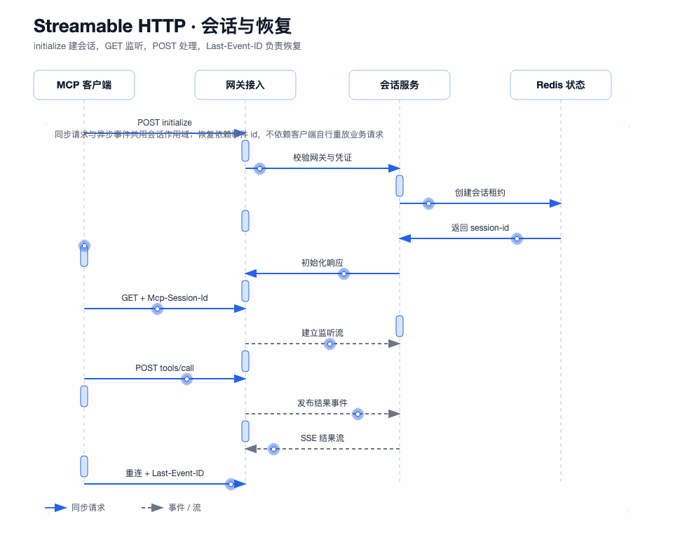

# MCP 会话、Streamable HTTP 与 SSE：把连接当成有生命周期的资源

图要回答的问题：initialize、GET 监听、POST 消息、SSE 事件和断线恢复如何配合。协议请求和流连接不是同一个动作，session id、事件 id 和租约各自承担不同职责。

## Streamable HTTP 初始化

客户端通过 POST 发送 `initialize`，请求可以不带 `Mcp-Session-Id`。网关先执行授权，再调用初始化消息处理，创建 Streamable HTTP 会话，并在响应头返回 `Mcp-Session-Id`。

后续请求必须带会话标识。网关会校验会话存在性、所属网关和 transport 类型，恢复会话绑定的授权作用域，再执行 JSON-RPC 请求。

## GET、POST 和 DELETE

- GET 建立监听流，返回 SSE 事件和心跳。
- POST 处理 `tools/list`、`tools/call` 等请求；普通请求返回 JSON，流式请求通过 SSE 返回，通知返回 202。
- DELETE 删除当前 Streamable HTTP 会话，释放本地资源并清理会话元数据。

旧 SSE 路径保留兼容能力，但包级令牌只能通过 Streamable HTTP 的 Authorization Bearer 传递，避免把高价值凭证放在旧 query 参数中。

## Last-Event-ID 恢复

服务端为 Streamable HTTP 会话生成有序事件 id，并通过 replay port 保存固定长度事件。客户端带 `Last-Event-ID` 重连时，GET 入口在打开新流前先判断是否命中回放缓冲；命中则补发缺失事件，未命中则按恢复结果继续监听或拒绝。

## 租约和心跳

连接取消不会立即删除 Redis 会话元数据。心跳刷新活跃租约，后台清理任务删除过期元数据，本地资源也在删除会话时回收。这样短暂断网有机会恢复，又不会让无主会话永久存在。

## 当前实现边界

本地 replay buffer 是实例内存实现，能够证明协议语义和单实例恢复逻辑，但不能直接等同于跨实例可靠事件存储。水平扩展前需要共享回放存储或会话粘性，并新增跨实例重连测试。
