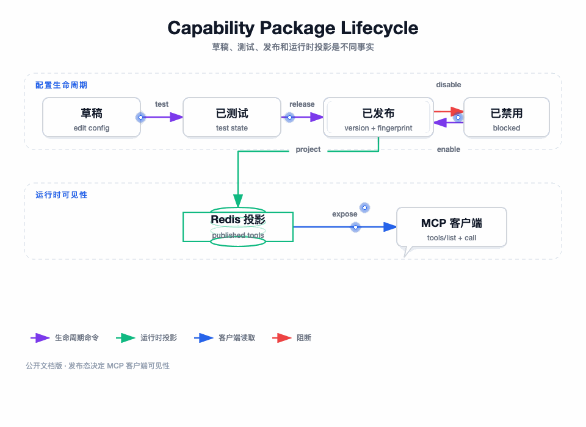

# 能力包发布与运行时缓存：配置态不能直接穿透到运行态

图要回答的问题：草稿、测试、发布、禁用和运行时投影为何必须拆成不同状态。只有发布态才能向 MCP 客户端暴露工具。

## 我为什么引入能力包

如果 MCP 工具列表直接来自所有网关工具，管理端一次保存就会影响线上客户端；如果直接把所有工具放进工具列表，授权范围也无法收敛。能力包提供了一个显式的对外发布单元，工具只有成为能力包成员并完成发布，才进入运行时。

## 发布前校验

发布服务会检查能力包归属、成员状态、工具数量、工具配置、语义卡片和测试准备状态。发布失败时不更新发布版本，也不刷新运行时投影。测试状态单独持久化，避免一条旧测试记录被误读为当前配置已经发布。

## MySQL 事实与 Redis 投影

MySQL 保存网关、工具、协议、能力包、成员关系、测试状态和令牌等业务事实。Redis 保存已发布能力的运行时投影、版本键和脏标记，运行时读取投影以降低管理配置查询压力。

缓存重建在事务完成后触发；如果事务回滚，不能留下新版本投影。如果 Redis 异常，读取逻辑不能把异常转换为空能力，而应按实现策略回源 MySQL 或拒绝本次读取。

## 版本与指纹

能力包发布产生版本和指纹，工具配置变化、成员变化或语义变化都应能体现在发布事实中。客户端看到的是一个稳定的发布版本，而不是管理员正在编辑的下一版草稿。

## 禁用和回滚

禁用是运行时可见性的阻断，启用是重新建立投影的命令，归档是管理生命周期变化。发布、禁用、启用都要更新运行时版本或脏标记，避免仅修改 MySQL 后旧缓存继续提供能力。
