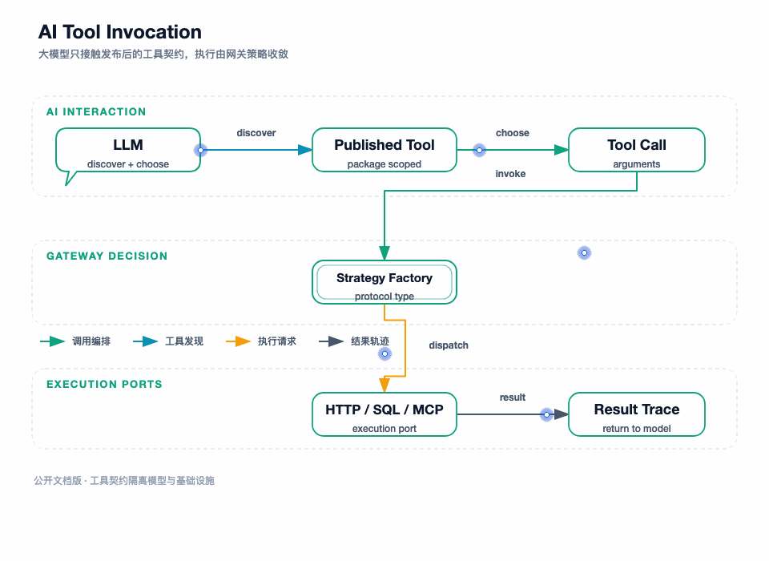

## 我先把 LLM 放回它应该在的位置

在演示里，模型似乎可以“自动调用工具”；在企业系统里，模型只能负责三件事：理解用户意图、从 `tools/list` 选择工具、生成工具 arguments 并组织回答。它不应该判断令牌是否有效、不应该决定工具属于哪个能力包、不应该选择数据库凭证，也不应该绕过数据源安全链。

我把 LLM 看成 MCP Gateway 的一个调用方，而不是权限中心。无论调用来自 LLM、MCP 客户端还是管理台工具测试，最终都要进入同一个工具调用领域服务；授权、范围、协议和数据源安全仍然由网关服务端决定。

图要回答的问题：LLM 通过 MCP 客户端发现工具，生成工具调用，工具回到网关执行并把结果交回模型，模型再决定是否继续调用或生成最终回答。模型循环之外的授权和安全门禁始终由网关掌握。

## 统一工具调用入口

`ToolsCallHandler` 负责 JSON-RPC 参数转换和 MCP 响应映射，真正执行交给 `IToolInvocationService`。这个职责分开后，MCP 层不需要知道 HTTP 如何组装、Redis 如何读写或上游 MCP 如何维护连接。

`ToolInvocationService` 的实际判断是：

1. command 必须有 gatewayId、toolName 和 arguments。
2. 根据 gatewayId + toolName 查询工具协议配置，不接受调用方直接提交完整下游配置。
3. 空 protocolType 按历史兼容逻辑视为 HTTP，否则交给策略工厂匹配协议。
4. 没有匹配策略时返回方法/协议错误，不触达任何下游。
5. 策略返回统一的 `ToolInvocationResultVO`，由 MCP handler 转成 content 和 `isError`。

这个入口是管理台工具测试和正式 MCP `tools/call` 的共同路径。管理台测试在进入这里之前还会保存 expectedFingerprint 并在返回后记录测试状态；MCP 正式调用在进入这里之前还会做 session scope 和 package tool 校验。

## 策略工厂如何隔离三类执行来源

| 策略 | supports 的 protocol | 负责什么 | 依赖的 Domain Port |
| --- | --- | --- | --- |
| `HttpToolInvocationStrategy` | 空值、`http` | 组装 HTTP 请求，执行下游，解包响应 | `IHttpExecutionPort`、`IProtocolExecuteService` |
| `DataSourceToolInvocationStrategy` | `mysql`、`redis` | 运行数据源安全链，生成数据源命令，转换结果 | `IDataSourceRuntimePort` |
| `McpUpstreamToolInvocationStrategy` | `mcp` | 生成上游 `tools/call` 参数并调用原生 MCP | `IMcpUpstreamPort` |

策略工厂只决定谁执行，不决定工具是否已授权；权限和发布 scope 在更靠前的 Session/Capability Package 层处理。数据源策略内部再做一次安全责任链，防止其它调用入口绕过通用 MCP handler。

### HTTP 策略

HTTP 策略先检查 URL 和 method，再调用 `ProtocolExecuteService.assembleRequest`。它把 MCP arguments 转为 path/query/header/cookie/body，交给 `IHttpExecutionPort`；得到响应后调用 `unpackResponse`。连接异常形成没有 response 的失败结果，非 2xx 保留 response 并标记 failureReason，解包异常也不会重新发起请求。

### 数据源策略

数据源策略要求 arguments 是 JSON object，把参数拷贝成字符串 key 的 Map，经过协议白名单、写授权、结构化参数和 SQL/Redis 专项规则后，才创建 `DataSourceToolExecutionCommandEntity`。策略把数据源执行结果包装成统一文本；领域拒绝继续抛出，运行时异常转换为“数据源调用失败”的统一结果。

### 上游 MCP 策略

上游 MCP 策略确认 endpoint、上游工具名和 port 存在，把本地工具参数放进 `tools/call` 结构，调用 `IMcpUpstreamPort`。上游 MCP 返回业务错误时，策略保留文本并标记失败；连接异常不伪造成功响应。上游工具的调用只使用本地已发布工具对应的 endpoint 和 upstreamToolName，不让模型提交目标 URL。

## MCP 结果如何表达给客户端

`ToolsCallHandler` 把统一结果转换为 MCP JSON-RPC response：content 中放一个 text item，优先使用解包结果，否则使用 failureReason；网络失败、非 2xx、数据源执行失败或上游业务错误会映射为 `isError=true`。参数、范围或协议配置异常进入 JSON-RPC error。

两种错误的区别很重要：

| 类型 | 例子 | 客户端/LLM 应如何理解 |
| --- | --- | --- |
| JSON-RPC error | 参数不是对象、工具不在 package、协议配置缺失 | 本次调用没有进入有效执行，通常应修正请求或重新授权 |
| tool result error | HTTP 500、下游超时、Redis 执行异常、上游工具业务失败 | 已经进入执行路径但下游没有产出成功结果，模型可根据文本决定重试或换能力 |

网关不能把所有下游错误都包装成 200 成功文本，也不能把一个已经触达外部资源的失败简单重试。执行策略返回 request、duration 和 failureReason，为工作台、日志和测试状态保留诊断事实。

## 上游 MCP 导入和运行不是同一动作

管理端导入上游 MCP 时，由 `UpstreamMcpImportService` 先校验配置，调用 `initialize` 和 `tools/list` 取得 `UpstreamMcpPreviewVO`。管理员只从预览中选择工具，系统将选择结果保存为本地工具和 `mcp` 协议配置。

运行时调用时，本地工具名可以与上游工具名不同；本地配置保存 endpoint、transport、上游工具名、input schema 和 timeout，由策略把本地 arguments 转给上游。这样上游服务的全量工具列表不自动成为本地客户端的全量工具列表。

上游连接管理器还会在 heartbeat 失败后重建连接并重新执行 initialize/tools/list。`McpUpstreamPortIntegrationTest` 已验证首次连接、断链恢复、工具调用、上游结果和无认证上游不透传 Authorization/Cookie。

## Spring AI 如何真正调用 MCP 工具

Infrastructure 的 `LLMGatewayService` 为每个 gatewayId 管理一个 `GatewaySlot`，slot 内保存 ManagedChatSession、McpSyncClient、ChatModel 和工具调用记录器。管理端 LLM 测试调用 Domain `LLMService`；如果要求 reload 或该网关尚未初始化，port 重新创建会话。

建会话时的关键动作是：

- 根据 baseUri 和 SSE endpoint 构造 `HttpClientSseClientTransport`。
- 使用 MCP SDK 执行 initialize，确认上游/本地 MCP 服务可用。
- 通过 `SyncMcpToolCallbackProvider` 把 MCP tools 转成 Spring AI ToolCallback。
- 用 `TrackingToolCallback` 包裹 callback，记录工具名和成功/失败/未知状态。
- 创建带 timeout 的 OpenAI-compatible ChatModel，模型配置来自应用配置，工具回调绑定到当前 MCP client。

因此 LLM 侧看到的是 MCP `tools/list` 生成的工具定义；模型产生 tool call 后，Spring AI callback 会回到 MCP client，再由网关 session、scope、handler 和策略完成执行。LLM 不需要知道 MySQL、Redis 或 HTTP 的内部连接细节。

## 一次 LLM 测试如何判定成功

`LLMService.callGateway` 先校验 gateway、MCP 配置和消息，MCP timeout 必须在 1000 到 300000 毫秒之间。LLM port 返回回答和工具调用轨迹后，Domain 根据测试命令判断：

- 如果不要求工具调用，只返回模型结果。
- 如果要求工具调用但没有轨迹，返回 `AI_TOOL_CALL_NOT_EXECUTED`。
- 有轨迹但没有成功工具，返回 `AI_TOOL_CALL_FAILED`。
- 配置了 expected tool names 时，成功工具集合必须覆盖期望集合，否则返回 `AI_TOOL_CALL_MISMATCH`。
- provider timeout 映射为 `AI_PROVIDER_TIMEOUT`，不与工具业务错误混淆。

`TrackingToolCallback` 对异常做了更细的区分：明确的 MCP JSON-RPC 拒绝记录 FAILED，无法确定工具是否已经触达下游的异常记录 UNKNOWN。UNKNOWN 不能被当成“肯定没有副作用”，这为企业后续重试和人工核查保留了安全语义。

## 会话重载和并发关闭

一个 gatewayId 的 LLM 会话使用 slot 锁替换旧 ManagedChatSession。新会话建好后才切换引用，旧会话在替换后关闭；如果旧会话仍有一次模型调用，ManagedChatSession 使用 callLock 保证调用完成后再关闭 MCP client。

这避免了配置 reload 时出现半初始化 client，也避免关闭线程与正在进行的 tool call 同时操作同一个 MCP client。`@PreDestroy` 在应用退出时遍历 slot，设置关闭标记并释放客户端。

当前实现的会话槽位是 JVM 本地的。若多实例部署，每个实例都要管理自己的 LLM/MCP client，不能假设某一实例的已初始化 slot 会被其它实例共享；若将 LLM 联调做成生产能力，还应加上并发、provider 限流、prompt 注入防护和调用审计。

## 失败如何定位

| 现象 | 先查哪一层 | 不应直接做什么 |
| --- | --- | --- |
| 模型没有选择工具 | tools/list、工具描述、schema 和 expected names | 先不要盲目调高模型参数 |
| 工具名不存在 | session package scope、发布投影和本地工具配置 | 不要让客户端传自定义 endpoint |
| 参数被拒绝 | JSON-RPC 参数、协议 mapping 或数据源责任链 | 不要放宽服务端校验来迁就一次调用 |
| HTTP 返回非 2xx | request 组装、下游状态、response mapping | 不要把非 2xx 改成成功 |
| 数据源执行失败 | 数据源启停、凭证、操作白名单和运行端口 | 不要直接开放原生 SQL/Redis command |
| 上游 MCP 失败 | upstream initialize、heartbeat、tools/list 和 timeout | 不要因为超时生成新工具或新 endpoint |
| LLM timeout | provider HTTP timeout、MCP timeout、工具执行耗时 | 不要把 provider timeout 当工具成功 |

## 测试证据

`ToolInvocationServiceTest` 验证策略调用入口和协议缺失；`ToolsCallHandlerTest` 验证 MCP 结果映射；`DataSourceInvocationSafetyChainTest` 覆盖数据源执行前拒绝。

`LLMServiceTest` 验证没有工具调用、工具调用失败、工具调用不匹配、参数校验和正常返回；`TrackingToolCallbackTest` 验证成功、明确 MCP 拒绝和未知异常的轨迹状态。

真实验收资料记录了模型成功调用 `search_company_employees` 一次，并返回两名员工结果；这证明的是“模型发现并调用已发布 MCP 工具”的联调路径，不代表所有模型在所有 Prompt 下都能稳定选择正确工具。

## 本篇结论

工具执行层用策略工厂隔离 HTTP、数据源和上游 MCP，MCP handler 只负责协议转换，数据源策略自带安全责任链；LLM 通过 MCP client 获得工具回调，但它只是调用方，不能改变服务端 scope 和执行边界。下一篇把这些边界集中起来，说明 token、网关、能力包、会话、工具和数据源如何构成多层隔离。

下一篇：[认证、权限与隔离](./09-认证权限与隔离.md)
