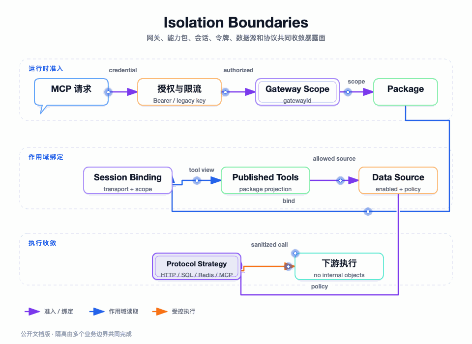

## 我不把“鉴权通过”当成“可以执行任何工具”

一个请求通过 Bearer 校验，只能说明凭证仍然有效；它没有说明请求属于哪个网关、客户端应该看到哪个能力包、工具是否已发布、数据源是否可用，或者这次写操作是否获得了二次确认。

我把权限拆成多个连续边界：凭证身份、Gateway 归属、Capability Package scope、MCP Session 上下文、Tool scope、Protocol 执行策略和 Data Source 安全门禁。每一层只回答一个问题，下一层不能假设上一层替自己回答了所有问题。

图要回答的问题：一次调用中的凭证、网关、能力包、会话、工具、协议和数据源如何逐层收窄，哪些边界由服务端事实决定，哪些拒绝发生在真实下游之前。

## 隔离模型：从外到内逐层收窄

| 层级 | 服务端事实 | 防止的错误 |
| --- | --- | --- |
| Credential | tokenId/secret 摘要、状态、过期时间、限流配置 | 使用伪造、过期或撤销凭证 |
| Gateway | URL gatewayId 与配置归属 | 把一个网关的工具拿到另一个网关执行 |
| Package | token 绑定的 packageId 和发布状态 | 看到网关全部工具或草稿工具 |
| Session | sessionId、gateway、transport、package/token scope | 伪造 packageId、跨网关复用 session |
| Tool | 已发布投影中的 toolId/toolName | 只过滤列表、不防直接构造调用 |
| Protocol | 服务端查询到的 HTTP/MCP/Data Source 配置 | 调用方自定义 endpoint 或执行策略 |
| Data Source | sourceType、dataSourceId、启停、写开关和凭证 | 跨类型、停用资源或高风险操作 |
| Action | operation、arguments、confirmWrite、返回上限 | SQL 全表修改、Redis 任意命令和大结果 |

这组边界形成的是纵深防御，不是重复实现。越靠前越关注“能不能进入”，越靠后越关注“进入后具体能做什么”。

## 包级 token：把运行授权绑定到发布单元

### 签发

`PackageAccessTokenService.issue` 先确认请求的能力包可管理、属于当前 gateway 且没有归档。随后生成 32 字节高熵随机 secret，使用无填充 Base64URL 表示，并生成 32 位十六进制 tokenId。对外 token 的结构是 `mcp_<tokenId>.<secret>`，管理端只在签发响应中拿到完整明文。

MySQL 只保存 tokenId、token hash、hash key version、末四位 hint、tokenName、状态、过期时间、限流次数和窗口等元数据。明文 secret 不落库。HMAC 摘要由 `IAccessTokenHashPort` 生成和校验，真实 HMAC secret 通过启动环境注入。

### 鉴权

`AuthLicenseService` 根据凭证是否以 `mcp_` 开头选择包级 token 分支。`PackageAccessTokenService.authenticate` 严格解析 tokenId 和 secret 格式，查询 token 记录后依次校验：

- token 存在且状态为 ACTIVE。
- 当前时间仍早于 expireTime。
- secret 与保存的 hash 和 key version 匹配。
- `IPackagePublicationAccessPort` 判断 token 绑定的 package 在当前 gateway 上仍处于当前发布态。

成功结果不是一个 boolean，而是 `AccessAuthorizationVO`：包含 authorized、legacy、gatewayId、packageId、tokenId、rateLimit 和 rateLimitWindowSeconds。Session 创建时保存这些非敏感授权事实，后续消息从 session 恢复 scope。

这一步把 token 与发布状态绑定起来：管理员停用或使能力包发布失效后，即使 token 尚未到期，也不能建立或继续使用有效运行范围。

## 旧 API Key 兼容：兼容边界要明确

项目仍支持一个版本的旧网关 API Key，以便既有客户端迁移。旧认证分支读取网关认证状态：未开启强认证的网关按兼容规则授权；已配置的旧凭证校验状态和过期时间；没有过期时间的旧凭证按原有规则长期有效。

旧认证返回 `legacy=true` 且 packageId 为空，运行时按网关级工具范围工作。包级 token 格式错误时不会回退到旧认证，避免一个伪造的 `mcp_` 字符串绕过新 token 语义。

旧 SSE 允许旧 API Key 通过兼容路径传递，但明确拒绝 `mcp_` 包级 token；新 token 只能通过 Streamable HTTP Authorization Bearer。迁移完成后，企业应逐步关闭旧认证，因为旧网关级范围无法提供能力包级最小授权。

## 会话 scope：客户端不能提交自己的权限范围

Streamable HTTP initialize 通过认证后创建 session。后续 POST 只使用客户端提交的 sessionId 查找服务端 SessionConfigVO，并比较：

- 请求路径 gatewayId 与 session.gatewayId 相同。
- session.transportType 是 Streamable HTTP。
- session 仍 active 且未超过 idle timeout。
- 新认证会话同时具有 packageId 和 tokenId。

`SessionMessageService` 从已恢复的 SessionConfigVO 推导 package scope：legacy 会话返回空 packageId，包级会话必须返回服务端保存的正 packageId；任何缺失或不一致都返回权限不足。调用方不能在 JSON-RPC params、query 参数或请求 header 中提交另一个 packageId 来替换服务端 scope。

GET 监听和 DELETE 同样验证 gateway 与 transport，避免一个有效 sessionId 被拿到其它网关或旧 SSE 路径使用。删除会话会回收本地 Sink、event sequence 和 replay buffer，并删除共享元数据。

## 工具范围：列表过滤和调用复核必须同时存在

包级 `tools/list` 读取 `PublishedCapabilityPackageVO.enabledToolIds`，再按这个有序集合加载工具配置；它不会读取网关全部工具。工具名、描述和 input schema 由当前发布投影决定，草稿和禁用成员不会进入列表。

但列表不是安全边界。`ToolsCallHandler` 解析客户端传来的 tool name 后，再调用 `requirePublishedTool` 读取当前发布投影并确认 enabledToolNames 包含该名称。未通过时不会进入 `ToolInvocationService`，也不会触达 HTTP、JDBC、Redis 或上游 MCP。

我特意保留这次二次复核，因为 MCP 客户端可以缓存工具列表，也可以直接构造 JSON-RPC 请求；不能假设它一定只调用上次看到的工具。发布失效、成员变化和 token 撤销也需要在真实调用前被重新识别。

## 数据源隔离：工具名不能扩大数据权限

数据源工具配置保存 dataSourceId 和 operation，但调用方只提交工具 arguments。`DataSourceToolInvocationStrategy` 根据服务端配置加载数据源类型，再由责任链判断 operation 与 arguments；它不会接受调用方自定义 dataSourceId、sourceType、host、credential 或原生命令。

执行端口再次读取 dataSourceId 对应的配置和加密凭证，要求来源类型与 command 一致，并在真实执行时检查 `ENABLED`。凭证解密只在端口内发生，JDBC/Redisson 连接每次使用后释放。一个工具如果被重新配置到另一数据源，必须重新测试并发布，不能因为 toolName 不变而沿用旧发布事实。

数据源级隔离仍不是租户级数据权限。当前项目能控制“调用哪个数据源、执行哪种操作、是否写入、返回多少”，但不能凭通用 SQL 规则自动理解企业组织、租户、行列敏感级别。生产必须继续使用数据库账号、视图、网络策略、脱敏和审计组合控制。

## 限流：区分旧凭证和包级 token

Streamable HTTP 只对 `tools/call` 进入限流服务：

- 包级 token 使用会话保存的 tokenId、rateLimit 和窗口配置，交给 `IAccessRateLimitPort` 做分布式获取。
- 旧 API Key 使用 gatewayId + apiKey 的本地 Guava RateLimiter 缓存，按旧逻辑把每小时次数换算为每秒速率。
- 包级配置缺失或非正数按拒绝处理；旧配置缺失时按兼容规则放行，数据库读取异常也遵循旧逻辑记录并放行。

这两个分支的可靠性不同：包级 token 可以覆盖多实例，旧 API Key 限流器是实例本地缓存，集群总量不能仅靠单实例设置保证。企业迁移到包级 token 后，仍需监控 Redis/限流端口故障时的放行策略；当前代码对分布式限流异常记录日志并放行，这是可用性优先的选择，生产高风险写工具可以改成 fail-closed。

## 凭证保护和连接信息保护

数据源凭证使用 AES-GCM 加密，secret 记录保存 cipher algorithm、key version、iv 和 ciphertext。密钥通过环境变量或外部密钥服务注入，不能写入仓库配置；密钥轮换需要按 key version 支持解密旧数据并重新加密。

包级 token 采用 HMAC 摘要，旧 API Key 兼容配置则不应在日志和连接卡中明文输出。工作台连接配置只生成指向 token 环境变量的配置，不把 token 放入 URL 或 TOML 明文；LLM/MCP 连接日志只打印是否配置凭证，不打印凭证值。

这里有一个实际边界：当前 `SessionConfigVO` 对旧认证会话保留 legacy credential 以支持旧 SSE message endpoint；新包级认证不保存明文 token。企业完成迁移后应移除旧 query 参数协议，并让所有会话只保存 tokenId 与授权摘要。

## 错误分类和安全决策

| 错误 | 发生层 | 安全含义 |
| --- | --- | --- |
| token 格式、hash、状态或过期错误 | Auth | 不建立会话 |
| token 对应包未发布 | Auth/Package | 不建立或不继续有效 scope |
| session 不存在、网关不匹配 | Session | 不处理 JSON-RPC |
| 工具不在发布投影 | Tool scope | 不触达下游 |
| 协议类型和配置不匹配 | Invocation | 不选择执行策略 |
| SQL/Redis 参数不安全 | Data Source safety | 不创建真实数据源执行动作 |
| 下游 401/403/500/timeout | Execution | 记录工具错误，不扩大客户端权限 |
| 限流命中 | Rate limit | 当前工具调用被拒绝，会话可保留 |

错误消息可以向客户端返回可行动的原因，但不能返回密码、连接串、完整 SQL 敏感值或内部网络拓扑。审计记录应区分“被拒绝”和“已经触达下游后失败”，这决定后续是否需要人工核对副作用。

## 当前权限边界的诚实结论

项目已经实现的是运行面授权闭环：token 绑定发布包、session 保存服务端 scope、工具列表按发布投影收敛、调用前二次检查、数据源安全链和凭证加密。它还不是完整的企业 IAM：

- 管理端没有在本工程内完成组织、角色、用户和审批流的完整模型。
- 能力包发布规则目前关注生命周期、成员、语义、测试和 token，不包含企业级双人审批。
- 数据源安全链不能替代租户行列权限和敏感数据脱敏。
- 旧 API Key 的本地限流和 legacy session 是迁移兼容能力，不是长期推荐模型。

生产部署时，我会把管理身份接入 SSO/RBAC，把发布权限映射到能力包操作，把高风险数据源操作接入审批和审计，再用包级 token 作为 AI 运行面的最小授权凭证。

## 测试证据

`PackageAccessTokenServiceTest` 验证 token 只在签发时返回明文、数据库保存 HMAC hash、错误 token/过期 token/撤销 token 被拒绝、能力包作用域正确传入授权结果；`PackageAccessTokenMapperTest` 验证可管理与已发布包的网关归属查询。

`McpGatewayControllerBearerTest` 验证 Bearer 进入命令、旧 SSE 拒绝包级 token；`McpStreamableHttpAuthenticationTest` 验证 initialize 后 session header 和包级授权上下文建立；`SessionMessageServicePackageScopeTest` 与 `ToolsListHandlerPackageScopeTest` 验证 scope 不被客户端伪造。

`AesGcmDataSourceCredentialCipherTest` 验证数据源密文、IV 和 key version；`DataSourceInvocationSafetyChainTest` 验证 write confirmation、Redis command 禁止和 SQL 安全规则；`AuthRepositoryPackageTokenCacheTest` 验证 token 查询缓存与失效边界。

## 本篇结论

隔离不是一个 Filter，而是 token、发布包、session、tool、protocol 和 data source 共同收窄的结果。`tools/list` 负责减少可见性，`tools/call` 负责阻止直接构造，数据源责任链负责控制副作用，密钥与限流负责控制凭证生命周期。下一篇继续看这些事实在多实例部署时如何共享，哪些资源仍然只存在当前 JVM。

下一篇：[一致性、多实例与部署](./10-一致性多实例与部署.md)
