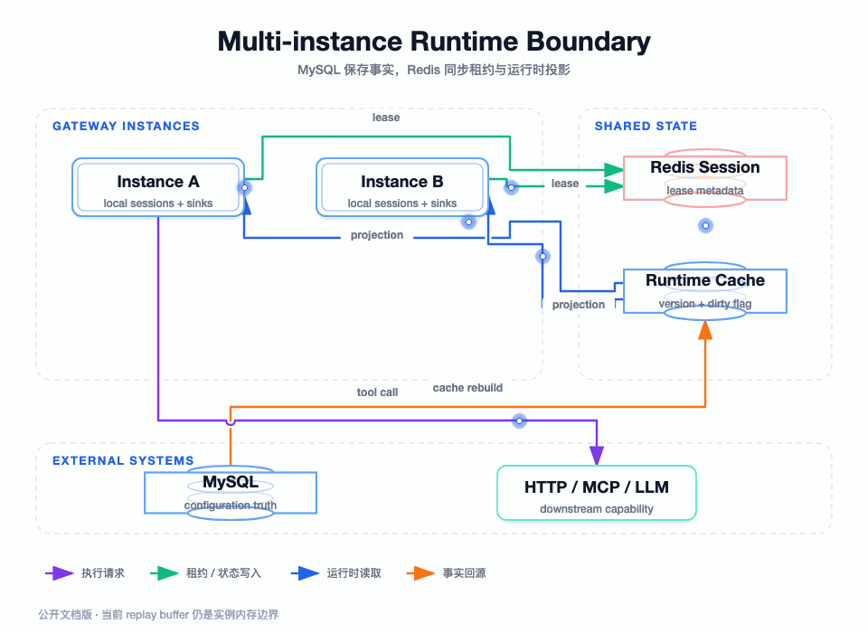

## 我先区分三种状态

这个项目同时使用 MySQL、Redis 和 JVM 本地内存。如果不区分它们的权威性，很容易把“Redis 里有数据”误认为“业务已经发布”，或者把“某个实例有 Sink”误认为“集群里的会话都可用”。

我的划分是：MySQL 保存长期业务事实，Redis 保存可重建的运行时投影和共享协调状态，JVM 内存保存当前实例的连接资源。它们之间有同步和失效关系，但不是一个存储系统的三个副本。

图要回答的问题：多个应用实例共享哪些数据，缓存和会话同步如何工作，哪些连接和 replay 资源仍然依赖某个具体 JVM，以及故障时应该回源、重建还是重新初始化。

## 状态分类和事实权威

| 状态 | 当前存储 | 是否可重建 | 权威性 | 主要消费者 |
| --- | --- | --- | --- | --- |
| 网关、工具、协议、映射 | MySQL | 否，需业务数据 | 配置事实 | 管理面、工作台、运行时回源 |
| 能力包、成员、发布版本 | MySQL | 否，需业务事务 | 发布事实 | token 认证、运行时投影构建 |
| token 元数据和 hash | MySQL | 否，需安全事实 | 授权事实 | Auth、限流、管理面 |
| 数据源密文 | MySQL secret 表 + 环境密钥 | 不能凭缓存恢复 | 凭证事实 | DataSourceRuntimePort |
| 发布能力投影 | Redis | 是，可从 MySQL 重建 | 运行时加速投影 | package scope、tools/list |
| 工具完整配置投影 | Redis | 是，可从 MySQL 重建 | 运行时加速投影 | ToolsListHandler、调用配置读取 |
| session 元数据 | Redis Map | 是，可在实例重启时重建本地资源 | 共享连接上下文 | SessionManagementService |
| session Sink、event sequence | JVM 本地 | 否，需重新创建 | 当前连接资源 | Reactor SSE/Streamable HTTP |
| replay buffer | JVM 本地固定长度队列 | 否，重启丢失 | 单实例恢复能力 | Last-Event-ID GET |
| LLM/MCP client slot | JVM 本地 | 是，可按 gateway 重载 | 联调连接资源 | LLMGatewayService |

重点是“发布事实”和“发布投影”不同：MySQL 中的 publishedVersion/publishedFingerprint 决定能否构建有效投影，Redis 只是让运行面快速读取；Redis 中不存在投影不等于能力不存在，Redis 故障时可以回源并重建。

## 能力包缓存：版本键、脏标记和回源锁

### 为什么不直接删除一个固定 key

如果发布时直接删除一个固定 package key，正在读取旧配置的请求可能在删除前拿到旧数据，删除后又可能把旧结果写回去；多个包同时变化时，还需要逐个扫描和删除。项目使用网关级运行时版本：package key 携带 gatewayId、version 和 packageId，版本切换后旧版本天然不再是当前读取目标。

### 读取和回填的保护

运行时读取先检查 dirty，再捕获 version；查询缓存前后都确认 dirty 不存在且 version 仍是同一个值。未命中后，单包回源锁只用于降低并发 MySQL 查询；拿到锁的实例会二次检查缓存，避免多个实例一起回源。

回源成功且版本稳定才允许写入投影。若配置在 MySQL 查询期间发生变更，旧查询结果不能写入新版本。若 Redis 发生异常，读取逻辑按 cache miss 回源 MySQL，写缓存失败只记录告警，不影响已经形成的业务事实。

### 脏标记为什么需要独立 mutation

一次事务写入前先加入 dirty mutation，并设置超过正常缓存最大 TTL 的过期时间。提交后切换网关版本并只移除自己的 mutation；回滚时不切换版本，只移除自己的 mutation。

如果版本切换失败，仓储保留 dirty，旧投影不能重新获得信任，直到 dirty TTL 到期或运维恢复 Redis 后完成切版。这是可用性与一致性的取舍：发布窗口内宁可回源或暂时拒绝，也不让旧发布数据继续承担新授权。

### TTL 和负缓存

当前正常投影默认 5 分钟，增加最多 30 秒随机抖动；未发布或失效包的空结果默认缓存 10 秒。正常投影避免频繁回源，抖动避免大量 key 同时过期；负缓存避免不存在包被高频请求持续打 MySQL，同时短 TTL 让管理员发布后不会长时间看不到新能力。

## 会话多实例：Redis 保存元数据，实例保存流资源

### Redis Map 和 Topic 的职责

`SessionPort` 使用 `ai:mcp:gateway:session:active` 保存活跃会话元数据，使用 `ai:mcp:gateway:session:sync` 广播 CREATE/REMOVE 事件。元数据包含 sessionId、gatewayId、transport、legacy/package/token scope、限流配置、创建时间、最后访问时间和 active 状态，不包含本地 Sink。

新会话在本地创建 Sink 后先写 Redis Map，再广播 CREATE；其它实例收到事件后通过 `SessionDistributedService` 重建本地 SessionConfigVO 和新的 Sink。删除会话时先移除本地资源，最终确保 Redis 元数据删除，并在实际删除成功后广播 REMOVE。

### 为什么不能把 Sink 放进 Redis

Reactor Sink 是 JVM 内对象，不能序列化成跨进程可用的实时连接。即使把 session 元数据共享到所有实例，也只能让其它实例知道“这个会话存在”，不能让它们直接向原实例的 HTTP 响应推送数据。因此负载均衡必须让后续 GET/POST 落到拥有有效连接资源的实例，或者引入真正共享的事件传输层。

### 启动恢复

应用启动时，`SessionManagementService` 从 Redis Map 加载全部会话：超过 idle timeout 的元数据会删除，仍有效的会话在本地重建 Sink 和事件序列。这个动作只恢复连接上下文，不能恢复已经丢失的 JVM replay 事件；客户端若带有无法命中的 Last-Event-ID，需要按当前协议策略重新初始化或接受恢复空窗。

## 本地 replay 是当前最大的集群边界

`InMemoryStreamableSessionReplayPort` 以 sessionId 建立固定容量 200 的事件队列。发布事件先追加到队列，再尝试推送实时 Sink；GET 带 Last-Event-ID 时从队列快照中查找游标并补发后续事件。

它适合证明协议语义和单实例断线恢复，但有三个明确限制：

- 实例重启后队列丢失。
- 事件发布到 A 实例后，B 实例无法读取 A 的事件。
- 队列超过 200 条后最早事件淘汰，Last-Event-ID 可能无法命中。

当前实现未把这部分包装成跨实例可靠消息系统。生产有两种路线：使用共享短期事件存储，并按 session/sequence 做原子追加和读取；或者在负载均衡层保持会话粘性，并把故障后的行为定义为重新初始化。若业务要求不丢 MCP 事件，必须采用前者，并增加跨实例、重启和 buffer gap 测试。

## 多实例下的 LLM/MCP 客户端

`LLMGatewayService` 以 gatewayId 在当前 JVM 中维护一个 GatewaySlot，slot 里有 MCP client、ChatModel、callback 和调用锁。配置 reload 时先创建新 session，锁内替换旧 session，旧 session 等当前调用结束后再关闭。

这个 slot 不是共享服务状态。多实例部署时，每个实例独立初始化自己的 LLM/MCP client；如果管理请求在不同实例之间切换，可能出现某实例尚未建立 ChatModel 的情况。生产若要提供稳定的 LLM 联调，应设置粘性、预热或把调用交给独立的模型编排服务，并明确 provider 配额按实例还是按网关汇总。

## 部署资料中的实际形态

### 应用镜像

`ai-mcp-gateway-app/Dockerfile` 基于 `openjdk:17-jdk-slim`，把构建产物放入镜像，使用 `JAVA_OPTS` 和 `PARAMS` 启动。Docker Compose 应用示例把容器 8091 端口暴露到宿主机，日志挂载到 `/data/log`，容器失败自动重启。

### 数据源集成测试栈

`docker-compose-datasource-test.yml` 是独立的测试依赖栈：MySQL 8.0.32 负责初始化网关 schema 和目标业务表，Redis 6.2 关闭持久化并设置测试密码，两个服务都有 healthcheck。测试端口使用可覆盖的环境变量，避免与本机已有服务冲突。

这个测试栈只为集成测试服务，不代表生产拓扑。生产 MySQL、Redis 和应用应使用独立网络、持久卷、备份、监控和凭证管理；测试用的 root 密码和 Redis 密码不能进入生产配置。

### 配置注入

根配置已经把敏感和运行参数抽成环境变量：

| 配置 | 当前默认/示例 | 生产建议 |
| --- | --- | --- |
| `MCP_DATASOURCE_AES_KEY` | 空，启动时必须注入才能使用数据源 | 使用密钥管理服务，配置 key version 和轮换策略 |
| `MCP_ACCESS_TOKEN_HMAC_SECRET` | 空，启动时注入 | 使用独立 secret，限制读取权限 |
| `MCP_WORKBENCH_PUBLIC_BASE_URL` | prod 为空 | 配置真实 HTTPS 公网/内网地址，供连接卡生成 |
| Redis host/password | dev 使用本机示例 | 使用私网、TLS、ACL 和连接池监控 |
| MySQL URL/username/password | dev 仅用于本地联调 | 使用独立最小权限账号和连接加密 |
| LLM base URL/API key/model | dev 示例配置 | 使用 provider secret、超时、配额和审计 |
| session/cache timeout | root/application 默认值 | 按客户端连接、负载、事件可靠性重新评估 |

生产不应复制 `application-dev.yml` 中的固定密码、API key、localhost 地址和测试端口；`application-prod.yml` 目前只保留基础生产配置，数据库等基础设施需要由部署环境补齐。

## 一次发布在多实例中的一致性边界

管理员修改能力包时，MySQL 事务负责保证 package、member、published snapshot 的内部一致性；缓存仓储通过 dirty 和 version 让运行时停止信任旧投影；其它实例不需要收到“删除每个 key”的广播，因为它们下一次读取会捕获新的网关版本。

这不是严格的跨存储原子提交。存在一个短暂窗口：MySQL 已提交但 Redis 版本切换失败，此时 dirty 保持，运行面可能回源或失败；Redis 版本切换成功后，缓存仍需要懒加载。这个结果是可观察且可修复的，比旧投影继续被当成新授权更安全。

## 故障场景和处理策略

| 故障 | 影响 | 当前行为 | 生产动作 |
| --- | --- | --- | --- |
| Redis 读失败 | 无法读取投影或 session | 能力投影回源；session 访问可能失败 | 告警、恢复 Redis、检查连接和 ACL |
| Redis 写失败 | 投影/版本无法更新 | 投影写失败记录日志；切版失败保留 dirty | 不要手工清 dirty，先恢复 Redis |
| MySQL 读失败 | 无法回源配置 | 运行请求失败 | 检查连接池、数据库健康和慢查询 |
| 应用实例重启 | 本地 Sink、序列和 replay 丢失 | Redis 元数据可恢复，事件不保证 | 负载粘性或共享 replay，明确重新初始化 |
| Topic 消息丢失 | 其它实例未及时重建/移除本地资源 | 启动全量恢复可兜底 | 监控订阅、定期校准本地与 Redis 状态 |
| LLM slot 未初始化 | 当前实例不能联调 | `LLMService` 按需 reload | 预热或独立编排服务 |
| 下游数据源不可达 | 工具执行失败 | 返回统一运行时失败 | 独立网络、连接测试、熔断和告警 |

## 本篇结论

多实例设计的关键不是把所有状态都放进 Redis，而是知道每种状态为什么存在、谁是权威、能否重建。MySQL 负责配置和发布事实，Redis 负责投影、会话元数据和跨实例通知，JVM 负责当前连接和 replay 资源。当前工程的主要生产缺口是跨实例 replay 和更完整的部署安全配置，这些必须在容量与可靠性评审中显式处理。下一篇用测试、验收和排障把前面所有边界落成可以验证的证据。

下一篇：[测试、验收与故障排查](./11-测试验收与故障排查.md)
