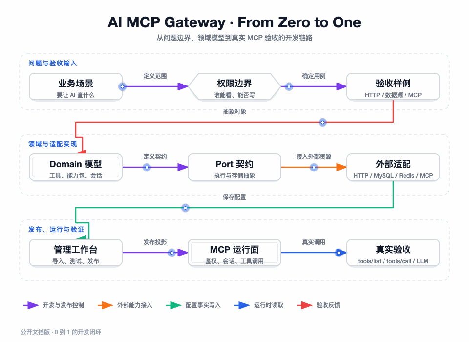

## 我为什么从一条垂直链路开始

这个项目如果从“先把所有接口做出来”开始，最后很容易得到一组彼此孤立的管理接口：能保存网关，能保存工具，能测试 HTTP，但不知道 AI 是否能真正发现和调用；或者能让 MCP 客户端拿到工具列表，却没有能力包、Token 和数据源边界。

所以我从一条可以验收的垂直链路切入：让 AI 查询一个企业的基本信息和员工列表。这个样例足够小，可以在本地快速闭环；同时它包含 GET 的 path/query/header 映射、POST 的 body 映射、MCP `tools/list`、MCP `tools/call` 和真实 LLM 工具调用，能够把最关键的边界一次验证出来。

我在开发过程中固定了四个验收问题：

1. 管理者是否能从外部能力形成稳定的工具契约？
2. 草稿、测试和发布是否有明确闸门，未发布配置是否不会泄露给 MCP 客户端？
3. 客户端能否通过 Streamable HTTP 建立带能力包 scope 的会话，并完成真实调用？
4. 下游是 HTTP、MySQL、Redis 还是上游 MCP，是否都能在同一个工具调用边界内被授权、执行和解释？



图要回答的问题：我先从业务场景和权限边界确定验收样例，再依次落领域对象、Port、外部适配和管理工作台，最后以 MCP 和真实 LLM 调用作为闭环验收。红色回路表示真实验收发现的问题要反馈回对象或边界设计，而不是只修 Controller 返回值。

## 第一阶段：先把项目运行起来，再确定可重复的样例

### 1. 先确认工程实际形态

完整源码已开源在 GitHub：[AI-MCP-Gateway](https://github.com/jiangnuonnuo/AI-MCP-Gateway)，以下命令与配置都可以直接对照仓库运行。根工程是 Maven 多模块项目，Java 编译目标是 17，Spring Boot 应用模块是 `ai-mcp-gateway-app`。模块依赖关系不是多个独立服务，而是一份最终由 App 启动的分层单体：`api` 提供契约，`trigger` 提供入口，`case` 组织场景，`domain` 保留业务边界，`infrastructure` 连接 MySQL、Redis、HTTP、MCP 和 LLM。

我先用跳过测试的打包确认模块和资源完整，而不是一开始就排查外部服务：

```bash
./mvnw -q -pl ai-mcp-gateway-app -am package -DskipTests
```

这一步只回答“代码和资源能不能组装成应用”，不回答数据源、MCP 或大模型是否可用。打包成功后，才进入真实依赖准备。

### 2. 注入启动期安全配置

数据源凭证和能力包 Token 的密钥不从管理接口传入，也不应该写入文档、Git 或前端。开发环境可以使用临时值，启动前至少准备：

```bash
export MCP_DATASOURCE_AES_KEY="<base64-encoded-16-24-or-32-byte-key>"
export MCP_DATASOURCE_AES_KEY_VERSION="1"
export MCP_ACCESS_TOKEN_HMAC_SECRET="<development-only-secret>"
export MCP_ACCESS_TOKEN_HMAC_KEY_VERSION="1"
```

`application-dev.yml` 当前使用本机 MySQL、Redis 和 8797 端口，Servlet context path 是 `/api-gateway`。开发配置里还存在固定的示例密码、Redis 密码和 OpenAI-compatible API 地址，这些只是本地联调输入，不能直接迁移到生产。

如果要验证数据源真实能力，我先启动仓库提供的 MySQL 8.0.32 与 Redis 6.2 测试栈：

```bash
docker compose -p mcp-gateway-datasource-test \
  -f docs/dev-ops/docker-compose-datasource-test.yml up -d --wait
```

应用启动后，统一管理端前缀是 `/api-gateway/admin/`，MCP 地址模板是：

```text
http://127.0.0.1:8797/api-gateway/{gatewayId}/mcp
```

### 3. 先准备一个不会掩盖问题的下游

项目提供了协议导入联调专用的本地 HTTP Controller。它不是生产业务接口，而是为了让导入和执行链路有一个稳定下游：

| 下游接口 | 用来验证的映射 | 固定约束 |
| --- | --- | --- |
| `GET /test/import-demo/companies/{companyId}` | path、query、header | `sessionId` 必须是联调固定值 |
| `POST /test/import-demo/companies/{companyId}/employees/search` | path、query、header、body | 返回两名员工和摘要字段 |

我先使用这个固定下游验证工具映射，再接真实企业 API。这样如果调用失败，可以先判断是映射组装错误，还是企业服务的网络、权限和业务错误；不会在第一天就把所有故障混在一起。

## 第二阶段：先建边界，再写具体适配器

### 1. 先落领域对象，而不是先做表单

我先确定最小的业务对象集合：Gateway 表示顶层归属，Tool 表示 AI 看到的契约，Protocol 表示如何执行，Data Source 表示受控连接资源，Capability Package 表示客户端可见范围，Session 表示一次 MCP 连接，Tool Invocation 表示一次执行。

这个顺序很重要。若先从管理页面字段开始，往往会把 URL、数据库密码、工具描述、发布状态和会话 ID 拼成一个“配置对象”；后面补权限时，只能在 Controller 外层打补丁。先拆对象，才可以明确哪些字段进入 MySQL，哪些字段进入 Redis，哪些字段只能存在于一次调用上下文。

### 2. 用 Port 锁定变化方向

Domain 先定义“需要什么能力”，Infrastructure 再决定“具体怎么做”。本项目中最关键的端口包括：

| Domain 需要的能力 | Port 的语义 | 当前适配实现 |
| --- | --- | --- |
| 执行 HTTP | 给出方法、URL、请求参数和超时，返回下游响应 | HTTP client 适配器 |
| 执行 MySQL/Redis | 受控执行结构化数据源操作 | JDBC、Redisson 运行时适配 |
| 调用上游 MCP | 建立客户端、发现工具、执行工具 | 上游 MCP 适配器 |
| 保存配置和发布事实 | 按领域对象读写，不泄露 DAO | MyBatis Repository |
| 保存投影和会话元数据 | 写入版本、脏标记、租约和同步事件 | Redis Repository/Service |

我在这一阶段先写规则测试：工具调用没有自带 `packageId`，数据源写操作没有 `confirmWrite=true`，过期测试指纹不能发布，跨网关 session 不能继续处理。规则测试先通过后，适配器才有明确的输入边界。

## 第三阶段：把三类能力来源接入管理面


图要回答的问题：HTTP/OpenAPI、MySQL/Redis 和上游 MCP 虽然发现方式不同，但最终都要形成工具契约、进入能力包发布门禁，再由 MCP 会话提供给 AI。图中的 `tools/list` 只读取发布投影，`tools/call` 还会再次执行权限和安全复核。

### 1. HTTP/OpenAPI：发现、预览、导入分三步

管理端不能把原始 OpenAPI 文档直接当作工具列表。我实际使用的操作顺序是：

1. 调用 `POST /api-gateway/admin/query_protocol_operation_candidates`，只得到归一化的 operation 候选。
2. 选择需要的 method、path 和 operationId，调用 `POST /api-gateway/admin/preview_gateway_protocol`，审查请求参数位置和响应结构。
3. 确认 preview 中的 warnings 后，调用 `POST /api-gateway/admin/import_gateway_protocol`，保存协议、工具和 request/response mapping。

对于示例下游，GET operation 会形成 `companyId`、`lang` 等输入，固定的 `sessionId` 和 `X-Tenant-Id` 可以作为协议侧请求头；POST operation 会同时保存 path、分页 query、租户/追踪 header 和 `keyword` 等 request body 字段。

我把 `operationId` 缺失处理成 warning，而不是直接拼出一个看似正式的名称。归一化阶段会生成稳定的 synthetic id，但最终暴露给 AI 的工具名仍要经过工具配置和语义卡约束，不能把文档里的内部命名原样当成长期契约。

### 2. MySQL/Redis：先注册资源，再导入有限操作

数据源的管理顺序必须是“注册、连通性测试、能力预览、工具导入”：

```text
POST /api-gateway/admin/register_data_source
POST /api-gateway/admin/test_data_source_connection?dataSourceId={id}
GET  /api-gateway/admin/preview_data_source_capabilities?dataSourceId={id}
POST /api-gateway/admin/import_data_source_tools
```

MySQL 先导入 `list_tables`、`describe_table`、`select`；只有数据源注册时明确 `writeEnabled=true`，预览和导入结果才允许出现 `insert`、`update`、`delete`。Redis 只导入 String、Hash、List、Set、ZSet 的结构化操作，不导入原生命令。

这个顺序让“连接可用”和“允许做什么”分离。连接测试成功只说明凭证、地址和网络可用，不代表模型已经获得数据库能力；能力预览成功也不代表工具已经加入某个能力包。

### 3. 上游 MCP：发现结果仍然归本地治理

上游 MCP 通过 `POST /api-gateway/admin/preview_upstream_mcp` 调用上游 `initialize` 和 `tools/list`，管理员从预览中选择工具后，使用 `POST /api-gateway/admin/import_upstream_mcp` 保存本地协议配置。

我没有把上游返回的工具直接挂到当前 MCP 地址。上游工具进入本地后仍然有自己的工具 ID、协议状态、能力包成员、语义卡和测试状态；运行时也要经过本地 Token、Session、Package scope 和策略工厂。这是为了避免“上游能用”被误解成“当前客户端应该能用”。

## 第四阶段：创建能力包并完成发布前准备

### 1. 先查询工具，再创建包

工具导入完成后，我先调用：

```text
GET /api-gateway/admin/query_gateway_tool_list_by_gateway_id?gatewayId={gatewayId}
```

列表返回的是网关下所有已配置工具，不是某个客户端最终能看到的工具。接着创建能力包：

```json
{
  "gatewayId": "gateway-demo",
  "packageCode": "fulfillment_ops",
  "packageName": "履约排障",
  "packageDescription": "面向履约异常和订单状态排障的只读工具集合。"
}
```

新包从 `DRAFT` 开始，后端生成 `packageId`，不能由前端自己指定。成员保存时需要提交 `includeReason`，并通过 `memberStatus` 和 `sortOrder` 表达是否启用、在工具列表中的顺序；全部成员数量最多 20 个，包含暂时禁用的成员。

### 2. 语义卡不是装饰字段

每个要发布的启用成员都需要语义卡。未生成时先调用 `POST /api-gateway/admin/generate_tool_semantic_card_draft`，再调用 `POST /api-gateway/admin/save_tool_semantic_card` 保存为 `READY`。

我在工作台中要求语义卡至少说明：这个工具属于哪个数据源和业务域，操作的资源对象和动作是什么，需要哪些输入和范围，返回哪些关键字段，与相邻工具的边界是什么，是否有副作用，以及一个可以被模型理解的示例问题。

如果一个工具描述只写“查询数据”，即使接口能执行，也不应该进入高质量能力包。模型需要知道它什么时候应该用、什么时候不应该用；这也是发布门禁要求 `READY` 的原因。

### 3. 给每个工具准备当前配置的测试

我不会把测试参数写死在前端。先调用：

```text
GET /api-gateway/admin/query_gateway_tool_test_template?gatewayId={gatewayId}&toolId={toolId}
```

模板的 `argumentsTemplate` 是动态 JSON 对象。测试请求的参数也必须是对象，不能把 JSON 对象序列化成字符串：

```json
{
  "gatewayId": "gateway-demo",
  "toolId": "20001",
  "arguments": {
    "companyId": "company-1001",
    "lang": "zh-CN"
  },
  "confirmSideEffect": false
}
```

调用 `POST /api-gateway/admin/test_gateway_tool` 后，我会记录测试状态、下游 HTTP 状态、耗时、脱敏摘要、traceId 和配置指纹。测试成功只说明“这份指纹下的配置执行过”，不等于能力包已经发布。

## 第五阶段：签发 Token、发布能力包和生成连接卡

### 1. Token 必须绑定包，而不是只绑定网关

在发布前先签发包级 Token：

```json
{
  "gatewayId": "gateway-demo",
  "packageId": "10001",
  "tokenName": "履约排障本地联调",
  "expireMinutes": 60,
  "rateLimit": 10,
  "rateLimitWindowSeconds": 60
}
```

Token 明文只在签发响应返回一次，格式类似 `mcp_{tokenId}.{secret}`。数据库只保存 tokenId、HMAC 摘要、key version、提示片段、过期时间和限流配置；管理端刷新列表后只能看到摘要，不能再次获取明文。

### 2. 发布请求要使用最新顶层版本

能力包详情会返回顶层 `version`、`contentVersion`、成员状态、语义状态、当前测试状态和是否存在有效 Token。发布请求提交详情中的顶层 `version`：

```json
{
  "gatewayId": "gateway-demo",
  "packageId": "10001",
  "version": "3"
}
```

发布门禁按固定顺序检查：包状态是否允许发布、是否存在启用成员、成员总数是否超过 20、启用成员语义是否全部 `READY`、当前配置指纹测试是否全部通过、是否存在未过期 `ACTIVE` Token。任意一项失败都停在管理面，不应该让 MCP 客户端看到半成品。

发布成功后，能力包进入 `PUBLISHED`，产生 `publishedVersion`、`publishedFingerprint` 和 `publishedAt`。Redis 运行时仓储随后按版本懒加载发布工具投影；它不是把全部管理草稿复制出去，而是只投影运行面需要的已发布配置。

### 3. 连接卡只负责交付安全引用

调用 `GET /api-gateway/admin/query_capability_package_codex_connection` 时，服务端返回 MCP URL、环境变量名、启用工具白名单和不含 Token 明文的 TOML 片段。客户端或 Codex 运行环境通过环境变量注入签发时复制的 Token，连接卡本身不承载密钥。

如果返回 `available=false`，我不会让前端继续显示“复制并启用”：先看能力包状态、发布指纹、有效 Token 和公开地址配置。连接卡可用是运行前检查，不是一个可以绕过发布门禁的快捷入口。

## 第六阶段：用 Streamable HTTP 完成一次 MCP 调用

### 1. initialize 创建带 scope 的会话

以开发环境 `gateway-demo` 为例，客户端向以下地址发送 JSON-RPC `initialize`：

```text
POST http://127.0.0.1:8797/api-gateway/gateway-demo/mcp
Authorization: Bearer ${MCP_PACKAGE_TOKEN}
Content-Type: application/json
Accept: application/json, text/event-stream
```

请求体保持 MCP JSON-RPC 对象形态：

```json
{
  "jsonrpc": "2.0",
  "id": 1,
  "method": "initialize",
  "params": {
    "protocolVersion": "2025-03-26",
    "capabilities": {},
    "clientInfo": {"name": "local-mcp-client", "version": "1.0.0"}
  }
}
```

服务端验证 Bearer Token 的 ACTIVE 状态、过期时间、HMAC key version 和当前发布包，再把 gateway、package、token 和 transport 事实写进服务端 session。响应头中的 `Mcp-Session-Id` 必须保存，后续 POST、GET 和 DELETE 都使用它。

### 2. tools/list 只返回发布投影

客户端带着 `Mcp-Session-Id` 发送 `tools/list` 后，服务端按 session 中的 package scope 查询发布投影。即使当前网关还有其它工具，也不会因为工具名相同或客户端提交了另一个 packageId 而扩大列表。

HTTP 工具的 input schema 由 request mapping 重新生成；MySQL/Redis 工具使用操作专属 schema；上游 MCP 工具使用导入时保存的 input schema。列表阶段不执行下游调用，但会暴露影响模型选择的名称、描述、字段类型、必填项和范围说明。

### 3. tools/call 重新走一次完整边界

以本地 HTTP 示例的 GET 工具为例，调用参数可以是：

```json
{
  "jsonrpc": "2.0",
  "id": 2,
  "method": "tools/call",
  "params": {
    "name": "get_company_profile",
    "arguments": {
      "companyId": "company-1001",
      "lang": "zh-CN"
    }
  }
}
```

服务端不会相信客户端的 packageId，而是从 session 恢复 scope，再检查工具名是否属于当前发布投影，最后才读取协议配置并选择 HTTP、数据源或上游 MCP 策略。HTTP 策略把 `companyId` 放入 path、`lang` 放入 query，固定请求头由协议映射提供，响应解包后转换成 MCP content。

如果调用的是 MySQL/Redis 工具，进入具体端口前还会执行白名单、写开关、二次确认、SQL/结构化参数和上限校验；如果调用的是上游 MCP 工具，本地调用结果仍然由统一结果对象转换为 MCP response。工具被发现不代表执行必定成功，成功和失败都要在正确层次表达。

## 第七阶段：把真实 LLM 放到最后验收

LLM 联调不是开发第一步。先用确定性的 `tools/list` 和 `tools/call` 验证网关，再从管理端 `POST /api-gateway/admin/test_call_gateway` 发起 LLM 测试。这样模型没有选工具时，可以区分为模型描述/提示问题；工具选了但被拒绝时，可以回到 scope 或安全链；工具执行成功但回答不对时，再看结果解包和模型上下文。

一次合格的 LLM 验收至少要留下这些事实：

1. ChatModel 收到了已发布工具定义，而不是管理态全量工具。
2. 模型真实产生了 `search_company_employees` 或指定的 expected tool call。
3. Spring AI callback 回到当前 MCP Gateway，并带着合法 session scope。
4. 下游返回的员工结果被送回模型，模型回答包含工具结果，而不是凭空编造。
5. 轨迹能区分 SUCCESS、FAILED 和 UNKNOWN，不把“模型没有调用工具”伪装成网关成功。

MVP 验收记录的真实结果是：OpenAPI 成功导入企业详情 GET 与员工搜索 POST；MCP `initialize`、`tools/list`、`tools/call` 成功；真实模型调用 `search_company_employees` 一次并返回两名员工。

## 第八阶段：上线前按依赖顺序验证

我把上线前检查固定成四层，任何一层失败都不进入下一层：

| 层级 | 验证内容 | 失败时回到哪里 |
| --- | --- | --- |
| 构建层 | Maven 多模块编译和打包 | pom、资源和模块依赖 |
| 领域层 | 发布门禁、数据源安全、Token、Session、指纹 | Domain 单元测试 |
| 集成层 | MySQL、Redis、HTTP、上游 MCP 真实适配 | Docker、端口和配置 |
| 协议层 | MCP 会话、工具列表、工具调用、LLM callback | Streamable HTTP、scope 和描述 |

数据源真实测试使用：

```bash
MCP_DATASOURCE_IT=true ./mvnw -B \
  -pl ai-mcp-gateway-app -am \
  -Dtest=DataSourceDockerEndToEndTest \
  -Dsurefire.failIfNoSpecifiedTests=false test
```

验收完成后关闭测试依赖栈，避免旧数据源和端口影响下一轮：

```bash
docker compose -p mcp-gateway-datasource-test \
  -f docs/dev-ops/docker-compose-datasource-test.yml down --remove-orphans
```

## 我在这条链上遇到的实际困难

### 配置保存成功，但客户端仍然看不到工具

这是最容易被误判的问题。原因可能是包没有发布、成员是 `DISABLED`、语义卡未 READY、测试指纹过期、没有有效 Token 或 Redis 运行时投影仍处于 dirty。我的处理方式是先查能力包详情，再查发布版本和运行时版本，最后才看 `tools/list`，不直接把“工具表里有记录”当成客户端可见。

### 测试成功，但发布仍然失败

测试和发布之间可能发生了协议、映射、数据源或语义变更。指纹服务会让旧成功状态失效，发布门禁返回当前测试未通过。这个结果看起来比“沿用旧测试”麻烦，但它阻止了管理员在不知情的情况下把新配置带到线上。

### Redis 故障时最危险的不是报错，而是返回空能力

如果把 Redis miss 当成空列表，客户端会以为能力包没有工具，甚至把空列表缓存下来。我让运行时仓储在缓存异常或 dirty 时回源 MySQL，回源失败就明确失败；空投影只在确实确认能力包为空时使用，并通过短负缓存限制反复回源。

### 多实例下会话元数据能恢复，但事件回放不一定能恢复

Redis 保存 session 元数据和同步事件，当前 JVM 保存 Sink 与固定容量 200 的 replay buffer。实例重启或负载切换后，session 可能仍存在，但旧实例内存中的事件已经不存在。这个边界不能用“Redis 已经分布式化”掩盖，生产必须使用粘性会话、共享 replay 或要求客户端重新初始化。

## 本篇结论

从 0 到 1 的关键不是按模块把代码写完，而是用一个可验收场景穿过所有边界：需求先定义能力范围，Domain 固定对象和规则，Port 隔离外部资源，管理面形成发布事实，MCP 会话消费发布投影，工具调用再执行权限与安全门禁，最后由真实 LLM 验证模型是否真的会用。后续如果新增协议或数据源，我仍会沿用这条垂直链路，而不是只增加一个配置表字段。

下一篇：[管理端操作与 MCP 客户端联调](./13-管理端操作与MCP客户端联调.md)
