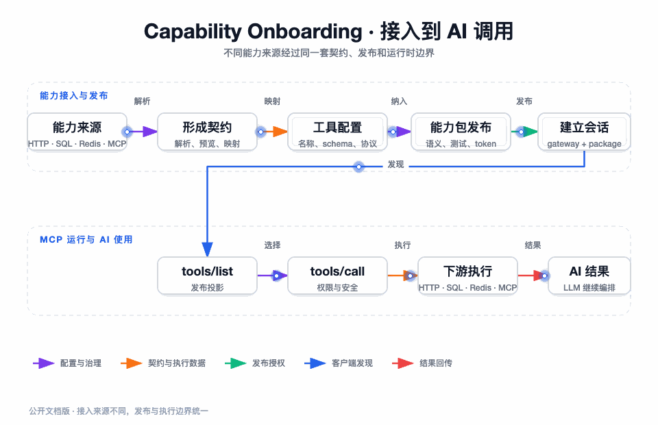

## 我如何理解这个项目

这个项目解决的不是“让 AI 发一个 HTTP 请求”这么简单的问题，而是企业已经拥有大量能力，却没有一个可以让 AI 安全、可发现、可发布、可回收地使用这些能力的运行边界。

企业原有的能力来源至少有四种形态：已有 HTTP API 或 OpenAPI 文档，业务 MySQL 数据，Redis 中的缓存和状态，上游已经实现好的原生 MCP 服务。它们的参数模型、失败语义、权限风险和生命周期都不一样。如果把它们直接拼接到 Prompt 或直接把数据库连接交给模型，模型获得的只是“能调用”，企业失去的却是访问范围、数据最小化、上线审批和事故追踪。

我的做法是把这些异构来源重新收敛为 MCP 工具，并在 MCP 运行面前增加一层明确的治理事实：工具属于哪个网关，是否属于某个能力包，能力包是否完成测试和发布，会话是否绑定了这个范围，执行时是否还要通过数据源安全门禁。只有这些事实全部成立，模型才有机会触达下游。

因此，AI MCP Gateway 更准确的定位是：**面向企业内部能力的 AI 工具接入与发布平台**。它兼有协议适配器、能力工作台、运行时网关和 AI 联调入口

**完整源码已开源在 GitHub**：[AI-MCP-Gateway](https://github.com/jiangnuonnuo/AI-MCP-Gateway)。本文档中的模块结构、实现细节与运行方式，都可以直接对照仓库代码阅读。

## 项目背景：AI 使用企业能力时，真正缺的是什么

### 缺的不是接口，而是可验证的契约

一个 HTTP 接口有 URL、方法和参数，但不一定有适合模型理解的字段说明；一个 SQL 查询能返回数据，但不等于模型可以自由决定表、字段和条件；一个 Redis 客户端可以执行命令，但不应把任意命令解释权交给模型；一个上游 MCP 服务返回了工具列表，也不代表其中每个工具都应被当前业务客户端继承。

我把这类问题拆成四个判断：

| 判断 | 如果没有这层，系统会出现什么问题 | 本项目的落点 |
| --- | --- | --- |
| 工具契约 | 模型无法稳定生成参数，结果也无法稳定解释 | MCP `tools/list`、JSON Schema、请求与响应映射 |
| 能力范围 | 模型可以绕过列表直接构造未授权工具名 | 能力包成员、发布投影、会话 scope、调用前复核 |
| 执行安全 | SQL、Redis 或 HTTP 参数可能扩大真实权限 | 数据源责任链、写操作确认、参数白名单、超时上限 |
| 变更治理 | 管理员保存草稿就影响线上客户端 | 测试指纹、发布版本、Redis 运行时投影、禁用与归档 |

这四个判断互相依赖，但不应该由同一个对象承担。工具契约属于协议和工具模型，能力范围属于发布与授权，执行安全属于调用前门禁，变更治理属于工作台和运行时缓存。后文按这个边界展开。

## 项目能力全景

| 能力方向 | 实际提供的能力 | 我在设计中固定的边界 |
| --- | --- | --- |
| 网关与工具管理 | 网关、工具、协议、映射、数据源、语义卡片和测试状态管理 | 管理配置不直接等于运行时可见 |
| HTTP/OpenAPI 接入 | Swagger/OpenAPI 解析、operation 预览、参数映射、响应解包 | 先形成候选，再由管理侧选择和发布 |
| MySQL 接入 | 表发现、表结构描述、`select`、受控 `insert/update/delete` | SQL 只能使用白名单操作和结构化参数 |
| Redis 接入 | String、Hash、List、Set、ZSet 的有限读写操作 | 不接受 Redis 原生命令参数 |
| 上游 MCP 接入 | `initialize`、`tools/list` 预览、工具选择、原生 MCP 调用 | 导入的工具仍归本地能力包治理 |
| 能力包 | 成员编排、语义完善、工具测试、指纹发布、启停、归档 | 客户端只看到当前发布投影 |
| MCP 运行面 | Streamable HTTP、旧 SSE、JSON-RPC、SSE 事件和重连恢复 | 会话是有租约的连接资源，不是永久配置 |
| 认证与隔离 | 包级 Bearer Token、限流、网关和会话校验 | 新认证会话必须绑定能力包和 token 身份 |
| AI 联调 | Spring AI 发现 MCP 工具、自动工具调用、调用轨迹和结果校验 | LLM 负责选择工具，网关负责批准执行 |
| 运行时一致性 | MySQL 事实、Redis 投影、脏标记、版本键、回源锁 | |

## 一次能力如何从配置变成 AI 可调用工具

这条主线由后面的专题分别解释，当前只保留足够建立全局认知的阶段语义：

| 阶段 | 管理面形成的事实 | 运行面真正读取的事实 |
| --- | --- | --- |
| 接入 | 解析到 HTTP operation、数据源操作或上游 MCP 工具 | 尚不可见 |
| 配置 | 保存工具名称、描述、参数映射和执行协议 | 尚不可见 |
| 编排 | 选择能力包成员并补齐语义卡片 | 尚不可见 |
| 测试 | 以当前工具配置生成指纹，记录一次成功或失败 | 尚不可见 |
| 发布 | 写入能力包发布版本、发布指纹和启用成员 | 可构建运行时投影 |
| 建连 | 包级 token 通过认证，会话保存网关和能力包 scope | 可以执行 `initialize` |
| 发现 | `tools/list` 按发布投影查询有序工具配置 | AI 得到 JSON Schema |
| 调用 | `tools/call` 再检查工具属于 scope，再进入策略与安全链 | 下游返回结果并映射成 MCP content |

## 架构全貌

系统按 Maven 模块形成一套 DDD 分层单体：Trigger 负责协议入口，Case 负责场景编排，Domain 负责业务规则和端口，Infrastructure 实现 MySQL、Redis、HTTP、MCP 与 LLM 适配，App 负责启动和配置。`api` 与 `types` 提供稳定的接口、响应、异常和枚举。

我没有把“协议入口”“用例编排”“领域规则”和“连接实现”塞进一个服务类，主要因为这四部分的变化原因不同：Spring MVC 或 SSE 头部变化不应该修改 SQL 安全规则；新增 Redis 操作不应该修改 Controller；切换 HTTP 客户端不应该改变能力包发布门禁。

如果要真正开始开发，不建议从管理页面或某个 Controller 单点切入。先阅读 [从 0 到 1 开发与上线链路](./12-从0到1开发与上线链路.md)，用企业查询样例穿过对象、Port、适配器、发布、会话和 LLM；再用 [管理端操作与 MCP 客户端联调](./13-管理端操作与MCP客户端联调.md) 按实际接口复现。也可以直接 clone 开源仓库 [AI-MCP-Gateway](https://github.com/jiangnuonnuo/AI-MCP-Gateway) 对照代码运行。这样总览里的每个名词都有一条可以跑通的落地路径。

图要回答的问题：为什么不同来源最终要经过同一套工具契约和能力包发布边界。它是使用路径的总图，具体的 HTTP 映射、数据源责任链和会话时序分别在专题文章中展开。

## 这组文章的阅读方式

先看 [项目知识地图](./00-知识地图.md)，它说明每篇文章解决的问题和边界；第一次阅读按下列顺序进入：

1. [项目背景与定位](./01-项目背景与定位.md)：理解为什么系统需要“能力治理”而不是简单转发。
2. [DDD 分层与系统架构](./02-DDD分层与系统架构.md)：建立模块、入口、领域服务和外部端口的空间关系。
3. [领域模型与业务边界](./03-领域模型与业务边界.md)：理解 Gateway、Tool、Protocol、Package、Session 和数据源不是同一层对象。
4. [HTTP 与 OpenAPI 转 MCP](./04-HTTP与OpenAPI转MCP.md)：看通用 HTTP 能力怎样生成 MCP 契约并组装请求。
5. [MySQL、SQL 与 Redis 转 MCP](./05-MySQL-SQL与Redis转MCP.md)：看数据源为什么必须以有限操作模型和责任链暴露。
6. [MCP 会话、Streamable HTTP 与 SSE](./06-MCP会话与Streamable-HTTP.md)：看协议请求、长连接、事件回放与租约如何分离。
7. [能力包发布与运行时缓存](./07-能力包发布与运行时缓存.md)：看草稿怎样经过门禁成为客户端可见的发布投影。
8. [工具执行与 LLM 集成](./08-工具执行与LLM集成.md)：看 MCP、策略工厂、上游能力和 Spring AI 如何接合。
9. [认证、权限与隔离](./09-认证权限与隔离.md)：看 token、scope、网关、会话、工具和数据源的边界如何叠加。
10. [一致性、多实例与部署](./10-一致性多实例与部署.md)：看 MySQL、Redis 与 JVM 本地资源的事实边界，以及生产限制。
11. [测试、验收与故障排查](./11-测试验收与故障排查.md)：用测试矩阵和验收证据回到真实可用性。
12. [从 0 到 1 开发与上线链路](./12-从0到1开发与上线链路.md)：从本地启动到真实 LLM 验收，完整走一遍垂直开发链路。
13. [管理端操作与 MCP 客户端联调](./13-管理端操作与MCP客户端联调.md)：按管理 API、Token 和 Streamable HTTP 请求复现一条能力。
14. [困难与技术取舍复盘](./14-困难与技术取舍复盘.md)：回到实际困难，说明为什么没有选择更简单但更危险的方案。

## 我认为这个项目最值得沉淀的判断

- MCP 只是对外协议，企业真正要治理的是能力范围和执行副作用。
- `tools/list` 的过滤不能替代 `tools/call` 的服务端复核，客户端可以绕过列表直接构造调用。
- 数据源安全必须发生在调用运行时端口之前；把风险检查放到 SQL 执行器或 Redis 客户端之后已经太晚。
- 发布版本、测试指纹和缓存版本共同构成“客户端看到哪一份能力”的证据链。
- Redis 是运行时投影和协调设施，不是业务配置事实；缓存故障应回源或失败，不应静默返回空工具。
- 本地 replay buffer 可以实现单实例协议语义，但不能伪装成跨实例可靠事件总线。
- LLM 的工具调用成功不代表业务动作一定成功；网关必须区分模型编排、授权、安全门禁和下游执行失败。

## 当前实现边界

当前工程已经覆盖 HTTP/OpenAPI、MySQL、Redis、上游 MCP、能力包、MCP 会话和 LLM 联调的核心闭环，但仍有几个必须诚实保留的边界：

| 边界 | 当前实现 | 生产落地时的要求 |
| --- | --- | --- |
| 管理身份 | 工程重点是运行授权和能力包管理用例 | 接入企业 SSO、组织、角色、审批和审计 |
| 会话回放 | `IStreamableSessionReplayPort` 的当前实现是 JVM 内存缓冲 | 共享回放存储、粘性会话或故障后重新初始化 |
| 数据权限 | 提供数据源级、工具级和写操作级门禁 | 继续叠加租户、行列权限、脱敏和审计 |
| 多实例缓存 | Redis 版本键、脏标记和锁已覆盖运行时投影 | 监控 Redis 可用性，明确降级与发布窗口 |

下一篇：[项目知识地图](./00-知识地图.md)
