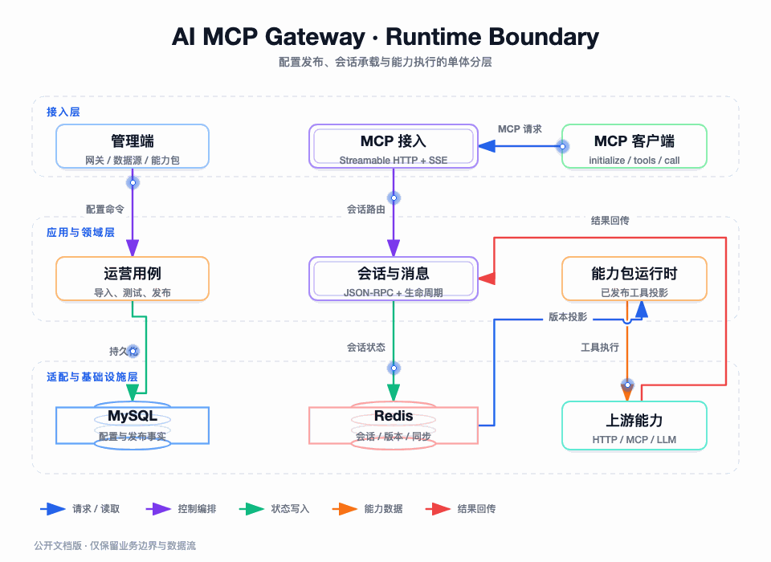

# AI MCP Gateway：把企业系统能力交给 AI 之前，我先把边界立住

## 我如何理解这个项目

这个项目不是一个把请求转发到下游的 MCP Proxy，而是一个面向 AI 客户端的能力接入与治理平台。

企业已经有大量 HTTP API、OpenAPI 文档、MySQL 数据、Redis 数据和上游 MCP 服务，但这些能力原本面向人或固定程序，并不适合直接交给大模型。AI 需要的是可发现、参数明确、范围受控、结果可理解的工具；企业需要的是授权、限流、审计、发布、回滚和隔离。

我最终把两者之间的边界收敛到 MCP Gateway：管理侧配置能力，发布能力包，运行侧只暴露已发布的工具；工具执行再根据协议类型落到 HTTP、MySQL、Redis、上游 MCP 或 LLM。

图要回答的问题：管理面、MCP 运行面、领域规则、持久化状态和外部能力分别由谁负责。图中的箭头表达请求、状态、数据和结果的不同语义，不能把它们理解成一个简单的 Controller 调用链。

## 项目能力全景

| 能力方向 | 项目提供的能力 | 对 AI 的意义 |
| --- | --- | --- |
| 网关管理 | 网关配置、认证、工具与协议管理 | 形成独立的能力入口 |
| HTTP 接入 | Swagger/OpenAPI 解析、operation 选择、请求/响应映射 | 把旧 HTTP API 变成 MCP 工具 |
| MySQL 接入 | 表发现、结构描述、查询和受控写操作 | 让 AI 读取业务数据而不接触数据库连接 |
| Redis 接入 | String、Hash、List、Set、ZSet 的受控操作 | 让 AI 使用缓存和状态能力 |
| 上游 MCP | 上游服务预览、工具导入和调用 | 聚合已有 MCP 能力 |
| 能力包 | 工具分组、测试、发布、启用、禁用、归档 | 形成客户端真正可见的范围 |
| 会话协议 | Streamable HTTP、SSE、JSON-RPC、事件恢复 | 支持长连接和断线重连 |
| AI 编排 | LLM 工具发现、调用、结果回传和轨迹记录 | 让模型安全地完成工具调用 |
| 安全治理 | Bearer、旧 API Key、HMAC、AES-GCM、限流 | 隔离凭证、用户和执行范围 |

## 一次能力从配置到被调用

这条主线拆在不同文章中，避免总览重复解释每个实现细节。

1. 管理员登记数据源或导入协议。
2. 系统产生候选 operation 或数据源能力。
3. 管理员选择并保存工具配置。
4. 工具进入能力包并完成测试。
5. 能力包发布形成版本和运行时投影。
6. MCP 客户端建立会话并发现工具。
7. AI 发起工具调用，网关按协议策略执行。
8. 结果通过 MCP 返回给 AI，并留下调用轨迹。

## 阅读顺序

1. [项目背景与定位](./01-项目背景与定位.md)
2. [DDD 分层与系统架构](./02-DDD分层与系统架构.md)
3. [领域模型与业务边界](./03-领域模型与业务边界.md)
4. [HTTP/OpenAPI 转 MCP](./04-HTTP与OpenAPI转MCP.md)
5. [MySQL、SQL 与 Redis 转 MCP](./05-MySQL-SQL与Redis转MCP.md)
6. [MCP 会话、Streamable HTTP 与 SSE](./06-MCP会话与Streamable-HTTP.md)
7. [能力包发布与运行时缓存](./07-能力包发布与运行时缓存.md)
8. [工具执行与 LLM 集成](./08-工具执行与LLM集成.md)
9. [认证、权限与隔离](./09-认证权限与隔离.md)
10. [一致性、多实例与部署](./10-一致性多实例与部署.md)
11. [测试、验收与故障排查](./11-测试验收与故障排查.md)

## 当前实现的边界

当前工程是分层单体应用，不应包装成已经拆分完成的微服务；运行时事件回放使用实例内存实现，多实例生产需要共享回放存储或明确会话粘性；当前测试资料已证明核心端到端链路可用，但 Java 25 与现有 Byte Buddy 测试工具链存在兼容性问题。
