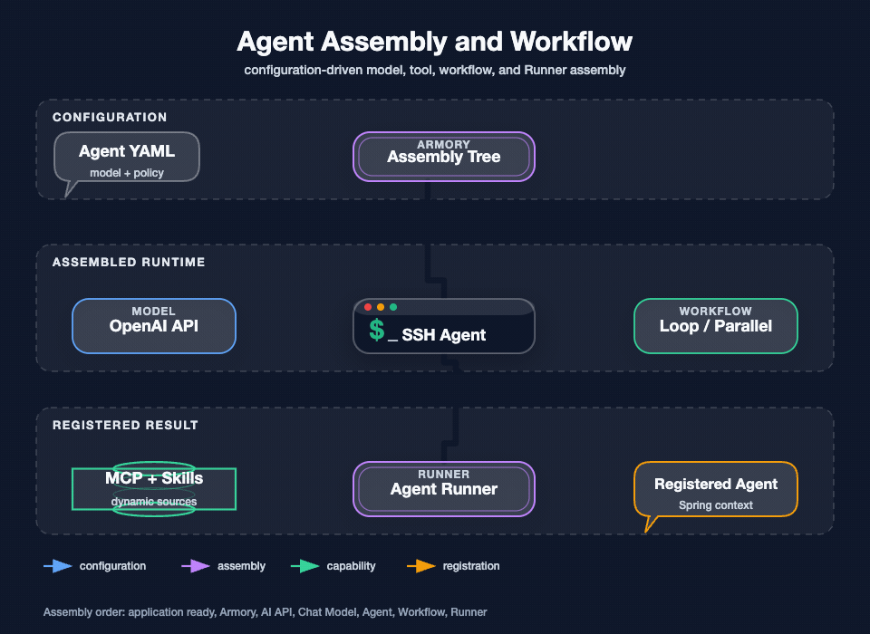

## 我要回答的问题

我需要先区分两件事：应用启动时怎样得到一个可运行的 Agent，以及用户发消息后怎样触发一次工具调用。前者是装配链，后者是 [ReAct 对话与 Agent 调用链](./10-ReAct对话与Agent调用链.md)。如果把两者混在一起，就会误以为修改 YAML 会立即改变一个正在运行的聊天会话。

图要回答的问题：配置怎样经过 Armory 形成模型、工具、Workflow 和 Runner，并最终注册为 Spring 上下文中的 Agent。绿色能力流表示内置工具和动态来源进入运行时，橙色注册流表示装配结果成为可调用 Agent；图中没有展开单次 SSH 执行，具体执行见 [SSH 命令执行主链路](./06-SSH命令执行主链路.md)。

## 装配入口

应用就绪事件触发装配。应用配置读取 `agent/code-agent.yml` 这类 Agent 配置后，依次准备 AI API、Chat Model、Agent、Workflow 和 Runner。配置中的模型地址是 OpenAI 兼容接口形态，模型名称由配置决定；源码和部署资料支持从环境或部署配置注入，不应把密钥写入公开文档或镜像。

我的判断是把配置解析和运行时注册放在 `app`，把工具实际能力放在 `trigger`、`case` 和 `domain`，这样换模型供应商不会改变 SSH 命令安全规则，增加一个工具也不会要求重写 Agent 生命周期。

## 工具汇总

当前工具平面由两类来源组成：

| 来源 | 实际能力 | 进入方式 |
| --- | --- | --- |
| 内置运维工具 | SSH 连接查询、命令执行、执行查询、取消、最近执行、SFTP、Sandbox、统一 Execution 查询 | Spring AI `@Tool` 组件，被内置 Agent 直接调用 |
| 动态能力 | MCP SSE、Streamable HTTP、Stdio、Local 和 Skills 等外部或本地能力 | 配置或运行时贡献者汇总后进入 Agent 工具集合 |

工具汇总不是“所有方法都暴露”。实现中还要经过白名单、重名检查、调用次数和循环保护等约束。内置 Agent 的 SSH 工具直接进入同一套 Case 和 Domain，不经过 `/mcp`，也不依赖 MCP Bearer Token；外部 MCP 客户端才经过 MCP 端点和其会话解析。

## 工具调用上下文

内置 Agent 优先使用当前聊天会话作为执行上下文。外部 MCP Agent 使用 transport 的 `mcp-session-id`，若 transport 无法提供，会要求显式的 `executionContextId`；无法得到会话时返回 `MCP_SESSION_UNAVAILABLE`，不猜测或切换目标。

SSH 工具还会把来源、会话和连接组合成受控的执行上下文。这样同一 Agent 会话在同一连接上可以识别长任务和重复提交，但页面人工终端、另一个 MCP 会话和另一个连接不会共用同一占用锁。

## 工具说明中的安全契约

我把很多行为写进工具的参数描述，是为了让模型先理解约束；但真正的防线仍在服务端：

- `connectionId` 必须来自连接列表或既有上下文，不能用连接名称代替。
- `ssh_execute` 返回运行中的 `executionId` 后，必须调用查询工具，不能再次提交原命令。
- 下载即执行、动态解码执行等不可信命令需要改走 Sandbox。
- `COMMAND_EXIT_NON_ZERO` 表示命令已结束但退出码非零，不等于 SSH 通道故障。
- `execution_get` 的后续请求必须原样传回 `nextCursor`。

## 装配失败如何处理

配置解析、模型初始化、工具重名或能力装配失败会阻止对应 Agent 正常注册或使启动阶段报错；它们不应该伪装成“Agent 已经可用”。运行时一次工具调用失败则由 Tool、Case 和 ReAct 层分别记录，循环节点决定是否停止，具体错误语义见 [数据一致性、并发与异常处理](./12-数据一致性并发与异常处理.md)。

## 验证方式

我用三类证据验证装配：配置文件中能找到模型、Agent 和工具说明；应用测试覆盖自动配置、Agent 选择、工具上下文和循环保护；运行时工具测试验证内置 SSH 工具能把输入交给执行 Case，而不是在工具类中直接建立远端连接。

下一篇：[SSH 连接认证与主机信任](./05-SSH连接认证与主机信任.md) · 相关：[ReAct 对话与 Agent 调用链](./10-ReAct对话与Agent调用链.md)
