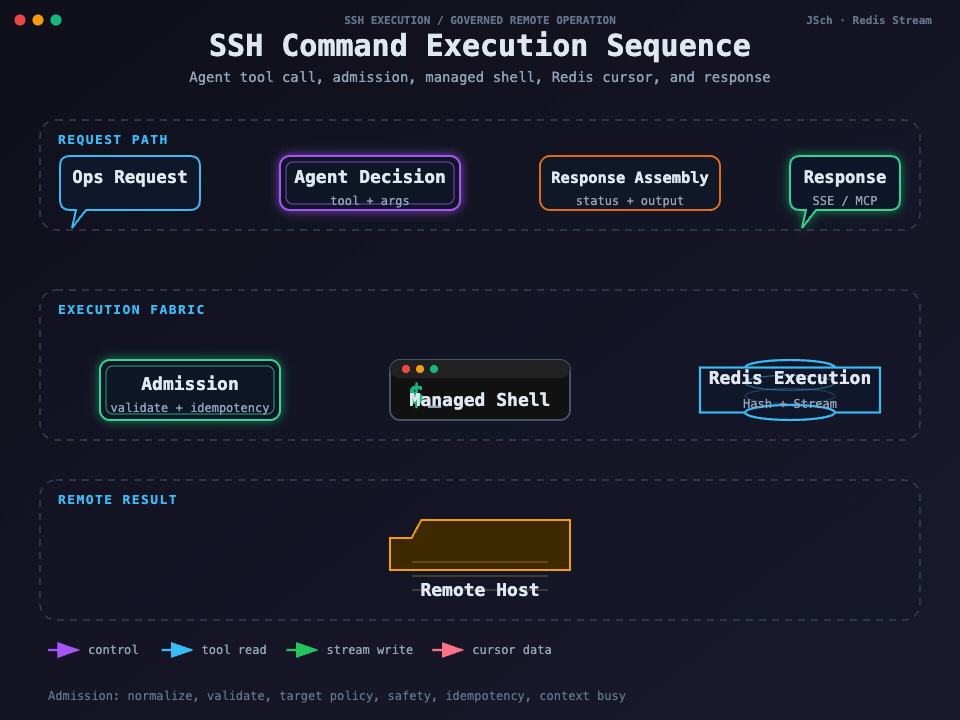

## 我要回答的问题

一次 `ssh_execute` 到底做了什么，不能只回答“调用 JSch 执行命令”。真实实现先要判断目标、风险、幂等和并发，再把命令交给受控 Shell，最后在同步响应或长任务记录中返回结果。

图要回答的问题：Agent 决策怎样进入准入链，准入后的原始命令怎样到达 Managed Shell，远端输出怎样进入 Redis Hash 和 Stream，再以状态、结果和游标回到客户端。失败分支集中在 Admission 和 Remote Host 两个边界，Redis 记录的是可观察证据，不是远端进程本身。

## 调用入口

命令可以来自内置 Agent、外部 MCP Agent 或普通 HTTP 场景。内置 Agent 将当前聊天会话作为上下文，外部 MCP Agent 使用 MCP transport 会话或显式 `executionContextId`。最终都组装成带有来源、连接、目标类型、目标引用、原始命令、超时和幂等键的执行请求，进入同一个 SSH Command Case。

## 准入顺序

我在实现中固定了以下顺序：

1. 请求规范化，整理空白、上下文和可选参数。
2. 参数校验，确认 connectionId、命令、超时和目标引用有效。
3. 目标策略，区分 `HOST`、`INTERACTIVE_TERMINAL` 和 `SANDBOX`。
4. 执行安全策略，判断危险命令、是否需要确认以及是否必须隔离。
5. 幂等去重，重试同一次业务提交时复用幂等键。
6. 执行上下文占用检查，同一上下文只允许一个运行中命令。

任何一步拒绝都不会创建新的远端执行。特别是 `SANDBOX_REQUIRED` 不能通过修改命令、换工具或再次提交到 HOST 绕过，正确路径是先检查 Docker 能力，再显式创建和执行 Sandbox。

## HOST 的执行方式

HOST 目标使用 Managed Shell。实现使用非 PTY 的 Shell 通道、控制帧和退出码帧承载执行边界，原始命令不通过 `eval` 重新解释，也不在执行前静默改写。这样既能保留管道、重定向和多行命令的原始语义，也能在输出中区分 stdout、stderr、控制帧和退出状态。

它不适合 `vim`、密码询问或依赖真实交互 TTY 的程序。需要页面交互时走终端资源，需要不可信脚本时走 Sandbox，三种目标不能混成一个执行器。

## Managed Shell 如何结束一次命令

Managed Shell 为每个执行上下文维护独占的 Shell Channel。提交命令时，网关写入带有命令边界的控制数据；读取线程把普通输出、错误输出、退出码和控制帧解析成领域结果。命令结束后，Case 记录 `success`、`exitCode`、输出是否完整、是否截断、耗时和失败代码，再由响应组装成同步结果或长任务记录。

如果同步等待被打断，Case 会关闭当前执行上下文并释放占用；如果超时，只是把控制权转给长任务跟踪，不会再次调用执行策略。取消动作只针对该 executionId 的独占上下文，页面终端、SFTP 和其他 Agent 执行都有自己的 Channel。

## 并发和同步窗口

默认执行线程池核心线程数为 4，最大线程数为 8，队列容量为 32，拒绝策略为 `AbortPolicy`。Case 层还以执行上下文做业务占用控制，因此线程池有空闲并不意味着同一上下文可以并行提交多个命令。

默认同步等待窗口为 10 秒。10 秒内结束的命令直接返回状态和输出；超过窗口的命令仍继续运行，响应返回 executionId，调用者随后使用查询工具继续观察。超时是客户端等待方式变化，不是把命令重新执行一次。

## 输出和结果

实现限制单次输出上限 20 MiB，诊断尾部保留 64 KiB，内联输出上限 256 KiB，预览上限 16 KiB。输出超过内联上限时，客户端应依据 executionId、游标和状态继续读取，不应依赖一次 HTTP 响应承载全部结果。

命令非零退出和工具异常被分开：命令正常完成但 exit code 非零，可以返回 `COMMAND_EXIT_NON_ZERO`；SSH 通道断开、线程池拒绝、参数错误或提交异常则是工具或执行生命周期失败。调用方需要结合 code、disposition、exitCode 和 output 做判断。

## 事务边界在哪里

一次命令至少跨越三个系统边界：远端 Shell 的真实副作用、JVM 中的运行时跟踪、Redis 中的观察记录。没有一个事务能同时回滚它们。因而 `executionId` 是“找回同一次执行”的稳定句柄，查询和取消都围绕它工作；HTTP 请求超时不能说明远端命令未执行，也不能触发盲目重试。

## 验证方式

准入链测试覆盖规范化、参数校验、目标策略、安全策略、幂等和上下文忙；命令服务测试覆盖输出、超时、取消和非零退出；Managed Shell 测试覆盖控制帧、退出码帧和原始命令保留。完整的远端链路仍需要真实 SSH 集成测试。

下一篇：[长执行输出游标与故障恢复](./07-长执行输出游标与故障恢复.md) · 相关：[Sandbox 隔离与执行策略](./09-Sandbox隔离与执行策略.md)
