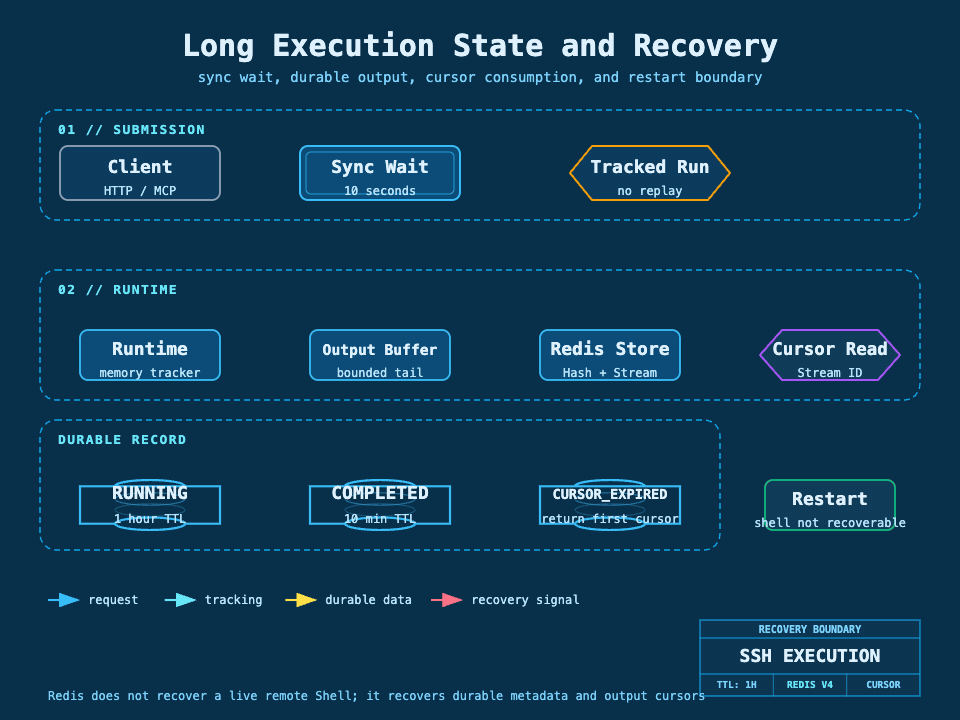

## 我为什么把长任务单独建模

SSH 命令可能在 10 秒内结束，也可能持续几分钟。HTTP 请求的等待时间、远端进程生命周期和输出读取速度不是同一件事。我把执行拆成“提交一次、持续查询、按游标读取、必要时取消”的生命周期，避免客户端超时后误以为命令没有执行，再次提交产生重复副作用。

图要回答的问题：同步等待结束后，运行时状态、有限输出缓冲、Redis Hash、Redis Stream 和外部游标怎样协作；重启时哪些信息能恢复，哪些信息不能恢复。黄色数据路径表示持久记录，粉色路径表示恢复和游标边界。

## Redis 中保存什么

当前 Redis v4 适配包含四类结构：Hash 保存执行元数据，Stream 保存增量输出，Sorted Set 保存最近执行和运行中索引，Value 保存幂等键到执行记录的映射。Stream ID 是对外游标，不应被包装成前端自定义的页码。

执行记录会同时存在于 JVM 运行时注册表和 Redis。JVM 负责实时任务、远端通道和取消；Redis 负责在请求之间保存状态、输出块和检索索引。两者不是同一个事实源，也没有跨它们的原子事务。

我把 Redis 的四类结构理解成四种查询责任：Hash 负责执行快照，Stream 负责按时间顺序承载输出块，Sorted Set 负责按时间找最近执行和运行中执行，Value 负责把“上下文 + 幂等键”映射到 executionId。它们共同组成可查询投影，但不保存 JSch Session、Shell Channel 或远端进程句柄。

## 查询方式

第一次调用 `execution_get` 时游标留空；响应返回状态、当前输出块和 `nextCursor`。后续请求必须原样传回 `nextCursor`，系统从 Stream 的下一个位置读取增量输出。运行中继续查询同一个 executionId，绝不能因为上一轮只读到部分输出就再次提交命令。

当游标落后于清理边界时，系统返回 `CURSOR_EXPIRED`，调用者应按响应给出的首个可用游标重新建立读取位置，而不是假设可以无限回放历史。已交付记录的 TTL 更短，普通和运行记录的 TTL 约为 1 小时，已交付记录约为 10 分钟。

## 持久化失败时的降级

输出先经过有界的内存缓冲，再由持久化协调器写入 Redis。Redis 暂不可用时，进程仍可能保留内存结果，并返回 `MEMORY_ONLY` 或 `PERSISTENCE_FAILED` 这类结果语义；后台会继续尝试转存。这个降级能减少短时 Redis 故障对正在运行命令的影响，但不能承诺进程宕机后内存结果还存在。

我没有把 Redis 故障静默变成“没有输出”。显式返回持久化状态，是为了让 Agent 或运维人员知道后续查询的可靠程度，也便于判断是否需要立即收集远端日志。

## 重启、取消和找回

进程重启后，Redis 可以恢复执行元数据、最近执行索引和已经转存的输出，但不能恢复真实远端 Shell 的进程句柄、JSch Channel 或本地取消回调。如果运行时上下文已不存在，取消会返回 `CANCEL_UNAVAILABLE`，这表示本地无法再发出终止动作，不代表远端命令一定已经停止。

executionId 丢失时，调用者可以使用原始 executionContextId 调用 `execution_recent` 找回最近执行。这个接口的目的只是找回查询入口，不是创建一个新命令；目标类型和目标引用也要与原执行保持一致。

应用启动后的执行对账会读取 Redis 中仍为 `RUNNING` 的记录。由于新进程没有旧 Channel，系统把这些记录改为 `UNKNOWN`，写入 `PROCESS_RESTARTED` 和“只读核验、禁止自动重跑”的提示，并保留已经转存的输出。这个动作是恢复语义的核心：它承认状态不确定，而不是把 Redis 中的旧 `RUNNING` 当作仍可取消。

## 补偿边界

输出转存失败可以重试，幂等键映射和 Stream 写入需要避免重复记录；但远端命令本身不能用“补偿执行”解决，因为再次执行可能产生重复删除、重复发布或重复修改。对于不可逆命令，补偿动作只能是查询、人工确认或使用业务上明确的反向操作。

## 验证方式

Redis 仓储测试覆盖 Hash、Stream、索引、TTL、游标过期、幂等映射和不可用降级；Case 测试覆盖同步窗口、长任务、取消、重启缺少上下文和最近执行找回。真正的验收还要在 Redis 重启或网络抖动条件下观察返回码和输出连续性。

下一篇：[交互终端与远程文件操作](./08-交互终端与远程文件操作.md) · 相关：[数据一致性、并发与异常处理](./12-数据一致性并发与异常处理.md)
