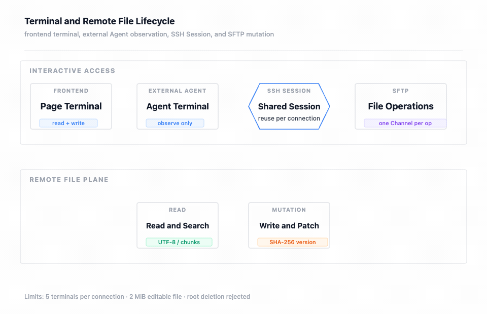

## 我先拆开终端和文件

终端和文件都依赖 SSH，但它们不是同一种资源。终端关注持续输入、输出和窗口大小；文件关注路径、内容、版本和一次操作的成功性。把文件保存做成“向终端输入一段 Shell”会失去版本校验、精确替换和错误定位，因此实现分别提供 Terminal 和 File 两套 Case。

图要回答的问题：页面终端和外部 Agent 终端如何共享连接级 Session，SFTP 如何以每次独立 Channel 承载文件操作，读写和版本检查如何从交互访问进入远程文件平面。图中外部 Agent 终端明确标为只观察，避免把 Agent 自动执行和人工输入混为一谈。

## 终端生命周期

终端接口挂在 `/api/v1/ssh/terminal`，包含列表、打开、执行、写入、读取、resize 和关闭。每个连接最多 5 个终端。页面终端允许读写；外部 Agent 创建的终端归属 `EXTERNAL_AGENT`，页面可以观察或关闭，但不能向其写入，避免观察者变成隐式控制者。

Agent 的 HOST 命令执行使用 Managed Shell 和独立执行上下文，不把页面终端当作自己的命令帧通道。这样人工登录的当前目录、输入状态和自动化任务不会互相覆盖，也使取消一个 Agent execution 不会误伤页面终端或 SFTP。

## SSH Session 与 SFTP Channel

连接建立后可以复用进程内 SSH Session，减少重复认证；每次文件操作都创建独立 SFTP Channel，完成后关闭。Session 是连接级资源，Channel 是操作级资源，这个层次划分让并行的读取、上传和目录浏览不会共用一个易污染的文件通道。

文件接口挂在 `/api/v1/ssh/file`，实际能力包含目录树、内容、分块内容、创建文件、创建目录、重命名、删除、保存内容、上传和下载。文件读写需要使用已连接的 connectionId，不通过文件名自动寻找连接。

## 文件读取和写入边界

文本读取按 UTF-8 和分块结果处理，内容读取与内容分页分别对应普通内容和受限输出。可编辑文件上限为 2 MiB，根目录删除直接拒绝。删除、重命名和上传仍受远端账户权限影响，应用不会把 SSH 连接权限提升为系统管理员权限。

保存内容支持 SHA-256 乐观版本校验。客户端读取文件时拿到版本摘要，保存时带回预期摘要；摘要已经变化时拒绝覆盖，调用者需要重新读取并处理冲突。文件替换还要求精确替换次数，避免一个模糊文本匹配意外修改多个位置。

为减少同一进程内的并发覆盖，文件修改使用 64 条本地锁条带。它不是分布式锁，也不能阻止另一台应用实例同时修改同一文件；跨实例场景仍应依赖 SHA-256 冲突检查、发布窗口或外部协调。

文件读取有两种节流方式：内容读取按字节 offset/limit 分块，按行读取限制起始行、行数和约 32 KiB 的 Agent 返回大小。目录列表限制返回数量，文本解码采用 UTF-8；检测为二进制时返回二进制标志而不是把任意字节拼成模型上下文。SFTP 网关还会把每次操作限制在独立 Channel 内，完成后在 `finally` 中关闭。

## 两种文件修改策略

实现存在 SFTP 文件修改策略和 sudo 文件修改策略，由策略工厂按请求选择。SFTP 适用于 SSH 用户本身有写权限的文件；需要受控提权时才进入 sudo 策略，且不通过命令传递用户密码。权限不足不能通过扩大路径、静默切换连接或改写目标来绕过。

`sftp_write` 适合创建或完整替换小文本，`sftp_apply_patch` 适合在已读取快照后做最多 20 项精确替换。写入前先读取快照并检查文件是否存在、是否为目录、是否为二进制、是否超过 2 MiB；补丁还要检查每一项的实际匹配次数。这样“先读后改”不是 Agent instruction 的建议，而是文件领域服务的实际顺序。

## 失败分支

- 终端数量达到 5：拒绝打开新终端，已存在终端不受影响。
- 外部 Agent 终端收到页面写入：拒绝写入，保留观察能力。
- Session 不存在或已断开：终端和文件操作先失败，不隐式切换服务器。
- 文件版本不一致：返回冲突，调用者重新读取；不覆盖远端新内容。
- 根目录删除或超出 2 MiB：直接拒绝。
- SFTP Channel 失败：关闭本次 Channel；连接级 Session 是否健康由连接健康检查决定。

## 验证方式

终端领域测试覆盖数量上限、绑定关系、读写和关闭；文件服务测试覆盖路径、大小、根目录、版本和替换次数；基础设施测试覆盖 SFTP 命令构造、文件网关和权限错误。真实集成测试还要检查远端文件权限、中文内容和大文件边界。

下一篇：[Sandbox 隔离与执行策略](./09-Sandbox隔离与执行策略.md) · 相关：[认证、权限、会话与隔离边界](./11-认证权限会话与隔离边界.md)
