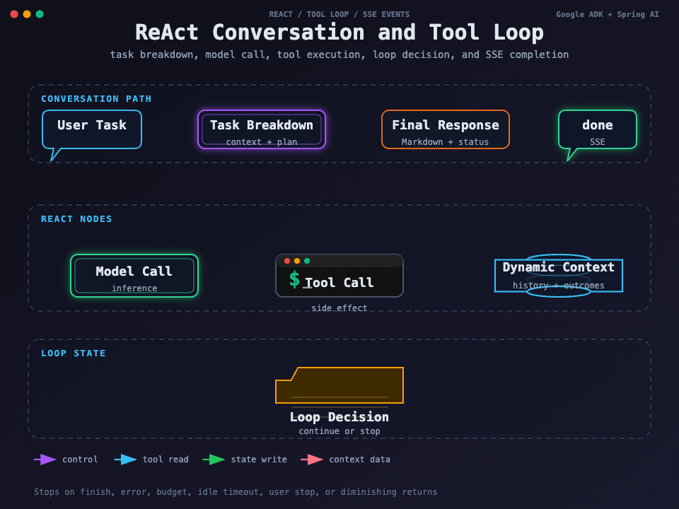

## 我如何把一次对话变成可追踪执行

用户说“检查服务器状态”时，系统不能直接把整句话拼进 Shell。ReAct 链路把任务拆解、模型推理、工具调用、工具结果、循环判断和最终响应分成独立节点；只有工具调用节点才会产生真实副作用，结果再回到上下文，供下一轮模型判断。

图要回答的问题：用户任务如何经过拆解、模型调用、工具调用、结果记录和循环判断，再以 SSE 状态和最终响应结束。它强调“模型生成调用”和“SSH 实际执行”是两个边界；后者继续走 [SSH 命令执行主链路](./06-SSH命令执行主链路.md)。

## 节点职责

| 节点 | 真实职责 | 失败后怎样处理 |
| --- | --- | --- |
| Root | 建立一次 ReAct 执行上下文并协调生命周期 | 上下文清理，返回终止状态 |
| Task Breakdown | 将用户任务整理为可执行目标和上下文 | 无法拆解时停止或回到用户反馈 |
| AI Call | 使用 Chat Model 产生文本或工具调用 | 模型异常、超时或预算耗尽时结束 |
| Tool Call | 解析工具名和参数，调用内置或动态工具 | 记录工具错误，由循环节点决定是否继续 |
| Loop Decision | 判断是否还有工具、是否需要继续推理 | 完成、错误、预算、空闲或收益下降时停止 |
| User Feedback | 把确认、拒绝、补充信息带回会话 | 等待用户或结束当前动作 |
| SSE Notifier | 推送工具开始、输出、结果和状态事件 | 客户端断开不应重新执行工具 |

## 一次 SSH Agent 调用

模型先根据 Agent 指令和对话上下文选择工具，生成完整的 `connectionId`、命令、目标和可选超时。工具层将当前内置聊天会话放入执行上下文，调用 SSH Case；Case 完成准入后，才可能进入 HOST Managed Shell。执行结果经过工具结果记录器写回动态上下文，下一轮模型可以根据退出码和输出决定继续查询、换用 Sandbox、请求确认或直接回答。

长任务返回 executionId 后，Agent 不应再提交同一命令，而应调用统一的 `execution_get`，按 nextCursor 读取增量输出。这个规则既写在工具说明中，也由 Execution Case 负责约束。

当前实现有两条 ReAct 工具执行形态：ADK 自动执行是主路径，Runner 事件中已经包含工具结果，系统在事后做权限审计并把结果写回上下文；手动工具执行路径保留了逐个做权限检查、等待用户确认、执行并发送工具结果事件的能力。两条路径都不应该绕过 SSH Case，但它们在“拒绝发生在执行前还是执行后”上不同，因此不能用一套测试结论替代另一套。

## 上下文记录和历史边界

上下文记录包含用户任务、模型响应、工具参数、工具结果和进度事件。实现对流式历史有压缩和边界处理，避免把无限增长的工具输出全部塞回模型上下文。SSH 输出本身受 20 MiB 总上限和内联、预览上限约束，Agent 需要使用摘要、尾部或游标结果继续推理。

聊天服务在创建会话时同时创建 ADK Session 和 MySQL 会话记录；消息、工具结果和里程碑通过持久仓储保存，加载历史时按时间恢复并受 token 预算约束。终端绑定通过聊天会话关联到终端资源，ReAct 结束、暂停或异常时都会尝试解绑并清理 ThreadLocal，避免后续请求误用旧终端。

## 循环和预算保护

ReAct 循环有完成、错误、预算、空闲超时、用户停止和收益下降等终止条件。`AgentToolLoopGuard` 还保护 `ssh_execute` 和 `sandbox_execute`：同一 ADK invocation 连续相同调用超过 2 次后阻断，防止模型在错误参数或不变上下文下重复产生远端副作用。

我把循环保护放在工具调用附近，而不是只依赖 Prompt，因为 Prompt 无法可靠阻止客户端重放或模型在异常情况下重复调用。它也不替代幂等键：循环保护处理模型行为，幂等键处理同一次业务提交的网络重试。

## 用户确认和权限结果

危险命令或敏感文件操作可能要求确认。确认请求通过权限接口等待用户结果；拒绝时不执行原动作，确认后仍需要重新通过执行入口。AI 分类失败的默认放行风险见 [Sandbox 隔离与执行策略](./09-Sandbox隔离与执行策略.md)，因此人工确认和确定性规则仍是关键防线。

## 验证方式

ReAct 节点测试覆盖任务拆解、历史边界、循环判断、用户反馈、工具结果和上下文清理；Agent 自动配置测试覆盖模型和工具注册；SSH 工具测试验证调用上下文、长任务查询和异常映射。真实验收需要使用可控 SSH 目标，确认事件顺序与远端实际状态一致。

下一篇：[认证、权限、会话与隔离边界](./11-认证权限会话与隔离边界.md) · 相关：[Agent 装配与工具暴露](./04-Agent装配与工具暴露.md)
