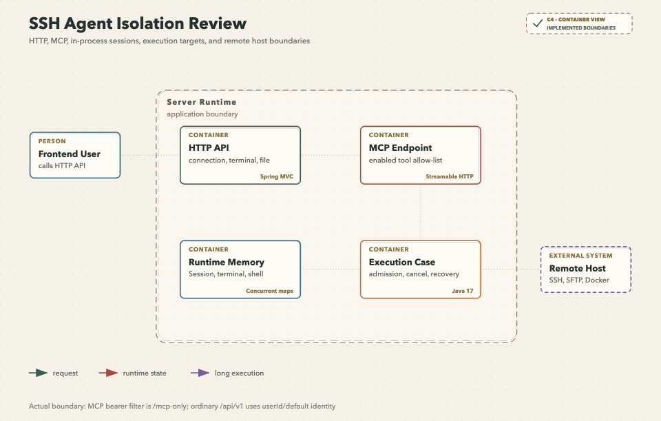

## 我要先把“谁能做什么”说清楚

运维 Agent 最容易让人误判的地方，是把 MCP Token、userId、聊天会话、SSH 连接和远端 Linux 用户看成同一层身份。它们在当前实现中分别承担不同职责：HTTP 入口负责接收请求，MCP Token 只保护 /mcp，userId 参与连接和聊天数据的归属，聊天或 MCP 会话负责运行时上下文，SSH 凭据最终决定远端账户能做什么。

图要回答的问题：请求从普通 HTTP 或 MCP 入口进入运行时后，认证、上下文、执行目标和远端权限分别在哪一层生效。关键节点是 /mcp 的静态 Bearer 过滤、普通 API 的请求字段、进程内会话注册表、SSH Session 和远端主机；失败分支包括 Token 缺失、MCP 会话无法识别、连接未建立和命令策略拒绝。一致性边界在进程内状态与 Redis/MySQL 之间，隔离边界在不同连接、不同 Agent 会话、HOST 与 Sandbox 之间。

## 入口认证不是统一身份体系

当前存在两类入口：

| 入口 | 当前保护方式 | 实际作用 | 当前边界 |
| --- | --- | --- | --- |
| /api/v1/** | 控制器接收请求，未发现统一登录过滤器 | 暴露 Agent、SSH、终端和文件 API | userId 多由请求字段或默认值提供，不能等同于登录身份 |
| /mcp | 可选静态 Bearer Token 过滤器 | 保护外部 MCP 客户端进入工具服务 | 只校验一个应用级 Token，不提供用户级角色和资源授权 |

MCP 静态认证由 MCP_STATIC_BEARER_ENABLED 和 MCP_STATIC_BEARER_TOKEN 控制。启用但 Token 为空时，配置会使应用启动失败；关闭后，应用不再在自身校验该静态 Token，适合由前置 MCP 网关承担认证。普通 API 不会因为 MCP Token 开启而自动获得保护，二者必须在部署边界上分别处理。

控制器普遍开放跨域来源，实际公网访问应由网关、安全组和反向代理收敛；server.address=0.0.0.0 只表示监听所有网卡，不表示 TLS、登录或权限已经完成。

## userId 是数据归属键，不是完整租户

SSH 连接表和聊天会话表都保存 user_id。连接列表按 userId 查询，Agent 会话创建和聊天也把 userId 传入领域服务；缺省值在普通 SSH MCP 配置中是 default。这让个人部署和多用户数据归属有了最小的字段基础，但当前代码没有把它绑定到可信认证主体，也没有完整的租户、组织、角色或细粒度 RBAC 解析器。

我因此把下列事实视为当前风险，而不是隐藏起来：

- 不能仅凭客户端传入的 userId 证明调用者就是该用户。
- 连接列表有按用户过滤，但按 connectionId 的查询、连接、断开和部分操作不能从入口层看出一致的用户归属校验。
- MCP 工具固定使用配置中的 ssh.mcp.user-id，外部 MCP Token 与数据库用户没有天然映射。
- tools/list 只是能力发现，不能作为权限授予；工具被列出后，调用仍要经过连接、目标和命令规则。

生产接入时，我会把可信用户身份放在网关或统一认证层生成，再由后端从受信请求上下文得到用户和租户，而不是继续相信任意请求体字段。之后还需要在每个按 connectionId、sessionId、executionId 和 path 访问的用例入口执行资源归属检查。

## 会话按用途分成四种

| 会话 | 保存位置 | 负责什么 | 重启后的结果 |
| --- | --- | --- | --- |
| Agent 聊天会话 | MySQL 会话记录，ADK 运行时另有内存会话 | 消息历史、工具调用和 ReAct 上下文 | 数据记录可保留；ADK 内存状态需重建 |
| MCP transport 会话 | MCP 传输层提供的会话标识 | 外部 Agent 的调用隔离和终端归属 | transport 会话失效，不能继续复用旧 Channel |
| SSH Session | 进程内 JSch 运行时缓存 | 复用已认证的远端连接 | 配置仍在，Session 必须重新连接 |
| 终端会话 | 进程内终端注册表和 Shell Channel | 页面 PTY 或外部 Agent 观察终端 | Channel、绑定关系和读写缓冲丢失 |

内置 Agent 以聊天会话作为上下文；外部 MCP 优先使用 mcp-session-id，旧 transport 可读取 sessionId，没有 transport 会话时才接受显式 executionContextId。无法识别外部会话时返回 MCP_SESSION_UNAVAILABLE，不会猜一个全局会话。

## 连接、执行和终端如何隔离

我把隔离做成多个相互独立的键：

- 连接以 connectionId 指向一个远端配置和一个进程内 SSH Session。
- HOST 命令的执行上下文由来源、会话和连接组成，同一上下文只允许一个运行中命令。
- 外部 Agent 终端按“连接 + MCP 会话”复用，一对一建立关系；页面终端和外部 Agent 终端不共享同一个自动化控制通道。
- 终端每个连接最多 5 个，页面终端允许写入，外部 Agent 终端是观察型资源，页面不能向它注入输入。
- SFTP 每次操作新建独立 Channel，不把文件读写混进终端 Shell。
- Sandbox 仍绑定一个已显式建立的 SSH 连接，但容器工作区、网络模式和生命周期独立于主机 Shell。

这些隔离主要是进程内结构和领域规则，不能自动扩展为多实例分布式隔离。部署为多个应用实例时，终端、绑定、Session、执行线程和本地锁仍需要粘性路由或进一步外置化。

## 敏感材料和远端权限

密码和私钥在保存前使用应用密钥加密，查询响应不返回原始凭据；连接建立时才由基础设施解密并交给 SSH 客户端。应用密钥由 WALISSH_SECRET_KEY 提供，部署资料要求使用至少 32 个随机字符并保持稳定。更换密钥不会自动迁移旧密文，结果是旧连接凭据无法解密。

SSH 认证成功后，真正的文件权限、命令权限和 sudo 能力仍由远端账户决定。SFTP 和受控 sudo 文件策略是两种不同的操作路径，应用不会因为拥有连接配置就自动取得 root 权限；需要提权时也不能通过 SFTP 工具自动传递密码。

## 我如何判断当前设计是否足够

对个人单实例运维工具来说，当前边界足以把不同 Agent 会话的执行、页面终端和 Sandbox 分开，也能避免首次连接默默接受 host key。但它还不足以承担企业级多租户安全责任。验收时我会分别验证 MCP Token 缺失、普通 API 未携带登录身份、跨用户 connectionId、跨会话 executionId、外部终端写入、Sandbox 工作区挂载和应用重启后的资源失效。

下一篇：[数据一致性、并发与异常处理](./12-数据一致性并发与异常处理.md) · 相关：[SSH 连接认证与主机信任](./05-SSH连接认证与主机信任.md)、[Sandbox 隔离与执行策略](./09-Sandbox隔离与执行策略.md)
