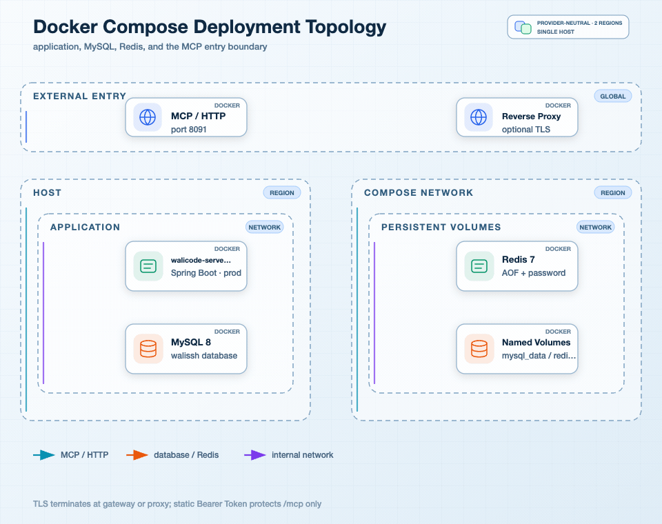

## 我如何划定生产边界

当前部署资料给出的是一个适合个人或小规模运维的 Docker Compose 拓扑：MySQL、Redis 和应用容器在同一个后端网络中，MySQL 和 Redis 不映射宿主机端口，应用映射 8091。SSH 目标主机不属于 Compose 网络，它由应用容器通过用户配置的 SSH 连接访问。

图要回答的问题：客户端、可选 MCP 网关、应用、MySQL、Redis 和远端 SSH 主机之间的网络边界在哪里。关键节点是应用容器和两个有状态依赖，失败分支包括健康检查失败、应用无法连接依赖、MCP Token 失效和远端 SSH/Docker 不可用。一致性边界是 MySQL 持久数据与 Redis 临时执行记录之间，隔离边界是 Compose 后端网络、网关入口、SSH 连接和目标主机上的 Sandbox。

## Compose 拓扑

| 服务 | 镜像/运行方式 | 数据与网络 | 健康检查 |
| --- | --- | --- | --- |
| MySQL | mysql:8.0.43 | mysql_data 卷，后端网络，不映射宿主机端口 | mysqladmin ping |
| Redis | redis:7.4.5-alpine，开启 AOF 和密码 | redis_data 卷，后端网络，不映射宿主机端口 | redis-cli ping |
| app | Java 17 JRE 镜像，非 root walicode 用户 | app_logs 卷，宿主机映射应用端口 8091 | TCP 8091 探活 |

app 依赖 MySQL 和 Redis healthy 后启动，三项服务都使用 restart: unless-stopped。Compose 使用 bridge 后端网络，应用通过服务名连接依赖。默认只把应用端口映射到宿主机；公网 TLS、访问控制和域名路由应位于反向代理或 MCP 网关。

## 配置分层

基础 application.yml 放置通用默认值，包括 MCP streamable HTTP 的 /mcp 端点、70 秒请求超时、SSH 执行窗口和输出预算、终端上限、Sandbox 生命周期及模板。dev profile 面向 IDEA 和本机依赖，prod profile 则把地址、密码和开关改为环境变量。

关键配置可以按职责分组：

- 入口：SERVER_ADDRESS、SERVER_PORT、MCP Server 开关、静态 Bearer 开关和 Token。
- 持久化：SPRING_DATASOURCE_URL、用户名、密码、Hikari 最小/最大连接数。
- Redis：REDIS_HOST、端口、密码、数据库和超时。
- 凭据加密：WALISSH_SECRET_KEY，必须在重启和发布间保持稳定。
- 执行：同步等待 10 秒、默认命令超时 10 分钟、最大 30 分钟、输出上限约 20 MiB、工作线程 4/8、队列 32、记录 TTL 1 小时。
- Sandbox：默认 TTL 2 小时、最大 TTL 8 小时、终端保留 24 小时、连接索引保留 48 小时、每分钟清理。

开发环境文件可能含本机密码和模型 Key，Docker profile 会排除 application-dev.yml。生产只通过密钥管理或环境变量注入秘密，不把 .env、私钥和模型 Key 放入镜像层或日志。

## 数据保留和恢复

MySQL 卷承载聊天、连接配置、核心记忆等持久事实；Redis AOF 和数据卷承载执行元数据、输出 Stream、索引和幂等映射。docker compose down 默认保留卷，docker compose down -v 会删除本地卷并清空这套 Compose 数据，只有明确需要清空环境时才使用。

应用日志挂载到 app_logs，SSH 执行审计还会记录命令和结果摘要。日志内容应避免输出密码、私钥、静态 Token 和完整敏感文件；执行审计开启命令记录时，要同时评估运维命令本身是否含凭据参数。

恢复时先恢复 MySQL 和 Redis，再启动应用。Redis 中的执行记录可以恢复查询入口和已转存输出，但应用进程内的 JSch Session、Shell Channel、线程、终端绑定和取消回调无法由 Redis 重建。对 RUNNING 记录应按 UNKNOWN 或不可控制处理，使用只读命令重新核验远端，而不是自动补跑原命令。

## 发布时的配置优先级

我把配置来源按“通用默认值 → profile 文件 → 环境变量/Compose 注入”理解。`application.yml` 提供执行窗口、输出预算、MCP 路径、终端上限和 Sandbox 默认值；`application-dev.yml` 连接本机依赖并导入开发 Agent；`application-prod.yml` 把数据库、Redis、端口和 MCP 开关改为环境变量。Compose 再把服务名、密码、应用密钥和端口注入容器。

生产环境尤其要确认三件事：`SPRING_PROFILES_ACTIVE=prod` 确实生效，`WALISSH_SECRET_KEY` 在升级前后保持不变，MCP 直连和网关接入两种模式没有同时暴露旁路。配置中只保留密钥占位符，开发文件里的本机凭据不能复制到公开镜像。

## 监控重点

当前工程主要依赖日志、Compose healthcheck 和执行结果字段，没有看到完整的指标、分布式追踪或告警平台接入。因此我会把以下日志和状态作为第一阶段运维信号：

| 信号 | 需要关注的情况 | 处置方向 |
| --- | --- | --- |
| app health | 端口存活但依赖不可用，或容器反复重启 | 查 app 日志、MySQL/Redis health 和配置注入 |
| SSH 连接 | host key 不匹配、凭据解密失败、认证失败、健康检查失败 | 核对目标、指纹、应用密钥和远端账户权限 |
| 执行状态 | UNKNOWN、PERSISTENCE_FAILED、MEMORY_ONLY、CURSOR_EXPIRED 增多 | 查 Redis、网络、输出预算和客户端游标消费 |
| 并发容量 | 线程池拒绝、上下文忙、终端达到 5 个 | 降低并发、拆分上下文或调整经过验证的容量参数 |
| Sandbox | Docker 未安装、权限拒绝、daemon 不可用、过期清理跳过 | 保持隔离要求，不静默回退 HOST；恢复 SSH/Docker 后再清理 |
| 文件操作 | SHA-256 冲突、SFTP 权限拒绝、Patch 次数不符 | 重新读取版本，检查远端属主和目标路径 |

生产上还应把静态 Token 失败、跨用户资源访问尝试和绝对拒绝命令纳入安全告警。当前没有统一用户审计和细粒度授权，网络层和网关日志尤其重要。

## 常用运维动作

启动和升级前先完成 Jar 或镜像构建，再从 docs/dev-ops 目录复制 .env.example 为环境文件并填入密钥。启动后检查：

    docker compose up -d --build
    docker compose ps
    docker compose logs --tail=200 app

查看实时应用日志使用 docker compose logs -f app。普通停止使用 docker compose down，保留卷；只有需要清除本地数据时才使用带 -v 的命令。外部 MySQL/Redis 部署时，应把 app 服务环境变量迁移到平台配置，并保证应用容器能访问对应网络。

连接问题排查顺序是“容器健康 → 应用配置 → 数据库/Redis 连通 → SSH 连接 → host key → 远端账户权限”。Sandbox 问题排查顺序是“SSH 已连接 → Docker 能力 → Docker 权限/daemon → 模板镜像 → 工作区和网络策略”。任何 SANDBOX_REQUIRED 都不能直接改成 HOST 重试。

## 生产边界和下一步

Compose 方案适合单实例、低到中等并发和明确的运维目标。若要扩展为高可用平台，我会优先补齐：统一身份到 userId 的可信映射、按资源的授权检查、TLS 和网关旁路防护、执行与终端状态外置、分布式锁或单写路由、指标与告警、远端命令审计存储以及 Redis/MySQL 的备份恢复演练。

下一篇：[测试、验收、风险与技术取舍](./15-测试验收风险与技术取舍.md) · 相关：[从 0 到 1 开发、测试、发布与上线](./13-从0到1开发测试发布上线.md)、[长执行输出游标与故障恢复](./07-长执行输出游标与故障恢复.md)
