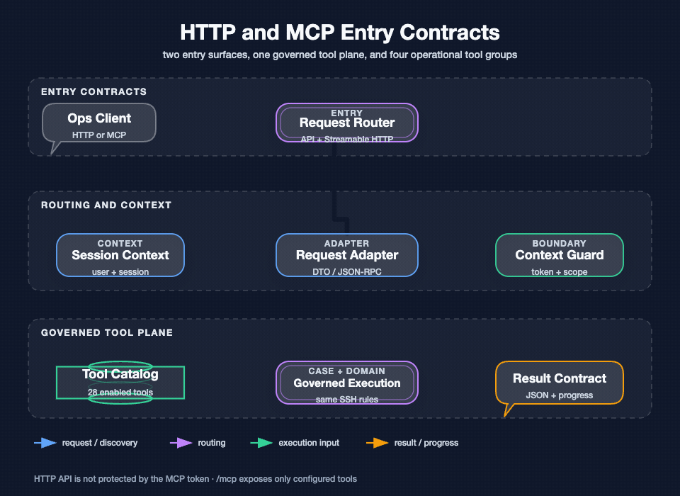

## 我要回答的问题

这个项目同时存在普通 HTTP、进程内 Agent 和外部 MCP 三种调用方式。它们最终可以落到同一套 SSH、Sandbox、Execution 和 SFTP 规则，但请求格式、会话来源、认证边界和返回方式并不相同。

我把入口契约单独写成一篇，是因为“工具能被发现”不等于“调用已经授权”，“HTTP 返回成功”也不等于“远端命令已经完成”。调用方需要先知道自己处在哪个入口，再决定使用哪个 session、connectionId、executionId 或游标。

图要回答的问题：普通 HTTP 和 Streamable HTTP MCP 如何进入同一工具平面，入口如何携带会话与认证信息，以及结果如何以 JSON、事件或长任务记录返回。`Request Adapter` 代表 DTO 或 JSON-RPC 到用例请求的转换，不代表一套新的业务规则；真正的执行仍由 Case、Domain 和基础设施边界完成。`Context Guard` 的失败会在触达远端之前结束，长任务结果通过 executionId 和增量输出继续观察。

## 三种入口的共同点和差异

| 入口 | 真实实现 | 会话来源 | 结果形态 | 关键边界 |
| --- | --- | --- | --- | --- |
| 普通 HTTP | `/api/v1/**` Controller | 请求体或查询参数中的 `userId`、`sessionId`、`terminalSessionId` | 统一 `Response`、`ResponseBodyEmitter` 或下载响应 | 当前没有统一登录过滤器，资源归属不能只靠字段名推断 |
| 内置 Agent | 应用内 Agent、ReAct Case、Spring AI 工具 | 当前聊天会话和绑定的终端上下文 | ReAct 事件、最终结果、工具事实 | 不经过 `/mcp`，不依赖 MCP Bearer Token |
| 外部 MCP | `/mcp` Streamable HTTP | transport 的 MCP 会话；缺失时才允许显式 `executionContextId` | MCP 工具发现和工具调用结果 | 静态 Bearer 只保护 `/mcp`，不自动保护普通 API |

三条路径最后都应使用完整的 `connectionId`，而不是连接名称、截断 ID 或猜测的主机地址。Agent 工具的文字描述会提醒模型遵守这个约束，服务端仍会在连接、执行目标、权限和策略层再次校验。

## 普通 HTTP API 的真实目录

### Agent 与会话

| 方法 | 路径 | 用途 | 结果或副作用 |
| --- | --- | --- | --- |
| GET | `/api/v1/query_ai_agent_config_list` | 查询启用的 Agent 摘要 | 返回 Agent ID、名称和描述 |
| POST / GET | `/api/v1/create_session` | 创建 ADK 会话和会话元数据 | 返回 `sessionId`；数据库记录失败只记录日志，不阻止 ADK 会话返回 |
| POST | `/api/v1/chat` | 同步对话 | 未传 `sessionId` 时创建会话，收集文本事件后拼接返回 |
| POST | `/api/v1/chat_stream` | ReAct 流式对话 | 返回 NDJSON 风格的 `ResponseBodyEmitter` 事件 |
| POST | `/api/v1/chat_stream/cancel` | 停止指定流任务 | `requestId` 对应的任务被标记停止，重复停止返回未找到或已结束 |
| POST / GET | `/api/v1/bind_terminal`、`/api/v1/unbind_terminal`、`/api/v1/query_binding` | 绑定聊天会话和终端会话 | 绑定关系供 Agent 工具恢复终端上下文 |

流式事件由 ReAct Case 负责产生，常见事件包括 `task_breakdown`、`text`、`tool_call`、`tool_result`、步骤结束、`done` 和 `error`。客户端断开只移除传输订阅者，后台流任务仍可能继续；因此前端不能用连接断开推断远端命令未执行。

### SSH 连接、终端和文件

| 资源 | 实际路径 | 主要操作 |
| --- | --- | --- |
| SSH 连接 | `/api/v1/ssh/create_connection`、`update_connection`、`delete_connection`、`get_connection`、`connection_list`、`connect`、`confirm_host_key`、`disconnect` | 保存配置、建立连接、确认主机指纹和断开连接 |
| 终端 | `/api/v1/ssh/terminal/list`、`open`、`exec`、`write`、`read`、`resize`、`close` | 页面 PTY 的打开、原始读写、调整大小和关闭 |
| 文件 | `/api/v1/ssh/file/tree`、`content`、`content-chunk`、`create-file`、`create-directory`、`rename`、`delete`、`save-content`、`upload`、`download` | 远端目录浏览、分片读取、文件变更、上传和下载 |
| 权限确认 | `/api/v1/permission/resolve` | 回写用户对危险工具调用的确认结果 |

连接接口与文件接口都返回统一 `Response`，参数错误通常映射为 `ILLEGAL_PARAMETER`，业务拒绝由领域异常携带业务码，未分类异常映射为 `UN_ERROR`。下载接口是例外：它直接写入二进制响应，发生异常时设置 HTTP 500。

### 本地指令回传通道

`/api/v1/tool_result`、`/api/v1/tool_result/pending`、`/api/v1/tool_result/pending_all` 和 `/api/v1/command_status` 属于本地指令分发兼容通道。服务端通过事件要求 Client 执行本地指令，Client 可以 POST 回传结果，也可以通过 GET 一次性消费缓存结果；这不是远端 SSH 执行接口，结果消费后不会永久留在这个内存缓存中。

## `/mcp` 的协议和认证边界

MCP 服务由 Spring AI 配置启用时挂载在 `/mcp`，当前协议配置为 Streamable HTTP、同步工具服务、工具能力开启，resource、prompt 和 completion 能力关闭，请求超时配置为 70 秒。MCP 服务通过 `ssh.mcp.enabled-tools` 读取白名单，并在启动时执行两项检查：白名单不能为空，且每个名字必须存在于本地运维工具目录。

开发或应用直连场景可以开启静态 Bearer Token。过滤器只匹配 `/mcp` 和 `/mcp/` 路径，使用常量时间比较校验 `Authorization: Bearer ...`；缺失或不匹配时返回 401。生产接入前置 MCP 网关时可以关闭应用内静态 Token，让网关承担身份认证，但这不会替普通 `/api/v1` 自动补上登录和权限。

因此我把以下两件事分开验收：

- MCP 客户端是否能 initialize、tools/list 和 tools/call。
- 普通 HTTP 客户端是否被网络边界、可信主体和资源归属检查保护。

## 当前实际的 28 个运维工具

工具总数以 `OperationToolCatalog` 和 `ssh.mcp.enabled-tools` 为准，共 28 个，分为四组。外部 MCP 的白名单默认包含这 28 个；内置 Agent 会按自身 Agent 配置选择工具，不能因为外部 MCP 白名单存在就假设内置 Agent 一定拥有全部工具。

| 组 | 工具 | 作用 |
| --- | --- | --- |
| SSH 8 个 | `mcp_ping`、`ssh_connection_list`、`ssh_connection_check`、`ssh_execute`、`ssh_execution_get`、`ssh_execution_cancel`、`ssh_execution_output`、`ssh_execution_recent` | 探活、选择连接、HOST 命令、长任务查询、取消、输出分页和最近执行恢复 |
| Sandbox 8 个 | `sandbox_capability_check`、`sandbox_template_list`、`sandbox_create`、`sandbox_get`、`sandbox_list`、`sandbox_execute`、`sandbox_reset`、`sandbox_destroy` | 检查远端 Docker 能力、模板、容器生命周期和隔离执行 |
| Execution 3 个 | `execution_get`、`execution_cancel`、`execution_recent` | 统一查询、取消和恢复 HOST、SANDBOX、INTERACTIVE_TERMINAL 执行 |
| SFTP 9 个 | `sftp_list`、`sftp_stat`、`sftp_search`、`sftp_read_lines`、`sftp_write`、`sftp_apply_patch`、`sftp_mkdir`、`sftp_move`、`sftp_delete` | 远端目录、文件事实、搜索、分段读取和受版本保护的变更 |

SSH 组中的四个兼容工具仍然存在，是为了兼容已有 MCP 客户端；新调用优先使用统一的 `execution_get`、`execution_cancel` 和 `execution_recent`。工具名称只是发现契约，执行仍会进入 Case 层的连接检查、目标策略、幂等、并发和命令准入。

## 关键参数和返回语义

### SSH 和 Execution

`ssh_execute` 接受 `connectionId`、可选 `executionContextId`、原始 Shell 命令、可选超时秒数和幂等键。同步窗口内完成时返回结果；超过同步等待窗口时返回 `executionId`，调用方必须继续查询同一个执行，不得因 HTTP 或 MCP 请求结束而重新提交原命令。`COMMAND_EXIT_NON_ZERO` 表示通道正常但远端命令退出码非 0，需要结合 `exitCode` 和输出判断。

`execution_get` 和 `ssh_execution_get` 的第一次 `cursor` 为空，后续原样传上次响应的 `nextCursor`；`waitSeconds` 只影响本次查询等待新输出的时间，不改变命令总超时。`execution_recent` 需要持续复用原来的 `executionContextId`，作用是找回执行记录，不是创建新执行。

### Sandbox

Sandbox 工具的 `connectionId` 指向已经连接的远端服务器，容器创建在目标服务器上，不是在 WaLiCode 部署机上。模板当前由配置提供，默认模板为 Java 17 Maven，另有 Node 20；创建、执行、重置和销毁都受 Sandbox 生命周期和资源策略约束。若执行策略返回 `SANDBOX_REQUIRED`，正确动作是先检查能力，再显式创建并使用 Sandbox，不能静默回退 HOST。

### SFTP

SFTP 所有路径都解释为目标 SSH 服务器上的远程绝对路径。`sftp_write` 写已有文件时需要提供由 `sftp_stat(includeSha256=true)` 得到的 SHA-256；`sftp_apply_patch` 要求文件版本匹配，并对每个精确替换检查期望出现次数，任意一项不满足就整体拒绝。`sftp_delete` 不允许删除根目录，`sftp_read_lines` 和 `sftp_search` 都有数量和输出上限。

成功工具通常返回 `success: true` 和操作摘要；工具包装层捕获参数、SSH 文件操作和未分类异常，返回 `success: false`、`code`、`message`。这类工具返回的是业务对象而不是 HTTP 状态码，调用方要先看 `success` 或执行状态，再决定是否继续。

## 从入口到真实执行的调用链

普通流式聊天的调用链是：

1. `POST /api/v1/chat_stream` 接收 Agent、用户、会话、终端和消息参数。
2. Controller 没有会话时先创建会话，然后把请求交给 ReAct Case。
3. Root 初始化动态上下文，加载最近历史、意图和 Agent 对话策略；Task Breakdown 可选生成子任务。
4. AI Call 节点裁剪历史、注入终端和核心记忆上下文，调用 ADK Runner。
5. 模型选择工具后，Tool Call 节点执行工具；SSH 工具把请求交给 SSH Execution Case，SFTP 和 Sandbox 也沿各自的 Domain/Port 进入基础设施。
6. 工具结果即时记录到当前上下文和历史，Loop Decision 判断继续、等待外部执行或结束，User Feedback 发送 `done` 或 `error`。

外部 MCP 的调用链少了聊天 ReAct 层，但没有绕过工具目录和底层用例：MCP transport 解析 JSON-RPC，工具回调获取 MCP 会话上下文，工具再进入相同的连接、执行和文件规则。内置 Agent 则不经过 `/mcp`，直接把 Spring AI 工具适配为 ADK Function Call。

## 我如何验证这套契约

我会先用无副作用的 `mcp_ping`、Agent 配置查询和连接列表验证入口，再用已知连接执行只读命令，最后才验收长任务、取消、SFTP 版本冲突和 Sandbox 能力不足。自动化测试覆盖 MCP 会话解析、工具回调注册、SFTP 工具返回、HTTP Controller 分支和本地结果轮询；真实验收还必须覆盖 Token 缺失、普通 API 旁路、断线重连、远端非零退出和应用重启。

下一篇：[聊天会话上下文与记忆](./17-聊天会话上下文与记忆.md) · 上一篇：[测试、验收、风险与技术取舍](./15-测试验收风险与技术取舍.md) · 相关：[认证、权限、会话与隔离边界](./11-认证权限会话与隔离边界.md)
