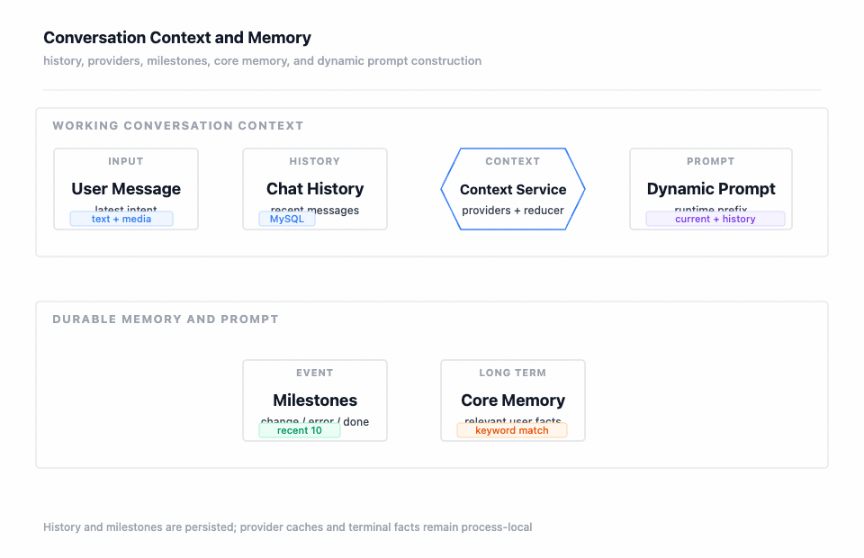

## 我要回答的问题

Agent 能不能连续工作，不只取决于模型。它还要知道当前是哪一个聊天会话、之前发生过哪些工具事实、当前终端处在哪个目录、用户是否纠正过方向，以及这些信息在下一轮应该保留多少。

我把“会话”和“记忆”拆开观察：`ChatSession` 是会话元数据，`ChatMessage` 是历史事实，Milestone 是从用户和工具消息中提取的事件，Core Memory 是可以跨会话复用的长期知识。它们都可能参与 Prompt，但生命周期、持久化位置和失败后的降级策略不同。

图要回答的问题：用户消息怎样进入聊天历史，Context Service 怎样组合多个 Provider，纠正和工具错误如何形成里程碑或核心记忆，以及相关记忆如何回到动态 Prompt。历史与里程碑的写入是事实路径，核心记忆的写入只在纠正、任务变更或工具错误等规则命中时发生；没有命中时不会把所有对话自动升级为长期记忆。

## 四类对象不是同一份上下文

| 对象 | 真实字段或内容 | 生命周期 | 主要用途 |
| --- | --- | --- | --- |
| ChatSession | `id`、`agentId`、`userId`、标题、消息数量、创建和更新时间 | 一个 Agent 聊天会话 | 让 ADK session 和数据库会话元数据有可追踪关系 |
| ChatMessage | `sessionId`、`role`、内容、工具名、`toolCallId`、优先级、估算 token 数 | 一条用户、工具或后续消息事实 | 恢复历史、去重工具结果和参与上下文裁剪 |
| Milestone | `TASK_CHANGE`、`TASK_COMPLETE`、`USER_CORRECTION`、`ERROR`、`DECISION`、`FILE_SWITCH` 及内容和时间 | 当前会话的关键事件 | 用较短记录提醒下一轮任务变化、错误和用户纠正 |
| Core Memory | 用户、作用域、分类、标题、关键词、正文、优先级、来源会话、使用统计 | 跨会话长期知识 | 按当前消息关键词检索后以 XML 片段注入 Prompt |

ADK 的运行时 session 仍然是执行所需的内存资源，数据库中的 ChatSession 记录不能替代 ADK 的全部状态。数据库能恢复聊天事实和元数据，但应用重启后，进程内 Agent Runner、终端绑定和部分运行时上下文需要重新建立。

## 会话从创建到下一轮恢复

### 显式创建

`create_session` 先根据 `agentId` 找到已装配的 Agent Runner，再用 `userId` 和一个用户相关的 session key 创建 ADK session。随后写入 ChatSession 元数据，初始消息数量为 0。数据库写入异常会记录错误，但不会把已经创建成功的 ADK session 当成失败返回，这体现了“运行时可用性”和“历史元数据持久化”是两个边界。

普通 HTTP 的 `userId` 必须非空，当前配置默认值为 `default` 的场景主要用于 MCP 工具。创建会话并不等于完成登录，也不等于得到企业身份；身份边界请看[认证、权限、会话与隔离边界](./11-认证权限会话与隔离边界.md)。

### 首次聊天或续聊

`chat` 没有 `sessionId` 时会先创建；`chat_stream` 也会在进入 ReAct Case 前补齐会话。Root 节点随后：

1. 读取 `sessionId`、`userId`、`agentId`、消息和可选终端。
2. 若请求带终端，则建立聊天会话到终端会话的绑定；若未带终端，则尝试恢复已有绑定。
3. 从数据库读取最近 50 条 ChatMessage，按时间正序放入动态历史。
4. 根据 Agent 配置决定意图识别、任务拆解、动态上下文、工具事件和工具结果持久化是否启用。
5. 对本轮消息做意图分类，形成执行预算，再把原始用户消息追加到当前上下文。

这一步没有把所有数据库消息直接原样交给模型。后续 Ai Call 节点还会执行历史裁剪、上下文 Provider 采集和动态 Prompt 注入。

## 上下文 Provider 的实际顺序

`ChatContextService` 在启动后按 Provider 的 order 排序，并把每个 Provider 返回的键值合并为 `PromptContextVO`。当前顺序和责任如下：

| 顺序 | Provider | 写入内容 | 事实来源 |
| ---: | --- | --- | --- |
| 10 | Terminal State | SSH 连接名、主机、端口、用户、操作系统、当前用户、uptime、当前目录 | 终端会话、连接仓储和受控 `pwd` / `whoami` 等查询 |
| 20 | Task | 前序用户消息作为任务描述 | 当前动态历史中的用户消息 |
| 25 | Core Memory | 与最后一条用户消息相关的长期记忆 XML | MySQL 核心记忆仓储 |
| 30 | Milestone | 最近 10 个关键事件 | Milestone Tracker 优先读数据库，失败时回退内存 |
| 40 | Tool Result | 当前会话工具结果结构化摘要 | 进程内结果缓存 |

Provider 不是互相覆盖的业务对象，而是按键贡献上下文。没有终端会话时，Terminal State 不会主动创建连接；取不到系统环境时只让该部分为空，不阻断其他 Provider。这样一个 SSH 连接失败不会让长期记忆或历史消息完全消失。

## 历史裁剪和工具事实保留

当前默认上下文预算是 8000。`HybridReducer` 合并优先级保留和滑动窗口保留的结果，再强制保留最近两条消息，并额外保留最近三个工具事实。滑动窗口最多保留 20 条消息，token 估算主要按文本长度除以 2，属于轻量估算，不是模型 tokenizer 的精确计费。

工具结果采用更严格的事实边界：工具执行完成后立刻写入 ChatMessage，使用 `toolCallId` 做 `insertIfAbsent`，同时追加到当前动态上下文并推送到 ToolResultProvider。当前轮结果最多保留约 2000 字符；结构化摘要区分历史轮和当前轮，并在工具类别维度压缩。

我这样处理是因为工具结果是远端已经发生的事实，不能因为 assistant 文本过长就全部裁掉；但也不能无上限地把每次命令输出再次放大到 Prompt。长 SSH 输出应回到 executionId、游标和专门的执行查询链路，而不是依赖聊天历史保存完整日志。

## 意图识别与任务拆解如何参与上下文

Root 节点先调用 Intent Service。它先使用规则分类器；置信度达到 0.8 时直接采用，否则调用 LLM 分类器，并在 LLM 置信度达到 0.5 时采用 LLM 结果，否则回退规则结果。分类结果按 `sessionId + 消息 SHA-256 前缀` 做 5 分钟、最多 200 项的进程内缓存，同时更新会话上下文中的实体。

分类失败不会自动当成高置信度运维命令，而是回退为 `UNKNOWN`，执行预算和后续 Agent 行为仍受 ReAct 节点限制。任务拆解是另一条可选链：Task Breakdown Node 根据消息和会话判断是否需要拆解，需要时调用服务生成子任务、发送 `task_breakdown` 事件，并把计划注入后续用户消息；简单任务直接跳过。

因此，“意图分类”“任务拆解”和“动态 Prompt”不是三份独立的聊天记录：前两者是本轮执行前的派生判断，Prompt 是在历史和实时状态基础上形成的输入前缀。

## 动态 Prompt 的两层信息

Prompt Service 先从 ChatContextService 取得 `PromptContextVO`，再把 Case 层的最近命令、工程上下文和终端信息补入，交给 Dynamic Prompt Builder。Builder 将内容划分为两层：

### 实时状态

系统环境、SSH 连接和当前目录属于实时事实，直接写入当前消息前缀。当前目录每次重新查询，因为用户可能在页面终端中执行过 `cd`；操作系统、当前用户和 uptime 在同一终端会话内使用进程缓存，断开时清除。

### 历史和长期知识

最近命令、关键事件、工具摘要和前序任务会标注为历史上下文，并明确要求模型以当前用户意图为主。Core Memory 单独标注为跨会话持久偏好或知识，不与一次会话的里程碑混为一谈。

如果所有 Provider 都没有内容，Prompt Service 返回原始用户消息，不添加空前缀；如果有内容，则用上下文前缀、分隔线和原始消息组合，避免把历史信息伪装成当前指令。

## Milestone 和 Core Memory 的写入规则

Milestone Tracker 会识别用户消息中的后悔、方向变化、停止、完成等模式，也会识别工具结果中的 error、failed、permission denied、timeout 等错误词。命中后把最多 200 字符的内容加入会话内存，并尝试写入数据库；数据库写失败时，当前进程内的事件仍可作为降级来源。

其中 `USER_CORRECTION` 和任务变更类事件会触发 Core Memory 的纠正记忆写入，工具错误会写入低优先级事实记忆。Core Memory Service 会限制用户记忆总量为 50 条，超出后尝试淘汰 30 天未使用且优先级不高于 3 的冷记忆。

读取核心记忆时，最后一条用户消息最多取 200 字符作为查询；仓储按分词后的关键词做包含匹配，没有命中时回退到最近的高优先级记忆。命中的记忆会更新 `lastUsedAt` 和使用次数，并以 `<core_memories>` XML 片段注入 Prompt。这个实现是关键词相关性过滤，不是向量检索，也不会宣称具备语义相似度召回。

## 一次完整对话的事实时间线

我会把一次流式对话拆成以下事实点：

1. Controller 接收消息，若无会话则创建 ADK session 和 ChatSession 元数据。
2. Root 从数据库恢复最多 50 条历史，设置终端绑定、意图和执行预算。
3. Ai Call 节点裁剪历史，采集 Provider，构建动态 Prompt，首轮保存原始用户消息。
4. ADK Runner 输出 assistant 文本或工具调用事件；工具事实一旦完整返回，就由 ToolOutcomeContextRecorder 幂等写入历史和当前上下文。
5. Milestone Tracker 检查用户或工具内容，必要时写入会话事件和长期纠正/事实记忆。
6. Loop Decision 根据工具调用、后台执行、终止指令、错误、步数和重复签名决定继续或结束。
7. User Feedback 发送最终 `done` 或 `error`，清理终端 ThreadLocal、会话绑定和 SSE 工具进度订阅。

assistant 文本只有在流正常结束时才适合进入完整历史；工具结果则是已发生的外部事实，需要在收到完整结果后立即记录。这也是为什么“模型说过什么”和“工具实际做过什么”在持久化时采用不同提交时机。

## 失败、重启和一致性边界

- ADK Runner 不存在：按 Agent ID 查询失败，调用直接报 Agent 不存在。
- 历史读取失败：ReAct 仍可以在有限上下文下运行，但不会假设历史已经完整恢复。
- Provider 查询失败：该 Provider 返回空或回退内存，其他 Provider 继续构建。
- 工具结果重复到达：`toolCallId` 去重，内存上下文也只保留一份。
- SSE 客户端断开：传输订阅者移除，后台执行可能继续，下一轮必须依据已有事实查询，不得重复命令。
- 进程重启：MySQL 中的会话、消息、里程碑和 Core Memory 可以恢复；ADK 内存 session、终端 Channel、工具结果缓存和部分绑定关系不能被数据库自动重建。

这条边界决定了我不会把聊天历史宣传成完整事件溯源，也不会把 Core Memory 宣传成自动学习全部用户行为。它是一个带规则触发、关键词召回和数量淘汰的轻量长期记忆实现。

## 我如何验证上下文没有越界

自动化测试覆盖 Prompt Service 的 userId 传递、核心记忆添加和召回、工具结果幂等记录、历史裁剪、SSE chunk 与 messageHistory 的边界，以及 Agent 配置对动态上下文的开关。联调时还要确认终端 `cd` 后目录变化、工具错误能进入下一轮、用户纠正能形成长期记忆、重连不会重复保存工具事实，并在应用重启后区分“数据库事实恢复”和“运行时资源已失效”。

上一篇：[HTTP 入口与 MCP 工具契约](./16-HTTP入口与MCP工具契约.md) · 相关：[ReAct 对话与 Agent 调用链](./10-ReAct对话与Agent调用链.md)、[数据一致性、并发与异常处理](./12-数据一致性并发与异常处理.md) · 返回：[项目总览](./index.md)
