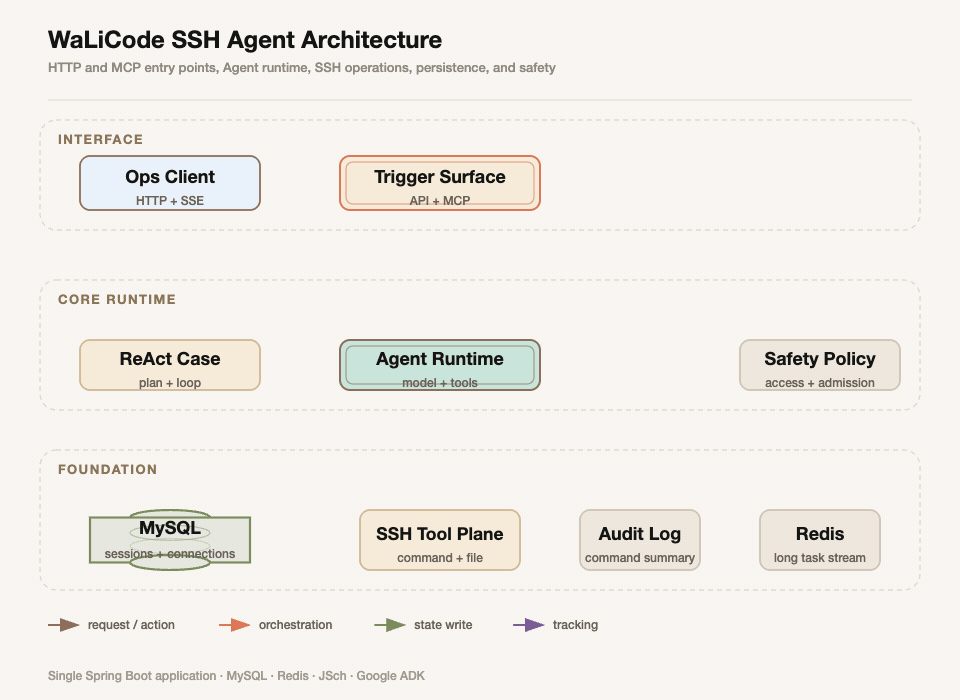

## 我如何理解这个项目

我把这个项目理解为一个以运维为中心的 Agent 执行底座。它不是把大模型接到一个普通的 SSH 客户端上，而是把“模型决定做什么”“系统允许做什么”“远端主机实际做了什么”拆成可以观测、可以拒绝、可以恢复的不同边界。

项目的主链路是 SSH。用户可以先配置远端连接，完成密码或私钥认证，并在严格主机密钥检查下确认指纹；随后，页面终端、内置 Agent 或外部 MCP Agent 都可以在明确的连接和执行上下文中发起命令。命令执行经过准入链，进入远端 Managed Shell，输出被限制、分块并可写入 Redis，长任务由 executionId 和游标继续观察。文件操作则复用 SSH Session，但为每次 SFTP 操作建立独立 Channel。

Agent 是另一条装配链。应用就绪后，配置被装配为 AI API、Chat Model、Agent、Workflow 和 Runner；内置 SSH、Sandbox、Execution、SFTP 能力与动态 MCP、Skills 能力统一进入工具平面。ReAct 节点负责拆解任务、调用模型、执行工具、记录结果和判断是否继续，SSH 执行仍然回到同一套 Case、Domain 和 Infrastructure 边界。

图要回答的问题：一个运维请求怎样从 HTTP 或 MCP 入口进入 Agent Runtime，再落到 SSH 工具、MySQL 会话事实、Redis 长任务记录和安全策略。图中 `Trigger Surface` 是协议入口，`Agent Runtime` 是模型与工具的编排面，`SSH Tool Plane` 是副作用入口；Redis 只负责长任务跟踪，不等于远端 Shell 本身。

## 全局阅读路径

第一次阅读先看 [项目知识地图](./00-知识地图.md)，再按 [项目背景与定位](./01-项目背景与定位.md)、[DDD 分层与系统架构](./02-DDD分层与系统架构.md)、[领域模型与业务边界](./03-领域模型与业务边界.md) 建立空间认知。然后进入 [Agent 装配与工具暴露](./04-Agent装配与工具暴露.md)，最后沿 SSH 主链路阅读连接、命令、长任务、终端文件和 Sandbox 专题。

如果只关心一次真实运维调用，推荐阅读顺序是 [SSH 连接认证与主机信任](./05-SSH连接认证与主机信任.md) → [SSH 命令执行主链路](./06-SSH命令执行主链路.md) → [长执行输出游标与故障恢复](./07-长执行输出游标与故障恢复.md)。如果关心 Agent 如何驱动这条链路，再接着读 [ReAct 对话与 Agent 调用链](./10-ReAct对话与Agent调用链.md) 和 [聊天会话上下文与记忆](./17-聊天会话上下文与记忆.md)。如果关心外部调用方如何接入，阅读 [HTTP 入口与 MCP 工具契约](./16-HTTP入口与MCP工具契约.md)。

## 我确认过的真实边界

当前工程是 Maven 分层单体：`app` 负责启动和配置，`trigger` 暴露 HTTP、MCP 和工具，`case` 编排场景，`domain` 保留领域规则和端口，`infrastructure` 接入 MySQL、Redis、JSch、Docker 等外部设施，`api` 与 `types` 提供契约、响应、异常和枚举。

当前普通 `/api/v1` 接口主要使用 `userId`，默认值是 `default`；我没有在源码中发现完整登录用户、租户体系或细粒度 RBAC。`/mcp` 有静态 Bearer Token 过滤器，但这个过滤器只保护 MCP 路径，不自动保护普通 HTTP API。这个边界会在 [认证、权限、会话与隔离边界](./11-认证权限会话与隔离边界.md) 中单独说明，不能把它包装成已经完成的企业身份治理。

项目适合做受控的 SSH 运维、状态检查、日志排障、远程文件维护和 Agent 辅助操作；它不等同于完整堡垒机、CMDB、企业 IAM 或跨实例高可靠终端平台。尤其是进程重启后，Redis 可以帮助找回执行元数据和输出游标，但不能凭空恢复一个已经消失的远端 Shell。

## 配套资料

知识库中的每张图都保留静态 SVG、PNG、语义 JSON、GIF 和 motion report。图稿只使用可公开的项目概念，不包含密钥、表名、内部类名或源码路径。部署、验证和取舍的最终结论分别收录在 [部署拓扑、配置、监控与运维](./14-部署拓扑配置监控与运维.md) 和 [测试、验收、风险与技术取舍](./15-测试验收风险与技术取舍.md) 中。

完整导航：[项目知识地图](./00-知识地图.md) · 入口契约：[HTTP 入口与 MCP 工具契约](./16-HTTP入口与MCP工具契约.md) · 上下文：[聊天会话上下文与记忆](./17-聊天会话上下文与记忆.md)
