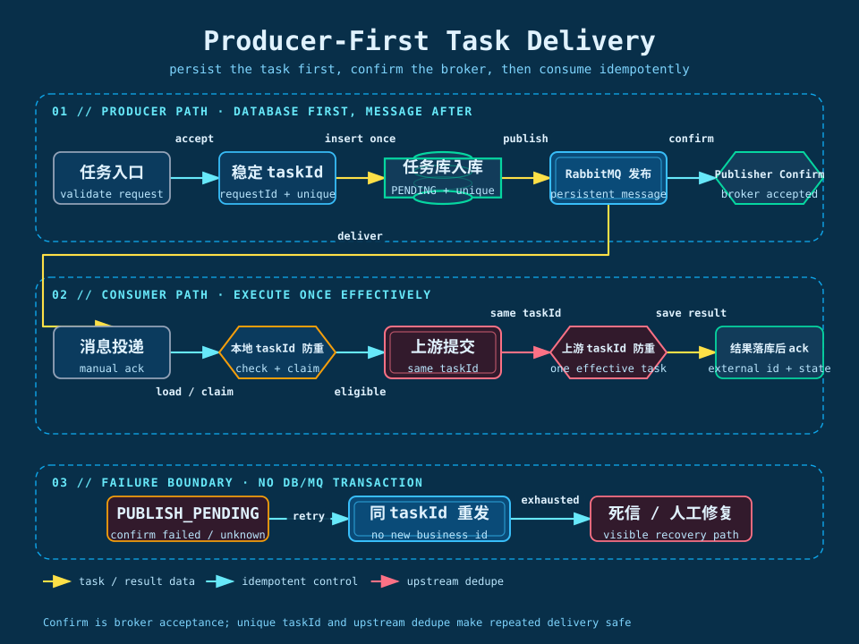

## 我先拆开“提交”和“执行”

最初的同步思路是：接口接收请求后，直接调用上游并等待结果。单次请求下它比较直观，但不适合 AI 调用上游的耗时任务：上游耗时不可控，批量请求会占满接口线程，失败重试会继续延长请求时间；如果没有统一的任务 ID 和状态控制，本地重试还容易造成同一任务重复执行。

我把链路拆成两个阶段：

1. **提交阶段**：校验输入、生成稳定的任务身份，生产者先使用唯一索引幂等写入主任务和子任务，再发布带有 `taskId` 的消息并等待 Publisher Confirm，确认消息已被 broker 接收后返回任务 ID。
2. **执行阶段**：消费者从 RabbitMQ 取出子任务，先按本地 `taskId` 做状态检查和抢占，再调用上游，保存外部任务标识，最后由回调或受控查询更新最终结果。

这样，接口耗时不再等于 AI 生成耗时，队列也成为入口流量和上游处理能力之间的缓冲层。

我在实现时把“异步”具体化成三个约束：接口线程不能等待生成结果；消息不能依赖进程内对象；消费者不能把一次上游调用的失败直接当成整个批次失败。只有这三个约束同时成立，异步化才不是把同步代码换到线程池里，而是把任务生命周期真正交给后台处理。

静态图展示主要职责边界，可以看到任务从生产者入库、RabbitMQ 发布确认进入队列，再被消费者取走并回写结果。

## 一条任务完整流程是怎么样的

下面以一个批量任务为例说明完整路径。批量任务在内部会拆成多个子任务，每个子任务独立调用上游、重试和回写，主任务只做进度和结果汇总。

### 1. 请求进入：生产者先写任务事实

我在提交接口中保留四类快速动作：身份和权限校验、参数校验、配额预检查、生成稳定的任务身份。请求会生成或接收稳定的业务幂等键，生产者先用 `requestId`/业务键判断是否已经受理；重复点击时返回已有 `taskId`，不能因为前端重试就再次扣配额或创建一批本地任务。

我先为主任务和子任务生成稳定的 `taskId`、`subTaskId` 和上游请求 ID，再使用唯一索引幂等写入主任务和子任务。任务初始状态为 `PENDING` 或 `PUBLISH_PENDING`，记录输入引用、业务类型、版本、重试计数等必要事实，不保存图片二进制。当前实现没有把数据库写入和 RabbitMQ 发布放在同一个数据库事务中，因此消息发布状态必须单独记录，不能把一次数据库写入误认为消息已经成功。

这里的关键不是“把代码放到异步线程里”，而是让任务事实、消息和上游调用都围绕同一个稳定身份协作。生产者先把任务记录写入数据库，消费者拿到消息后能够查询到任务；唯一索引负责阻止重复建档，幂等校验负责让重试继续使用原任务身份。

### 2. 生产者入库后发布：Confirm 只确认 broker 接收

这条链路的实际顺序是：生产者写入任务事实，发布带有稳定 ID 的 RabbitMQ 消息，等待 Publisher Confirm，再把发布结果记录到任务或投递记录中。Confirm 是 RabbitMQ 发布端对 broker 的确认，不是数据库事务，也不是消费者完成确认。

发布端至少要同时处理三类结果：

1. **Confirm 成功**：RabbitMQ 已接收消息；如果使用持久化消息，还要确保 exchange、queue 和消息属性都按持久化配置创建。
2. **Confirm 失败或结果未知**：本次发布不能被当成成功，重试时必须复用原 `taskId`、`subTaskId` 和上游请求 ID，不能重新生成一套业务身份。
3. **消息不可路由**：开启 mandatory/return 处理，收到退回时按发布失败处理；客户端拿到了发送方法返回值，不等于消息已经进入有效队列。

RabbitMQ Publisher Confirm 只回答“broker 是否接收了消息”，不代表消费者已经开始执行，也不代表消费者已经完成。消费者可能在生产者收到 Confirm 回调之前就收到消息，因此消费者不能把 Confirm 当成自己的消费触发条件。后面还有一个独立确认：消费者是否已经把执行结果持久化并 ack。

没有数据库事务时，真正需要处理的是“任务已经入库，但生产者还没有成功发布消息”的窗口。任务必须保留 `PUBLISH_PENDING` 状态，发布侧在当前请求内有限重试；如果进程已经退出，则需要一个按状态触发的发布重试、人工重放或其他修复入口，继续使用原 `taskId` 发布。只依赖 Confirm 而没有任何恢复入口，无法保证数据库中的任务最终进入队列。

如果重复发布，RabbitMQ 可能出现多条相同业务消息，这是可以接受的；不能接受的是为重试生成新的 `taskId`。本地唯一索引和状态条件阻止重复推进，上游 taskId 防重阻止重复创建有效外部任务。

这套方案的边界必须明确：它是“生产者任务入库 + RabbitMQ 至少一次投递 + 本地与上游双层幂等”，不是数据库与消息的原子一致性。唯一索引解决重复数据，Confirm 解决发布端是否知道 broker 已接收，发布重试解决数据库与消息之间的时间窗口。

### 3. 消息只承载执行意图

消息中放任务 ID、子任务 ID、业务类型、幂等键、必要的版本信息和输入引用，不把大图片内容和完整业务对象塞进消息。消费者拿到消息后根据稳定 ID 查询生产者已经写入的任务事实；如果因生产者发布后落库状态未完成、数据库暂时不可用或数据异常导致查不到任务，不能直接 ack，也不应创建新的业务任务，而应进入重试或人工修复路径。

消息还需要带上投递次数、创建时间和追踪标识。消费者可以据此区分首次投递和延迟重试，日志也能把一次任务的接口请求、队列消费、上游调用和回调串起来。消息中不放临时签名 URL，因为 URL 可能过期；消费者需要时根据文件元数据重新获取短时地址。

### 4. 消费者先检查状态，再调用上游

消费者从业务队列取出一条子任务后，不会直接调用上游，而是按以下顺序处理：

1. 解析消息并校验任务 ID、业务类型和幂等键。
2. 根据 `taskId` 查询生产者已经写入的任务事实；查不到记录时不调用上游、不 ack，进入重试或修复路径。
3. 只有 `PENDING`、`RETRY` 或明确允许执行的状态才能继续，并通过带状态/版本条件的更新抢占执行权。
4. 获取对应上游账号的并发许可，超过上限就延迟处理，不在当前线程里长时间等待。
5. 调用上游提交接口，始终复用同一个 `taskId` 或上游请求 ID，并分别设置连接超时、读取超时和总耗时。
6. 保存外部任务 ID、提交时间和响应分类；本地执行事实持久化成功后，再确认消息。

如果任务已经成功、失败或被取消，说明这是一条迟到消息或重复消息，消费者只记录一次跳过原因并确认消息；如果任务已经被其他消费者抢先推进，本地应直接跳过。即使因为消费竞态或消费者宕机而再次触达上游，也必须沿用同一个任务 ID 或请求 ID。上游按这个 ID 做防重，本地也按 `taskId` 做防重，两层共同保证不会创建第二个有效任务。

处理成功的含义是“上游已经接受并且本地记录已经保存”，不是“图片已经生成完成”。生成完成由上游回调或受控查询驱动。

### 5. 上游受理和最终完成是两个状态

我把上游调用拆成“提交动作”和“生成结果”两个阶段。提交响应只证明上游受理成功，不能把它直接写成最终成功；本地至少要保存外部任务 ID、上游状态、最近查询时间和最后一次错误。

这里有一个实际困难：提交接口超时后，客户端可能已经创建了外部任务。此时重试必须沿用原任务 ID 或请求 ID；上游会根据稳定 ID 做防重，本地再通过任务 ID、外部任务 ID 和状态记录完成对账。即使上游暂时无法查询，也不能生成新的业务 ID 静默提交，而应把任务放入“提交结果未知”的补偿状态。

### 6. 结果通过回调完成闭环，查询只做受控兜底

回调接口只做快速校验、幂等判断和状态更新，不在回调请求中进行压缩、批量下载等重操作。消息投递失败属于生产者发布链路的问题，由 `PUBLISH_PENDING` 和同 taskId 重试处理；结果完成则优先由上游回调推进，不让一个常驻定时器在没有待处理任务时持续制造外部调用。

回调链路至少要校验签名或来源、外部任务 ID、业务归属和状态版本。回调可能重复到达，也可能先到成功、后到处理中；状态更新必须使用允许迁移条件，迟到事件不能把成功状态改回处理中，避免重复执行相关任务的额外支出。

如果上游协议没有回调，只能增加受控的结果查询：通过延迟消息或有限重试只触达明确处于处理中的任务，设置最大执行时长、退避和限速，超过窗口进入“结果未知”或人工对账状态。这个兜底查询解决的是结果通知缺失，不承担消息投递和任务落库补偿。

### 7. 结果归档：把外部地址变成本地事实

上游返回图片地址后，我不会直接把这个地址当成永久结果。结果处理器先校验响应，再把文件转存到对象存储，保存对象 Key、文件大小、类型和校验信息，最后才把子任务推进到成功。

下载、转存、压缩都属于独立的重操作，不能放在回调 HTTP 请求里同步完成。转存失败时保留“生成完成、结果待归档”的中间事实，允许只重试归档，不重新调用上游，从而避免重复生成和重复计费。

### 8. 批次汇总：处理部分成功和重复完成

当一个批次的子任务全部进入终态后，再触发图片聚合、压缩和文件交付。用户查询的是本地任务状态，避免把上游接口直接暴露给前端。

主任务不能只用一个成功计数判断完成，因为子任务可能重复回调。每次子任务从非终态首次进入成功、失败或取消时，才更新主任务计数；计数更新通过终态事件唯一键和条件更新保证只生效一次。主任务的结果需要区分全量成功、部分成功和全量失败，部分成功不能被异常处理器误判为系统故障。

## 我在落地时遇到的几个难点

### 任务库先写、消息再发：如何处理确认边界

在这个项目里，生产者先把任务事实写入数据库，再发布带稳定 ID 的 RabbitMQ 消息。数据库写入和消息发布没有放在同一个数据库事务中，因此我把 Confirm、唯一索引、幂等校验和重试边界分别建模，而不是把它们描述成一个原子动作：

1. **先固定身份**：在任何数据库写入和远程调用前生成稳定的 `taskId`、`subTaskId` 和上游请求 ID；客户端重试或服务端重试都必须复用原身份。
2. **生产者先入库**：使用 `taskId`、业务幂等键和唯一索引创建主任务、子任务，初始状态为 `PENDING` 或 `PUBLISH_PENDING`。唯一索引负责兜住并发插入，不能只依赖“先查再插”。
3. **发布持久化消息**：消息携带任务 ID、业务类型、输入引用、版本和追踪信息；exchange、queue 和消息按持久化要求配置，并处理 mandatory/return。
4. **等待 Publisher Confirm**：Confirm 成功只表示 broker 已接收消息；Confirm 失败、不可路由或结果未知时，保留 `PUBLISH_PENDING`，按原 taskId 重试，不能生成新任务。
5. **消费者先查本地状态**：消费者收到消息后根据 taskId 查询生产者已经写入的任务，使用状态条件抢占执行权；查不到任务时不能直接调用上游，也不能直接 ack。
6. **结果落库后 ack**：消费者调用上游时复用原 taskId。即使上游已经受理但本地保存失败，消息重投后仍调用同一个 taskId；上游防重，本地唯一索引和状态条件防止重复推进，最终结果持久化后再 ack。

这条链路提供的是“生产者任务入库 + RabbitMQ 至少一次投递 + 本地与上游双层幂等”，不是数据库与消息的 Exactly Once。Confirm 不能替代数据库写入；数据库唯一索引不能替代消息发布；消费者 ack 也不能替代结果落库。

### 消费者宕机导致消息重复

消费者可能已经调用上游，但还没有来得及保存外部任务 ID 就宕机。重新投递时，本地看起来仍是待处理。此时仍然使用原任务 ID 或请求 ID 重新提交，上游会按原 ID 识别重复请求并保持防重，本地再根据实际响应补写外部任务 ID 和状态；本地任务 ID 检查则负责减少不必要的重复调用和重复状态推进。“手动 ack”只能控制消息是否重新投递，不能替代本地任务幂等和上游 ID 防重。

### 回调成功但结果下载失败

我把上游生成成功和结果归档拆开，保留可恢复的中间状态。这样文件网络异常只会重试下载或 OSS 写入，不会重新走生图流程。

### 批量任务中只有部分子任务失败

主任务汇总必须等待所有子任务进入终态，不能第一个失败就直接结束整个批次。前端查询返回已完成数量、失败数量和可重试数量，后续可以只重试失败子任务，不重复执行已经成功的子任务。

## 我用一张表固定每个阶段的责任

| 阶段 | 本地必须留下的事实 | 下一步触发者 | 失败后的动作 |
| --- | --- | --- | --- |
| 请求受理 | taskId、subTaskId、业务幂等键和初始状态 | 生产者写入任务库 | 唯一键冲突返回已有任务；写入失败不能发布新身份 |
| 消息投递 | 消息 ID、投递状态、Confirm 结果、追踪标识 | RabbitMQ 发布器 | confirm 失败或未知时按原 taskId 重试；必要时人工修复 |
| 消息消费 | 投递 ID、消费次数、开始时间 | 消费者 | ack 前退出则重新投递，不能生成新 taskId |
| 上游提交 | 外部任务 ID、受理时间、响应分类 | 回调或受控查询 | 分类重试或进入结果未知 |
| 生成处理中 | 外部状态、最近查询时间 | 回调或受控查询 | 退避查询，超过总时长终止 |
| 结果归档 | 对象 Key、大小、类型、校验信息 | 归档任务 | 只重试归档，不重新生成 |
| 批次完成 | 子任务终态计数、交付状态 | 用户查询或通知 | 部分成功可单独重试 |

这张表对应到代码职责时，接口层只负责受理，消息生产者只负责发布，消费者只负责执行一次尝试，状态服务只负责合法迁移，回调和受控查询只负责产生事件，归档任务只负责文件处理。职责拆开后，出现问题时能定位应该重试哪个动作，也避免一个异常处理器把整条链路重新执行。

代码层的提交、消费、上游防重和本地落库边界，见前面的异步架构图、消息消费决策图和“生产者任务入库、消息发布确认”流程图。图中需要特别注意：生产者先写入任务事实；消息携带任务 ID、稳定幂等 ID 和最小执行事实；消费者先查询本地状态，再决定是否执行；上游提交始终复用同一个 ID；执行结果持久化后才确认消息。

这里的 `claim` 和 `moveToProcessing` 不是普通的无条件更新，而是带当前状态和版本条件的更新；生产者入库成功但 `publish` 未确认时，任务保留 `PUBLISH_PENDING`，发布侧按原身份重试或进入人工修复；消费者执行成功但 ack 前退出时，消息可以重复投递，由本地和上游幂等收敛。图中的每一个分支，都对应后文的重试、状态机和幂等控制。

## 并发控制是异步化的一部分

RabbitMQ 只负责缓冲，不代表消费者可以无限增加。我把并发控制拆成三层：

| 控制层 | 控制内容 | 目的 |
| --- | --- | --- |
| 消费者层 | 固定并发范围和合理 prefetch | 避免单实例一次拉取过多未完成任务 |
| 业务层 | 用户、业务类型和上游账号维度的限流 | 避免某个用户或账号占满资源 |
| 依赖层 | HTTP 超时、连接池和上游并发上限 | 防止慢请求拖垮线程和连接 |

如果队列积压，优先观察消费速率、上游响应时间和数据库连接使用率，再决定是否扩容消费者。不能只看到队列变长就盲目增加并发，因为上游限流或数据库瓶颈可能会让积压更严重。

*下一章：[并发消费如何受到控制](./12-concurrency-and-capacity)*
