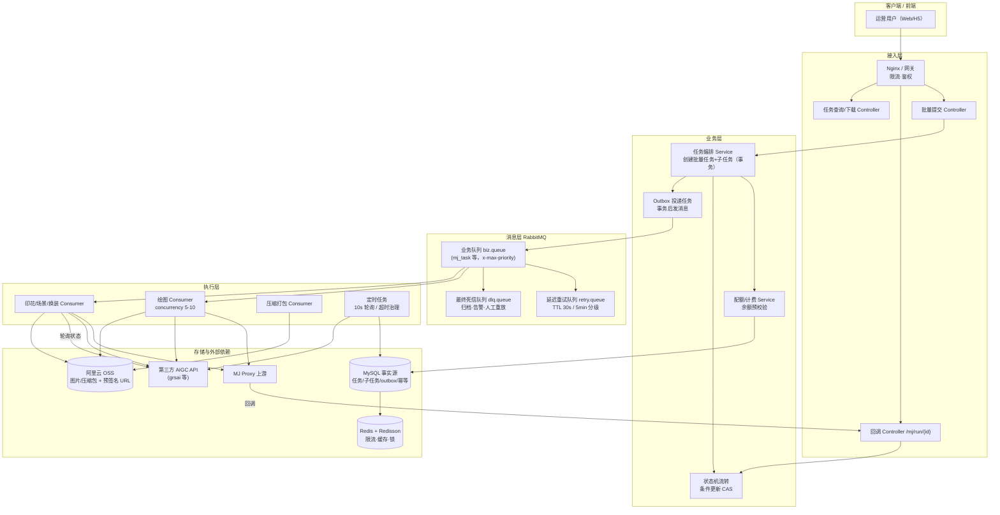

> 本章给出系统的**分层架构、逻辑架构图、核心设计原则**，是理解后续所有章节的地图。先讲整体，再讲细节。

---

## 1. 架构分层总览

系统自顶向下分为五层，每层职责单一、通过明确定义的数据契约协作：

```
┌─────────────────────────────────────────────────────────────────┐
│ 接入层（网关 / Controller / 全局过滤器）                          │
│   鉴权 · 限流 · 参数校验 · 统一响应 · traceId 生成 · 防重复提交     │
├─────────────────────────────────────────────────────────────────┤
│ 业务层（Service / 状态机）                                       │
│   任务编排 · 配额校验 · 状态流转 · 结果聚合 · 计费 · 事务边界       │
├─────────────────────────────────────────────────────────────────┤
│ 消息层（RabbitMQ）                                              │
│   业务队列 · 延迟重试队列 · 最终死信队列 · 优先级 · 发布确认       │
├─────────────────────────────────────────────────────────────────┤
│ 执行层（Consumer / 定时任务）                                    │
│   MJ 出图 · 印花提取 · 产品生场景 · 换装 · 压缩打包 · 结果回写      │
│   回调接收 · 兜底轮询 · 超时治理                                  │
├─────────────────────────────────────────────────────────────────┤
│ 存储与外部依赖层                                                  │
│   MySQL（事实源）· Redis/Redisson（缓存/限流/锁）· 阿里云 OSS      │
│   · 外部 AIGC API（MJ Proxy / grsai）                            │
└─────────────────────────────────────────────────────────────────┘
```

**分层原则**：上层只依赖下层的接口契约，不跨层访问（如 Controller 不直接操作 Mapper）；消息层与外部服务层对业务层透明，业务层不感知"消息是 MQ 还是 RPC"。

## 2. 逻辑架构图（Mermaid）



## 3. 核心设计原则（贯穿全书的判断标准）

| 原则 | 含义 | 落地体现 |
|------|------|---------|
| **DB 是事实源，MQ 只是管道** | 任务的一切状态以数据库为准；MQ 消息丢失可重放，DB 丢了就真丢了 | Outbox 表、状态机落库、扫描兜底（14 章） |
| **异步化 + 削峰填谷** | 接口毫秒返回，耗时交给队列缓冲与并发消费 | 提交接口只建任务入队（12-§3） |
| **一切故障都要收敛** | 任何异常路径最终都走到终态（成功/失败/取消），不允许"卡住" | 状态机 + 超时治理 + DLQ（16 章） |
| **幂等是默认要求** | 消息/回调/扣费天然可能重复，设计上必须可重复执行 | 唯一键 + 条件更新（14 章） |
| **故障隔离** | 一类业务故障不影响另一类业务 | 独立队列 + 独立死信（13 章） |
| **可观测性** | 每笔请求可追溯、每个异常可告警 | traceId、错误码、分层告警（15 章） |

## 4. 存储架构要点（为什么这么放）

| 存储 | 放什么 | 为什么 |
|------|--------|--------|
| MySQL | 任务/子任务/进度/outbox/计费/幂等记录 | 需要事务与唯一约束（幂等、计费一致性），量级万级/日，关系型足够 |
| Redis | 限流计数、令牌桶、用户配额缓存、分布式锁、热点状态缓存 | 高吞吐、低延迟；不可用时降级为直查 DB（15-§5.3） |
| 阿里云 OSS | 生成图、ZIP 压缩包、输入素材 | 无限容量、免自建存储；预签名 URL 提供安全直链（17-§5） |
| RabbitMQ | 任务消息、重试、死信 | 削峰、异步、失败重试的载体（13 章） |

## 5. 关键链路速览（三个"闭环"）

1. **提交闭环**：提交 → 建任务（事务+Outbox）→ 投递 → 消费 → 调上游 → 回调/轮询更新状态 → 全部完成 → 压缩 → OSS → 可下载；
2. **失败闭环**：消费失败 → 分类（可重试/不可重试）→ TTL 延迟重试（封顶 N 轮）→ 最终死信 → 置失败+告警+人工重放；
3. **一致性闭环**：业务事务写库 → Outbox 发消息 → 消费幂等 → 状态条件更新 → 定时扫描兜底收敛。

---

*下一章：[12-core-business-flows.md](./12-core-business-flows.md)*
