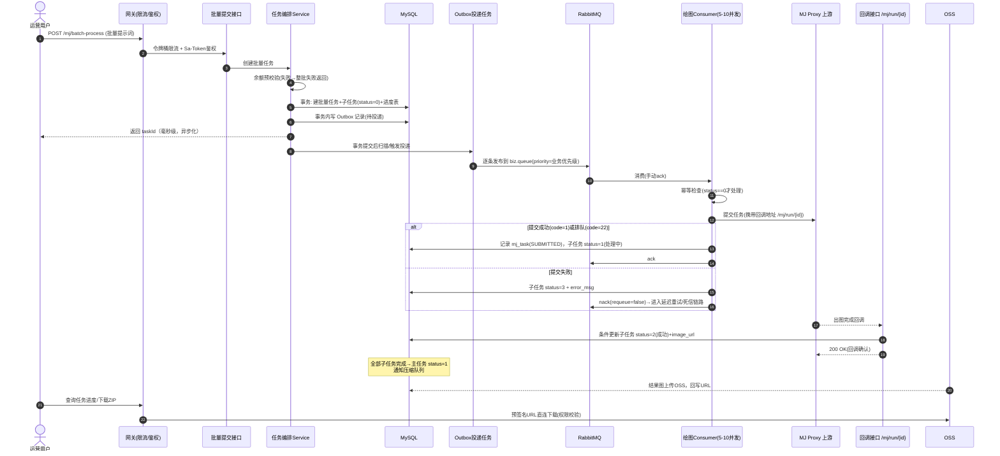
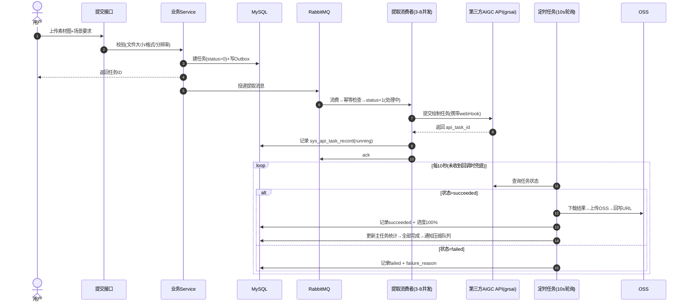
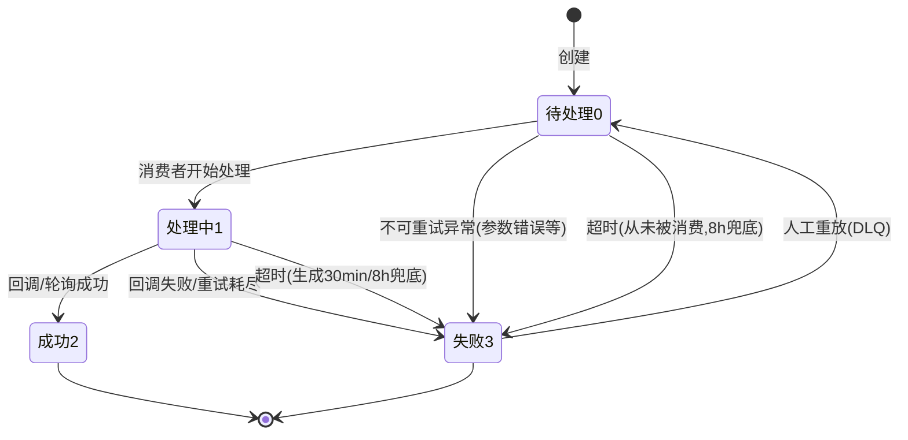
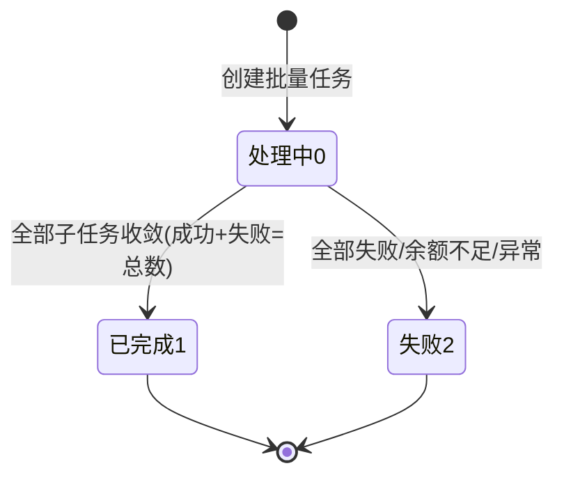
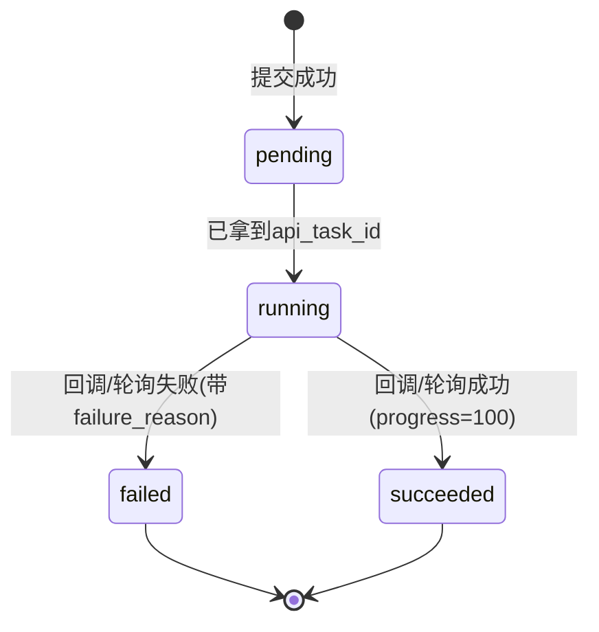

> 本章用 Mermaid 时序图/流程图讲清三个核心闭环：**批量绘图全流程、消息生命周期、印花提取/换装流程**。每个环节标注"做什么、为什么、失败怎么办"。

---

## 1. 批量 AI 绘图全流程（主流程）



**步骤解读（小白版）**：
- 步骤 1~6：用户提交 → 系统只做"记账"（建任务）并**立刻返回**，不等待出图——这就是"异步化"；
- 步骤 8~10：后台消费线程（并发 5~10 个）从队列取任务逐个调上游，**队列就是缓冲区**，请求再多也不会直接打到上游；
- 步骤 15~17：上游画完图会回调本系统（或系统轮询），回调把任务状态改成"成功"；
- 步骤 18~20：全部画完后打包上传 OSS，用户下载走预签名直链，**不占用应用服务器带宽**。

**失败怎么办**：第 14 行"提交失败"不直接丢弃——按 13 章规则进入延迟重试（30s/5min 分级）→ 封顶后进死信 → 置失败+告警，用户可看到失败原因。

## 2. 消息完整生命周期（一图看懂重试流转）

```mermaid
flowchart LR
    P["生产者<br/>(Outbox投递)"] -->|publish + confirm| X["biz.exchange"]
    X -->|routing key| Q["biz.queue<br/>业务主队列"]
    Q -->|投递给消费者| W["业务消费者"]
    W -->|处理成功 ack| OK["✅ 终态：成功"]
    W -->|可重试异常<br/>nack(requeue=false)| DLX1["retry.exchange"]
    DLX1 -->|retry.key| RQ["retry.queue<br/>TTL 30s/5min 无消费者"]
    RQ -->|TTL到期 自动死信| DLX2["retry.exchange"]
    DLX2 -->|回到业务队列| Q
    Q -->|x-death计数>=封顶轮数| DLXF["dlx.exchange"]
    DLXF -->|dlq.key| DQ["dlq.queue 最终死信"]
    DQ --> DLQC["死信消费者:<br/>置失败+归档+告警+人工重放"]
    W -->|不可重试异常<br/>(参数/审核拒绝)| DLXF
```

**核心设计点**（详细推导见 13 章）：
1. **延迟重试队列没有消费者**，消息靠"TTL 到期自动死信"回到业务队列，天然实现"等 30s 再试"；
2. 每次死信 RabbitMQ 自动记录 `x-death` 计数，**重试轮数封顶**（默认 3 轮），杜绝无限循环；
3. **不可重试异常直接进最终死信**，不浪费重试轮次；
4. 死信消费者**只归档不重投上游**，防止"死信又回上游"的死循环。

## 3. 印花提取 / 产品生场景 / 换装流程（第三方 API + 轮询兜底）



**为什么回调之外还要轮询**：第三方 API 的回调 webHook 可能丢失、可能延迟、可能重复。**回调 + 轮询双通道**，谁先到谁生效（靠状态机条件更新去重，见 14-§4.3），保证任务最终收敛。

## 4. 状态机全景（三张状态图）

**4.1 子任务状态机（`sys_mj_batch_prompt.status`）**



**4.2 主任务状态机（`sys_mj_batch_task.status`）**



**4.3 第三方 API 任务记录（`sys_api_task_record.status`）**



> 状态机三大纪律（详见 16-§4）：**① 只允许合法迁移（条件更新）；② 每个状态都有超时；③ 所有路径最终收敛到终态。**

---

*下一章：[13-message-queue-design.md](./13-message-queue-design.md)（本章核心）*
