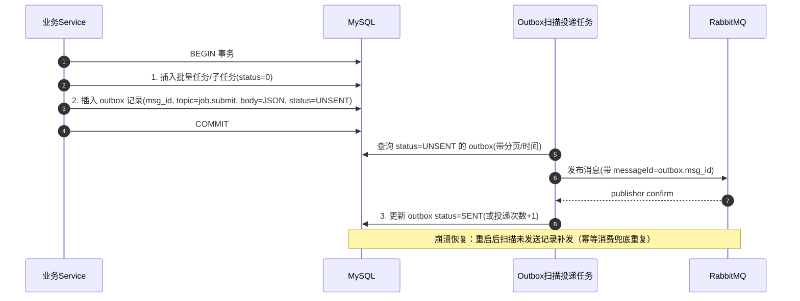
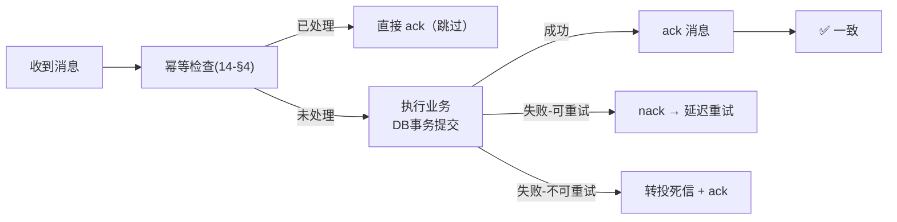
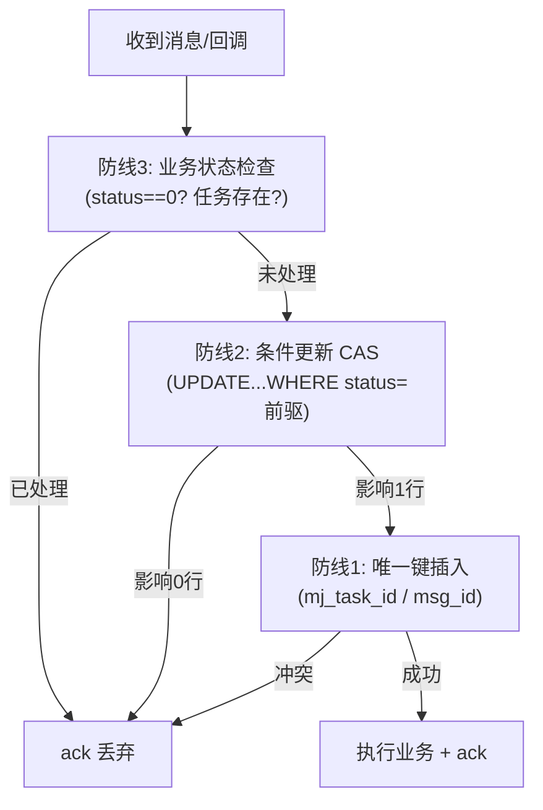

> 本章解决分布式系统最核心的问题：**业务状态（DB）与消息（MQ）如何保持一致、重复消息如何不产生副作用**。
> 核心结论：**DB 是事实源，MQ 只是管道；用 Outbox 保证"不丢消息"，用三层幂等保证"不重复副作用"。**

---

## 1. 一致性模型：从"最终一致"到"可证明一致"

**问题**：业务要同时做两件事——① 在 DB 建任务；② 往 MQ 发消息。两者不是同一个事务，必然存在先后：
- 先发消息后提交事务 → 消费者可能**查不到任务记录**（初版代码被迫 `sleep 2s` 补偿，治标不治本）；
- 先提交事务后发消息 → 事务提交后、发消息前应用崩溃 → **消息丢失，任务永远没人处理**；
- 发了消息但事务回滚 → **幽灵消息**（消息指向不存在的任务）。

**解法（Outbox 本地消息表）**：把"发消息"从业务事务中**拆出去**——业务事务只写"业务表 + outbox 表"（同一个事务），再由独立的投递任务把 outbox 记录发到 MQ。两步都是本地操作，天然一致：



**为什么这样就是"不丢消息"**：
- 事务提交后，outbox 记录已落盘；应用崩溃 → 重启后扫描 `UNSENT` 补发；
- MQ 宕机 → 投递任务失败，outbox 保持 `UNSENT`，MQ 恢复后继续投递；
- 投递了但 confirm 丢失 → 重投一次，靠消息幂等（§4）消除重复副作用。

## 2. 事务边界规范（哪些必须同一事务）

| 场景 | 事务范围 | 说明 |
|------|---------|------|
| 建批量任务 | 任务表 + 子任务表 + 进度表 + **outbox** | 必须同一事务（@Transactional） |
| 回调更新状态 | 子任务状态 + 主任务统计 + 计费扣费 | 必须同一事务（防"状态成功但没扣费"） |
| 消费处理 | 状态更新 + 结果落库 + **ack** | DB 提交在前，ack 在后（见 §3） |
| 发送消息 | 无事务 | 只依赖 outbox 状态机 |

## 3. 消费侧一致性：先落库、后 ack



**崩溃窗口分析**：DB 提交成功但未来得及 ack 就崩溃 → 消息重回队列再次投递 → **幂等检查发现已成功，直接 ack**，无副作用。这就是"至少一次投递 + 幂等消费 = 有效一次"。

## 4. 幂等设计（三层防线）

### 4.1 防线一：业务唯一键（数据库唯一约束）—— 主防线

业务数据本身携带天然唯一键，DB 唯一约束兜底：

| 场景 | 唯一键 | 表约束 |
|------|--------|--------|
| MJ 明细落库 | `mj_task_id`（上游任务 ID） | `sys_mj_task`：`UNIQUE KEY idx_mj_task_id(mj_task_id)` |
| 消费记录去重 | `msg_id`（消息 ID） | `sys_msg_consume_record`：`UNIQUE KEY uk_msg_id(msg_id)` |
| 回调去重 | 回调事件 ID | 回调消息幂等表（同上） |

**代码语义**：插入时捕获唯一键冲突（`DuplicateKeyException`）→ 视为"已存在"，按幂等处理（ack + 跳过），不再报错。初版已用该方案（`MybatisExceptionHandler` 统一处理重复键），本方案把它升级为**规范化的幂等框架**。

### 4.2 防线二：状态机条件更新（CAS，防乱序/重复回调）

所有状态流转必须用**条件更新**，而不是"先查再改"：

```sql
-- 只允许 处理中(1) → 成功(2)，且仅当当前确实是 1
UPDATE sys_mj_batch_prompt
   SET status='2', image_url=?, update_time=NOW()
 WHERE id=? AND status='1';
-- 影响行数=1 → 本次迁移生效；=0 → 说明状态已被其他路径改过（乱序/重复回调），丢弃本次
```

**为什么必须这样**：
- 回调可能乱序（成功回调先到、超时判定后到）→ 条件更新保证只有合法迁移生效；
- 重复回调（同一事件回调两次）→ 第二次影响行数=0，静默忽略；
- 与"先查再改"相比，条件更新**天然原子**，无需分布式锁。

### 4.3 防线三：消费状态检查（消息层幂等）

消费者处理前检查业务状态：子任务 `status != "0"`（待处理）→ 说明已被处理或已在处理中 → 直接 ack 跳过。这是对"重复投递"的第一道快速过滤，成本最低。

### 4.4 三层防线如何协作（决策树）



**效果**：无论消息重复投递、回调重复、回调乱序、应用重启重放，最终副作用**至多一次**。

## 5. 计费一致性（钱不能算错）

用户按"成功出图数"扣费（`consumption_record` / 余额预校验 `balanceSufficient`）：

1. **预校验**：提交时按批量数量预检余额，不足则整批拒绝（初版已实现）；
2. **成功后扣费**：子任务 `status=2` 事务内写消费记录（与状态更新同事务，见 §2）；
3. **幂等扣费**：消费记录以子任务 ID 建唯一键，防止回调重复导致重复扣费；
4. **对账**：定时任务核对"成功数 × 单价 = 消费总额"，偏差告警（16-§5 的兜底扫描兼做对账）。

## 6. 基础设施不可用时的兜底（一致性视角）

| 故障 | 表现 | 兜底 |
|------|------|------|
| MySQL 不可用 | 业务事务全失败 | 请求快速失败返回（限流降级）；MQ 消息 nack 回重试队列等待 DB 恢复；**禁止**先发消息后补库 |
| Redis 不可用 | 限流/缓存失效 | 限流降级为本地令牌桶（单机近似）；缓存旁路直查 DB（15-§5.3） |
| RabbitMQ 不可用 | 投递失败 | Outbox 保持 UNSENT，**任务数据在 DB 不丢**；MQ 恢复后补投；接入层可短时熔断新提交 |
| OSS 不可用 | 上传/下载失败 | 上传重试（可重试异常）；下载走预签名失败→提示稍后；结果 URL 暂存 DB，OSS 恢复后补传 |

> 设计哲学：**每一层依赖的故障都被"上一层的数据落地"吸收**——MQ 挂了有 DB 兜底，DB 挂了有 MQ 缓冲，永远不出现"两边都挂还指望内存"。

---

*下一章：[15-exception-handling.md](./15-exception-handling.md)*
