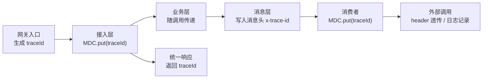

> 本章按五层（接入层、业务层、消息层、外部服务层、存储层）给出**异常分类、捕获策略、重试策略、降级策略、告警策略**，并统一错误码与 traceId。原则：**异常是设计的输入，不是 bug 的漏网之鱼。**

---

## 1. 总体原则

1. **异常分级**：每一层只处理自己职责内的异常，不跨层吞异常（除转换处）；
2. **可重试与不可重试分离**：重试策略依附于异常类型（`RetryableException` / `NonRetryableException`），而不是"所有异常都重试 3 次"；
3. **对外友好、对内可查**：用户看到"提示词不能为空（A1002）"，开发看到 errorCode + traceId + 堆栈；
4. **告警分级**：WARN（业务噪音，不告警或降级告警）/ ERROR（单点失败，告警）/ CRITICAL（大面积故障，P0 电话告警）；
5. **任何异常路径都要收敛**：不允许"吞掉异常但任务永远卡在处理中"。

## 2. 分层异常处理矩阵

| 层 | 异常来源 | 捕获/处理策略 | 重试策略 | 降级策略 | 告警级别 |
|----|---------|-------------|---------|---------|---------|
| **接入层** | 参数校验、鉴权、限流、反序列化 | 全局 `@RestControllerAdvice` 统一转错误码；参数错误直接 4xx 返回 | 不重试（客户端错误） | 限流触发 → 429 + 提示稍后重试；熔断触发 → 503 降级页 | WARN |
| **业务层** | 业务规则（余额不足、重复提交）、事务异常 | 业务异常显式抛出（带错误码）；事务异常回滚并记录 | 事务瞬时可重试（死锁 1213） | 配额校验失败 → 整批拒绝并说明原因 | WARN/ERROR |
| **消息层** | 反序列化失败、消费异常、发布失败 | 反序列化失败=不可重试直投死信；消费异常按分类 ack/nack（13-§3） | TTL 延迟重试封顶 3 轮（13-§4.3） | MQ 不可用 → Outbox 待投递 + 接入熔断 | ERROR（死信突增=CRITICAL） |
| **外部服务层** | 上游超时、5xx、429、审核拒绝、回调异常 | 统一封装 `AigcClient`，错误码映射（见 §4）；超时/5xx/429 抛 Retryable；审核拒绝抛 NonRetryable | 可重试走消息重试链路；**幂等请求才可重试**（提交类幂等，查询类天然幂等） | 上游熔断（连续失败→短路 N 秒，16-§3）+ 账户池切换 | ERROR（连续失败=CRITICAL） |
| **存储层** | 连接池耗尽、超时、唯一键冲突、Redis/MQ 不可用 | 唯一键冲突=幂等信号（14-§4）；连接池/超时抛 Retryable | 存储重试（指数退避，限次数） | Redis 不可用→旁路 DB；MQ 不可用→Outbox 缓冲；DB 不可用→快速失败 | CRITICAL（基础设施） |

## 3. 统一错误码设计

**错误码结构**：`{层级字母}{4位数字}`，语义自解释：

| 段 | 含义 |
|----|------|
| `A` 接入层 | `A1xxx` 参数/鉴权/限流：如 `A1001 参数校验失败`、`A1002 提示词为空`、`A2001 未登录/无权限`、`A3001 请求过于频繁(429)` |
| `B` 业务层 | `B2xxx` 业务规则：如 `B2001 余额不足`、`B2002 重复提交`、`B2003 批量任务不存在`、`B2004 任务已取消` |
| `M` 消息层 | `M3xxx` 消息问题：如 `M3001 消息反序列化失败`、`M3002 消息重试耗尽`、`M3003 死信入库` |
| `E` 外部服务 | `E4xxx` 上游错误：如 `E4001 上游超时`、`E4002 上游限流`、`E4003 内容审核拒绝`、`E4004 上游不可用` |
| `S` 存储层 | `S5xxx` 基础设施：如 `S5001 数据库不可用`、`S5002 Redis 不可用`、`S5003 MQ 不可用` |

**错误信息规范**：
- 对外响应：`{ "code": "E4003", "msg": "图片内容未通过审核，请调整提示词", "traceId": "..." }`——msg 对用户友好；
- 对内日志：同一 traceId 下记录 `[code=][biz=][上游原始错误=]` 全量上下文，便于排障；
- 禁止把堆栈/上游内部错误直接返回前端（信息泄露 + 体验差）。

## 4. 外部 AIGC 服务调用层（最容易出错的一层）

### 4.1 统一客户端封装（`AigcClient`）

```java
public interface AigcClient {
    SubmitResult submit(SubmitRequest req);   // 提交任务（幂等：带业务幂等键）
    TaskResult query(String apiTaskId);       // 查询状态（轮询用）
}
```

封装要点：
- **超时三件套**：连接超时 3s、读超时 60s（出图提交接口）、全链路超时 90s（OkHttp 显式设置）；
- **重试**：只对幂等操作重试（submit 带 `idempotencyKey` 才可重试；query 天然可重试）；重试次数 ≤2，间隔 500ms/1s；
- **错误码映射**：上游返回码统一翻译为内部错误码（MJ：`code=1` 成功、`code=22` 排队中=提交成功、其他=失败，附 `description`；grsai：`output_moderation/input_moderation/error` → E4003/E4004）；
- **熔断**：按上游账户维度熔断——连续失败 N 次 → 短路 30s，期间切换备用账户/降级（16-§3）；
- **降级**：上游不可用时，新任务转"延迟受理"（消息 nack 走重试），存量任务冻结等待恢复。

### 4.2 回调异常处理

- 回调处理必须**快速返回 200**（否则上游会重发回调导致风暴）；
- 回调本身幂等（14-§4.3 条件更新），重复回调无害；
- 回调内容缺失/校验失败 → 记录 + 不抛异常返回 200（由轮询兜底修正）。

## 5. 存储与基础设施异常兜底

### 5.1 数据库
- 唯一键冲突：`DuplicateKeyException` → 幂等信号，按 14-§4 处理（**不是异常，是业务分支**）；
- 连接池耗尽：HikariCP `connectionTimeout=30s` 后抛超时 → 按可重试处理（消费 nack 重试）；接入层熔断防止雪崩；
- 主从延迟：状态写主库、读走主库（本业务对一致性要求高，不读从库）。

### 5.2 Redis（Redisson）
- 限流降级：Redis 不可用时降级为**本地令牌桶**（单机近似限流），并告警；
- 缓存降级：缓存穿透时旁路直查 DB，并加"短暂空值缓存"防击穿；
- 锁降级：分布式锁不可用时，靠业务唯一键/条件更新兜底（本方案尽量不依赖锁，见 14-§4.2）。

### 5.3 RabbitMQ
- 生产端：Outbox 缓冲 + confirm 重投（14-§3）；
- 消费端：连接自动重连（Spring AMQP 内置）；通道异常捕获后按可重试处理；
- 平台级：集群 + 镜像队列（18-§3）。

## 6. 日志上下文与 traceId（贯穿全链路）

**traceId 生命周期**：



落地规范：
1. **生成**：网关/Filter 生成 `traceId`（UUID 短码），写入日志 MDC（`MDC.put("traceId", ...)`），日志 pattern 自动携带；
2. **传递**：HTTP 用 header `X-Trace-Id`；MQ 消息头 `x-trace-id`；消费者取出后重新 `MDC.put`；
3. **上下文**：日志额外携带 `userId / taskId / batchTaskId / msgId`，排障一条命令定位：`grep traceId xxx | grep taskId`；
4. **响应**：接口错误响应带上 `traceId`，用户反馈问题即可精准查日志；
5. **审计**：状态机每次流转写 `update_by`（初版已有该习惯，如 `receiveMjTaskQueueMessage`），保留变更轨迹。

## 7. 告警分级清单（可直接落监控）

| 级别 | 触发条件 | 通知方式 | 响应要求 |
|------|---------|---------|---------|
| WARN | 单条任务失败、上游偶发 429 | 钉钉/企微群 | 观察 |
| ERROR | 死信速率 > 100/min、消费速率下降 50%、上游连续失败 10 次 | 群 + 值班 | 30 分钟内定位 |
| CRITICAL | MQ/DB/Redis 不可用、熔断打开、队列积压 > 5 万且上涨 | 电话 + 群 | 立即响应 |

---

*下一章：[16-boundary-handling.md](./16-boundary-handling.md)*
