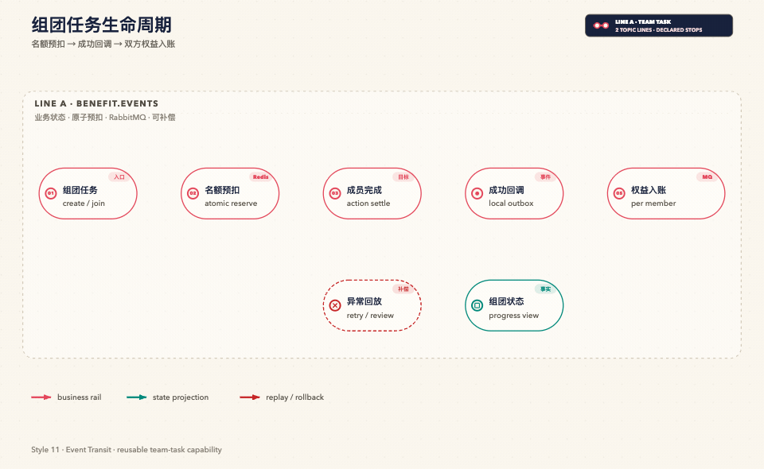
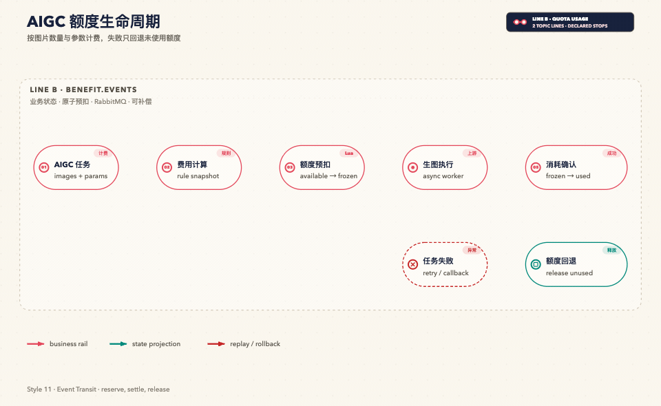
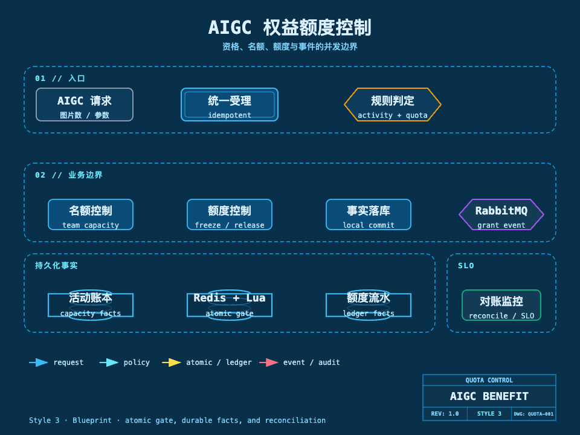
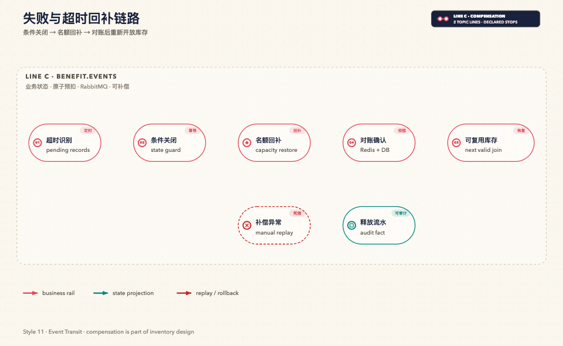

## 完整的额度链路

我参与的权益活动并不是在页面上简单展示一个“成功后加额度”的按钮，而是把两类业务连接起来：一类是通过分享邀请其他用户共同完成目标人数的组团活动，另一类是用户在 AIGC 平台提交生图任务并消耗额度。

用户先通过邀请组队开团获得权益，权益成功后进入用户额度账户；用户真正发起生图时，平台再根据本次生成的图片数量和参数组合计算消耗量，在任务受理前冻结额度，生成成功后确认消耗，失败或取消后释放未使用部分。

这条链路里，活动名额、活动可发放预算和用户额度不是同一种库存。我先把它们拆开，后续每一层分别控制并分别对账：

| 库存对象 | 我定义的业务含义 | 负责边界 | 关键不变量 |
| --- | --- | --- | --- |
| 队伍名额 | 一个活动队伍还允许多少个有效账号加入 | 权益活动服务 | 已锁定名额不超过目标人数 |
| 活动发放预算 | 整个活动最多还能发出多少额度，按活动需要启用 | 权益活动服务或预算服务 | 已承诺预算不超过活动上限 |
| 用户可用额度 | 某个账号当前可以拿来提交 AIGC 任务的额度 | 额度账户服务 | 可用额度不能为负 |
| 任务冻结额度 | 已被某个 AIGC 任务预留、但尚未确认消耗的额度 | 额度账户服务 | 冻结必须有任务和幂等凭证 |

如果只维护一个总数字，队伍名额和用户额度就会互相污染：队伍已经满员，不代表用户不能生图；用户额度不足，也不代表活动还可以继续加入。拆分后，活动服务只负责“谁可以获得权益”，额度服务只负责“额度有多少以及如何变化”，AIGC 任务服务只负责“这次任务应该消耗多少”。

## 一、我先确定权益活动的规则

### 1. 组队成功才产生发放资格

多人活动的规则可以描述为：发起人创建队伍并占用首个名额，分享邀请码给用户注册时使用；有效成员完成活动要求后，完成成员数按一次有效动作推进。当达到目标人数时，队伍完成，双方各获得活动配置的 AIGC 额度。

当目标人数为 `N` 时，发放对象是这 `N` 个有效成员，而不是分享链接的点击人数。活动可以配置有效期、参与次数上限、指定人群、来源渠道、每个成员的额度和是否需要完成支付等条件。

我把发放前置条件固定为以下几项：

1. 活动在有效时间内，且活动规则处于可参与状态。
2. 用户满足人群、渠道和风控条件。
3. 用户在当前活动中的有效参与次数没有超过上限。
4. 队伍仍处于进行中，没有超过有效期，也没有达到目标人数。
5. 同一个账号不能重复占用同一队伍的名额。
6. 活动目标人数、成员资格、赠送额度和规则版本需要在参与时形成快照。
7. 如果活动要求支付或完成其他动作，只有这些动作完成后才能计入完成成员数。

这些校验的目的不是增加接口步骤，而是把“没有资格”“队伍已满”“重复请求”“活动已结束”与“系统暂时失败”区分开。不同原因需要不同的页面提示、重试策略和补偿动作。

### 2. 名额锁定、活动完成和权益发放是三个事实

我不会把“拿到名额”直接当成“已经获得额度”，而是拆成三个可以独立审计的事实：

| 事实 | 说明 | 是否可以发放额度 |
| --- | --- | --- |
| 名额锁定 | 用户暂时占用队伍位置，但可能还没有完成活动要求 | 否 |
| 队伍完成 | 队伍达到目标人数，且成员完成了规定动作 | 是，进入发放流程 |
| 权益入账 | 额度账户已经写入可用额度流水 | 是，用户可以消费 |

这样可以避免用户只创建参与记录、没有完成活动要求时提前拿到额度。即使额度服务暂时不可用，队伍完成事实也会保留下来，后续可以通过消息重试继续发放，不需要回滚已经形成的活动完成事实。

### 3. 状态变化必须单向且可补偿



图中的主链路是“创建/加入 → 名额预扣 → 成员完成 → 成功回调 → 权益入账”；异常分支进入回放路径，队伍状态单独形成可查询事实。这里的“成功回调”不是接口调用成功，而是组团任务已经达到目标并完成本地事务后，通过 RabbitMQ 通知权益账户服务。

“进行中”可以接受新成员；“达到目标”只表示名额事实已经满足，还要等待活动要求的动作收敛；“完成”以后不再重新开放名额。发放处理中允许重复消费和失败重试，但每个成员的发放结果只能从未发放走向已发放一次。

我把“已发放”设计成额度流水，而不是只修改账户余额。余额是流水的查询投影，流水才是审计事实。这样既能回答“额度从哪里来”，也能回答“额度后来被什么任务冻结、确认或释放”。

## 二、AIGC 是怎样和权益额度绑定的

### 1. 权益发放是额度入账，不直接改 AIGC 任务状态

权益活动成功后，权益发放消费者为每个有效成员创建一笔“活动赠送”流水，并将活动配置的额度增加到用户的可用额度中。这个过程不直接调用 AIGC 供应商，也不直接修改生图任务状态。

这样做的原因是：活动成功和生图执行是两个时间点、两个故障域。用户可能拿到额度后马上生图，也可能过一段时间才使用；如果把发放和生图绑在一个事务里，活动服务就必须承担上游模型调用、队列拥塞和文件交付的风险，边界会变得不可控。

我在两个领域之间只传递业务事实：哪个活动、哪个队伍、哪些成员、哪一版规则、每位成员应得多少额度，以及这条事实的唯一事件号。额度账户服务根据事件为成员入账，AIGC 任务服务只读取并消耗额度。

### 2. 生图扣减量由图片数量和参数决定

用户提交 AIGC 任务时，我不会按“一次请求”固定扣一个数字，而是先把请求拆成可计费的子任务，根据图片数量和参数组合计算预计消耗量：

```text
预计消耗额度 = Σ（每个子任务的图片数量 × 对应参数组合的单张额度）
```

参数组合可以包含模型、尺寸、质量、推理档位、批量数量等业务计费维度。规则必须在任务受理时固化版本，任务执行期间不能因为运营调整了单价而重新计算，否则同一个任务可能出现“提交时够用、执行时不够用”或前后扣减不一致的问题。

对本次任务，我会保存以下业务信息：任务号、用户号、预计图片数、实际成功图片数、计费规则版本、预计消耗量、实际消耗量、冻结流水号和最终状态。图片生成数量与额度消耗之间的关系因此可追溯，也不会因为重试而重复扣减。

### 3. AIGC 任务采用冻结、确认、释放三段式扣减



图中的主链路是“提交任务 → 计算费用 → 额度预扣 → 生图执行 → 消耗确认”；失败分支进入异常回调，未使用冻结额度沿回退路径释放。

任务受理前，额度账户服务原子判断可用额度是否足够，并将可用额度转入冻结额度。只有冻结成功，任务才可以进入 AIGC 队列；额度不足时，任务不应进入队列，否则会出现任务已经消耗上游资源但用户账户无法结算的问题。

任务执行时，平台按子任务结果汇总实际成功数量。全部成功时确认全部冻结额度；部分成功时只确认成功部分，剩余冻结额度释放回可用额度；明确失败、取消、超时且没有成功结果时释放全部未使用额度。

冻结、确认和释放都使用同一个任务号或冻结号作为幂等依据。重复提交不能再次冻结，重复回调不能再次确认，重复失败通知不能重复释放。这样“额度扣减”和“图片生成结果”可以通过任务号关联起来。

### 4. 权益发放和 AIGC 消耗之间的边界

我将两个服务之间的边界固定为：

| 场景 | 权益活动服务 | 额度账户服务 | AIGC 任务服务 |
| --- | --- | --- | --- |
| 用户创建/加入活动 | 校验资格、锁定队伍名额 | 不参与 | 可提供入口，不改变名额事实 |
| 队伍完成 | 形成完成事实并发布事件 | 消费事件并入账 | 不参与发放事务 |
| 用户提交生图 | 不参与 | 冻结、确认、释放额度 | 计算消耗量并推进任务 |
| 生图失败/取消 | 不参与 | 释放未使用额度 | 负责上报任务结果 |
| 活动退款/撤销 | 形成撤销事实 | 记录撤销流水，按策略处理 | 不回写活动状态 |

权益不是 AIGC 任务的一个临时字段，而是先进入统一额度账户，再通过额度账户参与 AIGC 消耗。这样后续增加购买额度、运营补偿、会员额度或其他活动时，都可以复用同一套冻结与流水模型。

## 三、权益活动做成独立微服务，通过RPC和RabbitMQ 回调

我将整个权益获取做成与账号额度等单出的微服务，为何？因为权益的免费方法，不能影响正常AIGC的主链路，就算这边这边出现异常，也不能让整个主系统瘫痪。并且通过外部微服务形式，可以方便控制启停，也可以复用到各个项目实践，b
不同项目只需要维护各自的账号和额度设计

权益活动服务有自己的活动配置、队伍聚合、成员记录、名额状态、完成判定、超时处理和事件投递，因此它不应该被塞进 AIGC 任务服务中的条件分支。我把它设计成独立微服务：同步接口负责实时资格与名额决策，RabbitMQ 负责队伍完成后的跨服务事件传递。

在项目落地时，我将权益方法做成组团系统微服务 ，微服务作为组团任务能力的承载服务。从我的业务建模看，权益发放本质上就是组团任务完成后的一个结果，不需要在 AIGC 平台里再复制一套活动系统。这个微服务已经沉淀了活动规则、创建/加入队伍、成员参与、名额锁定、动作结算、超时关闭、退款回补、成功回调和消息投递等通用能力，能够兼容邀请得额度、邀请得优惠、多人完成后解锁权益等场景。

我在 AIGC 侧做的是“权益适配”而不是“重新实现组团”：把活动配置映射成 AIGC 额度权益，把组团成功事件映射成成员发放任务，再把用户额度账户接入生图任务的预扣、确认和回退链路。这样组团微服务保持通用，AIGC 平台只关心自己的额度规则和任务消耗。


上图中的动态节点表达的是一条业务事实如何流转：活动入口接收参与请求，权益规则确认资格，队伍完成形成事件，事件经 RabbitMQ 到达额度账户消费者；状态投影记录发放结果，异常消息进入死信路径等待重试或人工复核。

### 1. 同步 API 负责需要立即反馈的决策

用户点击加入活动后，需要马上知道“已锁定”“队伍已满”“已经参加过”还是“活动已结束”。这类决策必须同步完成，不能把名额判定放进异步消息里等待。

同步接口完成以下动作：

1. 校验活动状态、用户资格、参与次数和队伍状态。
2. 对目标队伍执行名额原子预扣。
3. 通过持久化条件更新确认名额事实。
4. 写入成员参与记录和规则快照。
5. 返回队伍号、参与单号、当前人数和锁定结果。

接口只返回名额决策，不等待队伍完成，也不等待额度发放。这样接口响应时间不会被其他成员的操作和下游额度服务拖慢。

### 2. RabbitMQ 负责完成后的异步副作用

队伍完成后可能同时触发多位成员入账、活动统计、通知刷新和运营数据更新。这些动作不应该放在队伍本地事务里，更不能因为其中一个消费者暂时故障而回滚已经确认的队伍完成事实。

我会在权益活动服务的本地事务中完成：

1. 将最后一个有效成员的参与状态推进到完成。
2. 增加队伍完成成员数，并检查是否达到目标人数。
3. 将队伍状态更新为完成。
4. 写入一条带唯一事件号的本地待投递消息。

本地事务提交后，再由消息投递器把事件可靠地发送到 RabbitMQ。消息发送需要持久化、发布确认、不可路由检查和重试；消费者需要手动确认，只有本地入账事务成功后才确认消息。

### 3. 事件只携带业务事实，不暴露内部实现

跨服务事件不应该携带内部对象结构或数据库字段，而应该携带稳定的业务契约。权益完成事件至少需要包含：

| 字段 | 用途 |
| --- | --- |
| eventId | 全局幂等和追踪 |
| eventType / version | 消费者按版本解析 |
| activityId | 识别活动规则 |
| teamId | 识别本次队伍完成事实 |
| completedAt | 审计完成时间 |
| ruleVersion | 固化赠送额度和资格规则 |
| members | 有效成员及成员角色快照 |
| benefit | 权益类型、每位成员额度和发放策略 |
| traceId | 串联接口、消息和入账日志 |

权益账户消费者不根据“队伍成功”四个字自行猜测成员，也不重新读取已经变化的活动配置。事件中的成员快照和规则版本是发放依据；需要补数时，可以根据队伍号回查历史事实，但不能以当前活动配置覆盖历史规则。

## 四、从邀请活动到生成图片的完整流程

我把端到端流程拆成两段：前半段产生权益，后半段消耗权益。两段通过用户额度账户连接，但不共享数据库事务。

### 阶段一：产生权益


用户先进入活动并完成组团任务，组团微服务负责活动资格、成员名额、动作结算和完成判定；任务完成后只形成一次成功事件。RabbitMQ 将事件投递给额度账户消费者，消费者按“事件号 + 成员号 + 权益类型”建立发放任务，为每位有效成员增加可消费的 AIGC 额度。

### 阶段二：消耗权益


用户再提交生图参数和图片数量，AIGC 任务服务固化计费规则、计算预计消耗量并生成任务号；额度账户服务确认余额后完成额度预扣，预扣成功才把任务放入异步生成队列。任务结束时按实际成功图片数确认消耗，部分成功或失败则释放未使用冻结额度，任务状态、额度流水和最终文件都通过任务号关联。

这条连接解决了一个容易被忽略的问题：活动发放的是“可消费额度”，不是“已经生成的图片”。活动服务只负责把额度安全地发给双方，AIGC 服务按照真实图片数量和参数消耗额度；两者之间通过额度账户和业务流水连接起来。

## 五、我如何控制高并发下不超卖，也不丢库存

### 1. 先定义必须守住的三个不变量

我会把压测和线上对账都建立在不变量上，而不是只看接口返回值：队伍锁定总量不能超过目标人数，完成成员数不能超过已锁定名额，释放只作用于未完成名额；活动已发放和待发放承诺不能超过预算；用户可用、冻结、已消耗三类额度必须与累计发放和累计撤销保持账面平衡。

其中“已锁定”包含尚未完成但暂时保留的成员位置，“已释放”包含超时、失败和退款回补的名额；额度账户则把可用、冻结和已消耗作为互斥状态，所有变化都落到带业务号的流水中。

“不超卖”是不能超过真实容量；“不丢库存”是失败请求已经释放的名额和额度仍然可以被后续有效请求使用。只做前者而不做补偿，会造成活动明明还有名额却被错误判满；只做后者而没有原子边界，则可能发出超过预算的权益。

### 2. Redisson 原子操作适合单值快速变化

对单个计数器或回补量，我使用 Redisson 的原子数据结构完成高频递增、递减和一次性标记。它适合以下场景：

- 维护某个队伍的快速占用计数。
- 记录可复用的回补名额。
- 写入短期幂等标记、重复请求标记和投递标记。
- 在故障补偿时快速恢复预扣数量。

单个计数器的操作虽然原子，但“检查上限、增加占位、写幂等标记、超限回滚”是一个整体业务动作，不能拆成多个客户端操作后再假设它们仍然连续。

### 3. Lua 把多步判断压缩成一个原子决策

对队伍名额和额度冻结这种同时涉及多个 key 的场景，我把关键判断放进 Lua，由 Redisson 负责脚本执行。脚本的业务语义是：

1. 先检查本次参与号或冻结号是否已经成功处理。
2. 再读取当前可用量和补偿量，判断是否足够。
3. 足够时一次完成计数、余额转移和幂等标记。
4. 不足时不改变任何库存。
5. 脚本返回明确的成功、重复、库存不足或状态冲突结果。

队伍名额的原子动作是“检查重复参与 → 检查目标人数 → 预扣名额 → 写入参与占位”；额度冻结的原子动作是“检查重复冻结 → 检查可用额度 → 可用转冻结 → 写入冻结标记”。这样不会出现“计数已经加上但幂等标记没有写入”“余额已经扣掉但冻结记录没有写入”这类半成功状态。

如果 Redis 采用集群部署，参与名额相关 key、参与幂等 key 和回补 key 需要落在同一分片，额度冻结相关 key 也需要遵守同一分片约束，否则脚本无法保证跨分片原子性。key 的命名只表达业务维度，不把内部类名或数据库结构暴露给调用方。

### 4. 数据库条件更新是持久化边界

Redis 是高并发入口的快速闸门，但不能替代最终事实。名额预扣通过后，我仍然需要在数据库中以“当前队伍仍进行中且锁定人数小于目标人数”为条件更新，并检查实际影响行数：

- 影响一行：数据库接受本次名额，继续写入成员参与事实。
- 影响为零：队伍已满、已结束或状态发生竞争，需要释放 Redis 预扣并返回明确原因。
- 数据库异常：不能把请求当成成功，需要记录补偿任务，后续释放或回补名额。

额度入账和额度冻结也遵循同样原则：业务流水、账户投影和唯一约束在一个本地事务内形成最终事实，任何更新都必须检查版本、状态和业务号，不能无条件地把余额加一遍。

我把防超卖的责任分成三道闸门：

1. **Redis/Lua 快速准入**：挡住热点请求，避免大量请求同时打到数据库。
2. **数据库条件更新**：确认最终名额、账户状态和队伍状态没有越界。
3. **唯一业务号与唯一流水**：防止重复参与、重复完成、重复入账和重复扣减。

任意一道闸门拒绝请求，都必须有对应的释放、回补或重试动作，不能只返回失败而留下不可见的占位。

### 5. 分布式锁只用于低频兜底

正常流量不应该让所有请求竞争同一把锁。分布式锁只用于以下低频场景：

- Lua 脚本临时不可用时，按活动和队伍粒度串行执行兼容路径。
- Redis 计数与数据库事实发生漂移时，进行重建和对账。
- 超时释放、退款回补、批量补偿和定时投递任务的多实例抢占。

拿到锁后仍然要重新读取队伍状态，并执行数据库条件更新；锁不能替代幂等键，也不能把外部调用放进长事务。锁需要设置等待时间和租约时间，避免某个异常实例长期占住补偿路径。

Redis 整体不可用时，我不会为了“继续卖”而绕过原子控制。安全策略是快速失败、进入受控排队或切换到经过验证的数据库条件路径；只有 Redis 仍可用而脚本能力短暂失败时，才使用分布式锁兼容路径。否则多个实例同时绕过 Redis，数据库压力和重复补偿风险都会放大。



上图把一次请求拆成入口校验、名额与额度分流、原子控制、持久化事实、事件投递和对账监控几个阶段。动画中的并行路径不是多个服务共同修改同一份数据，而是由各自的边界写入各自的事实，再通过事件连接起来。

## 六、消息可靠性和发放幂等如何闭环

### 1. 本地事务和消息投递分开处理

队伍完成和本地待投递消息必须在同一个数据库事务里提交。这样即使服务在提交后立即宕机，待投递消息仍然可以被扫描出来；如果消息发送暂时失败，投递器可以按次数和退避策略重试。

RabbitMQ 侧需要关注四个结果：消息是否被确认、是否不可路由、是否被消费者拒绝、是否超过重试边界。超过边界的消息进入死信队列，并保留原事件号、失败原因和最后一次重试时间，便于人工复核或安全重放。

### 2. 消费者按成员建立唯一发放单

一个队伍完成事件对应多个成员，不能只以队伍号作为唯一发放记录，否则其中一个成员失败时无法单独重试。我的发放幂等键由“事件号 + 成员号 + 权益类型”组成：

1. 第一次消费时创建待发放记录。
2. 记录已经发放成功时，重复消息直接返回成功，不重复加额度。
3. 记录仍在处理中或重试中时，根据状态继续处理，不创建第二笔记录。
4. 额度流水写入成功后，再把发放记录推进到完成。
5. 任意暂时性故障保留待重试状态，超过边界进入死信，不丢失业务事实。

额度账户的入账事务同时写入发放记录、额度流水和账户投影。即使消息重复到达，唯一约束也只能允许一笔有效流水。

### 3. “至少一次投递”要靠业务幂等变成“效果一次”

RabbitMQ 和网络链路通常按至少一次投递设计，所以同一事件可能因为确认超时、消费者重启或网络抖动被再次投递。平台不能把“消息只到一次”当作前提，而应接受重复消息，再通过业务幂等保证最终效果只发生一次。

同理，用户重复点击加入、支付回调重复到达、AIGC 任务回调重复到达，都不应该产生第二个名额、第二笔结算或第二次额度变化。幂等键必须来自业务事实，而不是来自每一次 HTTP 请求生成的随机值。

## 七、超时、退款、失败和回补怎么处理

### 1. 未完成队伍释放名额



图中的逆向路径是“超时识别 → 条件关闭 → 名额回补 → 对账确认 → 重新开放可复用库存”；补偿异常进入死信或人工回放，释放流水单独保留审计事实。

关闭参与状态、回补名额和写入释放事件需要有明确的业务号，重复执行只能得到同一个结果。数据库关闭失败时不能先回补 Redis；否则可能出现数据库仍然保留参与记录，但快速库存已经把名额让给另一个用户。

### 2. 队伍完成后不重新开放名额

队伍达到目标并形成完成事实后，不因为某个成员后续退款而把队伍重新打开。重新开放会让新的成员获得不属于原规则的资格，也会导致同一队伍重复发放。

完成后的退款按业务策略处理：如果权益尚未入账，撤销待发放任务；如果已经入账但尚未使用，写入撤销流水；如果已经被 AIGC 任务冻结或消耗，则根据活动条款决定是否允许撤销、补偿或保留。无论采用哪种策略，都不直接删除历史流水，而是用反向流水表达撤销。

### 3. AIGC 任务失败只释放未使用额度

AIGC 任务可能出现部分成功、供应商超时、回调丢失和重复回调。任务服务需要根据子任务结果计算实际成功图片数，并将预计冻结量拆成“已确认消耗”和“应释放额度”。

如果只在任务开始时直接扣余额，失败时很难判断应该退回多少；采用冻结、确认、释放三段式后，失败补偿只针对冻结中的未使用部分，已成功生成的图片不会被重复释放。

## 八、我如何验证 1000+ 并发下的结果

“1000+ 并发”应该描述为：同一活动或同一队伍在短时间内同时收到大量加入、重复提交、完成回调和消息重试，而不是把并发数直接等同于成功名额。压测时我会把目标人数设置得足够小，让竞争更集中，再混合以下流量：

- 大量不同用户同时加入同一个队伍。
- 同一个用户重复点击和重复提交。
- 队伍达到目标时的并发结算。
- 数据库更新失败、Redis 脚本失败和消息确认超时。
- 超时释放、退款回补和补偿任务重复执行。
- 同一完成事件被重复投递给多个消费者。
- 用户领取额度后并发提交多张图片的生图任务。

验收口径不看“接口返回成功了多少次”，而看最终持久化事实和额度流水：

| 验证项 | 通过标准 |
| --- | --- |
| 队伍名额 | 任意时刻锁定名额不超过目标人数，不出现负数 |
| 有效成员 | 去除重复幂等请求后，成功成员数不超过剩余名额 |
| 活动预算 | 所有队伍累计承诺和发放不超过活动预算 |
| 队伍完成 | 完成成员数不超过目标人数，完成事件只形成一次 |
| 权益发放 | 每个有效成员只有一笔有效入账流水 |
| AIGC 冻结 | 冻结额度都有任务号，任务结束后不残留无主冻结 |
| AIGC 消耗 | 实际消耗与成功图片数及参数规则一致 |
| 失败回补 | 数据库异常、超时、退款和消息重试后，名额与额度可对账 |
| 降级策略 | Redis 整体不可用时不绕过库存闸门，不放行未知状态 |

我还会观察原子操作耗时、Lua 失败率、数据库条件更新失败数、锁兜底比例、消息重试与死信数量、事件到入账的延迟、冻结超时数量、用户额度负数告警、Redis 与数据库库存差异，以及权益流水对账差异。

压测报告需要记录活动目标人数、初始库存、并发模型、重复请求比例、失败注入点、回补策略、消息重试策略和最终校验结果。只写“1000+ QPS”不能证明没有超卖，也不能证明失败请求没有吞掉库存。

## 九、我最终保留的设计结论

1. **权益活动和 AIGC 任务分离**：活动服务管理资格、队伍和名额，AIGC 服务管理任务和生成结果，额度账户服务管理可用、冻结、消耗和撤销。
2. **权益先入账，再参与生图扣减**：邀请活动成功后给双方额度账户入账，生图任务再按图片数量和参数冻结、确认或释放。
3. **同步做名额决策，异步做跨服务发放**：用户需要立即知道是否加入成功，队伍完成后的多成员发放通过 RabbitMQ 最终一致地完成。
4. **Redisson、Lua、数据库和锁各负其责**：原子操作处理简单计数，Lua 处理多 key 的快速控制，数据库条件更新守住持久化边界，分布式锁只做低频兜底。
5. **所有预扣都必须有逆向路径**：超时、失败、退款和消息重试都能够释放、回补或撤销，并且每一步都有幂等号和可审计流水。
6. **不变量比接口返回值更重要**：最终要证明的是名额没有超、有效额度没有重复发、失败资源没有丢、AIGC 消耗与真实生成结果一致。

这样，权益活动不再只是“完成后给两个账号加一个数字”，而是一条从邀请入口、队伍名额、完成事件、RabbitMQ 投递、额度账本入账，到 AIGC 任务冻结与实际消耗的完整业务链路。每个服务只维护自己的事实，跨服务动作通过可重试、可幂等、可对账的事件连接起来。

---

*上一章：[我如何落地 OSS 直传](./15-oss-direct-upload)*

*下一章：[技术取舍与指标复盘](./17-technical-decisions-and-metrics)*
