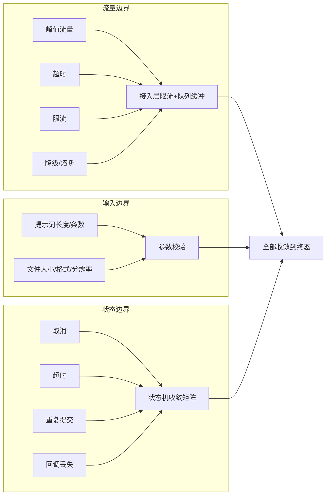
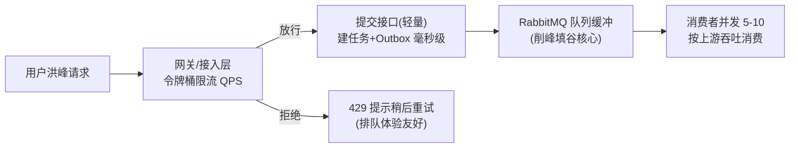

> 本章覆盖企业级系统最容易翻车的两类问题：**流量/资源边界**（峰值、超时、限流、降级、并发）与**状态边界**（取消、超时、重复提交、回调丢失如何收敛）。原则：**所有边界状态都必须收敛到终态，不允许"卡住"。**

---

## 1. 边界全景图



## 2. 流量边界：峰值 / 限流 / 并发控制

### 2.1 峰值流量（为什么不会打挂系统）



- **削峰原理**：峰值请求不直接打上游，而是瞬间转为"队列积压"——提交接口 1ms，消费端按上游能力 5~10 并发匀速消费，天然削峰填谷；
- **修正点**：初版用"生产者随机 1~3s 延迟"削峰，属于打补丁式做法且拖慢投递；本方案把削峰职责交给**队列本身**，生产者只做限流与配额校验；
- **容量规划**：单实例消费 50~100 msg/s（13-§5），峰值 50+ QPS 目标下 1~2 实例即可覆盖；双 11 类峰值按"3 倍容量"预留并通过监控扩容。

### 2.2 限流（分级限流）

| 层级 | 限流对象 | 实现 | 超限行为 |
|------|---------|------|---------|
| 网关 | 全局限流（IP/全局 QPS） | Nginx/网关层令牌桶 | 429 + 重试提示 |
| 应用 | 用户级限流（每人每分钟提交数） | Redisson 令牌桶（`RLock`/`RRateLimiter`），Redis 不可用降级本地 | 429 + "请稍后再试" |
| 业务 | 批量配额（每批 ≤ 100 条、每日条数） | DB/Redis 计数 | 拒绝并说明剩余配额 |
| 上游 | 账户级限流（每 MJ 账户并发 ≤ N） | 账户池信号量（Semaphore） | 排队等待/切换账户 |

### 2.3 降级与熔断（上游故障时）

- **熔断器**（按上游账户/接口维度）：连续失败 ≥ 10 次 → 打开短路 30s，期间请求快速失败（不空耗超时时间），进入降级路径；
- **降级路径**：
  1. 新任务：消息 nack 走延迟重试（等上游恢复，任务不丢）；
  2. 存量任务：冻结等待 + 定时探活恢复（探活成功→关闭熔断→重放队列）；
  3. 非核心能力（如压缩通知）失败 → 直接标记并异步重试，不阻塞主链路。

### 2.4 并发控制

| 资源 | 控制方式 | 参数 |
|------|---------|------|
| 消费者并发 | Spring AMQP `concurrency` | 5-10（绘图）、3-8（提取/场景/换装） |
| 上游并发 | 账户池 Semaphore 信号量 | 每账户 ≤ 2 并发（MJ 官方限制） |
| DB 连接 | HikariCP | maxPoolSize 50（生产） |
| 提交接口并发 | 网关 + 应用限流 | 与压测结果对齐 |

> **并发三原则**：① 能用队列天然并发就不用锁；② 必须用锁时用 Redisson 分布式锁并设过期时间；③ 状态流转用条件更新（CAS）替代锁（14-§4.2）。

## 3. 输入边界（用户输入与文件限制）

| 输入项 | 限制 | 超出处理 |
|--------|------|---------|
| 提示词长度 | ≤ 1000 字符（`prompt` varchar(1000)） | 拒绝 + `A1002` |
| 批量条数 | ≤ 100 条/批 | 拒绝 + 提示分批 |
| 上传文件大小 | ≤ 10MB（素材图） | 拒绝 + `A1001` |
| 图片格式 | jpg / jpeg / png / webp 白名单 | 拒绝 + `A1001` |
| 生成图规格 | 印花提取 4000×4000、300DPI、透明 PNG（上游能力约束，写入提示词约束） | 上游不满足 → 失败 + 原样原因返回 |
| 输入 URL | ≤ 500 字符、http(s) 白名单、禁止内网地址（SSRF 防护） | 拒绝 |
| 回调地址 | 仅允许配置的白名单上游地址回调 | 丢弃 + 告警 |

> SSRF 提示：素材图 URL 若允许用户自定义，必须校验目标地址非内网段（防止利用服务器发起内网探测），属于安全边界。

## 4. 状态机收敛：边界状态如何处理

### 4.1 收敛矩阵（任何输入最终都落到三个终态：成功/失败/取消）

| 边界场景 | 触发条件 | 收敛动作 | 终态 |
|---------|---------|---------|------|
| **重复提交** | 同一用户短时间内重复提交相同提示词 | 接口幂等（`RepeatSubmit` 注解/业务键去重）→ 返回原任务 ID | 不产生新任务 |
| **提交失败** | 上游提交异常（重试耗尽） | 13 章死信链路 → 置失败 | 失败 |
| **处理超时** | 生成环节超时（建议 20~30min，兜底 8h） | 定时扫描 → 条件更新置失败（"任务处理超时"） | 失败 |
| **回调丢失** | 上游未回调 | 10s 轮询兜底（12-§3） | 成功/失败 |
| **乱序回调** | 成功回调晚于超时判定到达 | 条件更新 `WHERE status=前驱` 影响 0 行 → 丢弃 | 维持已收敛状态 |
| **重复回调** | 同一回调事件多次到达 | 幂等（唯一键/CAS）→ 第二次丢弃 | 维持 |
| **取消** | 用户主动取消（处理中） | 状态置 `4 已取消`（新增边界态）；已入队消息靠状态检查跳过；已提交上游的任务记录取消并尽力召回 | 取消 |
| **僵尸任务** | 应用宕机后遗留"处理中"任务 | 启动/定时扫描 + 超时治理 → 置失败 | 失败 |
| **余额不足** | 提交时或消费时余额不足 | 预校验拒绝整批；消费时失败置失败并回滚占位 | 失败 |

### 4.2 状态机硬规则

1. **只允许合法迁移**：迁移必须经过条件更新（`UPDATE ... WHERE status=前驱`），非法迁移影响行数=0 直接丢弃；
2. **每个状态都有超时**：待处理（8h 兜底）、处理中（生成 20~30min）、压缩（10min）——不允许无限期"处理中"；
3. **收敛可观测**：定时扫描任务统计"未收敛数量"，>0 持续告警（僵尸任务指标）；
4. **人工通道**：失败/死信任务支持人工重放（13-§4.4），取消任务支持重新提交。

### 4.3 新增边界态说明

初版只有 0/1/2/3 四个状态；为支持取消与审计，演进为：

```
0 待处理 → 1 处理中 → 2 成功
               ↓        ↑(人工重放)
    3 失败 ←———┘
    4 已取消（可从 0/1 进入，用户主动）
```

取消实现要点：取消只更新 DB 状态（不删消息）；消费者状态检查（`status==0` 才处理）天然跳过已取消任务；已提交上游的任务由回调到来时按状态机忽略（条件更新失败即丢弃）。

## 5. 兜底扫描任务清单（收敛的最终保障）

| 扫描任务 | 频率 | 作用 |
|---------|------|------|
| 第三方任务状态轮询（`updateApiTaskRecord`） | 10s | 回调丢失兜底（12-§3） |
| 批量任务收敛扫描 | 1min | 子任务全收敛 → 主任务置完成；触发压缩通知 |
| 超时治理扫描 | 5min | 超过环节超时的任务置失败 |
| Outbox 补投扫描 | 10s | 未投递消息补发（14-§3） |
| 死信巡检 | 10min | 死信记录核对、人工重放入口、对账 |
| 计费对账 | 1h | 成功数×单价 vs 消费记录，偏差告警 |

---

*下一章：[17-tech-selection.md](./17-tech-selection.md)*
