> 本章给出"真实落地"视角的三样东西：**部署拓扑（集群/高可用）、核心数据表 DDL（含演进字段）、关键配置示例**。

---

## 1. 部署架构（生产拓扑）

```mermaid
flowchart TB
    subgraph 用户侧
        U["运营用户"]
    end
    subgraph 接入
        LB["Nginx/负载均衡"]
        GW["网关层(限流·鉴权·traceId)"]
    end
    subgraph 应用集群["应用集群（可水平扩展 ×2~N 实例）"]
        A1["App 实例 1<br/>提交/查询/回调/消费者/定时任务"]
        A2["App 实例 2"]
        AN["App 实例 N"]
    end
    subgraph 基础设施
        MQ["RabbitMQ 集群<br/>(3节点,镜像/仲裁队列)"]
        DB[("MySQL<br/>主从或云RDS(高可用)")]
        RDS[("Redis 哨兵/集群<br/>+ Redisson")]
    end
    subgraph 云资源
        OSS["阿里云 OSS<br/>+ 自定义域名/CDN(可选)"]
    end
    subgraph 上游
        UP1["MJ Proxy 集群"]
        UP2["第三方 AIGC API"]
    end

    U --> LB --> GW --> A1 & A2 & AN
    A1 & A2 & AN --> MQ
    A1 & A2 & AN --> DB
    A1 & A2 & AN --> RDS
    A1 & A2 & AN --> OSS
    A1 & A2 & AN --> UP1 & UP2
    UP1 -- 回调 --> GW
```



**高可用要点**：

| 组件 | 生产要求 | 说明 |
|------|---------|------|
| 应用 | ≥2 实例，无状态（状态全在 DB/MQ） | 水平扩展即吞吐扩展；消费者 concurrency 按实例累加 |
| RabbitMQ | 3 节点集群 + **仲裁队列/镜像队列**（queue 副本 ≥2） | 单节点故障不丢消息；vhost 按环境隔离（`/prod`） |
| MySQL | 云 RDS 高可用或主从 + 自动切换 | 本业务一致性要求高，读写都走主库 |
| Redis | 哨兵/集群 + Redisson | 不可用自动降级（15-§5.2） |
| OSS | 标准存储 + 生命周期策略 | 归档过期结果，控制成本 |
| 定时任务 | 只在一个实例执行（或分布式锁） | 防止多实例重复扫描（Redisson 锁 / @SchedulerLock） |

## 2. 核心数据表 DDL（含演进字段）

> 表结构基于初版真实表（`ruoyi-ai.sql` / `mj_task.sql`），为支持本方案新增/调整字段用 `✅ 新增` 标注。

### 2.1 批量任务主表 `sys_mj_batch_task`

```sql
CREATE TABLE `sys_mj_batch_task` (
  `id`            BIGINT       NOT NULL AUTO_INCREMENT COMMENT '批量任务ID',
  `user_id`       BIGINT       NOT NULL COMMENT '用户ID',
  `task_name`     VARCHAR(100) DEFAULT NULL COMMENT '任务名称',
  `status`        CHAR(1)      NOT NULL DEFAULT '0' COMMENT '任务状态 0处理中 1已完成 2失败 4已取消',
  `total_count`   INT          NOT NULL DEFAULT 0 COMMENT '总提示词数量',
  `success_count` INT          NOT NULL DEFAULT 0 COMMENT '成功数量',
  `failure_count` INT          NOT NULL DEFAULT 0 COMMENT '失败数量',
  `zip_file_id`   BIGINT       DEFAULT NULL COMMENT '压缩包文件ID(关联sys_file_info)',
  `bot`           VARCHAR(50)  DEFAULT 'MID_JOURNEY' COMMENT '机器人类型',
  `timeout_at`    DATETIME     DEFAULT NULL COMMENT '✅ 超时截止时间(创建+8h兜底)',
  `cancel_by`     BIGINT       DEFAULT NULL COMMENT '✅ 取消人(支持取消功能)',
  `create_by`     VARCHAR(64)  DEFAULT '',
  `create_time`   DATETIME     DEFAULT NULL,
  `update_by`     VARCHAR(64)  DEFAULT '',
  `update_time`   DATETIME     DEFAULT NULL,
  `remark`        VARCHAR(500) DEFAULT NULL,
  PRIMARY KEY (`id`),
  KEY `idx_user_id` (`user_id`),
  KEY `idx_status` (`status`)
) ENGINE=InnoDB DEFAULT CHARSET=utf8mb4 COMMENT='MJ批量处理任务表';
```

### 2.2 子任务表 `sys_mj_batch_prompt`

```sql
CREATE TABLE `sys_mj_batch_prompt` (
  `id`            BIGINT        NOT NULL AUTO_INCREMENT COMMENT '提示词ID',
  `batch_task_id` BIGINT        NOT NULL COMMENT '所属批量任务ID',
  `prompt`        TEXT          NOT NULL COMMENT '原始提示词',
  `draw_text`     TEXT          NOT NULL COMMENT '处理后的完整提示词',
  `status`        CHAR(1)       NOT NULL DEFAULT '0' COMMENT '0待处理 1处理中 2成功 3失败 4已取消',
  `image_url`     VARCHAR(500)  DEFAULT NULL COMMENT '生成的图片URL(OSS)',
  `image_file_id` BIGINT        DEFAULT NULL COMMENT '图片文件ID',
  `error_msg`     TEXT          DEFAULT NULL COMMENT '错误信息(含错误码)',
  `mj_task_id`    BIGINT        DEFAULT NULL COMMENT '关联MJ任务ID',
  `sequence`      INT           NOT NULL COMMENT '处理顺序(展示用)',
  `retry_count`   INT           NOT NULL DEFAULT 0 COMMENT '✅ 已重试轮数',
  `last_error`    VARCHAR(64)   DEFAULT NULL COMMENT '✅ 最近一次错误码',
  `create_by`     VARCHAR(64)   DEFAULT '',
  `create_time`   DATETIME      DEFAULT NULL,
  `update_by`     VARCHAR(64)   DEFAULT '',
  `update_time`   DATETIME      DEFAULT NULL,
  PRIMARY KEY (`id`),
  KEY `idx_batch_task_id` (`batch_task_id`),
  KEY `idx_status` (`status`),
  KEY `idx_mj_task_id` (`mj_task_id`)
) ENGINE=InnoDB DEFAULT CHARSET=utf8mb4 COMMENT='MJ批量处理提示词表';
```

### 2.3 MJ 任务明细表 `sys_mj_task`（幂等唯一键所在）

```sql
CREATE TABLE `sys_mj_task` (
  `id`          BIGINT       NOT NULL AUTO_INCREMENT COMMENT '主键ID',
  `mj_task_id`  VARCHAR(64)  NOT NULL COMMENT 'MJ任务ID(上游)',
  `prompt`      VARCHAR(1000) NOT NULL COMMENT '提示词',
  `status`      VARCHAR(20)  NOT NULL COMMENT 'NOT_START/SUBMITTED/IN_PROGRESS/FAILURE/SUCCESS',
  `progress`    VARCHAR(20)  DEFAULT NULL COMMENT '进度',
  `image_url`   VARCHAR(500) DEFAULT NULL COMMENT '图片URL',
  `action`      VARCHAR(20)  NOT NULL COMMENT 'IMAGINE/UPSCALE/VARIATION/REROLL',
  `fail_reason` VARCHAR(500) DEFAULT NULL COMMENT '失败原因',
  `submit_time` DATETIME DEFAULT NULL, `start_time` DATETIME DEFAULT NULL, `finish_time` DATETIME DEFAULT NULL,
  `create_by` VARCHAR(64) DEFAULT '', `create_time` DATETIME DEFAULT NULL,
  `update_by` VARCHAR(64) DEFAULT '', `update_time` DATETIME DEFAULT NULL,
  `remark`    VARCHAR(500) DEFAULT NULL,
  PRIMARY KEY (`id`),
  UNIQUE KEY `idx_mj_task_id` (`mj_task_id`),   -- ⭐ 幂等唯一键
  KEY `idx_status` (`status`),
  KEY `idx_submit_time` (`submit_time`)
) ENGINE=InnoDB DEFAULT CHARSET=utf8mb4 COMMENT='MJ任务表';
```

### 2.4 Outbox 本地消息表（✅ 新增，保证不丢消息）

```sql
CREATE TABLE `sys_message_outbox` (
  `id`          BIGINT       NOT NULL AUTO_INCREMENT,
  `msg_id`      VARCHAR(64)  NOT NULL COMMENT '消息ID(UUID,写消息头)',
  `biz_type`    VARCHAR(32)  NOT NULL COMMENT '业务类型: job.submit/compress.notify/...',
  `exchange`    VARCHAR(64)  NOT NULL COMMENT '目标交换机',
  `routing_key` VARCHAR(64)  NOT NULL COMMENT '路由键',
  `payload`     TEXT         NOT NULL COMMENT '消息体(JSON)',
  `status`      TINYINT      NOT NULL DEFAULT 0 COMMENT '0未投递 1已投递 2投递失败(待补偿)',
  `retry_count` INT          NOT NULL DEFAULT 0 COMMENT '投递重试次数',
  `trace_id`    VARCHAR(64)  DEFAULT NULL COMMENT '✅ 链路ID',
  `create_time` DATETIME     DEFAULT CURRENT_TIMESTAMP,
  `update_time` DATETIME     DEFAULT CURRENT_TIMESTAMP ON UPDATE CURRENT_TIMESTAMP,
  PRIMARY KEY (`id`),
  KEY `idx_status_time` (`status`, `create_time`)   -- 补偿扫描索引
) ENGINE=InnoDB DEFAULT CHARSET=utf8mb4 COMMENT='消息Outbox表';
```

### 2.5 消费记录去重表（✅ 新增，可选防线）

```sql
CREATE TABLE `sys_msg_consume_record` (
  `id`        BIGINT      NOT NULL AUTO_INCREMENT,
  `msg_id`    VARCHAR(64) NOT NULL COMMENT '消息ID',
  `biz_key`   VARCHAR(64) NOT NULL COMMENT '业务幂等键(如promptId)',
  `consume_at` DATETIME   DEFAULT CURRENT_TIMESTAMP,
  PRIMARY KEY (`id`),
  UNIQUE KEY `uk_msg_id` (`msg_id`)      -- 消息级去重
) ENGINE=InnoDB DEFAULT CHARSET=utf8mb4 COMMENT='消息消费记录表';
```

### 2.6 死信记录表（✅ 新增，人工重放入口）

```sql
CREATE TABLE `sys_dlq_record` (
  `id`          BIGINT       NOT NULL AUTO_INCREMENT,
  `msg_id`      VARCHAR(64)  NOT NULL,
  `biz_type`    VARCHAR(32)  NOT NULL,
  `exchange`    VARCHAR(64)  NOT NULL,
  `routing_key` VARCHAR(64)  NOT NULL,
  `payload`     TEXT         NOT NULL,
  `fail_reason` VARCHAR(64)  NOT NULL COMMENT '失败分类: retry_exhausted/non_retryable/...',
  `error_msg`   TEXT         DEFAULT NULL,
  `status`      TINYINT      NOT NULL DEFAULT 0 COMMENT '0待处置 1已重放 2已忽略',
  `replay_by`   BIGINT       DEFAULT NULL COMMENT '重放人',
  `replay_time` DATETIME     DEFAULT NULL,
  `trace_id`    VARCHAR(64)  DEFAULT NULL,
  `create_time` DATETIME     DEFAULT CURRENT_TIMESTAMP,
  PRIMARY KEY (`id`),
  KEY `idx_status` (`status`),
  KEY `idx_create_time` (`create_time`)
) ENGINE=InnoDB DEFAULT CHARSET=utf8mb4 COMMENT='死信记录表';
```

> 其余表（`sys_mj_batch_param`、`sys_mj_task_progress`、`sys_api_task_record`、`sys_file_info`、`sys_oss_config`、`consumption_record`）沿用初版设计，仅按上文补充索引/字段即可。

## 3. 关键配置示例

### 3.1 RabbitMQ 队列声明（Java，含重试/死信拓扑）

```java
// 业务队列：带优先级，失败消息 → retry.exchange
@Bean
public Queue mjQueue() {
    return QueueBuilder.durable("mj.queue")
        .withArgument("x-max-priority", 10)
        .withArgument("x-dead-letter-exchange", "retry.exchange")
        .withArgument("x-dead-letter-routing-key", "retry.mj.30s.queue")
        .build();
}

// 延迟重试队列（30s 档）：无消费者，TTL 到期自动回到业务队列
@Bean
public Queue retryMj30sQueue() {
    return QueueBuilder.durable("retry.mj.30s.queue")
        .withArgument("x-message-ttl", 30_000)
        .withArgument("x-dead-letter-exchange", "retry.exchange")
        .withArgument("x-dead-letter-routing-key", "mj.queue")  // 回到业务队列
        .build();
}

// 延迟重试队列（5min 档）：第 3 轮重试用
@Bean
public Queue retryMj5mQueue() {
    return QueueBuilder.durable("retry.mj.5m.queue")
        .withArgument("x-message-ttl", 300_000)
        .withArgument("x-dead-letter-exchange", "retry.exchange")
        .withArgument("x-dead-letter-routing-key", "mj.queue")
        .build();
}

// 最终死信队列：收容归档，不允许自动重投上游
@Bean
public Queue dlqMjQueue() {
    return QueueBuilder.durable("dlq.mj.queue").build();
}
```

### 3.2 应用配置（application-prod.yml 关键项）

```yaml
spring:
  rabbitmq:
    host: ${RABBITMQ_HOST}
    port: 5672
    virtual-host: /prod
    publisher-confirm-type: correlated
    publisher-returns: true
    listener:
      simple:
        acknowledge-mode: manual
        concurrency: 5
        max-concurrency: 10
        prefetch: 20
        default-requeue-rejected: false
        retry:
          enabled: false          # ⚠️ 关闭线程内重试，使用 Broker 级 TTL 重试

  datasource:
    dynamic:
      primary: master
      datasource:
        master:
          url: jdbc:mysql://${DB_HOST}:3306/ruoyi-ai?useSSL=true&serverTimezone=GMT%2B8&rewriteBatchedStatements=true
          driverClassName: com.mysql.cj.jdbc.Driver
    hikari:
      maximum-pool-size: 50       # 生产连接池
      connection-timeout: 30000

oss:
  presign:
    enable-custom-domain: true    # 生产隐藏 OSS 域名
    default-expire-seconds: 3600
    max-expire-seconds: 43200
```

### 3.3 定时任务幂等（多实例防重）

```text
使用 Redisson 分布式锁或 @SchedulerLock 保证扫描/轮询任务在集群中只被一个实例执行：
@SchedulerLock(name = "outboxScan", lockAtMostFor = "PT30S")
（注：此段为注释说明，非可执行 YAML 键值）
```

## 4. 上线检查清单（Go-Live Checklist）

| 类别 | 检查项 |
|------|--------|
| 队列 | 业务/重试/死信队列已声明；DLX 与路由键正确；TTL 生效；优先级生效 |
| 消费 | 手动 ack；`retry.enabled=false`；`prefetch=20`；异常分类已实现 |
| 生产 | publisher confirms + mandatory 开启；Outbox 补偿扫描已启动 |
| 幂等 | `mj_task_id` 唯一键存在；状态条件更新生效；消费记录去重表可用 |
| 监控 | 队列深度/消费速率/死信量指标接入；P0 告警通道可用；traceId 全链路打通 |
| 压测 | 50+ QPS 压测报告留存；限流阈值与压测结果对齐 |
| 安全 | OSS 桶私有 + 预签名；自定义域名启用；SSRF 校验；素材大小/格式限制生效 |

---

*全部章节完。回到 [19-revision-and-metrics.md](./19-revision-and-metrics.md) 查看索引与修订对照。*
