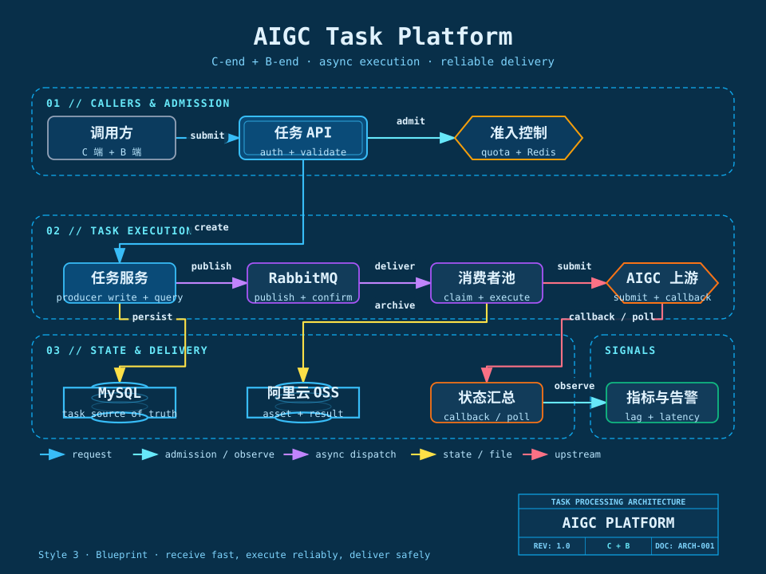
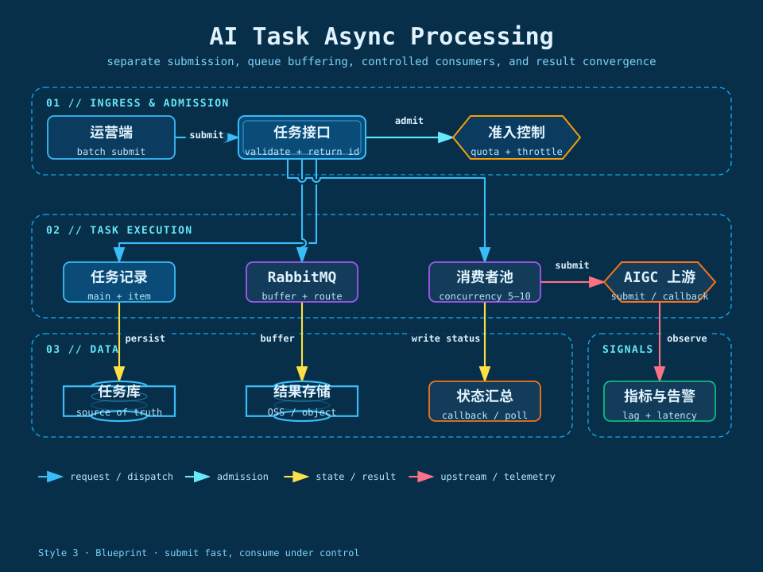
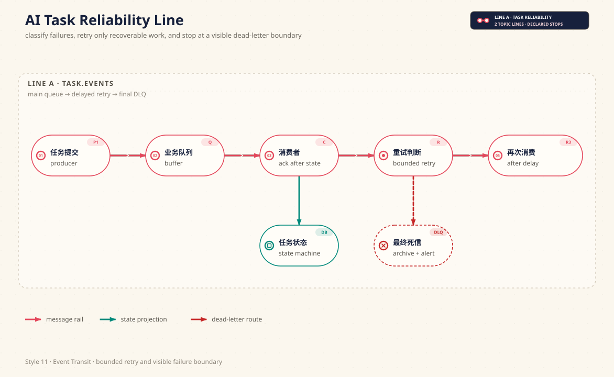
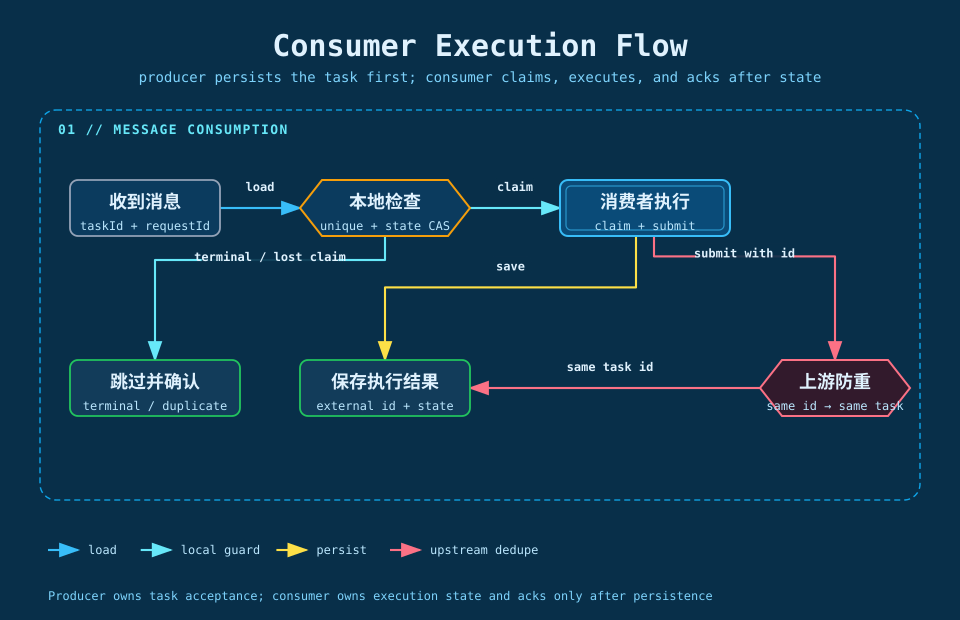
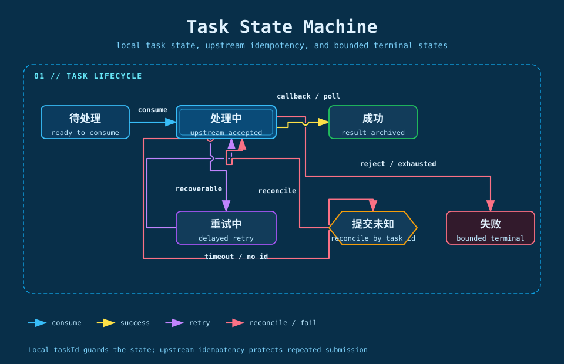
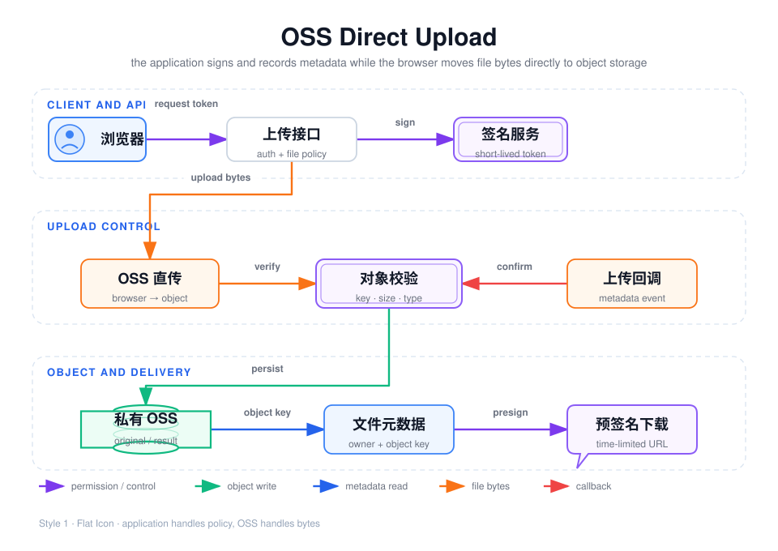

## 我如何理解这个项目

这是公司面向 C 端用户建设、同时配套 B 端运营能力的 AIGC 应用平台。C 端用户提交提示词或图片素材，发起 AI 生图、印花提取、场景合成、换装等任务，并在任务完成后查看和获取结果；B 端运营人员负责批量提交、任务监控、异常处理和结果管理。

我参与的重点不是重新实现模型，而是把 Midjourney 代理和第三方 AIGC API 等外部能力接入到一个可用、可追踪、可恢复的业务系统里。对用户来说，这是一个提交创作需求并拿到结果的产品；对运营来说，这是一个可以批量推进任务、观察异常和管理结果的工作台；对后端来说，它是一条由任务受理、消息投递、异步消费、上游调用、状态收敛和文件交付组成的长链路。

在权益活动上，我还参与了把分享邀请接入 AIGC 额度体系：用户通过邀请共同完成固定人数的团队，团队成功后由独立的权益活动服务通过 RabbitMQ 通知额度账户服务，为有效成员发放额度；用户发起生图任务时，再按照图片数量和参数组合冻结、确认或释放额度。团队名额和用户额度是两种不同的库存，分别由活动域和额度账户域负责。

所以我不会把它简单归类成“一个 C 端页面”或“一个 B 端后台”。更准确的描述是：**C 端产品入口 + B 端运营支撑 + 平台化任务处理能力**。C 端和 B 端的入口不同，但最终都依赖同一套任务状态、消息可靠性、外部调用和文件交付机制。

## 一、项目背景：为什么需要任务处理平台

### 1. AI 生成不是一次短请求

普通 CRUD 请求通常可以在较短时间内完成，而一次生图、印花提取或视频生成可能需要几十秒到几分钟。上游还可能排队、限流、超时，甚至只返回“已受理”而不是最终结果。

如果接口线程一直等待上游，连接、线程和业务资源都会被长时间占用；C 端用户会看到页面一直等待，B 端批量提交则可能在短时间内把大量请求直接推给上游。我的第一个判断是：**任务提交和任务执行必须解耦**。

### 2. 外部 AIGC 服务不能被当成本地方法调用

Midjourney 代理或其他第三方服务的状态不由本系统控制。请求可能已经到达上游，但响应在网络中丢失；回调可能延迟或重复；上游返回 429、5xx 和业务拒绝时，处理方式也完全不同。同时，上游提供基于稳定业务 ID 的防重能力：同一个任务 ID 或请求 ID 重复提交时，不会创建第二个有效任务，具体响应语义以实际接口协议为准。

因此，“调用方法返回异常，然后换一个 ID 再重试”不能覆盖完整场景。我需要在本地保存任务事实、任务 ID、外部任务 ID、投递记录、错误分类和状态迁移，让系统能回答三个问题：任务现在在哪里、下一步是否可以继续、继续执行会不会产生重复副作用。本地以任务 ID 做消费和状态幂等，上游以稳定 ID 做请求防重，两层共同保护重复消息和重复提交。

### 3. 文件流量不应该全部经过应用服务器

用户原始素材、AI 生成图片和批量结果压缩包都可能比较大。如果应用服务器负责接收、保存和转发全部文件，带宽和线程会被大量文件 IO 占用，应用资源无法集中用于任务编排和状态处理。

我的另一个判断是：**应用服务器负责鉴权、签名、元数据和业务归属，文件字节交给 OSS 传输**。上传时由客户端直传 OSS，下载时由服务端根据权限生成短时预签名地址；结果归档则作为独立的后台动作处理。

## 二、我负责的技术范围

我沿着一条真实任务从创建到结果交付的链路，负责和重点复盘以下部分：

| 技术范围 | 我处理的核心问题 | 关键实现 |
| --- | --- | --- |
| 任务受理 | 如何让 C 端和 B 端快速提交，不同步等待生成 | 参数校验、身份与权限校验、配额预检查、稳定任务 ID、生产者先幂等落库 |
| 异步执行 | 如何吸收突发流量并控制上游调用速度 | RabbitMQ 业务队列、消费者池、prefetch、并发上限、超时控制 |
| 可靠处理 | 消息重复、投递失败、上游超时后如何恢复 | Publisher Confirm、return、同 ID 重发、失败分类、延迟重试、死信、本地任务 ID 与上游 ID 防重 |
| 状态管理 | 回调和轮询如何共同推进任务，迟到事件如何处理 | 子任务状态机、主任务汇总、条件更新、版本与事件来源 |
| 文件交付 | 如何降低应用带宽压力并保护文件访问权限 | OSS 临时上传凭证、服务端确认、对象元数据、预签名 URL |
| 权益活动 | 如何让分享邀请、额度发放和生图扣减保持边界清晰 | 团队名额预扣、RabbitMQ 事件、权益账本、额度冻结与释放 |
| 可观测性 | 如何定位任务卡在入口、队列、上游还是文件阶段 | 任务 ID、投递 ID、外部任务 ID、阶段耗时、错误分类 |

## 三、技术全景

| 组件 | 在项目中的职责 | 为什么需要它 |
| --- | --- | --- |
| Java + Spring Boot | 提供任务 API、业务编排、消费者和回调处理 | 统一承载入口、后台执行和状态更新逻辑 |
| RabbitMQ | 缓冲任务、分发消费、承接重试和死信路径 | 把入口流量与上游处理能力隔开 |
| Redis | 配额、限流、短期状态和高频控制数据 | 避免把瞬时控制数据全部压到 MySQL |
| 权益活动服务 | 管理活动、团队名额、成员记录和完成事件 | 将分享邀请与 AIGC 任务、额度账户解耦 |
| MySQL | 保存主任务、子任务、投递尝试、错误和文件元数据 | 作为任务生命周期的本地事实来源 |
| 阿里云 OSS | 保存原始素材、生成结果和归档文件 | 承担大文件传输，减少应用服务器中转 |
| Midjourney 代理 / 第三方 AIGC API | 执行实际的生图、印花提取和场景合成 | 提供外部 AI 能力，状态和稳定性不可完全控制 |

## 四、系统架构总览

这张架构图从上到下分成四层：

1. **调用与准入层**：C 端客户端和 B 端运营台进入同一套任务 API，完成身份、参数、幂等和配额控制。
2. **任务执行层**：任务服务先生成稳定任务身份并把主任务、子任务写入 MySQL，再发布带有同一 taskId 的消息；RabbitMQ 负责缓冲和分发，消费者池按受控并发调用上游。
3. **状态与交付层**：MySQL 保存任务事实，OSS 保存素材与结果，状态汇总负责把回调或轮询转换为本地状态。
4. **外部依赖与信号层**：AIGC 上游返回受理结果或回调，系统记录队列延迟、调用耗时和失败信息，支持后续排障。

架构中最重要的边界是：入口不等待生成，消息不依赖进程内对象，消费者不直接相信消息中的旧数据，结果不直接依赖第三方临时 URL，通过任务状态机去实现任务进度的反馈，让长耗时流程更加可控
## 五、一次任务的完整执行流程

[查看生产者入库、RabbitMQ 发布确认与消费者执行流程](./assets/producer-task-publish-flow.svg)

下面以一个可能包含多个子任务的批量请求为例，说明我设计和排查这条链路时关注的事实：

| 阶段 | 发生了什么 | 本地必须留下的事实 | 下一步由谁触发 |
| --- | --- | --- | --- |
| 1. 请求受理 | C 端用户或 B 端运营人员提交提示词、素材和业务类型 | 用户归属、参数摘要、业务幂等键、配额结果 | 任务服务 |
| 2. 任务事实落库 | 生产者使用唯一索引创建主任务和子任务 | taskId、itemId、初始状态、输入文件引用、版本信息 | 任务服务 |
| 3. 消息投递 | 将带最小执行事实的意图发布到 RabbitMQ | 消息 ID、投递状态、追踪标识、Confirm 结果 | Publisher Confirm |
| 4. 消费执行 | 消费者抢占子任务并检查当前状态 | 消费次数、开始时间、消费者实例、并发许可 | 消费者池 |
| 5. 上游受理 | 使用同一任务 ID 或请求 ID 调用 Midjourney 代理或第三方 AIGC API | 外部任务 ID、提交时间、响应分类、防重结果 | 回调或受控查询 |
| 6. 状态推进 | 回调或受控查询报告处理中、成功、失败等事件 | 事件来源、事件时间、状态迁移结果 | 状态迁移函数 |
| 7. 结果归档 | 下载并校验结果，写入 OSS | 对象 Key、大小、类型、校验信息 | 归档任务 |
| 8. 结果交付 | 查询任务时生成受控访问地址 | 文件权限、交付状态、预签名 URL 有效期 | C 端查询或 B 端管理 |

这里的“接口返回成功”只代表本地任务已经被系统受理，不代表 AI 结果已经生成。接口返回稳定的本地任务 ID，前端或运营台通过查询本地状态获得进度；上游任务 ID、回调地址和第三方临时文件地址都属于后台执行阶段的内部事实。

## 六、我如何处理消息可靠性

[查看消息进入延迟重试和死信的动态流程](./assets/reliable-message-processing.gif)

我把消息路径拆成业务队列、延迟重试队列和最终死信队列，并在消费者与上游之间增加本地任务 ID 检查和上游 ID 防重。

这里最容易犯的错误是把所有异常都 `requeue`。参数错误和内容审核拒绝不会因为多重试几次就变好；上游 429 需要更长退避并降低对应账号并发；提交超时则不能直接判断失败，因为上游可能已经创建了外部任务。

我的处理原则是：

- 先区分异常是否产生外部副作用，再决定能否重试。
- 可恢复异常进入延迟队列，不占用消费者线程，也不阻塞主队列。
- 每次重试前重新检查本地状态，任务成功、取消或超时后不再调用上游。
- 超过最大次数或最大执行时长后进入明确终态，不允许无限自动重试。
- 无法确认上游是否受理的情况进入“提交结果未知”路径，沿用同一任务 ID 或请求 ID 查询、重试或对账，不生成新的业务 ID。
- 死信保留任务、消息、上游和错误上下文，人工重放必须再次经过状态检查、权限和限流。

## 七、状态机、回调和幂等如何共同工作

状态机的目的不是增加枚举，而是让每个状态都能指导下一步动作。子任务至少需要区分待处理、处理中、重试中、提交结果未知、成功、失败和取消；主任务则根据子任务终态计数汇总进行中、部分成功、全部成功或全部失败。

同一个任务可能同时收到回调和受控查询结果，因此两者不能各自直接改表，而要先转换成统一事件，再由状态迁移规则判断是否有效。状态更新需要带当前状态条件，重复回调、迟到查询和重复消息只能被记录，不能覆盖已经形成的新事实。

我把幂等拆成三层：

1. **业务幂等**：业务键或客户端请求号防止重复点击创建两笔任务。
2. **消息幂等**：消息 ID 和投递记录防止同一消息重复执行有效副作用。
3. **状态幂等**：条件更新保证只有满足当前状态的事件才有资格推进任务。

这三层组合起来追求的是“至少一次投递，业务副作用有效一次”：本地任务 ID 避免重复消费和重复状态推进，上游稳定 ID 避免重复创建外部任务。它不是宣称消息系统提供绝对的 Exactly Once。对开发排障来说，我会先查当前状态，再查最近一次合法迁移，最后查没有生效的重复或迟到事件。

## 八、OSS 文件链路：上传、确认和访问

[查看文件数据绕过应用服务器的动态流程](./assets/oss-direct-upload.gif)

文件链路分成三种事实，不能混在一起：

- **文件字节**：由客户端与 OSS 传输，应用服务器不承担大文件中转。
- **对象元数据**：由服务端确认对象真实存在、大小、类型和校验信息。
- **业务归属**：由服务端根据当前用户、任务和权限判断文件能否使用。

完整路径是：客户端先向后端申请上传凭证，服务端校验身份、权限、文件类型、大小、数量和业务关系，生成绑定对象 Key 的临时凭证；客户端直传 OSS 后，再调用确认接口；服务端确认对象存在且符合预期，才把文件绑定到任务。结果文件访问时使用私有 Bucket 和短时预签名 URL，过期后重新授权，不能把第三方长期地址直接交给用户。

这样做不只是为了上传更快，更重要的是把应用服务器从文件数据路径中移开，让它只负责鉴权、元数据和任务编排。上传中断、凭证过期、重复确认、回调丢失和孤儿对象，都应该有独立的补偿处理，不能要求用户重复上传来掩盖系统状态。

## 九、我如何定位问题和验证改造

一次任务出现“没有结果”时，我不会只看接口是否返回 200，而是按任务 ID 串起以下记录：

| 排查顺序 | 查看内容 | 能回答的问题 |
| --- | --- | --- |
| 1 | 主任务和子任务状态 | 任务是否创建，当前停在哪个阶段 |
| 2 | 投递记录和 RabbitMQ 状态 | 消息是否发布、是否堆积、是否重复消费 |
| 3 | 消费日志和并发许可 | 消费者是否领取，是否被并发或限流挡住 |
| 4 | 外部任务 ID 和上游响应 | 上游是否受理，超时是否可能已产生副作用 |
| 5 | 回调与轮询记录 | 是否收到迟到、重复或错误版本的事件 |
| 6 | OSS 对象元数据 | 结果是否归档，文件是否真实存在且可访问 |

我用四类场景验证链路，而不是只验证正常流程：

1. **正常闭环**：提交、入队、消费、上游成功、回调、归档和访问全部完成。
2. **重复安全**：重复点击、重复消息、重复回调和重复确认不产生重复任务、重复文件或重复副作用。
3. **异常恢复**：消费者退出、上游超时、429、5xx、回调丢失和 OSS 上传失败能够恢复或进入明确终态。
4. **资源边界**：队列积压时，消费者并发、HTTP 连接池、数据库连接池、上游账号限制和应用带宽仍处于可控范围。

对于吞吐、成功率和文件耗时等结果，我会同时记录统计窗口、任务类型、并发配置、成功终态定义和采集来源。结果指标只能用来解释改造是否有效，不能替代对任务状态、失败路径和资源边界的说明。

## 十、具体项目实现落地

1. [项目背景与问题边界](#我如何理解这个项目)：明确业务背景、职责边界和三个实际问题。
2. [我如何把耗时任务改成异步处理](./11-async-task-processing)：从同步阻塞拆到提交、入队、消费和结果回写。
3. [并发消费如何受到控制](./12-concurrency-and-capacity)：说明消费者并发、队列积压、上游限流和资源上限。
4. [我如何处理上游失败、重试和死信](./13-reliable-message-processing)：说明失败分类、延迟重试、死信和人工重放。
5. [状态机、回调和幂等如何配合](./14-state-machine-and-idempotency)：说明合法状态迁移、回调轮询竞态和重复副作用。
6. [我如何落地 OSS 直传](./15-oss-direct-upload)：说明凭证、对象确认、权限和预签名访问。
7. [我如何把 AIGC 权益发放接入额度消耗链路](./16-benefit-issuance-and-inventory)：说明团队名额、额度扣减、RabbitMQ 对接、发放幂等和防超卖。
8. [技术取舍与指标复盘](./17-technical-decisions-and-metrics)：复盘方案选择、验证方法和个人技术判断。
