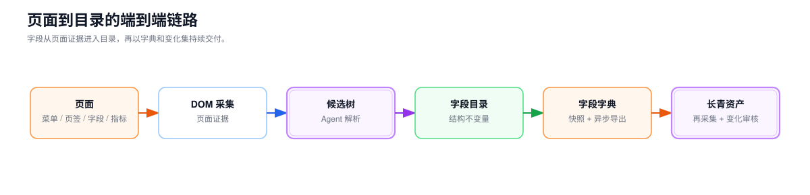

## 完整需求定位与架构

> 这一节给"为什么做、做什么、边界在哪、链路怎么走"一个完整答案。读完你应该能在白板上画出端到端链路，并讲清每个环节的取舍。

---

## 问题不在"字段录入"，而在"字段散落"

业务系统里大量"字段定义"散落在页面代码中：菜单名、页签名、分组标题、表单字段、表格列、指标口径……它们**没有统一来源、没有版本、没有血缘**。

带来的问题很具体：

- **定义漂移**：同一个"订单状态"，A 页面叫"状态"，B 页面叫"订单状态"，C 页面叫"order_status"。
- **改造返工**：页面改版时，没人知道哪些字段被影响，只能人肉核对。
- **口径打架**：指标"GMV"在三个报表里三个算法，谁都不对。

所以项目目标不是"做个录入框"，而是**把散落的字段沉淀为可维护的目录**，并让这个目录能随页面演进自动维护。

## 全栈职责与边界

我负责平台的**全栈研发与智能化方案设计**，工作覆盖：

- **采集端**：人工框选、DOM-first 自动采集、页面状态探索与字段证据预览；
- **智能解析端**：确定性规则、受限 Agent、候选树校验、反馈重算与进度推送；
- **平台前端**：目录树懒加载、批量录入、拖拽移动、候选差异审核与导出任务工作台；
- **平台后端**：目录领域模型、闭包表事务、并发控制、异步导出与文件交付；
- **工程治理**：认证、接口契约、测试、部署、可观测性、安全和评估指标。

平台不修改被采集业务系统的页面逻辑，也不定义下游数仓的业务计算口径；它负责字段从页面证据到目录资产，再到字典交付的完整技术链路。

## 端到端链路

字段从页面到目录，再交付为字典，链路是：

下面这张图给出端到端全景：

<InteractiveDiagram
  title="字段目录平台端到端全景"
  src="/media/projects/baozun-field-platform/diagrams/platform-overview/index.html?embed=1"
  poster="/media/projects/baozun-field-platform/diagrams/platform-overview/preview.png"
  description="从字段采集、层级解析、目录治理、字典交付到变更审核的闭环能力地图。"
/>

## 关键取舍

### 1. 采集：固定输入 vs DOM-first

最早想用"固定缩进 / 固定模板"喂给解析，但页面结构千奇百怪，维护模板比解析还累。后来转向 **DOM-first**：直接从渲染后的 DOM 抽证据，让"页面怎么长"由页面自己说了算。

<InteractiveDiagram
  title="采集方案演进：固定输入 → DOM-first"
  src="/media/projects/baozun-field-platform/diagrams/strategy-pivot/index.html?embed=1"
  poster="/media/projects/baozun-field-platform/diagrams/strategy-pivot/preview.png"
  description="从人工固定缩进、纯 Agent 探索到 DOM-first 人机闭环。"
/>

### 2. 解析：纯 Agent 探索 vs 受限 Agent

纯 Agent 自由探索页面，结果不可控、不可验收。我们用**受限 Agent**：输入只吃证据、动作只产出候选树、输出必须可验收。把"智能"框在"可信任"的边界里。

### 3. 治理：关系库 vs 文档树

字段目录本质是树。用关系表存父子，写入简单但祖先链查询贵；用文档树存整棵，查询快但并发写入难。我们取中间：**直接父级关系 + 祖先链按需展开**，并维护结构不变量。

### 4. 交付：同步返回 vs 异步导出

字段字典可能很大、消费方很多。同步返回会拖垮写入链路，所以用**独立导出任务**：从一致性快照流式写入，状态可查、失败可重试、交付原子。

> 一句话收尾：架构的所有取舍，都围绕一个目标——**在不信任的输入上，交付可信任的结构**。
