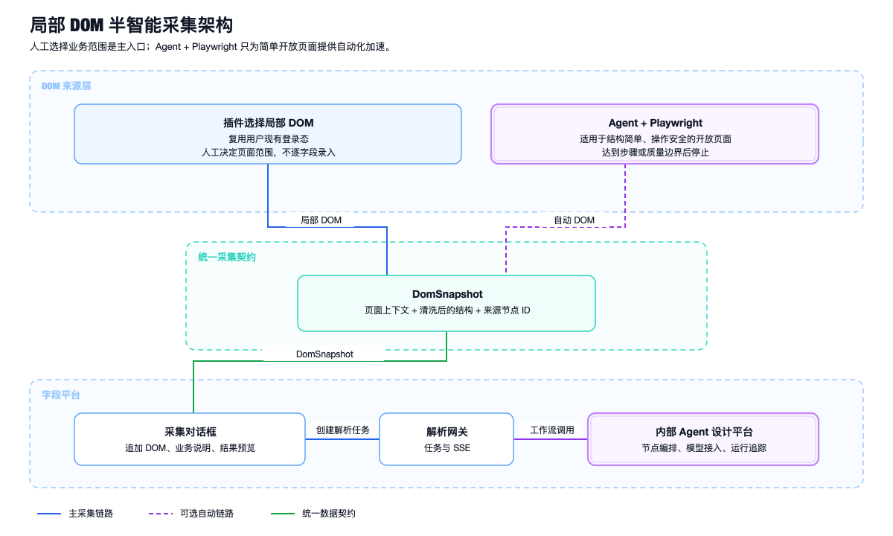
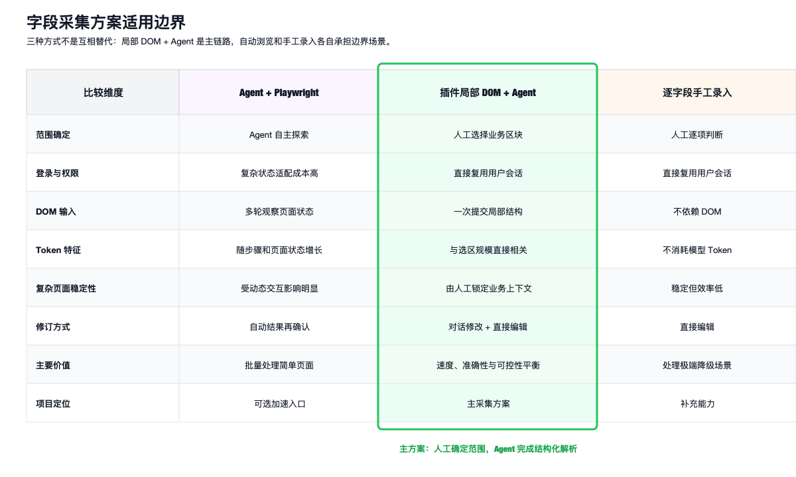
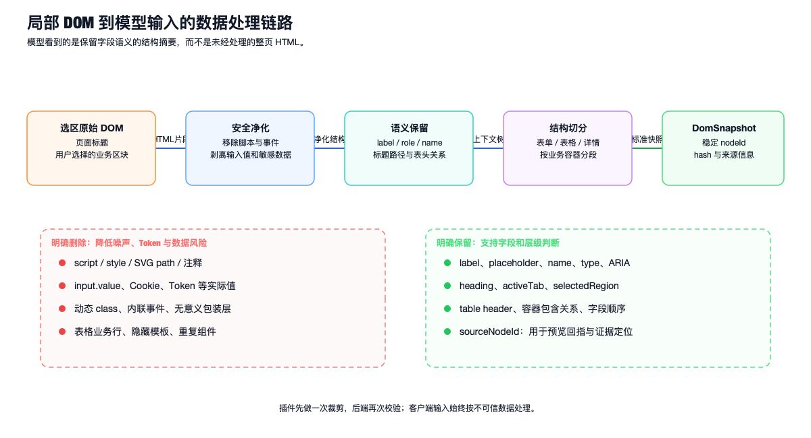

## 局部 DOM 驱动的半智能字段采集

字段采集面对的不是一份稳定的数据结构，而是已经渲染完成的业务页面。相同的“订单状态”可能出现在查询条件、列表列头、订单详情和售后抽屉中；只看文本无法判断它属于哪个业务对象，只看 DOM 层级又容易被组件库生成的包装节点误导。

项目最初验证过通用 Agent 调用 Playwright 的全自动采集方式：Agent 观察页面、选择下一步操作、读取 DOM 并持续生成字段。该方式在结构简单、操作路径有限的开放页面中能够减少重复操作，但在复杂企业页面中，登录状态、动态组件、业务前置条件和页面状态数量会同时放大执行误差与模型上下文。

最终方案没有把人工降级为逐字段录入，也没有要求 Agent 自主理解整个系统，而是把职责拆成三部分：

- 人工通过浏览器插件确定需要解析的业务区域；
- DOM 提供当前区域的结构、语义和位置证据；
- Agent 工作流把局部 DOM 解析成可编辑字段草稿。

这是一种渐进式自动化：主链路使用“人工选区 + DOM + Agent”，简单开放页面可以通过 Agent + Playwright 自动生成同样的 DOM 快照，极端结构则允许人工补充字段。



上图对应的核心设计是“两种 DOM 来源，一份解析契约”。下游工作流只接收 `DomSnapshot`，不关心快照来自插件还是 Playwright，因此自动化入口不会形成第二套解析逻辑。

## 为什么不让 Agent 直接采完整个页面

问题不在于 Agent 能否点击浏览器，而在于复杂页面很难建立稳定的完成条件。

一次全自动采集通常要反复执行：观察页面、选择元素、点击、等待渲染、重新读取 DOM、判断新增字段。模型输入会重复携带任务目标、历史步骤、当前页面结构和已采集字段，Token 消耗随“操作次数 × 页面状态数 × 单次上下文大小”增长，而不是只随字段数量增长。

复杂业务页还会出现以下问题：

- 页面需要验证码、扫码、双因素认证或临时权限；
- 点击同名按钮产生的结果依赖当前业务状态；
- React、Vue 组件重新渲染后，之前的定位信息已经失效；
- 标签页、抽屉、弹窗和条件字段形成大量组合状态；
- “保存”“提交”“删除”等按钮不能依赖模型自行判断安全性；
- DOM 中包含隐藏模板、虚拟列表缓冲节点和重复组件；
- Agent 很难证明哪些状态已访问，以及何时能够认定采集完成。

如果为每一种页面状态继续增加提示规则，最终会把模型变成一个成本更高、但确定性更弱的流程引擎。因此主方案让人工直接指出业务范围，跳过最不稳定的浏览器探索阶段，把模型能力集中在字段识别、类型判断和层级生成上。



三种方案各有明确边界：

- **Agent + Playwright**：作为简单页面的批量加速入口；
- **插件局部 DOM + Agent**：兼顾业务上下文、解析效率和可修订性，是主方案；
- **逐字段手工录入**：处理 Canvas、不可访问 iframe 等极端降级场景。

## 主采集流程

一次采集会话按照下面的顺序执行：

1. 用户在字段平台创建采集会话，选择目标平台和字段目录位置；
2. 用户进入目标业务系统，通过插件开启 DOM 选区模式；
3. 插件在页面上高亮当前候选容器，用户点击表单、表格、详情区或弹窗内容；
4. 插件读取选中子树，并补充页面标题、地址、当前页签和有限的祖先标题；
5. DOM 片段进入字段平台采集对话框，用户可以补充“这是退款详情”等业务说明；
6. 前端创建解析任务，后端把快照提交给内部 Agent 工作流；
7. 解析结果通过 SSE 增量回到对话框，形成字段草稿；
8. 用户可以继续选取其他 DOM 区域，追加到同一份草稿；
9. 字段草稿经过对话修改或直接编辑后，由用户显式保存。

这里的“人工”只负责选定业务区块，不需要逐个识别字段。对于一个包含几十个表单项的详情区域，用户只选择一次容器，DOM 和 Agent 会完成批量提取。

## 插件如何获取局部 DOM

插件采用内容脚本读取当前页面，但权限限制在配置的业务域名。选区模式开启后，鼠标移动只计算候选容器和高亮边界，点击确认时才真正序列化 DOM，避免持续扫描整页带来的性能开销。

选区不能只截取鼠标命中的最小节点。例如用户点击“退款状态”所在的表单项，如果只保留一个 `span`，Agent 会失去“退款信息”标题、当前“售后记录”页签等关键上下文。因此插件同时保留：

- 用户选中的 DOM 子树；
- 向上的有限祖先标题和容器语义；
- 页面标题、页面地址和当前页签；
- 元素在选区内的相对顺序；
- 用于预览回指的临时 `sourceNodeId`。

插件将快照交给采集对话框时，需要验证目标页面来源和一次性会话标识。原始 DOM 不放入 URL，也不写入普通访问日志；解析接口只接收经过大小限制和二次净化的快照。

## DomSnapshot 契约

DOM 来源统一后，解析工作流只依赖下面这类快照：

```json
{
  "snapshotId": "snap_01J6QY9T4K",
  "captureSessionId": "capture_1001",
  "sourceType": "PLUGIN",
  "page": {
    "url": "/orders/10086",
    "title": "订单详情",
    "activeTab": "售后记录",
    "selectedRegion": "退款信息"
  },
  "schemaVersion": "1.0",
  "domHash": "sha256:...",
  "elements": [
    {
      "sourceNodeId": "n_01",
      "role": "heading",
      "text": "退款信息"
    },
    {
      "sourceNodeId": "n_02",
      "role": "field",
      "label": "退款状态",
      "name": "refundStatus",
      "controlType": "select",
      "parentSourceNodeId": "n_01"
    }
  ]
}
```

`sourceType` 可以是 `PLUGIN` 或 `AGENT_PLAYWRIGHT`。来源不同只影响审计和评估，不改变字段解析规则。

`domHash` 用于识别同一采集会话中重复提交的选区；`sourceNodeId` 只在草稿期内稳定，用于字段与原始页面证据之间的回指，不会作为正式字段身份。

## DOM 为什么必须先清洗

浏览器中的 DOM 不能直接交给模型。它既包含大量与字段无关的 UI 噪声，也可能携带输入值、业务行数据和能够干扰提示的页面文本。



清洗分为插件预处理和服务端复检两层。

### 明确删除的内容

- `script`、`style`、SVG path、注释和内联事件；
- 输入框当前值、令牌、Cookie 和请求头等敏感数据；
- UI 框架生成的动态 class 和无意义包装层；
- 表格业务行，只保留列头和必要的空状态结构；
- 不可见模板、重复组件和超长文本；
- 与用户选区无关的导航栏、菜单和页面页脚。

### 明确保留的内容

- `label`、`name`、`type`、`placeholder`；
- `role`、`aria-label`、`aria-labelledby`；
- 标题层级、当前页签和选择区域；
- 表头、表单项和详情标签之间的包含关系；
- 字段在区块中的相对顺序；
- 稳定业务属性，例如 `data-field`；
- `sourceNodeId`，用于前端高亮和证据定位。

清洗不是简单删除所有属性。删除过度会让模型只能看到孤立文本，保留过度又会把动态样式和真实业务值带入上下文。工程上的判断标准是：保留能够支持“字段是什么、属于谁、是什么类型”的结构，删除与这三个问题无关的内容。

页面文本始终作为不可信数据放在明确的数据边界内。即使 DOM 中出现“忽略之前的规则”等文本，工作流也只能把它当作页面内容，不能把它提升为系统指令。

## 多次选区如何形成完整草稿

局部 DOM 并不要求一次覆盖完整页面。一个采集会话可以连续追加：

```text
订单基础信息 → 商品明细 → 支付信息 → 售后记录 → 退款抽屉
```

每次解析都产生字段增量，随后与当前草稿合并。合并不会只按字段名称判断，否则多个业务区域中的“状态”“金额”“时间”会被错误合并。字段草稿的候选指纹综合使用：

```text
页面标识
+ 选区标题路径
+ 字段 name / data-field
+ 标准化 label
+ 控件类型
+ 候选父级
```

强标识一致时直接合并；只有名称相似而业务路径不同的字段保留为独立节点，并在预览中提示用户确认。

如果选区过小，Agent 无法确定字段上级，工作流返回 `NEED_MORE_DOM`。前端不会把它展示成系统异常，而是明确提示“缺少上级标题”或“需要补充当前页签上下文”，用户重新选取包含更多结构的区域后即可继续解析。

## Agent + Playwright 的适用方式

对于无需复杂登录、结构标准且不存在写操作的开放页面，字段平台提供自动采集入口。Agent 调用 Playwright 打开页面、定位表单或表格、获取局部 DOM，再提交到同一个 `DomSnapshot` 解析链路。

自动入口设置了明确边界：

- 只访问允许域名；
- 只执行打开页面、切换页签、展开折叠和翻页等白名单动作；
- 禁止保存、删除、提交、确认和上传；
- 限制最大页面状态数、操作步数、执行时间和 Token 预算；
- 使用页面状态指纹阻止重复循环；
- 连续操作没有发现新字段时主动停止；
- 遇到登录、验证码、跨域 iframe 或复杂交互时退出自动模式。

自动采集停止并不影响已有结果。已生成的 `DomSnapshot` 仍然进入字段草稿，用户可以通过插件继续追加其他区域。因此 Agent + Playwright 是可选加速能力，而不是整条字段采集链路的单点依赖。

## 典型问题与处理方式

| 问题 | 产生原因 | 处理方式 |
| --- | --- | --- |
| 同一选区重复生成字段 | 页面重新渲染或用户重复提交 | `domHash` 拦截重复快照，字段候选指纹做二次合并 |
| 字段名称存在但父级错误 | 选区没有包含标题或页签 | 返回 `NEED_MORE_DOM`，提示扩大选区 |
| 动态 class 导致定位失效 | 组件构建时生成随机样式名 | 不把动态 class 作为字段身份，优先业务属性与语义关系 |
| 表格产生大量无关文本 | 采集了真实业务行 | 只保留表头、列顺序和空状态结构 |
| 输入内容泄漏到模型 | 直接序列化了 `input.value` | 插件剥离，服务端再次校验并拒绝敏感属性 |
| iframe 内容不可读 | 跨域隔离或插件权限不足 | 允许域名内单独注入；其余进入人工字段补充 |
| Canvas 无法形成字段 DOM | 页面只暴露绘制结果 | 记录页面位置与人工字段来源，不伪造 DOM 证据 |
| 自动浏览反复进入同一状态 | SPA 地址不变、组件局部变化 | 使用路由、标题、可见容器和 DOM hash 组成状态指纹 |

## 如何验证采集方案

采集层不使用“模型看起来回答正确”作为验收标准，而是建立固定页面样本和选区夹具，持续记录：

- 选区内业务字段召回率；
- 误把普通文本识别为字段的比例；
- 重复字段率；
- 需要追加 DOM 的比例和原因；
- 单个快照清洗前后的体积与 Token；
- 敏感值剥离结果；
- Agent + Playwright 的停止原因和人工接续比例。

这些指标用于比较页面类型和发现薄弱组件，不写脱离样本范围的绝对优化数字。

## 本章结论

局部 DOM 方案解决的不是“如何自动点击整个系统”，而是“如何把用户已经定位到的页面区域，高效转换成可修订的字段结构”。人工提供业务边界，插件保留页面证据，Agent 完成批量解析；简单页面再由 Playwright 自动生成相同快照。

下一章将在此基础上继续解释：内部低代码 Agent 工作流如何消费 `DomSnapshot`，怎样通过 SSE 输出字段草稿，以及对话修改、直接编辑和最终保存如何保持一致。
